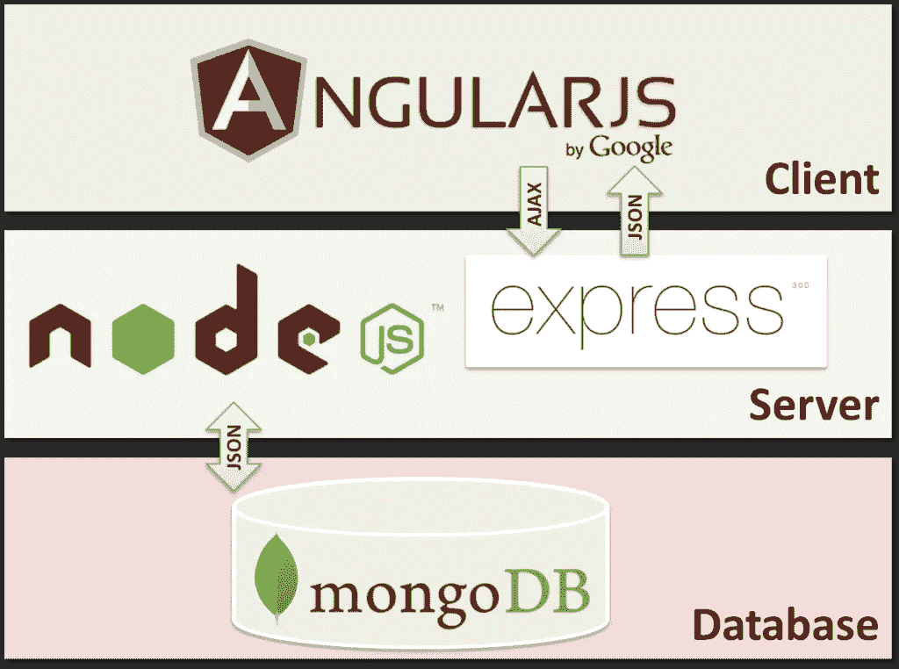

# 平均堆栈开发[面向开发人员]

> 原文：<https://medium.com/hackernoon/mean-stack-development-for-developers-4d88c40c4103>

# 平均堆栈

MEAN stack 基本上是基于 JavaScript 的 web 开发技术的集合，包括 **MongoDB** 、 **ExpressJS** 、 **AngularJS** 和 **NodeJS** 。下图清楚地解释了这些技术如何一起开发 web 应用程序。AngularJS 作为客户端对 ExpressJS 进行 AJAX 调用，并以 JSON 格式返回响应。运行在 NodeJS 服务器上的 ExpressJS 进一步与作为持久介质的 MongoDB(一个 NoSQL 数据库)进行通信。

# 为什么是指堆栈？

首字母缩写“MEAN”代表“[MongoDB](http://www.mongodb.org/)[express . js](http://expressjs.com/)[angular js](https://angularjs.org/)[node . js](http://nodejs.org/)”，代表一组已知能够很好地协同工作的技术。MEAN stack 的主要好处是可以非常快速地构建原型。Node.js 允许你在前端和后端都使用 Javascript，这样你就不用学习另外一种语言了。此外，MongoDB 的 [NoSQL](http://www.mongodb.com/nosql-explained) 特性允许您快速更改和改变数据层，而不必担心迁移，当您试图构建一个没有明确规范的产品时，这是一个非常有价值的属性。最后，这些技术背后有大量的社区支持，因此使用这些技术可以更容易地找到问题的答案或寻求帮助。

# 介绍

# MONGODB

MongoDB 是一个跨平台、面向文档的数据库，它提供了高性能、高可用性和易伸缩性。它致力于收集和文件的概念。

MongoDB 是一种 NoSQL 数据库。作为一个 NoSQL 数据库，MongoDB 避开了关系数据库的基于表的结构，以适应类似 JSON 的文档，这些文档具有它称之为 BSON 的动态模式。这使得某些类型的应用程序的数据集成更快更容易。

通过 [MongoDB 官网](https://www.mongodb.com/)进入其[大手册](https://docs.mongodb.com/manual)，应该可以帮助你更好的了解 NoSQL 和 MongoDB。

# 快递。射流研究…

Express 是一个最小且灵活的 Node.js web 应用程序框架，它为 web 和移动应用程序提供了一组强大的功能。Express.js 和 Node.js 为 JavaScript 提供了新的后端功能——首次允许开发人员在服务器端使用 JavaScript 构建软件。总之，它们使得用 JavaScript 构建整个网站成为可能:你可以用 Node.js 开发服务器端应用程序，然后用 Express 将这些 Node.js 应用程序发布为网站。

了解快递的最佳途径是通过其官方网站，尤其是 T2 的快递指南。你也可以通过[这个 StackOverflow 线程](http://stackoverflow.com/q/8144214/6115857)获得更多资源。

# 安古拉吉斯

AngularJS 是一个动态 web 应用的结构框架。它允许您使用 HTML 作为模板语言，并允许您扩展 HTML 的语法以清晰简洁地表达应用程序的组件。AngularJS 的数据绑定和依赖注入消除了你原本需要编写的大量代码。所有这一切都发生在浏览器中，这使它成为任何服务器技术的理想伙伴。

Angular 的官网是一个很好的起点。CodeSchool 为初学者创建了一个[伟大的教程](https://www.codeschool.com/courses/shaping-up-with-angular-js)，以及由 [Egghead](https://egghead.io/) 制作的有角度的视频。

# 节点。射流研究…

Node.js 是基于 Chrome 的 V8 JavaScript 引擎构建的 JavaScript 运行时。Node.js 使用事件驱动的非阻塞 I/O 模型，这使它变得轻量级和高效。它的包生态系统， [npm](https://www.npmjs.com/) ，是世界上最大的开源库生态系统。

Node.js 是一个跨平台的运行时环境，也有用于在浏览器之外运行 JavaScript 应用程序的库。节点用于创建服务器端和网络 web 应用程序。它是开源的，可以免费使用

首先浏览一下 [Node.js 官方网站](https://nodejs.org/)和[文档页面](https://nodejs.org/en/docs/)以及[这个 StackOverflow 线程](http://stackoverflow.com/q/2353818/6115857)，这应该会让你很快熟悉 Node.js 平台。

# 必备技术

### Linux * *Node.js* — [下载](http://nodejs.org/download/)并安装 Node.js，nodeschool 也有免费的[节点教程](http://nodeschool.io/#workshoppers)让你入门。我们推荐 node-4.x 作为首选节点版本来运行 mean.io. * *MongoDB* — [下载](https://www.mongodb.org/downloads)并安装 mongodb — [如果您刚刚开始，请查看他们的手册](https://docs.mongodb.org/manual/)。

如果你使用的是 ubuntu，这是首选的存储库。

$ curl-sL[https://deb.nodesource.com/setup_4.x](https://deb.nodesource.com/setup_4.x)| sudo-E bash-
$ sudo apt-get 更新
$ sudo apt-get 安装节点

*   *Git* —使用包管理器获取 Git 或[下载](http://git-scm.com/downloads)它。

# 窗子

*   *Node.js* — [下载](http://nodejs.org/download/)并安装 Node.js，nodeschool 有免费的[节点教程](http://nodeschool.io/#workshoppers)让你入门。
*   *MongoDB*——跟随 MongoDB 站点的优秀教程— [“在 Windows 上安装 MongoDB”](https://docs.mongodb.org/manual/tutorial/install-mongodb-on-windows/)
*   *Git* —安装 Git 并通过 *git bash* 应用程序(通过命令提示符)运行其余命令的最简单方法是下载并安装 [Git for Windows](http://git-scm.com/download/win)

# OSX

*   *Node.js* — [下载](http://nodejs.org/download/)并安装 Node.js 或使用 brew 或 macports 内的包。
*   *MongoDB*——按照这里的教程— [在 OSX 安装 MongoDB](https://docs.mongodb.org/manual/tutorial/install-mongodb-on-os-x/)
*   *git* —从此处获取 git。

# 必备包

*   Mean 目前使用 gulp 作为构建工具，bower 管理前端包。$ npm install -g gulp //和 bower $ npm install -g bower

# 装置

首先安装 NPM 的 mean-cli 软件包。这也将添加 *mean* 命令，让您与基于均值的应用程序进行交互(安装、管理、更新……)。

# 安装平均 CLI

在 linux 中，以 root 用户身份全局安装

bash $ sudo NPM install-g mean-CLI $ mean init<myapp>$ CD<myapp>& & NPM install</myapp></myapp>

# 用任务管理器调用节点

Mean 支持在代码上应用的各种服务的 gulp 任务运行器。要开始运行应用程序，请使用 bash $ gulp

或者，当不使用 gulp(对于生产环境)时，您可以运行:bash $ node server，然后打开浏览器并转到:bash[http://localhost:3000](http://localhost:3000)

# 在不同的端口上运行

如果您已经运行了一个 rails、node 或其他项目，那么您可能需要使用一个不同的端口。您可以用一个命令设置端口并启动新的 MEAN 项目:bash $ export PORT=3001 && gulp

然后，打开浏览器，更改端口号后再访问:bash[http://localhost:3001](http://localhost:3001)

## 更新 NPM，鲍尔或吞咽

有时你可能会发现在安装过程中有一个奇怪的错误，比如 npm 的*错误:ENOENT* 。通常将这些工具更新到最新版本可以解决这个问题。

*   更新 NPM: bash $ npm update -g npm
*   更新 Gulp: bash $ npm update -g gulp
*   更新 Bower: bash $ npm update -g bower

## 清理 NPM 和鲍尔高速缓存

NPM 和鲍尔有一个缓存系统来保存你已经安装的软件包。我们发现经常清理缓存可以解决系统带来的一些问题。

*   NPM 清理缓存:bash $ npm 缓存清理
*   Bower 清理缓存:bash $ bower 缓存清理

**平均栈开发教程**

想快速学习 Mean Stack 开发。你可以在这里找到一些资源

[https://github.com/ericdouglas/MEAN-Learning](https://github.com/ericdouglas/MEAN-Learning)

 [## 平均堆栈教程-初学者教程

### 这是一个简单的堆栈教程，您将在其中构建一个真实的应用程序。该教程是为初学者准备的，将让你…

www.bradoncode.com](http://www.bradoncode.com/tutorials/learn-mean-stack-tutorial/) 

# 雇佣意味着栈开发者

如果你想雇用平均栈开发人员，请访问我们这里

[http://ontoborn.com/](http://ontoborn.com/)

# 参考

[http://mean.io/](http://mean.io/)

> [黑客中午](http://bit.ly/Hackernoon)是黑客如何开始他们的下午。我们是 [@AMI](http://bit.ly/atAMIatAMI) 家庭的一员。我们现在[接受投稿](http://bit.ly/hackernoonsubmission)，并乐意[讨论广告&赞助](mailto:partners@amipublications.com)机会。
> 
> 如果你喜欢这个故事，我们推荐你阅读我们的[最新科技故事](http://bit.ly/hackernoonlatestt)和[趋势科技故事](https://hackernoon.com/trending)。直到下一次，不要把世界的现实想当然！

