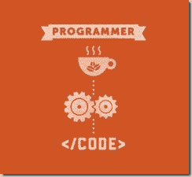

# 衡量软件开发人员的生产力

> 原文：<https://medium.com/hackernoon/measuring-productivity-of-a-software-developer-ed0bb4da204d>

一个[技术](https://hackernoon.com/tagged/technology)行业的交付经理不可能对比这个*开发者生产力*更感兴趣的事情了。他们总是在寻找帮助他们提高个人生产力的灵丹妙药。我来帮你— *这就是兴趣所在*。

衡量个人生产率并不是一个新概念，这一直是一个讨论的话题。你所说的任何行业——制造业、纺织业、化工业、汽车业——都有明确的衡量个人表现和生产力的方法。它可以是生产的单位，销售的单位，也可以是任何可以计算的单位。这些年来，这些行业已经建立了非常完善的方法来提高其操作人员的生产力。类似地，也需要识别程序员的生产力。他们希望衡量自己的工作对公司和客户的影响。为什么不呢！毕竟，他们是高薪员工，他们是靠写代码赚钱的。

已经有一些大胆的尝试来衡量开发人员的生产力，不幸的是，它们都以失败告终，或多或少。不是因为这些方法不成熟，而是因为'*开发人员太聪明了，不会玩弄这些想法。让我们快速看一下这些方法是什么。*

# 实践中的生产力方法

## 代码行

又称 [SLOC](https://en.wikipedia.org/wiki/Source_lines_of_code) 。我个人对开发人员的生产力和系统的复杂性感到非常恼火。作为一名开发人员，我可以推断代码，这可能是我见过的最糟糕的代码之一。有些日子，我所做的只是删除大量代码，但仍然称之为富有成效的一天。这是否意味着我的生产率是负数？天啊。！！

## 工作时间

好吧。因此，一个人在办公室呆的时间越长，你会说他越有效率。我见过有人，我发誓，他们可以整天盯着电脑屏幕，什么也不做。或者可能是玩[扫雷](https://en.wikipedia.org/wiki/Minesweeper_(video_game))换换口味。如果你不相信，读一读这篇。

## 功能点

这是一个衡量标准。你可能没有听说过它，它对你来说几乎没有任何意义。它是关于将一个高层次的需求分解成小的原子工作项目(这很好)，然后计算一个开发人员交付了多少这样的逻辑需求。

想阅读更多关于这种估算和生产率技术的内容，从维基百科开始，链接是[这里](https://en.wikipedia.org/wiki/Function_point)。人们会测量开发人员交付的[业务](https://hackernoon.com/tagged/business)功能的数量。

## 臭虫在一天内关闭

不要惊讶？我见过一些人，也在一些团队中工作过，他们的经理更喜欢计算一个开发人员在一天内修复的缺陷的数量。这还没有结束，目标是每天 1.75 个缺陷。

作为一个项目经理，你如何证明你的系统中存在缺陷，然后针对你的开发人员进行缺陷计数。请相信我的话，如果你在你的项目中遵循这个——“*你没有做正确的事情*”

> *做正确的事，做正确的事*

我个人认识一些人，他们被激励持续地修复更多的缺陷。然后，由于显而易见的原因，出现了争议

*   并非所有的缺陷都是一样的。你不能比较缺陷的复杂性。
*   一次修复可能解决许多缺陷。你同意吗？
*   开发人员倾向于修复容易的缺陷，而不是在实际问题上投入时间。

这给团队带来了很多负面能量。我个人最讨厌这个措施。

## 故事要点

在这整个列表中，唯一明智的事情是[故事点估算](http://martinfowler.com/bliki/StoryPoint.html)。然而，正如我刚才提到的，这是[估算](http://www.hanselman.com/blog/SoftwareEstimationRememberThatTargetsAreNotEstimates.aspx)技术，而不是生产力的度量。这其中当然有一个叫做速度的因素，但是故事点的本质是非常动态的。因此，速度的提高并不意味着开发人员交付了更多。总有一天，我会在 Story Point 上写一个独立的博客。

# 所以，我们对此没有解决方案

在我们真正尝试找到解决方案之前，我们需要了解开发人员是做什么的。

你以为开发者只是一个把咖啡因转化成代码的有机体。

或者你相信，他们被特别祝福转录文件和需求编码。相信我，他们不止如此。

编程是一门科学，也是一门艺术。它包括解释粗略的需求，并将其转化为非常精确的工作系统。开发人员试图详细理解问题，然后将它们分解成非常小的原子工作项。这就是一个开发团队如何集体解决一个问题并实现一个共同的需求集。作为一名开发人员，我们每天都要做出许多决策，这使得我们的工作与制造业有所不同。

这里的问题是主观的，在衡量开发人员的生产力时，我们的目标是客观的解决方案，即工作时间，编写的代码行，修复的缺陷。不对。

与其把开发者比作制造业的人，我更愿意把开发者比作律师、医生、诗人、记者甚至画家。你如何衡量他们的生产力？

所以下次当你想衡量一个开发者的生产力时。试试这些

*   在给定的时间框架内做这么多工作看起来很公平。
*   这个开发人员对他/她正在编写的系统和代码有足够的热情吗？
*   开发商是否致力于质量和交付。
*   开发人员是否对他/她正在做的工作有足够的了解。
*   这个开发者协作性够吗？
*   我对这个开发者的直觉是什么？

# 结论

最后，我想说的是——“相信你的开发者”。这些穿着牛仔裤和 t 恤、插着耳机的傲慢、寒酸的人实际上很聪明，知道他们的工作。

你在雇佣他们并让他们适应新环境方面投入了很多。你不能坚持用*制造业*驱动的方式来衡量个人表现。摆脱传统的 KRAs，引入更直观的衡量标准。