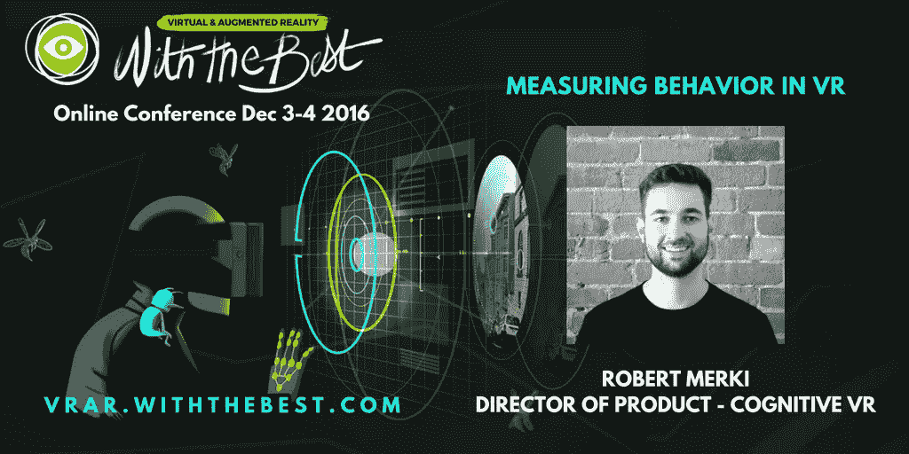
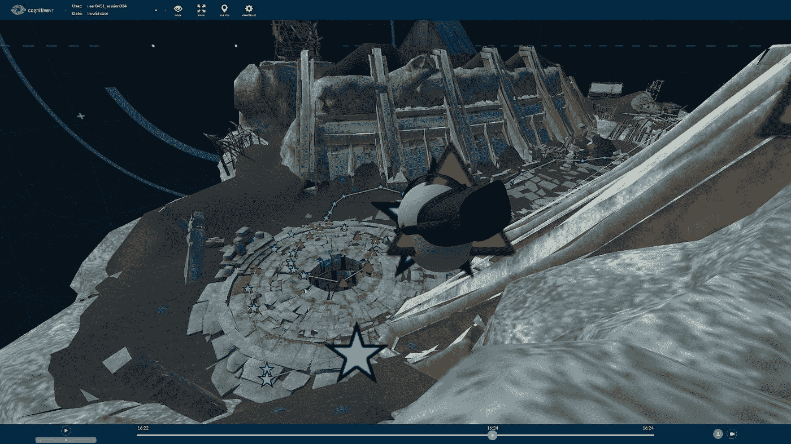
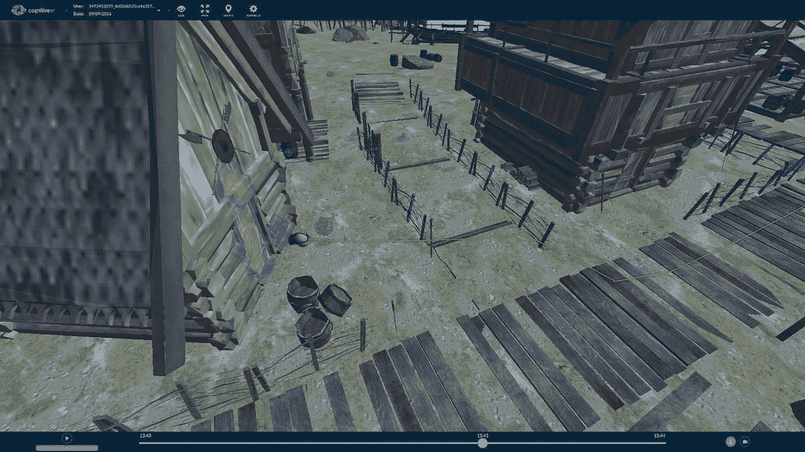
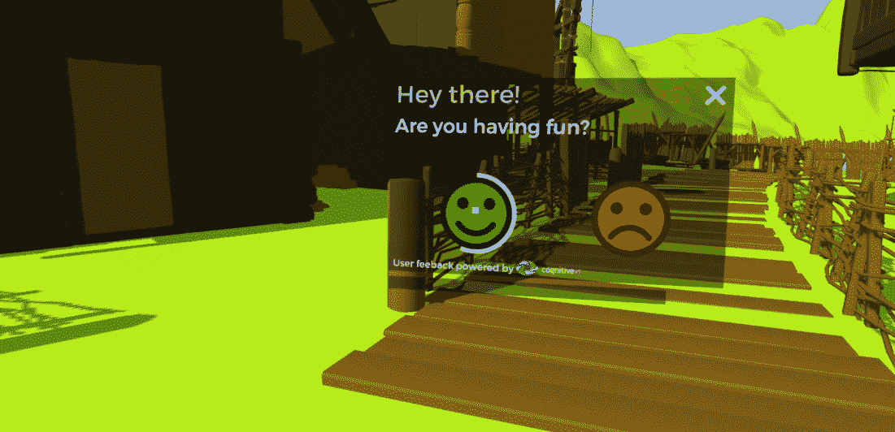

# 使用认知虚拟现实的场景资源管理器测量用户行为

> 原文：<https://medium.com/hackernoon/measuring-user-behavior-with-cognitive-vrs-sceneexplorer-bb03d7356633>

采访认知虚拟现实产品总监罗伯特·默基

总部位于温哥华的 CognitiveVR 通过使用 SceneExplorer 插件在可视网格地图上显示用户行为，并跟踪他们的运动，来帮助内容创作者和开发者了解人们如何与他们的产品互动。这告诉你用户更关注哪些部分，用户在哪里卡住了，或者帮助确定崩溃发生的确切位置。

此外，它可以通过记录用户在投票后调查中的反应并把他们的想法录在磁带上，告诉你用户对它的真实感受(T2)。产品总监 Robert Merki 将在 [VRAR 与 Best 12 月 3 日至 4 日](http://goo.gl/LczfgW)分享他对测量虚拟现实行为的见解，但 first 很友好地回答了我们的一些问题。

你的超级场景探索工具允许开发者使用一个简单的引擎插件来分析他们的体验设置、UX 和 bug。这解决了什么典型的构建问题？

我们看到的典型问题分为三大类:性能、用户困惑和主动反馈。

性能:我们能够向开发者展示他们的用户在应用中的性能，包括规模和每个用户会话的性能。如果特定用户对性能有反馈，开发人员可以快速检查确切的用户会话，并找出导致性能问题的原因。然后，开发人员可以返回 web 仪表板，交叉引用特定硬件配置的性能指标。

用户困惑:虚拟现实的美妙之处在于它能够模拟现实生活，不幸的是，这让开发者失去了很多方向。尽管开发者的初衷是好的，但用户经常会在虚拟世界中感到困惑或迷失。我们的平台允许开发者为他们的用户跟踪和标记不同的困惑点，以及跟踪人们有机地探索他们的虚拟世界的方式。

用户反馈:定性反馈对虚拟现实体验非常重要——我们已经为开发者建立了一种直接从用户那里接收游戏中反馈的方式。我们允许开发人员在他们的场景中放置一个预设对象，当提示时，用户可以回答一个简单的调查问题，并留下语音反馈(通过耳机麦克风记录)。开发人员可以在他们的仪表板上看到所有这些反馈项目，并基于这些声音和定性反馈直观地重放用户会话。

问更重要的是，你复杂的技术会跟踪用户并告诉你重要的信息——如果他们迷路了，他们不喜欢什么，他们在体验中看了什么——你如何跟踪用户的目光？

现在，我们跟踪耳机前方位置的中心点。这通常是一种非常有用的跟踪凝视的方法，因为大多数耳机的视野(FOV)相对较小，所以人们通常不会将眼睛从中心移开。

视网膜追踪是我们正在进行的实验，并取得了很大的成功。视网膜追踪允许我们开始追踪像情绪和对特定虚拟物体的反应这样的事情。一旦眼球追踪成为主流，我们将大规模支持它。

我们还跟踪玩家的位置和事件，这些位置和事件会被序列化和时间编码。这允许我们在 SceneExplorer 中构建用户会话的完整回放。

问你在 CognitiveVR 平台上收集的核心分析是什么，这对开发者有什么帮助？

我们的核心分析跟踪包括元数据，如硬件信息、应用性能和地理位置。这使我们的客户能够将不同的硬件配置与性能相关联。开发人员立即能够大规模测试他们的应用在不同显卡和处理器上的表现。

地理定位和自定义事件允许开发人员优化其 VR 应用程序的本地化。开发人员可以很快看到哪些国家或城市在特定的变量和自定义事件下表现更好。当我们的客户特别关注本地化改进时，我们已经看到应用程序的受欢迎程度飙升。

问对反馈环至关重要的是，有多少情报被采纳，创作者对数据的反应是什么？

开发者——尤其是 VR 开发者——几乎没有时间去学习新的仪表盘。因此，我们的很多流程都是自动化的。在几行代码根据用户事件 ping 我们的服务器之后，工作负载在我们的后端，为开发人员提供洞察。

此外，我们的仪表板提供了查询构建工具，使这些数据可以轻松、可伸缩且高效地访问。到目前为止，创作者对他们可以轻松地看到多深感到非常满意。

问就我个人而言，我们喜欢 ExitPoll 允许人们在体验结束时发表评论——最令人惊讶的反应是什么？

在我们的 ExitPoll beta 测试期间，有趣的事情是，一旦你从用户那里得到直接的声音反馈，洞察力会变得多么明显。一旦你从声音反馈的角度回到过去，你会有一种“咄！”每次你查看一个用户的会话！

有些评论很有趣。人们似乎真的很喜欢直接给开发人员反馈是多么容易。绝大多数用户选择参与这些反馈问题——这在大多数互联网反馈工具中是看不到的。

问你最近在推特上说虚拟现实需要更多的开发者——你认为是什么阻碍了人们的发展？

有两个具体问题阻碍了虚拟现实开发者的增加。

首先是硬件。完整的 Vive 或 Oculus Rift 设置既需要昂贵的耳机，也需要昂贵的游戏 PC。这对于许多人来说是无法实现的——尤其是年轻人，他们可能有必要的空闲时间在学校或大学时间之外进行实验。出于这个原因，考虑到大多数人都有智能手机，移动虚拟现实似乎是一个更好的发展路线。不幸的是，移动虚拟现实在 GearVR、谷歌 Cardboard 和谷歌 Daydream 之间也有些分散。这不是不可克服的，但肯定是一个因素。

阻碍虚拟现实的第二个因素是兴奋与发展不成比例。虚拟现实是一种需要大量实验的媒介，生态系统中的开发者越多越好。不幸的是，围绕虚拟现实的兴奋超过了坐下来钻研工具集的意愿。虚幻引擎和 Unity 都有优秀的开发者社区，非常容易上手。我希望看到更多的人雄心勃勃地创造新的 VR 体验，而不是简单地梦想未来的可能性。

坐下来构建你可以实际探索的 3D 世界*是你可以拥有的虚拟现实最具变革性的体验之一，我认为许多害怕加入 VR 开发社区行列的人应该做出信念的飞跃。*

*问认知虚拟现实如何支持独立开发者？*

*我们非常幸运地遇到了热心的独立开发者，他们渴望测试我们的软件。这些关系使我们能够通过即时反馈不断测试和重构我们的产品——同时向所述开发人员提供我们产品的免费版本，帮助他们进行改进。对我们所有人来说，这是一个双赢的局面。*

*此外，我们赞助并参加了遍布北美西海岸的虚拟现实黑客马拉松。这使得我们能够随时关注虚拟现实开发实践和过程。我们热爱独立虚拟开发社区！*

*问你会给想要创造一些惊人体验的开发者什么建议？*

*虚拟现实充满了未知，你必须尽快完成反馈循环。构建令人惊叹的内容是关于倾听客户想要什么，并将这些发现应用到您的愿景中。如果你没有听取用户的反馈，是时候开始了！*

*问你期待在 12 月的 VRAR 上与最优秀的人一起演讲吗？*

*绝对的！演讲者和与会者的阵容质量极高。这些类型的事件是我们下一代 VR 开发者成型所需要的！*

*谢谢罗伯特！*

**Robert 将在我们即将举办的*[***VRAR With The Best***](http://goo.gl/LczfgW)***【在线开发者大会(12 月 3 日至 4 日)上分享他对*测量 VR *行为的见解。*** *注册* [*此处*](http://goo.gl/LczfgW)*

******

> *[黑客中午](http://bit.ly/Hackernoon)是黑客如何开始他们的下午。我们是这个家庭的一员。我们现在[接受投稿](http://bit.ly/hackernoonsubmission)并乐意[讨论广告&赞助](mailto:partners@amipublications.com)机会。*
> 
> *如果你喜欢这个故事，我们推荐你阅读我们的[最新科技故事](http://bit.ly/hackernoonlatestt)和[趋势科技故事](https://hackernoon.com/trending)。直到下一次，不要把世界的现实想当然！*

**