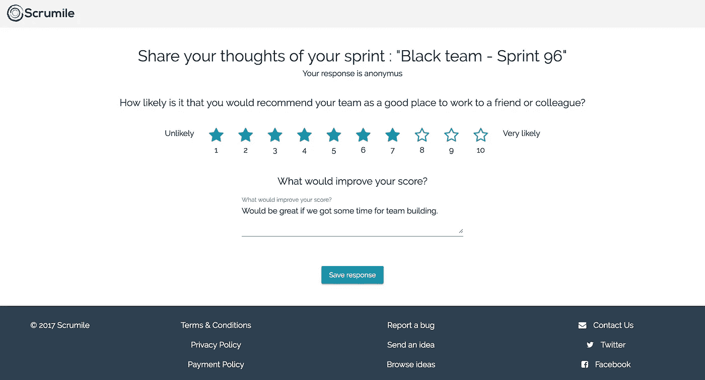
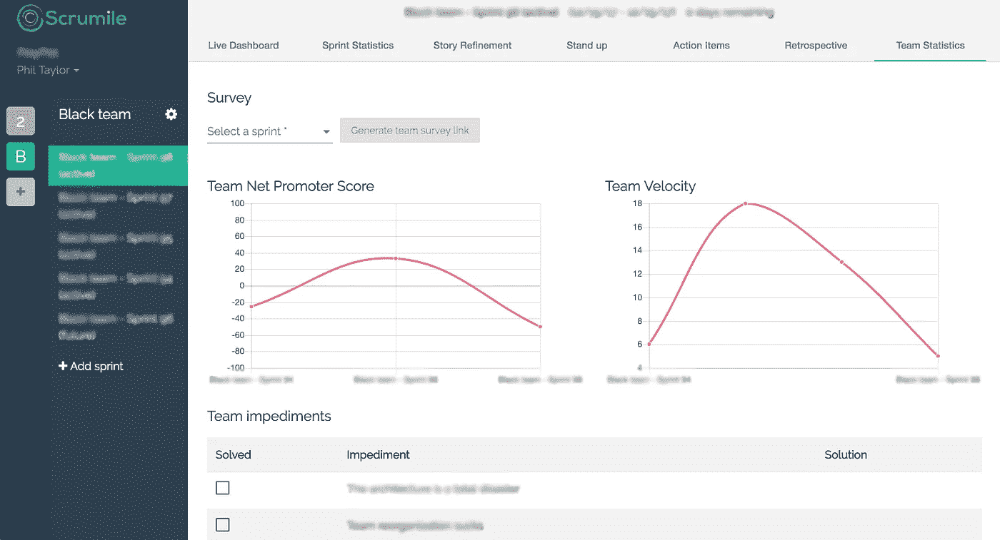

# 衡量敏捷/scrum 团队的健康状况

> 原文：<https://medium.com/hackernoon/measuring-your-agile-scrum-teams-health-91331f2e2d51>

可能你的许多团队已经经历了一些艰难的时期，无论是经理重组团队，产品的技术问题还是来自团队内外的任何干扰。

当一个团队经历这样的时刻时，团队的敏捷教练/scrum master 注意到有问题是至关重要的，更重要的是能够收集和分析问题的来源。

团队中有许多潜在的迹象可以显示这样的问题，如速度、质量、士气等的下降。但问题是，如果你有一个经验丰富的专业团队，这些指标不一定会改变，或者只是以后会改变。

我相信发现问题的唯一方法是从团队获得正确的信息。

当然，回顾会带来许多可能是短期问题的问题，但很多时候长期问题不会在回顾中出现。

因此，让我们通过匿名提问来帮助团队成员打开话题。

关注两个领域

*   团队目前表现如何？这可以通过收集 NPS(净推介值)来轻松衡量
*   什么能让团队成员感觉更好，或者什么能帮助他变得更有动力和效率？

我曾经用 SurveyMonkey 来测量这些值，但我的问题是，很难呈现结果的变化，甚至很难将它与团队的速度匹配起来。NPS 和团队速度经常是携手并进的。

最近，我开始使用 Scrum mile T1，这是一个工具，它包含了许多非常棒的工具，适合敏捷教练和 Scrum 大师使用，也给了他们一个解决方案:)

gif from tenor.com

我认为 Scrumile 在从团队中轻松收集所需信息方面做得很好。你只需要在每次冲刺后给你的团队成员发一个链接。他们打开盒子，回答两个非常简单的问题。这真的只需要 5 秒钟。

在您的团队提交他们的回答后，您可以查看团队的 NPS 分数，该分数根据团队的速度旁边您的 sprints 分组，这是一个非常有趣的配对。

你甚至可以管理你的团队在一段时间内收集的障碍。

Scrumile Team Statistics page

我希望你会发现测量团队健康对你和你的团队都有帮助。

菲尔·t。