# 媒体试图践踏我们，但只是帮助我们接触到 100 万用户并赚钱。MakeApp 的故事。

> 原文：<https://medium.com/hackernoon/media-tried-to-trample-us-but-only-helped-us-reach-out-to-1-000-000-users-and-make-money-fb39a90fd0fa>

在围绕我们的 [**MakeApp**](https://itunes.apple.com/app/makeapp-ai-based-editor/id1236717369) 项目的一周宣传期间，我在美国被冠以“白人至上主义者”、“厌女者”和“普京的间谍”等几个名字。我很惊讶吗？是的，我是。原因如下。

我们是一个只有 10 名开发人员和平面设计师的团队。我们的旗舰产品是基于人工智能的增强现实应用程序，名为 [**Magic**](https://itunes.apple.com/app/id1182004810) 。它将情感识别用于游戏和 3D 面具。

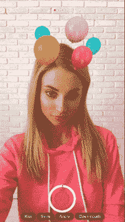

AI/AR based app Magic

它引起了苹果公司的注意，并一次又一次地出现在应用商店上。

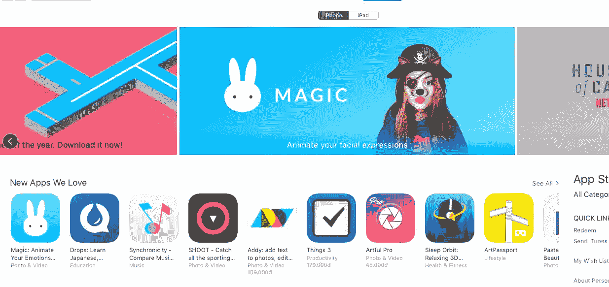

Magic on the AppStore

通过 Magic，我们开发了一种照片般逼真的数码化妆技术。

在进行实验时，我们发现神经网络既可以化妆，也可以卸妆。

“嗯，这可能很有趣，”我想，并建议我们利用这一功能来开拓市场。

我们所有的俄罗斯团队成员都投票赞成启动这个实验。只有我的密友、美国公民皮尔反对。

他认为美国媒体会无视这一特点，指责我们性别歧视。我在俄罗斯生活了一辈子，几乎听不懂他在说什么。我不知道这个卸妆功能有什么问题。我听取了所有的论点，并决定保留这一功能，并发布该应用程序。

第一个 [MakeApp](https://hackernoon.com/tagged/makeapp) 版本出现在半年前的 App Store。我们[将它发布在产品搜索](https://www.producthunt.com/posts/makeapp)上，并引起了其创始人瑞安·胡佛的注意。

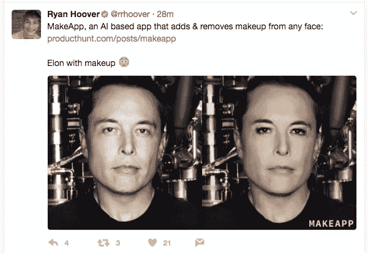

“哦，那太好了，”我们想了想，然后上床睡觉了。

当我第二天早上醒来查看邮件时，我几乎不敢相信自己的眼睛。我的收件箱被来自日本、韩国和中国记者的数十封电子邮件狂轰滥炸。他们都找我采访，问我对 MakeApp 的看法。

我去厨房给自己煮了些咖啡。在我看了数据之后，我明白了发生了什么。我们引爆了亚洲市场，迅速走红，在应用商店排名中名列前茅。

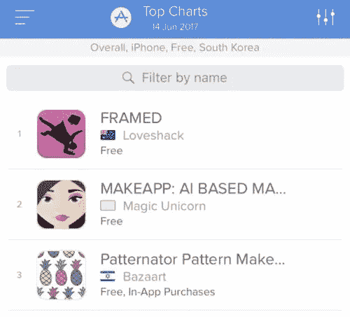

AppStore in South Korea

MakeApp 成为亚洲头号新闻。看，日本的电视节目主持人喜欢它！

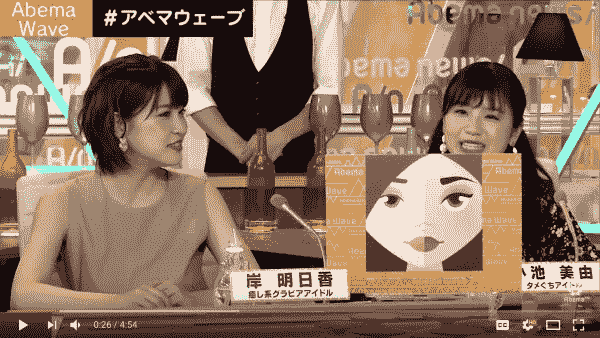

Abema TV

亚洲媒体对我们的项目持积极态度，推特用户也非常兴奋。我的美国朋友的担心被证明是没有根据的。“亚洲爱我们！”他给我发了信息。

中国、日本、韩国和泰国的媒体充斥着非常有利的头条新闻。MakeApp 仅仅一天就成为了畅销书。

这个项目在亚洲非常受欢迎，以至于中国的[腾讯宣布他们将开发一个竞争产品](https://www.yicaiglobal.com/news/tencent-youtu-lab-uses-ai-develop-make-removal-photo-software)。

“爽！媒体和用户爱我们！我们走在正确的轨道上，”我们的团队欢呼着，继续追求这项技术。

半年后，我们在 MakeApp 中加入了视频处理。我觉得在 BoredPanda 上发布这个消息会很棒。我决定把名人的视频和图片作为样本图片。他们的长相是众所周知的，用户不用化妆就可以很容易地认出他们来，看看这项技术是如何工作的。

我准备了照片和 gif，[发布了](https://www.boredpanda.com/app-removes-makeup-makeapp/)，并分享了相关子栏目的链接。

BoredPanda 的编辑看到了这些材料，并在他们的脸书页面上分享了这些材料。我们惊讶地看到欧洲这次爆发了。MakeApp 席卷了英国，随后是德国、瑞典、意大利和其他国家。《每日邮报》重复了我的实验，并在 stars 上测试了这款应用。MakeApp 上了新闻头条。

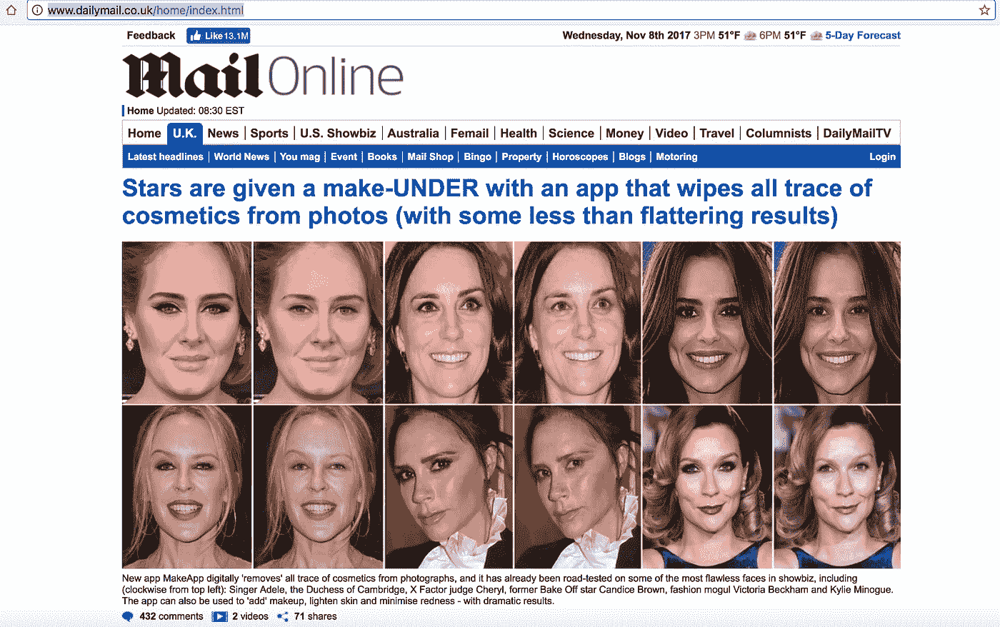

The Daily Mail’s main page

我们的幸福无止境！每个人都很激动！一切都很顺利。

是的，直到美国媒体注意到这一点。

“一名男性俄罗斯宣传员在一个毫不讨好的人工智能应用程序后面，该应用程序显示女性不化妆的样子”这是 Business Insider 的标题，标志着我们在美国的故事的开始。

我很失望地发现，这些和其他一些“优质”美国媒体机构的记者是多么不专业。

我与 Shona Ghosh 的通信表明，她的主要兴趣是炒作 clickbait 的故事，而不是调查应用程序和技术。“俄罗斯-克里姆林宫-间谍-性别歧视-种族歧视”——见鬼，这家伙是黄色媒体的梦想成真！

从我们的通信中，我意识到她的目的是把我变成一个邪恶的怪物，把这个应用变成一个地狱之子。我跟她提过。

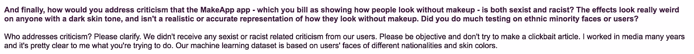

Part of an email correspondence with Business Insider

另一件有趣的事。《商业内幕》的记者问我们的团队中是否有女性。对煽动者来说不幸的是，我们船上有女性，一个年轻而有才华的女孩，专门处理神经网络。

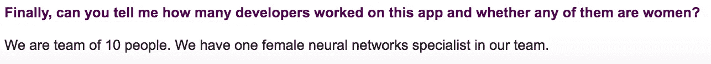

Part of an email correspondence with Business Insider

你认为这个故事提到她了吗？不，没有。毫无疑问，她问这个问题是为了得到我的“不”，然后写道，这个性别歧视的应用程序有一个仅限男性的团队。

商业内幕试图指责我们种族歧视。肖娜说这款应用程序让皮肤变得更白，并试图通过给我发塞雷娜·威廉姆斯的照片来证明这一点。

Sirena William’s image processed with MakeApp

我问她在照片中哪里看到“更白的皮肤”,但她懒得回答。

阅读一个对技术一无所知的人写的技术评论很有趣。

尤其是考虑到我们团队在人脸修图领域取得了突破。原因如下。

智能手机上的实时数字化妆目前是通过面部跟踪和投影映射来完成的。结果将直接取决于是否能在帧中找到该面部以及其标志能被识别得多好。当处理大量帧时，跟踪的质量尤其重要，因为小故障可能会导致补色的“丢失”。

由于潜在的人脸检测和跟踪步骤，对于这种方法来说，在一帧中处理多个人脸是一项非常具有挑战性的任务，并且现有的解决方案仅限于每个图像一个人脸。

为了说明我的观点，我将向您展示这是如何在最流行的美容编辑器之一 YouCam 中工作的。

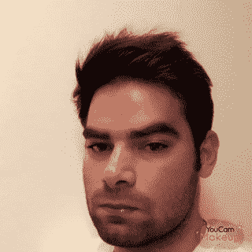

Made with YouCam

捕捉面部结构和投影映射也是一个问题。如果脸部被另一个物体部分覆盖，当今的技术只是忽略它，并在它上面化妆。

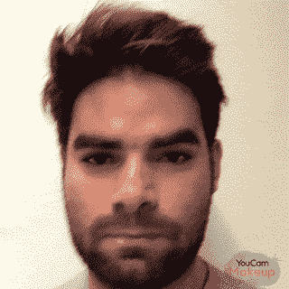

Made with YouCam

此外，我们不应该忘记面部稍微超出框架或不适合它的挑战性情况——手机摄像头经常出现这种情况。

因此，我们开发了一种完全不同的技术，图像完全由神经网络处理，从而为所有这些问题提供了部分或完整的解决方案。

这是我们的技术在发挥作用。

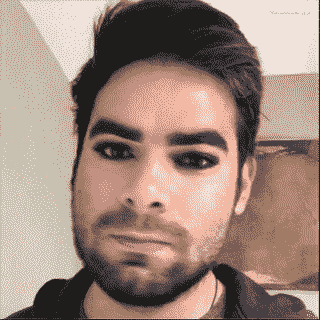

Made with MakeApp

我们的方法基于 GAN(生成对抗性神经网络)训练算法，其中模型试图模仿真实数据，以便尽可能真实地化妆。

生成的模型考虑了许多难以用程序捕捉的因素:光线、肤色、照片质量等。因此，妆容几乎和照片一样逼真。

与跟踪技术不同，这种方法可以通过使用过程中学习的数据回归面部图像来卸妆。

据我们所知，这是第一个基于 GAN 的移动设备实时模型，也是第一个使用生成过程来上妆和卸妆的模型。

但是记者们不在乎。

他们唯一感兴趣的似乎是“俄罗斯男性——性别歧视者——宣传者——想让女人变丑”的叙述。

文章发表后，媒体炸开了锅:

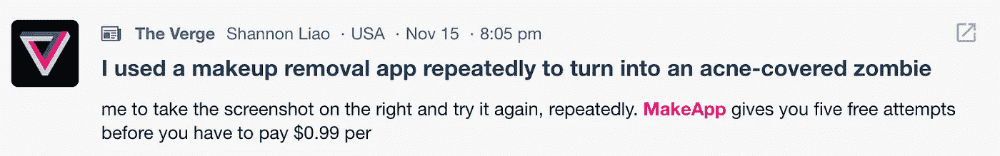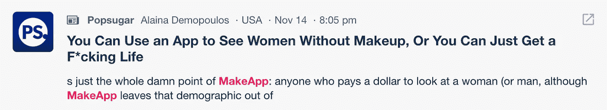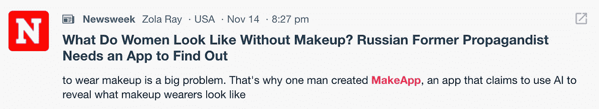

我必须承认我非常失望。作为一名记者，我已经在俄罗斯媒体工作了 10 多年。对我来说，美国媒体一直是高质量新闻的典范。想象一下，当除了 Business Insider 之外，只有四家报纸的代表联系我时，我有多惊讶:赫芬顿邮报、Buzzfeed、每日 Dota 和 Mashable——仅此而已。

其余的人不仅没有联系上，甚至连我自己的邮件都不理会。

他们通常会重印《商业内幕》的文章，甚至不去核实任何事实。有些人甚至走得更远，诉诸公然捏造。Elle Australia 写道，我开发了 FaceApp，这是一款之前被指责有种族歧视的应用。伙计们，我和 FaceApp 一点关系都没有！

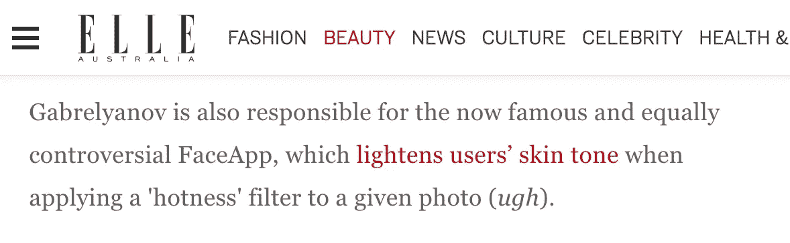

Elle Australia

我发了推特给澳大利亚 Elle 的主编。还是没有回复。

为了增加他们的流量，记者们试图把我描述成一个克里姆林宫代理商，并让 App 成为他们的产品。为了证明，他们访问了我的维基百科页面，上面写着我创建了俄罗斯生活新闻频道。“这就是证据！MakeApp 就来自克里姆林宫！”对，因为每个俄罗斯人都是间谍。至少记者们似乎是这么认为的。

LifeNews 类似于美国的 FoxNews 和英国的 SkyNews。在为该频道工作时，我借鉴了美国和英国同事的专业知识。开播两年后，它已经成为俄国最受欢迎的电视新闻频道，[因其对公民新闻的贡献获得了世界峰会奖](https://www.worldsummitawards.org/winner/hyperboloid-news-reporter/)。

《生活新闻》总是刊登关于俄罗斯生活的独家爆炸性新闻。

现在，我们看到的是俄罗斯国家足球队队长安德烈·阿尔沙文，在欧洲预选赛中被击败后，要求服务员给他送威士忌。

【https://youtu.be/W1RiLe5KmIE 

文章发表后，俄罗斯国家足球队想起诉《生活新闻》。

这是俄罗斯大亨奥列格·德里帕斯卡(Oleg Deripaska)用勺子吃黑鱼子酱，几周前，他的工厂因财务困难宣布裁员。

[https://youtu.be/vNv6K4eUuzY](https://youtu.be/vNv6K4eUuzY)

LifeNews 拥有俄罗斯最强的记者团队，他们总是提供照片、视频、音频资料作为证明。这是事实驱动的新闻。称之为宣传是荒谬的。

至于我自己，我曾经是该频道的首席执行官。如你所知，一个电视频道通常分为两个部分:编辑和技术。我负责频道的技术设备。我必须承认，我为我们在 7 个月内建成了欧洲最大的新闻室和多功能演播室而感到骄傲。你可以在这里看到我们的创作[。](http://bigpicture.ru/?p=491435)

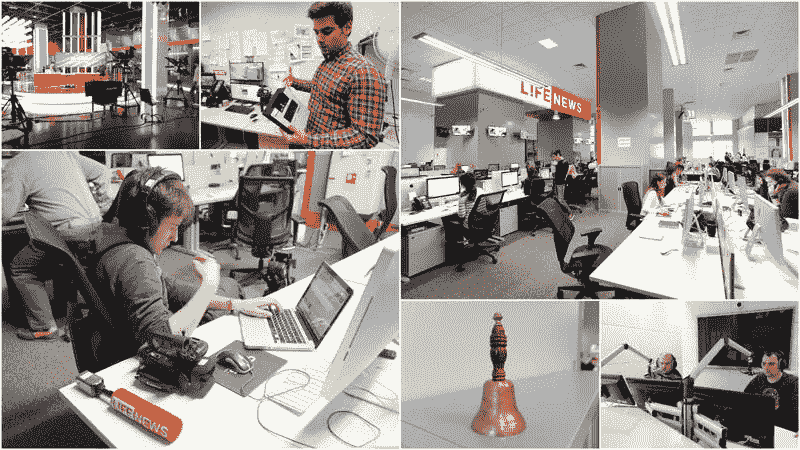

LifeNews’ office with studio and newsroom

我问记者是什么让我如此宣传，但他们没有提供任何答案。

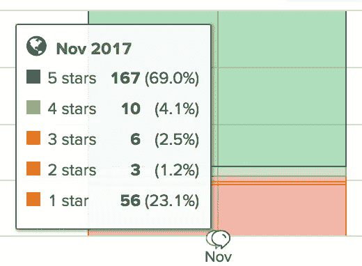

Information provided by AppAnnie

但是我们的美国用户站出来反对批评。你可以看到他们大部分都在称赞 MakeApp。

我们的团队收到了来自美国用户的大量支持信息。

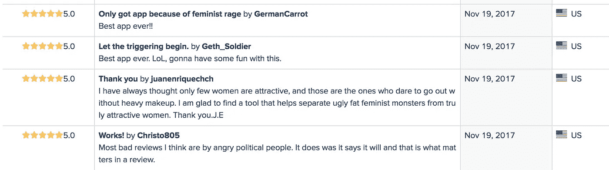

此外，我们的项目在专业社区中并没有被忽视。这是 Oculus VR 的创始人转发我关于 MakeApp 的消息。

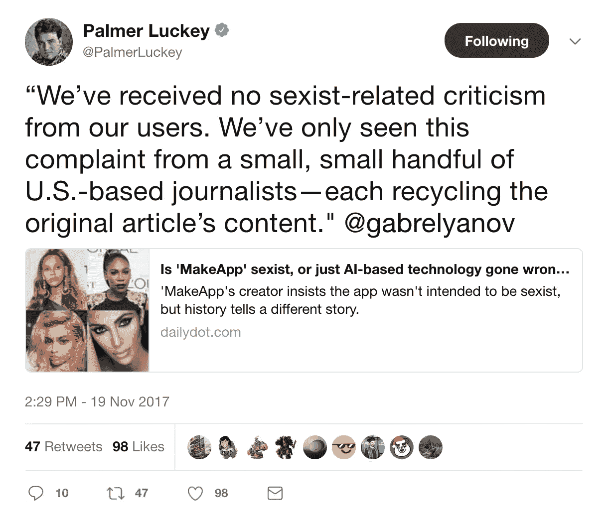

我必须承认，我们的成功在一定程度上要归功于那些不专业的记者。正是他们哗众取宠的噱头帮助我们获得了超过 200，000 个新安装，并在五天的宣传过程中登顶美国应用商店评级。除了对我们表示感谢，我们心怀感激的用户也在财政上支持这个项目。我们开始每天赚几千美元。

今天，我们推出了一个新的 MakeApp 版本，允许实时化妆和卸妆。iOS 用户(6S 及以上)可以在这里 下载 app [**，安卓版本会稍微晚一点推出。**](https://itunes.apple.com/app/makeapp-ai-based-editor/id1236717369)

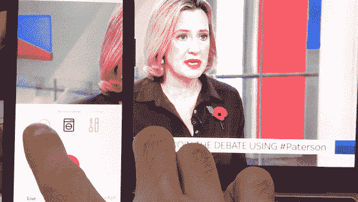

MakeApp now works in real-time

如果你能以任何方式支持我们的项目，无论是通过金钱捐助，积极的态度，还是仅仅通过分享这篇文章，我们将不胜感激。

你对真相的渴望和敢于直言的意愿是我们团队最大的成功。

最诚挚的问候，

你的俄罗斯间谍，

阿肖特·加布列扬诺夫

MakeApp & Magic

创始人