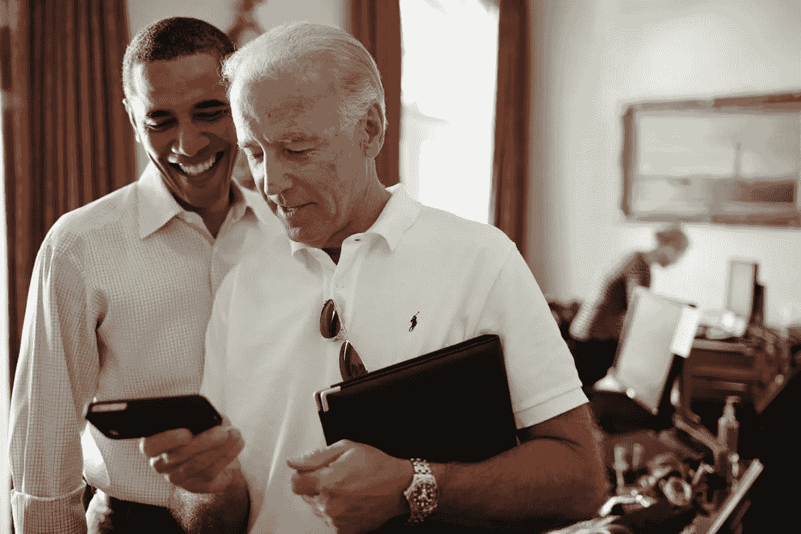

# 媒体与白宫数字化转型

> 原文：<https://medium.com/hackernoon/medium-and-the-white-house-digital-transition-5cf6f283ab6f>

## [白宫](https://medium.com/u/c9d0071ccfde?source=post_page-----5cf6f283ab6f--------------------------------)，[巴拉克·奥巴马](https://medium.com/u/255435e008e6?source=post_page-----5cf6f283ab6f--------------------------------)，[第一夫人](https://medium.com/u/d18d2d94aa50?source=post_page-----5cf6f283ab6f--------------------------------)，[副总统拜登](https://medium.com/u/c256e7b4d14e?source=post_page-----5cf6f283ab6f--------------------------------)，[吉尔·拜登博士](https://medium.com/u/4d0ed49d3149?source=post_page-----5cf6f283ab6f--------------------------------)待存档。

白宫[发布了一份摘要](https://www.whitehouse.gov/blog/2017/01/17/obama-administration-digital-transition-moving-forward)，介绍了哪些数字账户正在向新政府转移，以及你如何继续关注和参与奥巴马总统、第一夫人米歇尔·奥巴马和其他奥巴马白宫官员的工作。

数字化转型始于 10 月，当时有三个目标:

*   保存由国家档案和记录管理局创建的材料；
*   确保在创建这些材料的平台上可以继续访问这些材料，从而可以继续访问过去八年中发布的内容；
*   确保下一届白宫和未来的政府能够继续使用和发展已经建立的数字渠道，与他们服务的人民直接联系。

数字过渡包括在[媒体](https://medium.com/u/504c7870fdb6?source=post_page-----5cf6f283ab6f--------------------------------)上的所有白宫账户:

*   [白宫](https://medium.com/u/c9d0071ccfde?source=post_page-----5cf6f283ab6f--------------------------------)个人资料[[https://medium.com/@WhiteHouse](/@WhiteHouse)]是将保留在白宫并过渡到特朗普政府的数字资产之一，包括追随者，但没有帖子。
*   所有以前的帖子将通过 NARA 维护的新存档档案[白宫](https://medium.com/u/ca9f8f16893b?source=post_page-----5cf6f283ab6f--------------------------------)[[https://medium.com/@ObamaWhiteHouse](/@ObamaWhiteHouse)]存档。
*   巴拉克·欧巴马[[https://medium.com/@PresidentObama](/@PresidentObama)]将在 [Pres 存档。奥巴马(档案)](https://medium.com/u/af20771b807f?source=post_page-----5cf6f283ab6f--------------------------------)[https://medium.com/@potus44](/@potus44)。
*   [第一夫人](https://medium.com/u/d18d2d94aa50?source=post_page-----5cf6f283ab6f--------------------------------)[https://medium.com/@FLOTUS](/@FLOTUS)将在[米歇尔奥巴马(档案馆)](https://medium.com/u/a7c5b2067279?source=post_page-----5cf6f283ab6f--------------------------------)[https://medium.com/@FLOTUS44](/@FLOTUS44)存档。
*   [副总统拜登](https://medium.com/u/c256e7b4d14e?source=post_page-----5cf6f283ab6f--------------------------------)[[https://medium.com/@VPOTUS](/@VPOTUS)]将在[乔拜登(档案馆)](https://medium.com/u/207eb19f7f88?source=post_page-----5cf6f283ab6f--------------------------------)[[https://medium.com/@VPOTUS44](/@VPOTUS44)]存档。
*   [吉尔·拜登博士](https://medium.com/u/4d0ed49d3149?source=post_page-----5cf6f283ab6f--------------------------------)[[https://medium.com/@DrBiden](/@DrBiden)]将在[吉尔·拜登博士(档案馆)](https://medium.com/u/d1c76baae73d?source=post_page-----5cf6f283ab6f--------------------------------)[[https://medium.com/@DrBiden44](/@DrBiden44)]存档。

到目前为止，还没有关于其他受欢迎的白宫相关媒体简介的信息，如大使萨曼莎·鲍尔、T2、本·罗德斯、T4、詹森·高德曼、梅根·史密斯和其他人。

> [黑客中午](http://bit.ly/Hackernoon)是黑客如何开始他们的下午。我们是 [@AMI](http://bit.ly/atAMIatAMI) 家庭的一员。我们现在[接受投稿](http://bit.ly/hackernoonsubmission)并乐意[讨论广告&赞助](mailto:partners@amipublications.com)机会。
> 
> 如果你喜欢这个故事，我们推荐你阅读我们的[最新科技故事](http://bit.ly/hackernoonlatestt)和[趋势科技故事](https://hackernoon.com/trending)。直到下一次，不要把世界的现实想当然！

