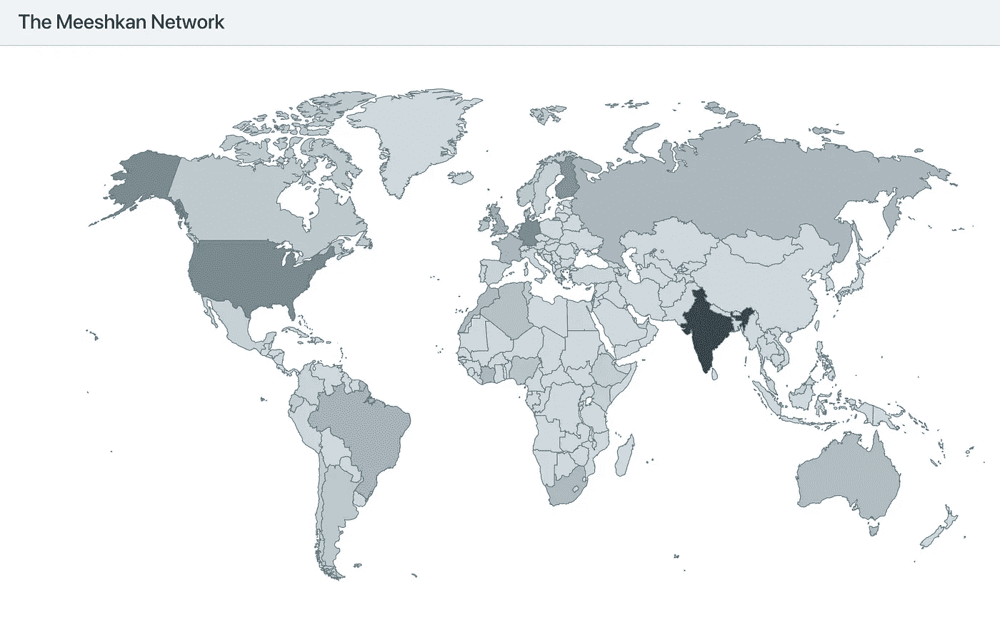
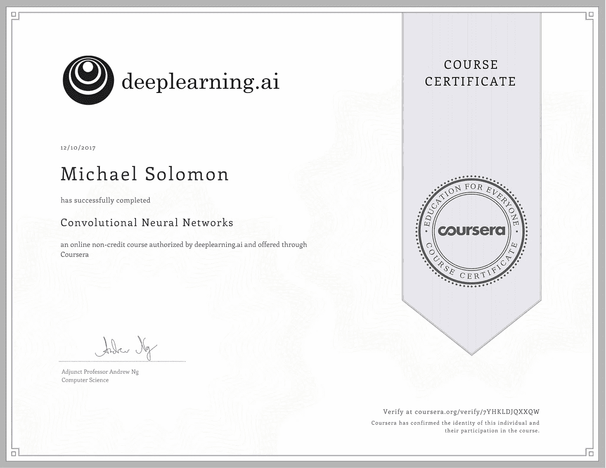

# 米什坎机器学习

> 原文：<https://medium.com/hackernoon/meeshkan-machine-learning-a33a8cabb0d6>

*TL；* [*米什坎博士机器学习公测*](https://app.meeshkan.com) *正式上线。去学点东西吧！*

A snapshot of the Meeshkan network on December 11th, 2017.

# Cloudera

2010 年，Cloudera 开了一个互联网上最大的愚人节玩笑。他们称 Apache Hadoop 正在 100 万台 Nexus 设备上运行，以帮助谷歌处理图像。他们很少知道，随着移动计算变得越来越强大，这正是公司一直在做的事情——使用连接到网络的机器作为服务器的扩展。

抛开奥威尔式的弦外之音，这带来了一个很好的问题——如果我们真的一起工作来制造分布式系统，帮助人们处理数据，同时向设备所有者支付使用时间，会怎么样？当然，2010 年的大多数人都无法接触到海量数据，更不用说分析这些数据的知识了。但现在是 2017 年了。吴恩达在 Coursera 上发布了他的第二本[机器学习课程](https://www.deeplearning.ai)。公司正在雇用专门的 ML 工程师，并在他们的工作流程中使用[机器学习即服务](https://www.quora.com/What-are-the-best-machine-learning-as-a-service-MLaaS-companies-and-startups) (MLaaS)。艺术家们正在利用机器学习创作[疯狂酷炫的作品](https://deepart.io/)。个人的个人设备，甚至是可穿戴设备，变得越来越强大。人们[在全球各地飞 GPU](https://qz.com/1039809/amd-shares-are-soaring-ethereum-miners-are-renting-boeing-747s-to-ship-graphics-cards-to-mines/)开采虚拟货币。游戏不一样…

# SETIs 的世界

SETI@home 项目将自己描述为一个“搜寻外星智能(SETI)的联网计算机”网络。你可以通过运行一个下载和分析射电望远镜数据的免费程序来参与其中。”你的电脑帮助 SETI 筛选庞大的、不断增加的数据集来寻找外星人。多酷啊。！？

2017 年，商业世界开始看起来更像一群迷你集合。有了像数据增强这样的技术以及像 [IOTA 数据市场](https://data.iota.org/)和 [OpenMined](https://openmined.org/) 这样的令人敬畏的项目，人们可以在巨大的开放数据集和数据流上运行他们的机器学习模型。因此，尽管数据变得可以访问，但问题是大多数公司和个人都负担不起在沙盒环境中进行机器学习实验，以获得对其模型的直觉和理解。

[**回车**](https://www.meeshkan.com) **。Meeshkan 是一个网络，任何人都可以在参与的主机设备上以大规模并行的方式训练和测试机器学习模型。作为回报，主持人赚了点钱。这将亚当·斯密的无形之手带入了 GPU 和 CPU，并允许人们在没有高昂价格的情况下使用大数据。当然，一个树莓 Pi 永远不可能有一个 NVIDIA 1080Ti 那么快。然而，成千上万的这些小家伙会像[非洲野狗](https://www.youtube.com/watch?v=fnR9s2JOxdQ)一样，分而治之，在合理的时间内把事情做完。随着设备所有者赚钱，企业可以廉价地测试想法。**

# 米什坎:名字有什么意义？

Meeshkan 是希伯来语 *meeshkenotecha* 的缩写，大致翻译为“你的住处”，见于民数记 24:5。巴兰出乎意料地被以色列人在西奈的临时营地所感动，他说:“雅各，你的帐棚，你的居所，以色列，多么美啊！”( *Ma tovu ohalecha Ya'akov，meeshkonetekha Yisrael*)。

Biblical distributed systems — Numbers 24:5.

Meeshkan 以这个小趣闻作为整个服务的起点。该公司的使命是让我们分散的数字居所在一起工作*变得更美好。*

*让我们想想谁赢谁输…*

1.  *设备拥有者在 Meeshkan 被称为“卖家”，他们赢得了胜利，因为他们仅仅通过连接网络就能赚钱。*
2.  *机器学习实践者，在 Meeshkan 被称为“买家”，赢得**因为他们可以用自己的机器以服务成本的一小部分运行大规模并行作业。这是因为数千台设备的市场决定了价格。***
3.  *Meeshkan **赢了**，因为我们公司从买家到卖家的每笔交易中抽取一小部分，这与易贝、优步或 AirBnB 等其他 P2P 和 B2B 服务没有什么不同。*
4.  *在机器学习上向你要价过高的公司**会失去**。不，开玩笑，每个人都赢了，所以他们**也赢了**，因为他们可以降低价格。事实上，在我们的私有 alpha 中，当需求很高时，一家机器学习咨询公司会自动从 Meeshkan 网络中提取额外的容量。*

# ***去学点东西吧！***

*转到 [Meeshkan](https://meeshkan.com) ，然后点击主页上的“立即尝试”链接进入[网络应用](https://meeshkan.com)。*

*一些随机的思考:*

1.  *我们在 Meeshkan 上给你 100 小时免费 ML。使用它，打破东西，向我们报告，并帮助我们使米什坎更好。*
2.  *一旦你进入 Meeshkan，点击[设置](https://app.meeshkan.com/#/settings)，滚动到底部，注册我们的 Slack #公测频道。*
3.  *在 Medium 上订阅@ [meeshkan](/@meeshkan) ，在 Twitter 上订阅@ [MeeshkanML](https://twitter.com/MeeshkanML) ，观看我们的第一个端到端教程，名为“机器学习 Github API”，将于下周推出。*
4.  *我们正在尽快开源我们的代码库。查看我们在 https://github.com/meeshkan 的项目。*
5.  *你喜欢咖啡吗？你想要更多的钱去买一些吗？把你的设备放到 Meeshkan 上！或者下载我们的[安卓应用](https://play.google.com/store/apps/details?id=com.meeshkan.android)，我们会把你的 droid 改造成深度学习的工具，并为你使用 [Iota](https://iota.org/) 的时间付费。*
6.  *你真的喜欢咖啡吗？你想要更多的钱买很多吗？[jobs@meeshkan.com](mailto:jobs@meeshkan.com)*

*你还在等什么？去 Meeshkan 上学点东西吧！*

*你在机器(和人类)学习方面的伙伴，
迈克·所罗门
首席执行官，米什坎机器学习*

**

*另外，昨晚还有人熬夜在截止日期前完成[卷积神经网络](https://www.coursera.org/learn/convolutional-neural-networks/)吗？自从《哈利·波特》系列的最后一部以来，我还没有对一个系列的新部分这么兴奋过。BOOYAH！*

**