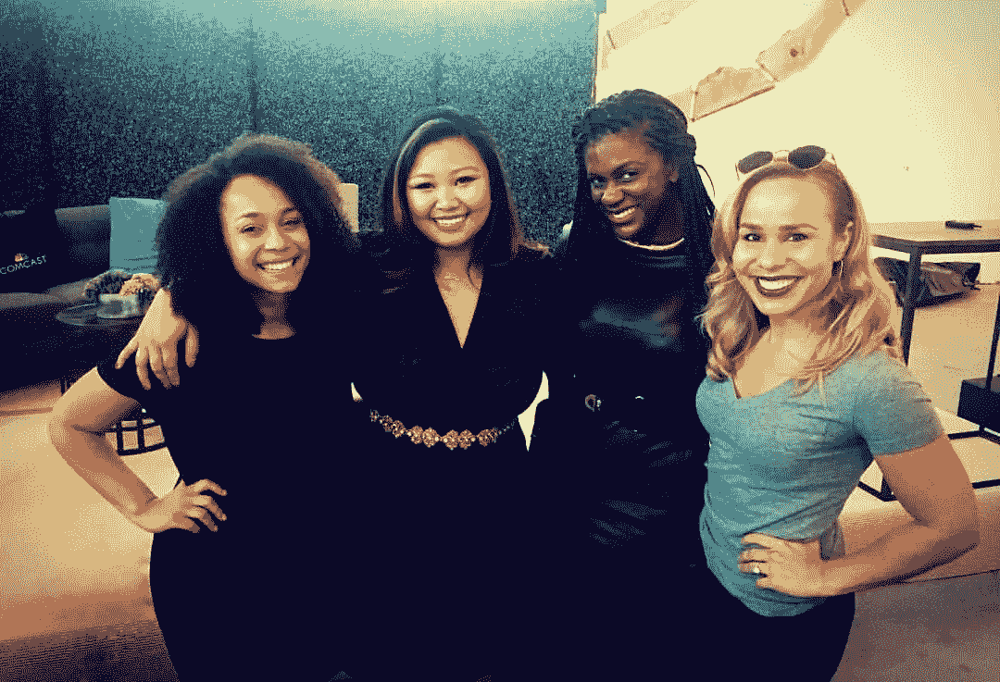
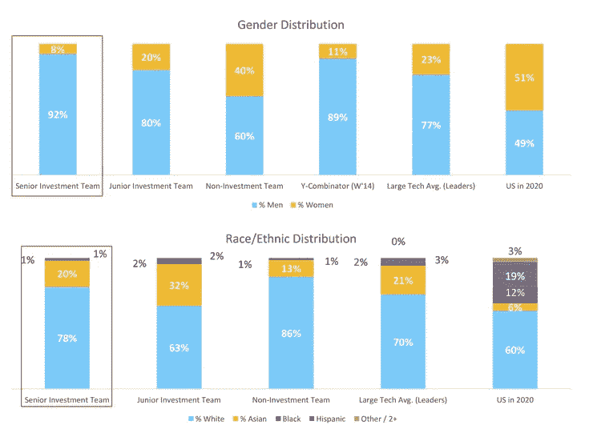

# 遇见真正的独角兽:500 家创业公司的第一个黑人合伙人

> 原文：<https://medium.com/hackernoon/meet-a-real-unicorn-the-first-black-partner-at-500-startups-af8090c59cc2>

500 Startups Investment Partner, Monique Woodard (center right), surrounded by Morgan DeBaun, Blavity Founder, Xiaohoa Michelle Ching, Literator Founder, and me.

风险资本家是一个投资商业风险的人，为创业或扩张提供资金。大部分风险资本(VC)来自专业管理的公共或私人公司，这些公司通过(通常)投资于有前途的[初创企业](https://hackernoon.com/tagged/startup)或具有高增长潜力但也具有高风险的年轻企业来寻求高回报率。[风险投资公司通常投资于商业领域，如 IT、生物制药、清洁技术、半导体等。(](https://hackernoon.com/tagged/vc)[来源](https://www.thebalance.com/what-is-a-venture-capitalist-2947071))

美国大多数风险资本家都是男性。美国大多数风险投资家都是白人。

Source: [Techcrunch](https://techcrunch.com/2015/10/06/s23p-racial-gender-diversity-venture/)

所以找出 [**莫尼克·伍德尔**](https://twitter.com/MoniqueWoodard) 是一个…

黑色

妇女

风险资本家

并且是最著名的公司之一的合伙人( [**500 家创业公司**](http://500.co) )。

有人要问…

# 她是怎么做到的？

我决定让自己成为那个人。我和 Monique 坐在一起，我们聊了聊和 [Dave McClure](https://twitter.com/davemcclure) 和 [Christine Tsai](https://twitter.com/christine_tsai) 一起工作的真实感受，如果她不投资创业公司，她会做些什么，以及她是如何散发出如此多的#BlackGirlMagic！观看下面的完整采访，如果你发现了值得分享的东西，一定要传下去！ **(** [**推特本**](https://twitter.com/home?status=%22Meet%20a%20Real%20Unicorn%3A%20The%20First%20Black%20Partner%20at%20%40500Startups%22%20via%20%40MandelaSH%20http%3A//bit.ly/TSC25article%20%23tech%20%23startup%20%23vc%20%40moniquewoodard) **)**

# 观看我对莫尼克·伍德的视频采访

# 感谢阅读！如果你喜欢这篇文章…

## 在 [Instagram 上打招呼](http://instagram.com/mandelash) | [脸书](http://facebook.com/mandelash) | [推特](http://twitter.com/mandelash) | [YouTube](https://www.youtube.com/channel/UC1XemKTBoMTxK3rgUSDFIVg)

## 点击这里订阅我的简讯

> [黑客中午](http://bit.ly/Hackernoon)是黑客如何开始他们的下午。我们是阿妹家庭的一员。我们现在[接受投稿](http://bit.ly/hackernoonsubmission)并乐意[讨论广告&赞助](mailto:partners@amipublications.com)机会。
> 
> 如果你喜欢这个故事，我们推荐你阅读我们的[最新科技故事](http://bit.ly/hackernoonlatestt)和[趋势科技故事](https://hackernoon.com/trending)。直到下一次，不要把世界的现实想当然！

