# 遇见‘恶搞’。单个实体如何主导比特币的价格。

> 原文：<https://medium.com/hackernoon/meet-spoofy-how-a-single-entity-dominates-the-price-of-bitcoin-39c711d28eb4>

这个故事是关于一个交易员，或者一群交易员，甚至可能是 Bitfinex 自己操纵比特币的价格。过去几个月，我慢慢收集了一个交易员的截图，我喜欢称之为“欺骗”。你会看到欺骗的证据，wash trading，这是一个与 Bitfinex 密切相关的粗略计划，在其他骗局中被称为“系绳”。

当 Spoofy 希望价格上涨时，他让价格上涨，当 Spoofy 希望价格下跌时，他让价格下跌，他得到了硬币……美元和比特币，当然要成功，而且在 Bitfinex 上不受惩罚。

# 更新:2017 年 8 月 7 日。

菲尔·波特在 8 月 6 日的一次采访中提到了我，并声称他们没有看到我所说的那种活动。

这是一个显示 2017 年 7 月 22 日活动的视频，包含 Phil Potters 对他声称没有发生的活动的评论。

你是法官。

Spoofing & Trading manipulation on July 22nd.

自 2017 年 3 月以来，我一直在警告人们关于 Bitfinex 及其与传统银行系统脱节的问题。

关于 Bitfinex 银行业困境的问题基本上处于次要地位，因为自那以来价格大幅上涨，但在我看来，这是比特币价格非常容易操纵的一个非常大的驱动因素。

Spoofy 是一个常规的交易者(或一组交易者)，主要在 Bitfinex 上运行，也在其他一些交易所上以有限的方式运行，从事以下活动:

1.  对比特币进行大额出价(200 万美元及以上)，通常是在较小的出价订单之下，一旦有人开始卖出，就会取消这些出价。这些订单通常持续几分钟，有时短至 5-10 秒，以操纵价格上涨(更常见)
2.  当他希望比特币价格下跌或停止上涨(不太常见)时，他会大笔买入(200 万美元及以上)
3.  偶尔“欺骗”会让订单簿中的订单停留几个小时，通常比当前价格低 50-100 美元。例如，在 2000 美元以上的恢复期间，他在 1900 美元范围内有大约 4000 BTC 的虚假订单，这些订单不太可能执行，最终从未执行。

你可能会问，什么是‘恶搞’？

欺骗是下你无意执行的订单。

欺骗的目的是向其他交易者发送错误的信号，让他们采取行动。下大单可能表明看涨，导致交易者平仓，甚至可能购买比特币。

你可以通过对你自己的比特币提出要求来获利，然后发出看涨的错误信号，人们通过购买你在要求订单上的比特币来平仓。

你也可以反过来做。提出大量要求表明看跌，导致人们关闭多头头寸，也许还会进入你的买入订单。

顺便说一下，欺骗是非法的。2010 年，根据多德-弗兰克法案，这在美国是非法的。比特币交易所在很大程度上仍然不受监管，也不监管欺骗、虚假交易和其他欺诈行为。

 [## 欺骗(金融)-维基百科

### 欺骗是一种破坏性的算法交易实体，交易者利用它来超越其他市场参与者并…

en.wikipedia.org](https://en.wikipedia.org/wiki/Spoofing_%28finance%29) 

> 欺骗者出价或报价，意图在订单完成前取消。围绕买卖订单的一系列活动旨在吸引其他[高频交易者](https://en.wikipedia.org/wiki/High-frequency_trading) (HFT)诱导特定的市场反应，例如操纵证券的市场价格。

# **等等，这和 Bitfinex 的银行问题有什么关系？**

欺骗之所以能够如此容易地操纵价格，是因为他比交易所里的所有人都更胜一筹。Spoofy 是一个在 Bitfinex 上拥有 2000 万到 6000 万美元的单一实体，但它可能更多。

为了打击欺骗行为(在他删除所有订单之前，将订单转储到他的订单中)，他们必须在交易中投入大量资金。

1.  你不能不通过一个未知的第三方就把美元送到交易所，任何想合法投资比特币的人，**永远不会**这么做。
2.  你可以发送比特币，但如果你想看到这些钱，你会向 Bitfinex 发送 10，000 BTC 或 20，000 BTC 来对抗欺骗吗？
3.  欺骗事实上可能是交易所本身，或者是与 Bitfinex 管理层关系密切的人。所以你在玩他们的大富翁棋盘游戏，他们实际上是[银行](https://www.bitfinex.com/posts/129)。

因此，Spoofy 可以在 Bitfinex 上不受惩罚地运行。

# 闭嘴。你在胡说。你没有证据！

恶搞在三个场景中现身。

1.  价格下跌得太快，spoofy 随后会提出大笔出价，从而引发价格回升。
2.  价格涨得太快，spoofy 然后下大单，防止价格涨得太高。Spoofy 单枪匹马地在 GDAX 上阻止了 3000 美元，他不断地重新填写低于 3000 美元的卖单，然后最终放弃了。
3.  如果订单薄的话，欺骗也会抬高价格。他会下自己的卖单，然后用另一个账户(或另一个合谋交易者)买入。这就是为什么我们看到这些垂直价格回升。他们可以简单地在每个账户之间来回切换。100 万美元的洗盘交易只需要 1000 美元左右的手续费。一个真实的比特币卖给另一个交易者，就为他所有的清洗交易买单，如果欺骗实际上是交易所或交易所管理，那就没用了。

*例子:*

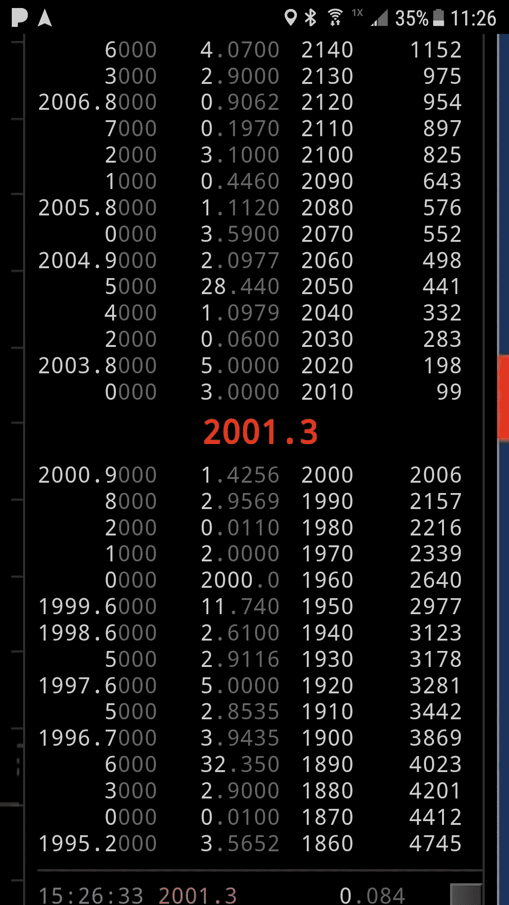

Spoofy vigorously trying to defend $2000 level. His order sizes are usually 1,000 BTC, 2000 BTC, 4000 BTC, or multiples on different price levels. If someone dumps into one, they all disappear at once.

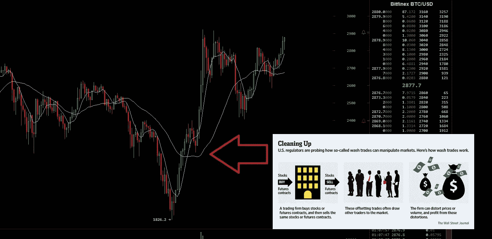

Spoofy wash trading to the Rescue!

7 月 23 日，出现了大规模抛售，Spoofy 单枪匹马就下了超过 1400 万美元的虚假买入订单。

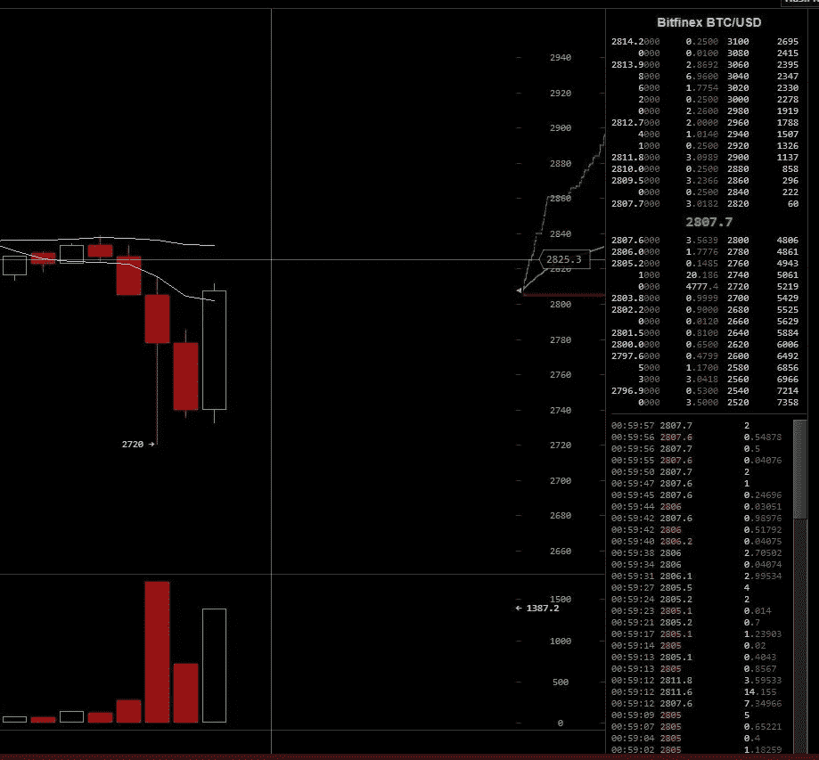

Spoofy on July 23rd at 00:59

这些出价对 Spoofy 来说是不寻常的，因为这一次他稍微离开了一些。这支撑了价格，而且他并不真的需要用出价买很多比特币。

然而，大约一个小时后，在最不寻常的情况下，有人确实向他的订单中倾倒了一些，他几乎立即撤回了订单的其余部分。

从表面上看，我相信一个有很多多头的交易者卖给了他，因为整体多头头寸在此之后立即下降。

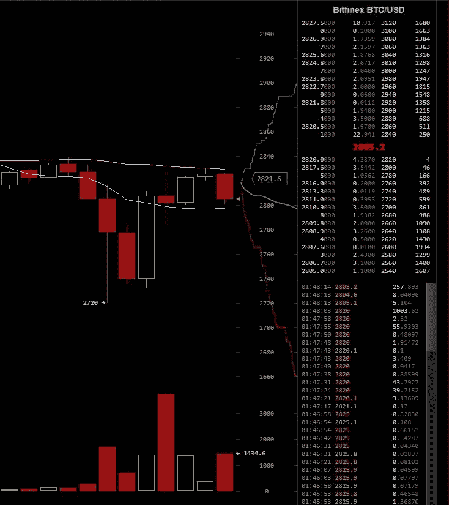

Spoofy getting pwned?

然而，有一个小问题。我们如何知道这种交易是合法的？我们怎么知道那个恶搞，没有接近他自己的秩序？

我们怎么知道 Spoofy 本人没有卖出自己的订单，从而引发虚假崩盘？

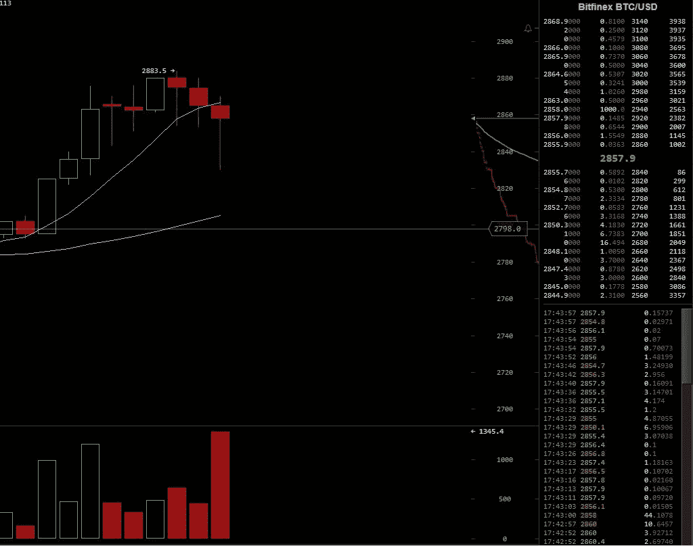

Spoofy wants the price to go down.

我们确实有洗盘交易的证据，如果 spoofy 在洗盘交易中抬高了价格，他可以在其他交易所建立头寸时洗盘交易。

请记住，就像有人不太可能向 Bitfinex 发送足够的比特币来对抗 spoofy 的虚假购买订单一样，也没有人会发送足够的美元来对抗他无情的市场抛售。即使他们想也做不到。

# “比特币现金”发行公告以一种更明显的方式暴露了 wash 交易员。

不幸的是，观察交易通常很难证明一笔交易是不是洗盘子交易。

但是 Bitfinex 给了我们一个小礼物来帮助证明这个理论。

7 月 27 日，Bitfinex 宣布了一项不同寻常的计划，他们计划如何贷记“比特币现金”代币。

[https://www.bitfinex.com/posts/212](https://www.bitfinex.com/posts/212)([http://archive.is/EOcsO](http://archive.is/EOcsO))

> 请注意，如果在分叉事件中空头多于多头，该系数将小于 1。这个系数可以从我们的 API ( [多头&空头](https://docs.bitfinex.com/v2/reference#rest-public-stats))和区块链([冷库](https://blockchain.info/address/3D2oetdNuZUqQHPJmcMDDHYoqkyNVsFk9r))的公开信息中粗略计算出来。”

结果是，人们可以通过洗自己的短裤来获得“免费”的 BCH，可以预见，这正是所发生的事情。

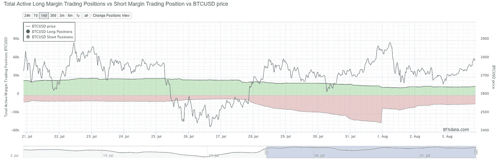

Spoofy ‘claims his position’ just before BCH distribution. Shorts skyrocketed way past all time highs, then immediately fell by around 24,000 BTC. **Notice how the price wasn’t falling despite shorts increasing so dramatically.**

一个**单个**实体(实体可以是一个交易员，也可以是一群交易员)，单枪匹马在空头交易了 24000 个比特币。为了做到这一点，你需要在 Bitfinex 上至少有 24，000 BTC 和美元来购买它们。

由于我不断在我的推特上提醒人们这件事，人们似乎开始关注它了。最终，该交易所承认事实上存在洗盘交易，并对该交易员进行了“制裁”。

在我看来，这更像是他们礼貌地要求交易者在分配前声明他的头寸。在 Bitfinex 上拥有 2000 万到 6000 万美元的人可能拥有其他交易员没有的东西。Bitfinex 的电话号码。

最重要的是，由于这些错误的信号。这导致其他交易者预期会出现“大空头挤压”，或者一些交易者“预期会出现大抛售”，可能会根据这些假空头建立头寸。

# Bitfinex 在 8 月 2 日宣布了操纵行为。

https://www.bitfinex.com/posts/214([http://archive.is/lNWAY](http://archive.is/lNWAY))

> *“在 7 月 27 日公布方法后，几个账户开始大规模操纵战术，试图以平台上的交易所多头和贷方为代价获得 BCH 代币，导致分配系数人为暴跌。*
> 
> *我们已经确定，这种操纵(包括洗盘交易和自筹资金做空)违反了 Bitfinex 的服务条款。那些企图以牺牲其他用户的利益为代价，不公平地利用 BCH 分布环境的人已经受到相应的制裁。”*

在我看来，空头在一个基点内下跌了 24000 BTC 的事实证明了这是由一个单一实体所为。

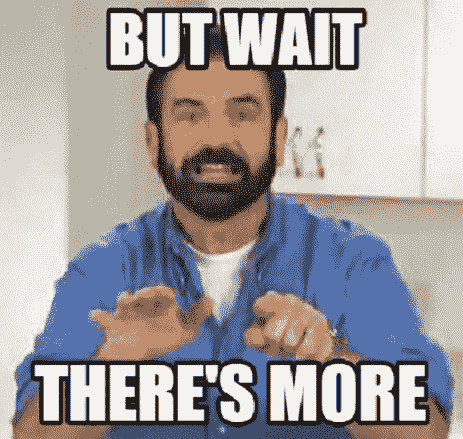

欺骗不仅限于比特币。这名“交易员”被“制裁”后不久，另一件有趣的事情发生了。

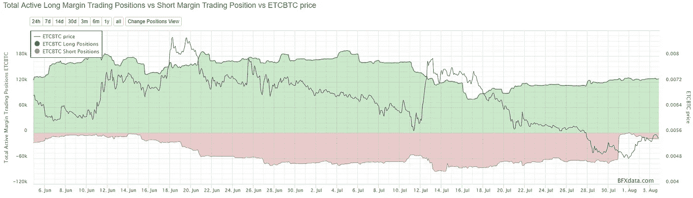

ETCBTC shorts immediately disappeared.

在这里，我们可以看到 ETCBTC 空头是如何消失的，从 60，000 ETC 空头到 93 ETC 空头。

但是我们不要只看 ETCBTC，那 ETCUSD 呢？

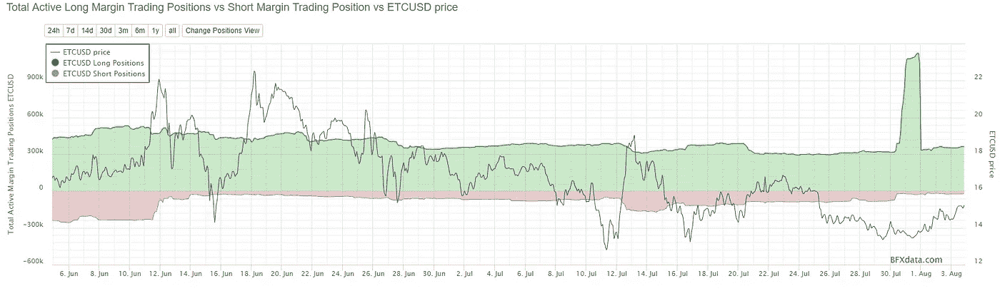

A giant middle finger. **Notice the dramatic increase and decrease in longs with no effect on price.**

我不确定这些是怎么回事，但这让人质疑这些数据的合法性。我试图通过显示 ETCBTC/ETCUSD 保证金对在同一时间也从事非常有趣的业务来说明这一点，我们如何知道 Bitfinex 上的 BTCUSD 多头不会受到这种操纵？

ETCBTC Shorts =操纵的明确证据
etc USD Longs =操纵的明确证据
BTCUSD Shorts =操纵的明确证据(*并被 Bitfinex* 承认)
BTCUSD Longs = BTCUSD Longs 以美元计，在 Bitfinex 的历史上从未有过的高。看到绿线了吗？

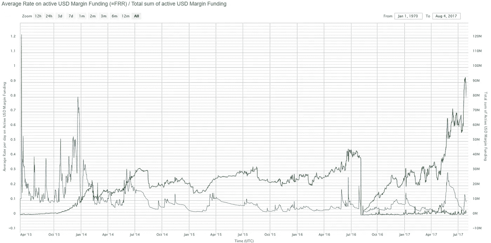

We had over $60 million of false short positions. How many long positions are fake? Green line. ( [Source](https://www.bfxdata.com/swaphistory/usd) )

当然，我们甚至没有进入其他保证金对…如 ETHBTC，这是非常坦率地说，荒谬的。

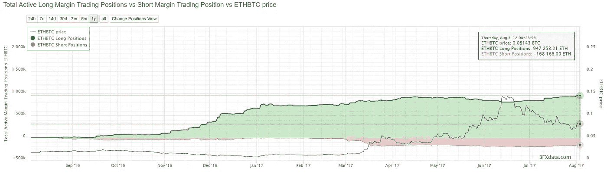

$200M of ETHBTC longs?

# **但是等等，这只是 Bitfinex！不止一个交流！别瞎扯了！**

欺骗已经在 GDAX 上被发现……但是他在 GDAX 上的订单要少得多。通常 400-500 BTC 欺骗投标或欺骗要求。

我的推特上有很多截图

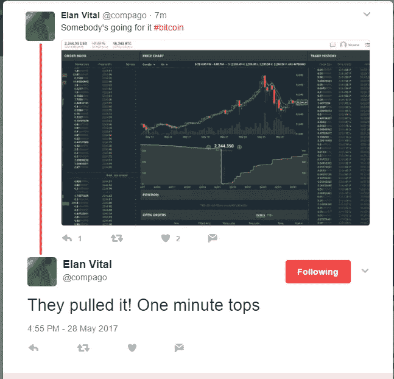

Spoof Bids

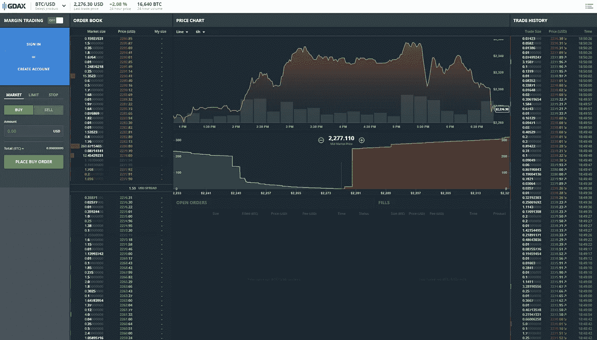

Spoof Asks

人们低估了相互交流的程度。一个交易所的操纵会影响其他交易所的价格。你有交易者观察所有的交易所，如果一个交易所开始领先，他们也会在更便宜的交易所买入。

你不只是有人类，你也有做同样事情的机器人，所以价格反应可以是立即的**。**

**我相信，自从 Bitfinex 失去了他们的传统银行业务后，在 Bitfinex 上发送美元买入或卖出以获得美元会涉及很多摩擦，结果是合法交易者少了很多，留给我们的是洗盘交易者和骗子。**

**在我看来，Bitfinex 永远不会重新建立传统的银行关系，他们的‘巧妙变通’终将失败。他们的首席战略官菲尔·波特(Phil Potter)甚至在一次采访中承认与银行玩游戏，这次采访最终被从 YouTube 上撤下，但幸运的是，我保存了下来。**

**【https://www.youtube.com/watch?v=62cvxPIDBGY **

> ***“我们过去也遇到过银行业务的小问题，我们总是能够绕过它或处理它，开设新账户，或者……转移到一个新的公司实体，许多猫捉老鼠的把戏。”
> ——Bitfinex 首席战略官菲尔·波特***

**如果你认为这是银行想与之做生意的那种业务，我在创世纪街区有些比特币想卖给你。**

**他们的下一个猫捉老鼠的把戏？**

# **系绳**

**你可能会问什么是系绳？**

**网络货币是“代币”,在其网站上声称由美元支持，1 USDT = 1 美元。**

**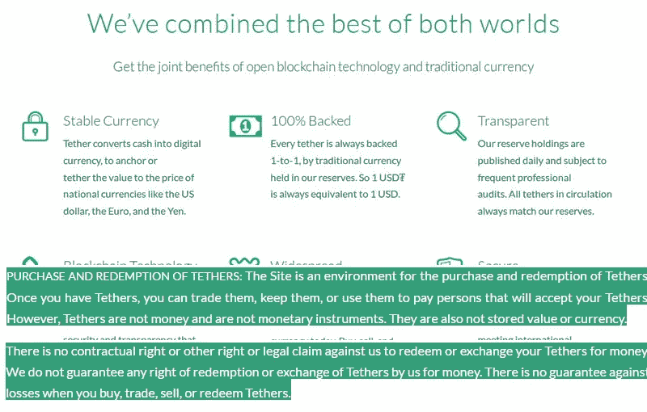**

**100% ‘backed’, but…not really.**

**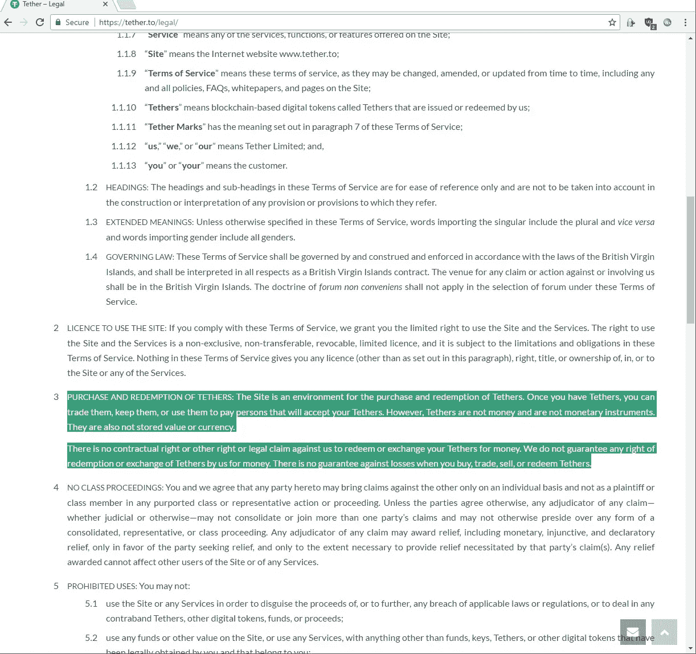**

**[Source](https://tether.to/legal/) ([Archive](http://archive.is/TRGkq))**

**Bitfinex 在一份支持票中声称，他们有一个“机构”投资者，该投资者应该有一个台湾银行账户，因此可以购买 Tethers。**

**[来源](https://www.reddit.com/r/BitcoinMarkets/comments/6nqsjo/daily_discussion_monday_july_17_2017/dkbu80w/)
[存档](http://archive.is/6jeJI)**

**只有一个小小的问题。没有一个头脑正常的机构会同意购买价值超过 2 . 5 亿美元的合法洗车代币…除非是像 BTC-E 这样的人，因此我认为他们可能会被捆绑在一起，这又是我的猜测。**

# **等一下！Tether 不是 Bitfinex！别瞎扯了！**

**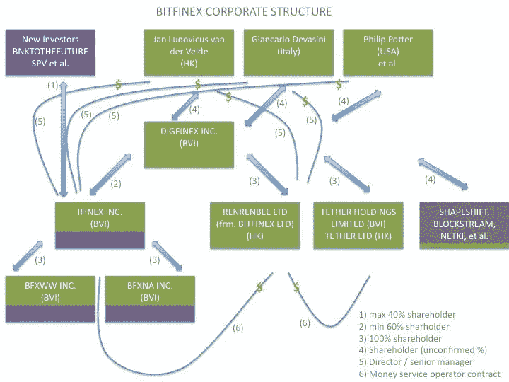**

**Well, actually…**

**Tether 和 Bitfinex 是一条船上的。他们也被富国银行切断了银行业务。Bitfinex 对富国银行的诉讼也有泰瑟作为原告。([来源](https://www.pacermonitor.com/public/case/21071162/iFinex_Inc_et_al_v_Wells_Fargo__Company_et_al))**

**他们自己反复说“Tether”不是 Bitfinex 的一部分，但是当你深入一点，就会发现他们都是对方的股东。**

**尽管没有传统的银行业务，尽管事实上系绳，根据他们自己的承认(和他们自己的律师的承认)，是不可兑换为金钱的**，系绳的发行仍在持续飙升。****

**当泰斯从银行业被切断时，泰斯大约是 6000 万美元，在这篇文章发表时，他们超过了[3.1 亿美元](https://coinmarketcap.com/assets/tether/)。**

**今年年初，流通中的股票数量仅为 600 万美元。从 1 月到 4 月增长了 10 倍，从 4 月到 8 月增长了近 4 倍。**

# **等等什么？他们自己的律师承认绳索是不可赎回的？！**

**那还用说！ ( [存档](http://archive.is/TA7Ou))**

**泰瑟的律师是斯图尔特·霍格纳，是 Bitfinex 和泰瑟的法律总顾问。安大略省(LSUC #42037E)和内华达州(NVbar #12774)律师协会会员。**

**[来源](https://www.reddit.com/r/BitcoinMarkets/comments/66fiif/despite_claims_re_hkd_chf_there_are_currently_no/dgiwcuu/) ( [来源#2](http://www.gamingcounsel.co/about/) )
[存档](http://archive.is/rg1e2) ( [存档#2](http://archive.is/5SXVR) )**

**虽然他们肯定会向每个人保证，他们实际上每发行一个系绳就有 1 美元，但如果他们实际上从来没有给你这个系绳美元，那就毫无意义了。**

**让我们不要忘记，整个系绳的概念，即使它们是可赎回的和合法的，最终也会与美国银行监管相抵触。*在我看来，这就是为什么他们在法律上规定没有现金价值的洗车代币的实际原因，试图使它们在法律上得到允许。我不认为监管者有这么愚蠢。***

**让我们想一想，如果系绳的银行账户被查封，或者如果事实证明钱与罪犯的 BTC-E 提款混在一起，系绳会发生什么。**

**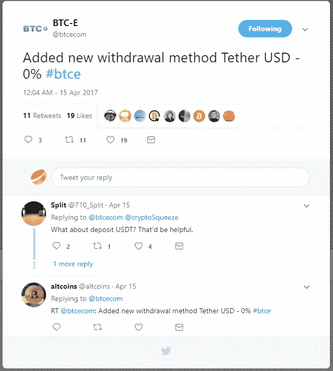**

**Note the date. [Source](https://twitter.com/btcecom/status/853142083527245824) ([Archive](http://archive.is/qRJTe))**

# **结论**

**由于欺骗、清洗交易和其他诡计，比特币的汇率受到了严重操纵。这对比特币的价格来说是不健康的长期趋势，Tether 和 Bitfinex 未来可能的崩溃将对未来的比特币价格产生巨大影响，因为我们将不再有这些来自 Bitfinex 的错误信号。**

**Bitfinex 上的所有资金基本上与 Tether 处于相同的位置。Bitfinex 已经有近 5 个月没有银行业务了。银行业不太可能回到 Bitfinex。**

**我不相信银行会与 Bitfinex 这样的交易所做生意，银行可能会犹豫是否与一家机构做生意，该机构也起诉了一家大型银行，这显然是一场无聊的诉讼，但一周后又撤回了诉讼。**

**一家与比特币交易所这样的公司做生意的银行，会对该交易所进行大量的尽职调查。当他们做一些关于 Bitfinex 的作业时，你认为他们会发现什么？**

**最后，在我看来，我认为 Bitfinex 上的大量交易可能是洗盘交易，这可能是双向洗盘交易。我相信 Spoofy 在多个交易所进行交易，但他在其他交易所的订单通常要少得多。**

**欺骗要么是:**

1.  **拥有多个账户的大型单一交易商。**
2.  **大型场外交易公司或一组交易商。**
3.  **Bitfinex 他们自己。**

> *****事实上，前十名 BFX 代币持有者中有两名在我们的管理团队*** *。我们向所有人保证，无论是作为公司还是作为个人客户，我们都深切地感受到了损失。* [来源](https://www.reddit.com/r/BitcoinMarkets/comments/4y4uwl/bitfinex_update_regarding_security_audit/) ( [存档](http://archive.is/nvtDy))**

**在我看来，Bitfinex 绝对不可能不知道欺骗者是谁，或者他在从事非法欺骗。交易所可以很容易地阻止或惩罚这类活动。**

**没有人需要在五秒钟内下单购买价值 1500 万美元至 1500 万美元的比特币的能力。他们可以通过简单地不允许超过一定规模的订单被删除，直到计时器超时，来防止这种活动。**

**甚至一些电子游戏也有这种限制，以防止对虚拟市场的操纵。**

**这是金融市场的常见策略，比特币也不能幸免。**

**[http://www . zero hedge . com/news/2017-06-05/exposure-legend-how-traders-spoofed-贵金属-市场](http://www.zerohedge.com/news/2017-06-05/exposing-legend-how-traders-spoofed-precious-metals-markets)**

**现在，我将留给你们这个图表。第一次奇迹般的复苏发生在 Bitfinex 与富国银行断绝关系的时候。**

**不要忘记 Bitfinex 直到 4 月 13 日[才宣布这个问题，他们甚至自豪地宣布他们的 BFX 代币赎回，尽管知道没有人可以从他们的交易所提取美元。](https://www.bitfinex.com/posts/199)**

**3 月 23 日至 4 月 13 日期间，大多数交易者对他们的银行问题一无所知。**

***管理除外。***

**欺骗购买吗？**

**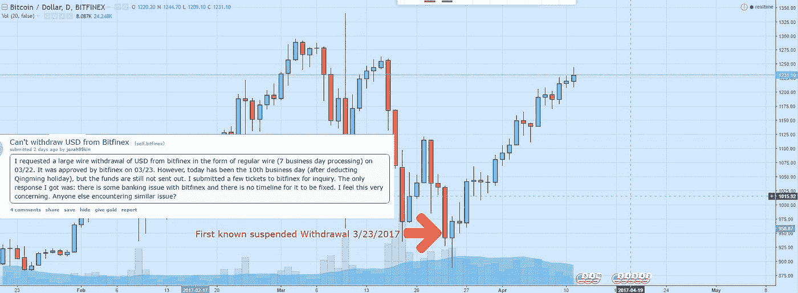**

**It’s not an accident that the largest bitcoin price bullrun started the very day Bitfinex lost banking. ([Post](https://www.reddit.com/r/bitfinex/comments/63y1xa/cant_withdraw_usd_from_bitfinex/)) ([Archive](http://archive.is/6szkb))**

**谨慎交易。**

**有关系绳的更多信息，请务必在这里查看关于系绳的更完整的故事[。](/@bitfinexed/the-curious-tale-of-tethers-6b0031eead87)**

**-bitfineexed**