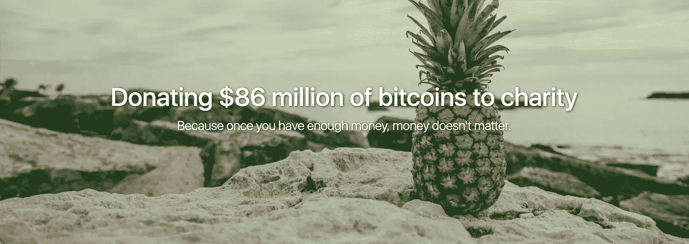

# 这位创始人承诺向慈善机构捐赠 5057 BTC(8600 万美元)

> 原文：<https://medium.com/hackernoon/meet-the-founder-who-pledged-5-057-btc-86m-to-charity-688685e922f6>

菠萝基金会承诺向慈善机构捐赠 5057 BTC。目前价值 8600 万美元。到目前为止，他们已经资助了 9 个慈善机构，总计 411 个比特币(约 700 万美元)。这些慈善机构是 [Watsi](https://goo.gl/DL4Ut7) 、[水项目](https://goo.gl/DNktE4)、 [BitGive EFF](https://goo.gl/fLbcx8) 、[电子前沿基金会](https://goo.gl/cuFvuP)、[多学科迷幻研究协会(MAPS)](https://goo.gl/hDpJSU) 、 [Open BSD](https://goo.gl/RS6YK5) 、 [Sens 研究基金会](https://goo.gl/FjzCKH)、[慈善机构:水](https://goo.gl/ev8VC9)和 [Mona](https://goo.gl/qD39kc) 。

我找到了这位匿名捐赠者，他将被称为“松树”，告诉[黑客正午](https://goo.gl/cV9MtF)社区技术——和你的勇气——如何被用来让世界变得更好。

*你愿意借助* [*菠萝基金的资本*](https://goo.gl/M1naAu) *对世界产生影响吗？如果你正在考虑启动一个非营利项目，请通过* [*联系创始人，联系【pineapplefund.org】*](https://tinyurl.com/yc63z32r)*。*

Pine，你如何评价该基金向哪些慈善机构捐赠了多少资金？

我主要关注三件事:

1)他们的工作有多大影响力，特别是如果他们在国际范围内产生影响
2)他们带来的创新(例如 [Watsi](https://goo.gl/DL4Ut7) 他们的点对点模式)
3)效率、可持续性和他们现有的规模。更大的慈善机构可以获得更多的资金；我也喜欢支持较小的慈善机构(将来也是！)但我不想让它们过于拥挤。

但说实话，最大的因素是我的直觉。我只资助我信任的慈善机构，有了信任，我相信他们最适合回答更微观的问题，并在这个世界上做好事。

你是真的把比特币捐给慈善机构，还是把它兑换成美元给他们？

比特币直接捐赠给慈善机构，然后由慈善机构将其兑换成美元或本国货币。这具有税收优势，能够通过全额比特币，而无需评估资本利得。这纯粹是为了慈善机构的利益；我不接受任何税收减免。

这也让我保持匿名:)

**既然你宣布了这一点，接下来对哪个慈善机构的投资最让你兴奋？**

目前，我对[地图](https://goo.gl/hDpJSU)感到非常兴奋！世界上许多人，包括我在内，不幸患有精神疾病。有各种极有希望的治疗方法正在研究中，如治疗 PTSD 的 MDMA 和治疗抑郁症的氯胺酮；具有比现有药物更长的寿命和更少的副作用。

我被开了克他命来治疗一种鲜为人知的疾病。我有了即时的、实质性的、持久的改善，而且没有副作用。事实上，我是在注射氯胺酮的时候想到菠萝基金的，因为我开始重新获得动力去影响这个世界。

向 MAPS 捐赠的 100 万美元将用于资助他们的 3 期 FDA 试验，用于 MDMA 辅助的 PTSD 心理治疗。我希望这最终能引入一种新的有效的治疗方法，并引发一系列进一步的研究。

我喜欢在汉堡甚至披萨上烤菠萝，但我妻子不喜欢。在更好的光线下怎么给她看菠萝？

菠萝是菠萝蛋白酶的唯一主要食物来源，菠萝蛋白酶是一种消炎药。它不仅美味，而且含有你在其他地方吃不到的营养。

后续问题:菠萝的最佳吃法是什么？

抓起一个新鲜的菠萝和西瓜，切成小楔形。现在你有了可以用手指吃的热带水果沙拉。甜西瓜是继多汁菠萝之后的又一美味！

**您将在多长时间内认捐全部基金？**

菠萝基金是一个不断发展的项目，我会在前进的过程中解决这个问题。我想在接下来的 3 个月里捐出绝大部分资金，但我也在探索一些衍生项目，如“PF Ventures”，让有激情的人创办自己的慈善机构，这些项目将提供基于里程碑的赠款。

**现在，菠萝基金比你进入时比特币的整个市值还要大，是当今最富有的 250 个比特币地址之一。你第一次听说** [**比特币**](https://hackernoon.com/bitcoin/home) **是什么时候？啊哈，我必须买的时刻是什么？**

我听说比特币的时候，价格还在个位数。我先是好奇，用批判的眼光看着它；没过多久，我就看到了分散式直接资金转移的巨大潜力。这就像听到了万维网或 iPhone。

**你投入比特币的财富比例是多少？**

很少；我主要把时间投入到了比特币上。我为比特币挖矿、交易、工作。这是一个过山车，我有这么多的故事；不过那是改天的事了:)

我不会说比特币能让没有财富的人轻易成为千万富翁；拥有适度的财富确实有所帮助。我不必卖掉我的比特币来支付生活费之类的事情，它帮我持有了大部分比特币，直到今天。其他早期采用比特币的人资金缓冲较少，不会持有比特币这么长时间。

**你是做什么工作的？或者你能告诉我们你是如何对待工作的吗？**

我想起了我和前老板兼导师在个人困难时期的一段对话:“(松树)，这不仅仅是(公司)的事，而是想想有一天你能对这个世界产生什么影响。”

如果那个人正在读这篇文章，请知道你自己的慈善愿望已经激励了我:)

既然钱已经不是考虑的因素，我对待工作的态度就是我能对改变世界产生多大的影响。这是一个略有不同的基准。我可以做一些金融科技方面的事情，利用一些市场低效率，或者构建 HFT 算法；但这真的能改善世界吗？

这是我仍在努力的一个领域。有时候，我醒来后不知所措。我想我很快就会有答案了。

**美国中部现在应该投资哪里？**

股票市场指数基金。这很无聊，但它会给你持续的、基于市场的回报，从长远来看，这种回报很可能会超过所有其他投资。我是伯格海德投资哲学的粉丝。

你可以投资加密，但一切都被极度高估，崩盘即将来临，95%的 ico 明显不起作用，应该被 SEC 起诉，因为它们是故意欺诈。

你的网站口号是“因为一旦你有了足够的钱，钱就不重要了。”你现在对钱有什么不同的看法？

我仍然过着相当简朴的生活。例如，我乘坐经济舱，尽管商务航班可以说更好，我不会感觉到对我钱包的影响。我现在的节俭是可有可无的，但我仍然喜欢节俭和寻找交易，并就购买我想要但不需要的东西进行辩论。

拥有它给了我不可思议的特权，因为我可以跳过许多不愉快的事情，消除对金钱的焦虑，还可以做一些很少有人能做的事情。当然，我不必工作，但除此之外，我不会像千万富翁那样生活，在毫无意义的事情上挥霍金钱，因为那是自私的，那不是我想成为的那种人。

要是世界上有更多的松树就好了！

*你愿意借助* [*菠萝基金的资本*](https://goo.gl/M1naAu) *影响世界吗？如果你想开始一个非盈利项目，请通过* [*联系 pineapplefund.org 联系创始人。*](https://tinyurl.com/yc63z32r)

