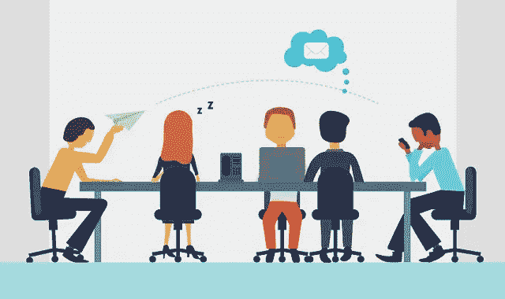
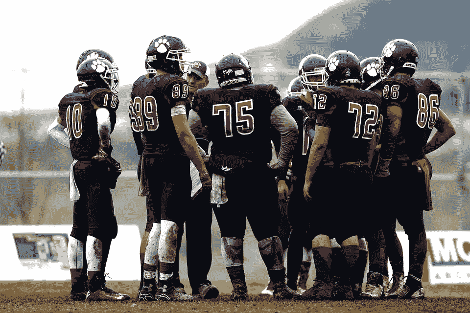
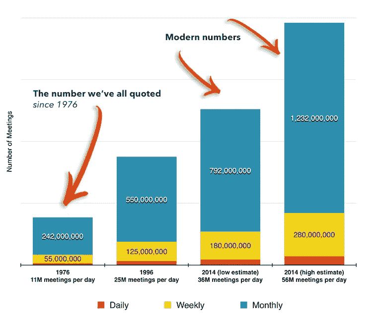
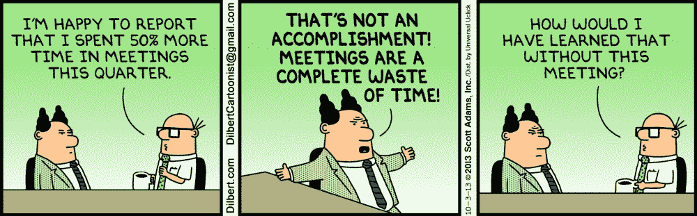
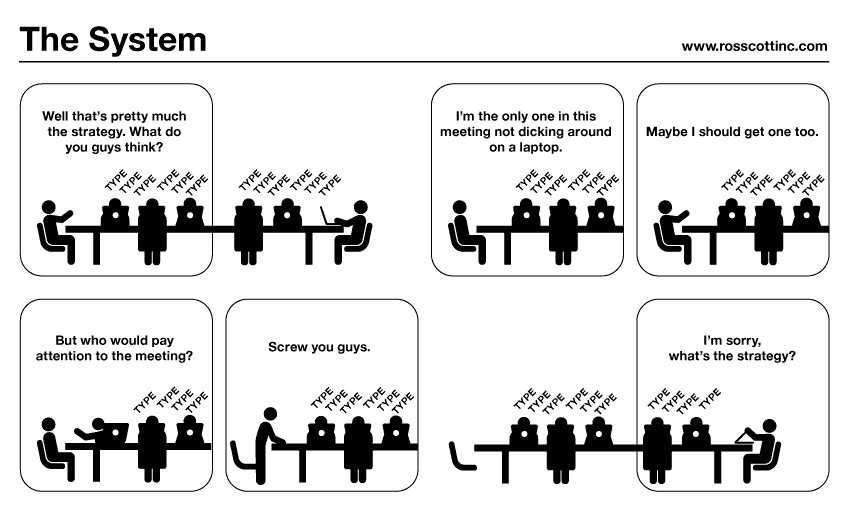
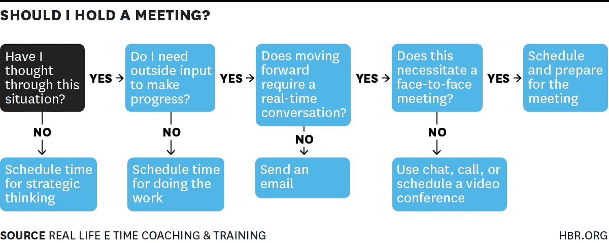

# 会议——一种伤害我们生产力和士气的过度文化

> 原文：<https://medium.com/hackernoon/meetings-a-culture-of-excess-that-hurts-our-productivity-and-morale-464a5797c799>

## 71%的会议被认为是无效的。让我们解决这个问题。

[Visualistan](http://www.visualistan.com/2014/06/the-ugly-truth-about-meetings.html) — The Ugly Truth About Meetings

我相信在这个世界里，会议可以提高生产力，激发创造力，让团队更快地前进——而不是相反。

> “如果你必须用一个词来说明为什么人类没有实现，也永远不会实现其全部潜力，这个词就是‘会议’。"
> ― [**戴夫·巴里**](https://www.goodreads.com/author/show/6245.Dave_Barry)

我们都经历过。我们上午 9 点开始工作(如果你在西海岸，则是上午 10 点)，打开日历查看当天的日程。是的，看起来又是一天，50%以上的时间将用于开会。

讽刺的是:没有人喜欢开会。事实上，我们都抱怨它们:太多、太长、太频繁。但是，我们仍然安排他们，我们仍然加入他们，我们仍然随波逐流。

这是为什么呢？嗯，会议在我们的工作文化中有所体现并根深蒂固。更进步的文化会有严格的会议政策，但是大多数工作场所没有会议政策或者会议政策不好。

那么，我们每天都听到什么？

> 昨天什么都没做，不得不去参加一堆会议。

—开发商

> 如果可以的话，在我的日程表上找个时间，尽管我已经排满了。

—导演

> 我的天啊。一个小时的会议就为了这个？他们可能只是发了一封电子邮件！

—营销人员

> 啊..我整天都在开会..安排更多的会议。

—销售代表

# 采用足球会议

本文关注的是更为正式的会议类型——留出一段明确的时间用于明确的目的(站立会议、正式的商务会议、正式安排的会议、定期会议)。

通常，我们将“会议”一词与正常的工作场所互动混为一谈，通过这种互动，你可以以一种更非正式的身份与同事讨论工作驱动的目标。这些通常是更有机的相互作用，没有固定的时间间隔，可以自发发生。

Pixabay

让我们看一个体育类比:足球(美国)。在整个比赛过程中有持续的互动:在场边的球员、教练、场上的球员、四分卫等等。玩家们一直都在相互交流。比赛开始前，场上的球员会聚在一起，但时间不到一分钟。那些在场边的人还在互动，准备他们上场的时间。教练们在这里和个别球员或者一小群球员聊天。

在中场休息时，有一个更正式的会议，所有球员都去更衣室。这是最长的会议，每场比赛只开一次。这是领导层与整个团队全体同步讨论目标、战略和反思上半场比赛的机会。

球队每场比赛都有有限的暂停次数，我们称之为“选择性会议”这些超时会议仅在必要时使用，以防外部情况要求改变计划。

每次会议都有非常明确的目的和同样严格的时间表，每次会议都必须做出某种决定来推动事情向前发展。

所以问题是:我们的工作场所应该像足球队一样对待会议吗？如果是的话，为什么我们不是？后果是什么？

# 会议的演变

## 过去的日子

回到固定电话、没有电脑、没有手机的时代，开会更是一种必须。你不能让一个人在不同的大楼里偷懒，也不能让多个参与者协调一个电子邮件线程。

> 在 20 世纪早期，协调会议的摩擦要大得多。

事实上，协调会议的摩擦要大得多。你必须提前安排，确保每个人都得到适当的通知，并确保每个人都能参加。没有谷歌日历来同步邀请和重新安排推送通知。

我不想说在技术发明之前的日子里，会议一定是或多或少富有成效的，但是我可以想象机会成本和计划成本要大得多。

## 成长的日子

随着 20 世纪的推进，公司不断发展壮大，在多个地区拥有多个不同的团队。协调成为一个普遍的组织挑战。

> 在 20 世纪后期，多地区公司继承了长时间频繁开会的文化，但现在规模扩大了。

这些公司继承了 20 世纪初的文化，仍然接受长时间频繁开会的文化——决策者从一个会议过渡到下一个会议，根据非常有限的信息做出或推迟决策。

## 科技时代

现在，随着简单的视频会议、会议日程安排器和自动日历的引入，会议协调变得更加顺畅。你只需选择你的参与者，找一个大多数人或所有人都有空的时间，然后把它放在他们的日程表上。

> 在现代科技时代，安排和组织会议已经变得无摩擦——意味着更多的会议，更频繁的会议。

安排和组织会议已经变得没有摩擦了。具有讽刺意味的是，最困难的部分是找到一个对所有相关利益相关者都合适的时间，因为他们被安排了很多其他会议。

# 会议有成效吗？让我们看看统计数据

> 71%的会议被认为是无效的——这意味着没有明确的结果和有效的后续步骤— [微软研究](https://news.microsoft.com/2005/03/15/survey-finds-workers-average-only-three-productive-days-per-week/)

[lucidmeetings.com](http://blog.lucidmeetings.com/blog/fresh-look-number-effectiveness-cost-meetings-in-us)

**92%** 的受访者承认在会议期间一心多用——[*来源*](https://tedideas.files.wordpress.com/2014/11/140702_ted-roi-meeting.jpg?w=770&h=2175)

**美国每天 3600 万至 5600 万次**会议— [*来源*](http://blog.lucidmeetings.com/blog/fresh-look-number-effectiveness-cost-meetings-in-us)

**一个组织集体时间的 15-20%**花费在会议上— [*来源*](https://www.slideshare.net/ashwin_c/make-your-meetings-work-56157224)

**每年有 2130 亿美元花在无成效的会议上——[*来源*](http://blog.lucidmeetings.com/blog/fresh-look-number-effectiveness-cost-meetings-in-us)**

****71%** 的会议被认为是无成效的— [*来源*](https://news.microsoft.com/2005/03/15/survey-finds-workers-average-only-three-productive-days-per-week/)**

****

**Dilbert.com**

# **过多、无准备的会议的后果**

**在一个会议时间长且频繁的组织中，会议已经在组织文化中根深蒂固。突然间，忙碌并不意味着你在做大量的工作或富有成效..忙意味着你的时间都花在开会上了。**

> **在一个以会议为导向的组织中,“忙碌”并不意味着你很有效率——它通常意味着你的时间都花在了会议上。所以，你时间有限，但不一定忙着为公司生产价值。**

## **以下是其他一些后果:**

****无效且草率的决策** —由于会议的频繁和冗长，为每次会议做好充分准备变得令人生畏，几乎是不可能的。因此，所发生的是团队根据有限的信息做出突然的和不明智的决定。或者，团队会就一个结果达成一致，只是为了提前结束会议。**

> **在会议中，团队会就结果达成一致，只是为了提前结束会议——通常会导致不明智的决策。**

****任务中断** —当个人贡献者将会议分散在一整天时，你集中精力完成任务的能力就会被打断。以稳定的节奏开始工作有一个上升时间，所以每次你被打断，你都必须重新上升。**

****时间间隙** —建立在任务中断基础上的是时间间隙的概念。如果你有一个上午 10:30 结束的会议和一个上午 11:00 开始的会议，那么你真的打算在这 30 分钟的时间里提高效率吗？在你需要去参加下一个会议之前，你最多有 10-15 分钟的工作时间。最有可能的是，在下一次会议之前的这段时间里，你会减压和放松。**

****能量流失**——还记得学校里那堂无聊的课吗？在那里你看着钟，走神。你努力保持清醒，努力自娱自乐。你不确定老师在说什么，你只是认同班级，希望自己能早点告退。**

****士气耗尽**——当你周围的每个人都感到无聊、无精打采或心烦意乱时，它就会耗尽房间里的士气(见下图)。**

****

**rosscottinc.com**

# **你应该开会吗？**

****

**Elizabeth Grace Saunders HBR**

# **完美的会面**

**完美的会议是这样的:**

*   ****无设备**(除了演讲者，禁止使用手机和笔记本电脑)——由于会议中多任务处理的猖獗，禁止分心将有助于加快决策、注意力和会议的决议。团队将更加“在场”,这将带来更有效的结果。**
*   ****时间意识** —只有在绝对需要实时对话且不会过度影响与会者工作流程的时候，才应该安排会议。80%的会议应该只有 15 分钟或更少。**
*   ****适当确定范围** —只有绝对相关的利益相关方应被邀请参加会议。可选与会者应通过电子邮件接收会议结果，但通常不需要亲自出席。事实上，这些与会者可以在会议讨论之前提出意见。**
*   ****讨论驱动**—你的会议资料(如幻灯片或讲义)应该适合实时讨论。会议应该留出更多的时间进行讨论，而不是做报告。会议主持人应直接询问与会者的意见，以鼓励积极倾听和参与。所有实质性的讨论都应立即搁置。**
*   ****必要的** —会议真的需要召开吗？或者，电子邮件、聊天、电话或面对面的聊天能解决问题吗？如果这是一个需要更多思考的话题，那么也许会议还为时过早，所有的利益相关者应该在正式会议之前做更多的研究。**
*   ****提前做好准备**——理想情况下，所有重要的利益相关者都应该在会议之前权衡这个问题，或者有时间做研究。会议应该是关于决策和结果，而不是发现新知识。知识和研究应该在会议之前作为作业发送，这样每个人在做决定之前都有时间思考这个问题。会议的焦点应该是富有成效的实时讨论。**
*   ****明确定义** —所有与会者都应清楚地阐述并理解会议的目的。它应该有一个明确的目标，使讨论切题。**
*   ****以适当的频率安排会议**——定期会议是现代工作文化中最大的谬误之一。通常，这些会议是知识同步，利益相关者只是交流知识。任何形式的双向信息交流都不需要实时讨论，因此会议可能不合适。相反，你可以创建一个生活状态文档或通过电子邮件同步。**
*   **要求实时交谈 —会议的目的是培养实时交谈。共享 PowerPoint 需要实时对话吗？可能，但通常这些演示非常注重知识共享，可能只是预先录制或发送给相关的利益相关者。然后，利益相关者可以确定是否有必要进行实时对话。**
*   ****结果导向** —实时讨论的目的应该是针对特定的结果。结果永远不应该是“再开一次会”结果还应该被整理并通过电子邮件发送给利益相关者(以及那些没有参加的人)，以便相关的利益相关者能够达成一致并有书面记录。**
*   **延伸阅读: [*NY Times —如何开一个有效的会议*](https://www.nytimes.com/guides/business/how-to-run-an-effective-meeting)**

****

# **文化转变——更短的会议，更少的频率**

**如果“完美会议”的范例在整个组织范围内实施，那么您可能会开始看到以下文化转变:**

> **80%的会议长度不应超过 15 分钟**

*   **正式会议的次数减少了 75%**
*   **80%的会议不超过 15 分钟，15%的会议不超过 30 分钟，5%的会议不超过 1 小时**
*   **如果需要更多实时讨论，可选择延长 15 分钟**
*   **对于一般的个人贡献者，不到 10%的时间应该花在正式会议上(这不包括一对一的讨论、快速同步和正常的工作场所协调)**
*   **当不再需要实时讨论时，会议应该休会，会议主持人应该向所有与会者发送总结/后续步骤电子邮件。这有两个好处:(1)它让主持人对他们组织的会议负责，(2)它提供了一个编码的结果。**

# **主要外卖**

> **会议应该提高生产力，激发创造力，让团队更快地前进——而不是相反。**

**— —**

*****感谢阅读！我很喜欢你的反馈——所以鼓掌、关注和评论，帮助我为你写更好的内容。也欢迎话题建议。*****