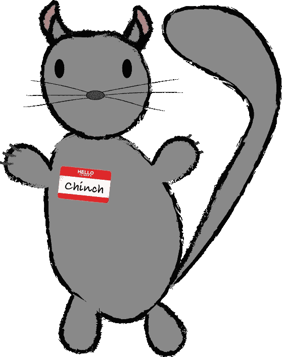

# 重新审视聚会和会议礼仪

> 原文：<https://medium.com/hackernoon/meetup-and-conference-etiquette-revisited-29de1686ec29>

我没有足够详细地记得本周的特定主题来讨论，所以我想是时候拿出一个长期的“话题来讨论”了。

几年前，我为《聚会礼仪的获取》写了一篇文章，在柏林经历了六个月之后，似乎是时候重新审视、更新和修改这篇文章了。原始帖子中的许多观点仍然适用，我在这里补充它们。

我将讨论适用于每个人和每项活动的一般话题，然后是会议、其他活动、与会者、演讲者和组织者的细节。

简单地说，这并不是针对任何特定的人，我并不是说我总是对的，或者我自己也总是遵守这些规则。这只是基于我多年参加、演讲和组织活动经验的一般性好(我希望)建议。

Meetup Chinchilla

## RSVPs

随着 meeting up(与其说是概念，不如说是平台)变得越来越流行，这种情况变得越来越糟糕。回顾我最初的帖子，我不得不修改我的可靠出席率。随着团体和活动规模的扩大，情况尤其如此，在大约 50 名参与者中，似乎有一个休息点。如果低于这个数字，我会说，你可以预期大约 60-70%的出席率，高于这个数字，可能是 30-40%。去年底，我参加了一个活动，有 170 名响应者和大约 60 名参与者。这对于你的组织者(通常是志愿者)来说是非常粗鲁和无礼的，更新回复回复是不需要任何努力的。我想补充一点，如果您不打算参加活动，请尽可能提前通知回复副总裁。繁忙的活动往往会有一些人在等候名单上，但是对大多数人来说，为一个活动腾出 10 分钟的时间可能太短了。

## 保持准时或优雅地迟到

这适用于每个参加活动的人，如果你太忙而不能准时到达，那就考虑不要来了。我明白有时会发生一些糟糕的事情，如果你仍然认为这值得参加，安静优雅地参加。在大多数情况下，与会者迟到不是什么大问题，但如果你是一名演讲者，那就更重要了。计划好你要花多长时间到达某个地方，并准备好准时出发，另外再加 20 分钟。确保你知道你的陈述会持续多长时间，抓住要点，紧扣要点，如果提问是形式的一部分，给提问留出足够的时间。这同样适用于组织者，尽量遵守时间。一些与会者可能需要长途跋涉回家，第二天一早就要开始工作，或者要安排儿童看护。虽然就我个人而言，我喜欢活动开始和结束的时间稍微早一点，这是我个人的偏好，但许多人都依赖于描述中陈述的时间，所以坚持下去。如果这意味着督促演讲者也遵守时间，那也没关系，他们也有责任遵守规定的时间。

## 饮食

我不会在这里添加更多来扩展我的原始帖子，我想添加的唯一一点是特殊饮食。我的公司为科技活动提供餐饮服务(以及其他服务),我们过去也有为其他活动提供餐饮服务的经验。我们已经听说了几乎所有的饮食要求，而且总有办法满足它们。如果你有特殊的饮食要求，请告诉组织者，他们可能会尽可能满足你，不要指望它会自动得到满足。同样，如果你不能再参加，通知组织者，这样就不会浪费专门为你准备的食物。会议组织者通常会询问与会者是否是素食主义者、纯素食主义者等，并根据这些人数组织食物。如果你没有要那些特别的食物，请把它们留给那些要的人，否则他们可能会挨饿。

## 问题不是为了一般性的陈述

人们在这一点上比以前做得更好了，或者这只是因为我不像以前那样参加那么多激进主义团体了。一个问题仅仅是一个带有标点符号的单词序列，适合于给出一个回答。这里不是你发表对事物的总体看法或宣传你所做的事情的地方。如果你想这么做，那就写博客或者做个报告。演讲者或主持人也应该尽量保持适当的回答时间来回答问题，但要为其他问题留出足够的时间。请记住，不是每个人都有信心举起手臂来提问，或者他们可能很矮，请密切注意那些试图提问的观众，他们可能不像其他人那样清楚。

## 尊重无线网络

我们都知道 wifi 在活动中有多糟糕，尤其是在会议中，那里永远没有足够的带宽或咖啡。如果提供 Wifi，尊重它。关闭 Dropbox 和其他类似的文件同步软件，不要利用这个机会发送或下载大文件或视频流。除非您需要，否则只需将一台设备连接到 wifi，并且请记住，有些国际与会者可能比您更需要使用 wifi，因为这是他们唯一的选择。

## 狭小空间中的空间意识

我不知道这是不是每个人都越来越多的问题，或者只是我与许多缺乏空间意识的人联系在一起，但请留意你周围的情况。技术人员倾向于在任何地方都带着大包，留意他们，他们可以让你身体的尺寸增加一倍，在你身后可能有人站着或走着的地方。活动是为了认识人，当然你会想和别人说话。聚集时，不要在繁忙的入口，如门口、走廊中间或其他任何阻碍人流的地方。你可能有一些重要的事情要讨论，但是增加 2 分钟找一个考虑周到的地方来讨论它不会降低这个话题的重要性。

## 瓶子和其他垃圾

我注意到在德国的活动中，参加者很容易打翻瓶子。我不知道德国科技人是什么样的，但在每次演讲中，你都会听到至少两个瓶子掉在地上的叮当声，声音大得令人难以置信，令人分心。如果你对自己的空间意识不够自信，那就拿好你的瓶子，如果你喝完了，把它扔掉更好。把垃圾放在上面也有助于活动结束后的清理，如果已经完成了一半，那么(可能是志愿者)组织者的工作量就少了。

## 对陌生人友好

许多活动现在都有行为准则，这些是对我们活动的很好补充，让每个人之间达成更有约束力的协议，以尊重你周围的人，并为那些可能在历史上推迟参加的人提供更舒适的环境。这些行为准则没有涉及到一群参与者，我发现他们在欧洲活动中受到的待遇比我在英国或澳大利亚参加的活动差得多。你不认识的人。虽然有些特定的活动只是为了结识朋友，但人们通常会出于同样的原因参加其他更特定的聚会和活动，以结识有共同兴趣的人。当你参加一个活动时，不要整晚只和你认识的人交往，如果你看到一个陌生人独自一人，走过去介绍自己并和他们聊天。

## 麦克风技术

这是一个只为发言者。学习如何使用麦克风，这并不难，会大大改善你的演示。不要轻敲麦克风看它是否开着，这是一种恼人的噪音，请放心，一旦你开始说话，人们会让你知道它是否不起作用。麦克风放在你的嘴前，而不是你的下巴前，不要害怕，除非你在一个有线很差的大楼里讲话，它不会咬人。看看麦克风头的形状，它发出的声波形状可以接收你的声音，对着它们说话。如果你恰当地使用麦克风，你不需要大喊大叫，但是(在某些时候)学会恰当地表达和清晰地说话将有助于提高你的演讲水平，如果这是你想要追求的东西的话。

## 演示和代码示例

如果你正在做一个技术演讲，那么你很可能想要展示一些东西，这很好，演示是展示一个概念或想法的好方法。但是演示也是出了名的出错，不管你之前尝试了多少次。我的主要建议是让演示尽可能地本地化，一个特别有用的工具是虚拟化，比如 Docker 或 vagger。您可以设置一个完整的隔离虚拟设置，然后在不影响您的机器的情况下删除它。如果不可能进行本地演示(例如演示大数据或大型服务器设置)，那么可以考虑制作一个视频，你知道这是可行的。事实上，每次演示都要有备份视频。如果你要展示代码，用易读的颜色组合和字体大小来展示，最好是清晰的布局，记住投影仪的对比度通常很差，所以坚持使用清晰、强烈的颜色。

## 性别语言

这是一个奇怪的问题，我不确定这是建议还是观察。当我在英语国家参加活动时，现在的人们倾向于尽可能多地删除性别语言，不提及“他”或“她”，而是使用中性语言。由于英语是一种松散的性别语言，这对于母语或流利的人来说很容易，因为英语在上下文或理解中不需要性别。随着我在母语确实有性别的主持人中间的接触越来越多，我注意到他们在说英语时有使用性别的倾向。当然，如果他们说的是他们的母语，那就另当别论了，我没有资格讨论在叙述中描述一个人时加入性别的相关性，因为对于许多语言来说，这是期望和需要的。但是，每当我听到有人在对这些问题敏感的活动中说英语时过度使用“男人”或性别语言，我就忍不住局促不安。因为我不想批评说非自己语言的人，所以我不想过多地推动这个问题，但请记住，从英语中去除性别很容易，而且不会失去任何东西，即使这对每个人来说可能都不自然。

## 对演讲者的进一步建议

我在 2015 年的 Write Docs 上为演讲者提出了一些具体的建议，其中包括上面的一些建议以及更多建议，[你可以在这里看到](http://chrischinchilla.github.io/Presentations/good_presentations/#/)。

**痛骂**。*是时候告诉我你的不满和在聚会和活动中的改进建议了。*

## 播客

*所有每周的 Squeak 帖子都附有一个播客，我可以在这里更深入地了解这个话题，点击这里* *订阅* [*。接下来的几天我要去旅行，所以这篇文章的插曲将在本周晚些时候发布。*](http://feeds.soundcloud.com/users/soundcloud:users:128163767/sounds.rss)

> [黑客中午](http://bit.ly/Hackernoon)是黑客如何开始他们的下午。我们是阿妹家庭的一员。我们现在[接受投稿](http://bit.ly/hackernoonsubmission)并乐意[讨论广告&赞助](mailto:partners@amipublications.com)的机会。
> 
> 如果你喜欢这个故事，我们推荐你阅读我们的[最新科技故事](http://bit.ly/hackernoonlatestt)和[趋势科技故事](https://hackernoon.com/trending)。直到下一次，不要把世界的现实想当然！

