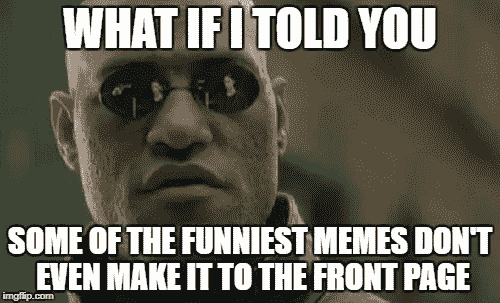
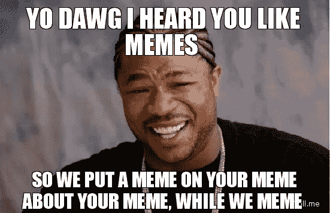
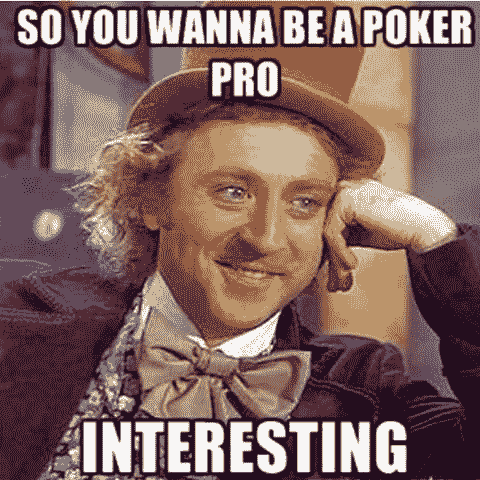

# 模因——简单的娱乐创意&我们生活中不可或缺的一部分

> 原文：<https://medium.com/hackernoon/memes-simple-entertaining-creatives-integral-part-of-our-life-73ea72340c9a>

# 表情包

如维基百科所述…

> 一个**模因**([***meem***](https://www.wikiwand.com/en/Help:Pronunciation_respelling_key))是一种思想、行为或风格，在一种文化中从一个人传播到另一个人——通常是为了传达模因所代表的特定现象、主题或意义。模因是一个承载文化观念、符号或实践的单位，可以通过写作、演讲、手势、仪式或其他模仿主题的可模仿现象从一个头脑传递到另一个头脑。

我们都笑过，分享过，甚至与一些最有创意但简单的被称为迷因的数字艺术有关联。这些是一些最简单的创意数字艺术，它们使用来自非常熟悉的电影剪辑、情景喜剧或卡通的日常图像，并在其上添加一些搞笑的上下文文本来传达有趣的信息。

## 人脑有趣的现象

Photo by [James Bak](https://unsplash.com/photos/mOkQGzaRvco?utm_source=unsplash&utm_medium=referral&utm_content=creditCopyText) on [Unsplash](https://unsplash.com/?utm_source=unsplash&utm_medium=referral&utm_content=creditCopyText)

人们与迷因相关并立即做出反应，因为他们可以想象出迷因中的演员说话的方式——这是一个有趣的现象&人类大脑可以做的奇妙的事情。乍一看，它看起来很简单，一个来自电影的图像剪辑，上面有轻微的文本——但它产生的影响是不同的——它使我们的大脑想象模因中的演员在与电影完全相同的情况下用自己的声音重复这些文本对话——从而提供了一种对给定上下文做出反应的棒极了的感觉，并使我们感到相关。

## 迷因=生活

成千上万有创造力的人制造了数百万这样的迷因，让我们在生活中的每一个特定时刻都能分享。无论是一个节日愿望，讽刺的反应，友好的姿态，令人惊讶的表情还是欣喜若狂的时刻——每件事都有一个模因。

## 尊重模因创造者

由于这些创意明星想了很多，给我们一种以正确的方式表达情感的方式，并在我们的观众中引起共鸣(当你在一个群体中与 meme 互动时，可能只是一个朋友或许多人)，让我们花一点时间来欣赏他们

> 这是我写的一个系列，感谢迷因创造者和他们需要得到的荣誉。从 Reddit 首页[开始是个好地方](https://www.reddit.com/r/memes/)