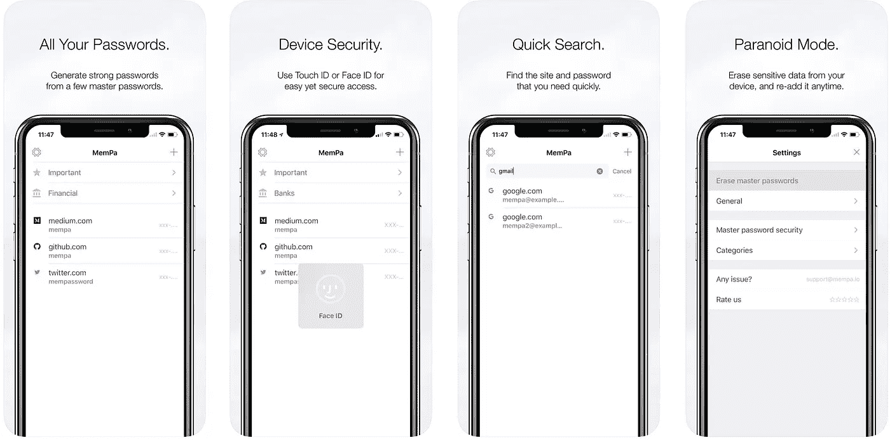

# MemPa——一个现代的确定性密码管理器

> 原文：<https://medium.com/hackernoon/mempa-a-modern-deterministic-password-manager-2c0f28fa108b>

我最近写了关于我如何管理我的密码的文章。dr:有了新的确定性密码管理器)，因为“有一些密码——谷歌、银行——我从来不想存储，但我总是想访问”。
从那以后，我收到的最多的问题是，“有没有应用程序？”最后，这就是了。

今天我很激动地宣布 iPhone & iPad **的 [**MemPa。** (安卓](https://itunes.apple.com/us/app/mempa/id1312657167?ls=1&mt=8)[世博预告](https://expo.io/@0x0ece/mempa))。)**

一个免责声明，实际上是两个:这是一个 MVP，只有最少的功能集，允许我们几个拥有 iPhone & Mac 的人开始有效地使用 MemPa。此外，它是确定性的，长话短说，这意味着它会为你生成新的密码，所以你必须在你想使用 MemPa 的所有网站上更改它们。也就是说，我真的希望这篇文章不会让你失望，你会尝试一下，并给我们一些很好的反馈。

那么 MemPa 是什么，你为什么要考虑它呢？

MemPa 是一个确定性的密码管理器，这意味着它可以帮助你从一个或几个主密码开始为你的网站和应用程序生成密码。MemPa 最棒的一点是，你可以在任何地方访问你的密码，即使没有这个应用程序——事实上这是我迄今为止一直使用它的方式。([技术细节在此。或者，更“营销”的解释是，你可以把你的密码存放在最安全的地方:你的内存，因此得名 MemPa。](https://hackernoon.com/how-i-manage-my-passwords-technical-version-8549dc1bde1e)

您可能希望像 MemPa 这样的确定性密码管理器来管理所有您不想存储的重要密码，也不需要依赖应用程序、设备或第三方网站来访问它们。显然，拥有一个应用程序在日常生活中非常方便，这就是我们创建 MemPa 的原因，但你应该考虑如何在突然无法访问你的设备的情况下至少恢复你最重要的密码。

以下是 MemPa 的核心功能:

*   你可以**轻按**复制一个密码**并将其粘贴**到一个网站、一个应用程序甚至你的 mac 上。大多数时候，你甚至不需要看到密码，第二次点击你就可以安全地从剪贴板上清除它。
*   您可以选择每次键入您的主密码，或者将其存储在您设备的安全存储中，并通过**触控 ID 或**方便地解锁。
*   借助**偏执模式**，您可以瞬间清除设备中的所有敏感数据。无论你是在旅行，分享你的设备，甚至只是向朋友展示 MemPa，你都可以在任何时候感到“不安全”时切换到偏执模式。键入一个假的主密码，MemPa 就会显示随机生成的/乱码密码。当你回到安全的地方时，随时重新添加你真正的主密码。

我们还让你探索了一些功能，包括搜索、分类、备份和恢复、iPad 上的多任务处理。

这就把我们带到了未来的步骤。我们真的相信，一个确定性的密码管理器是你最重要的密码，那些你总是想记住并能够访问的密码所必需的，但它不能解决你所有的秘密，特别是现有的秘密。我们已经在致力于将保险库整合到 MemPa 中，以解决这一限制，并为您提供以最方便的方式存储所有秘密的灵活性。

如果你有 iPhone，给 [MemPa 一个尝试](https://itunes.apple.com/us/app/mempa/id1312657167?ls=1&mt=8)——如果你有 Android 手机，你可以在展会上获得[的预览。如果你喜欢 MemPa，但认为它仍然缺少一个真正重要的功能，我很想听听这对你来说是什么，在评论中或 Twitter 上](https://expo.io/@0x0ece/mempa) [@0x0ece](https://twitter.com/0x0ece/) 。

页（page 的缩写）s:为戴夫、斯皮格、纳克、PS、卡拉迈科、卢卡和乐乐欢呼吧，是他们让这一切发生，并为即将到来的一切奠定了基础。