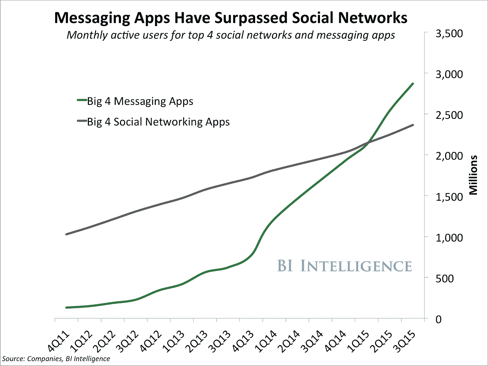
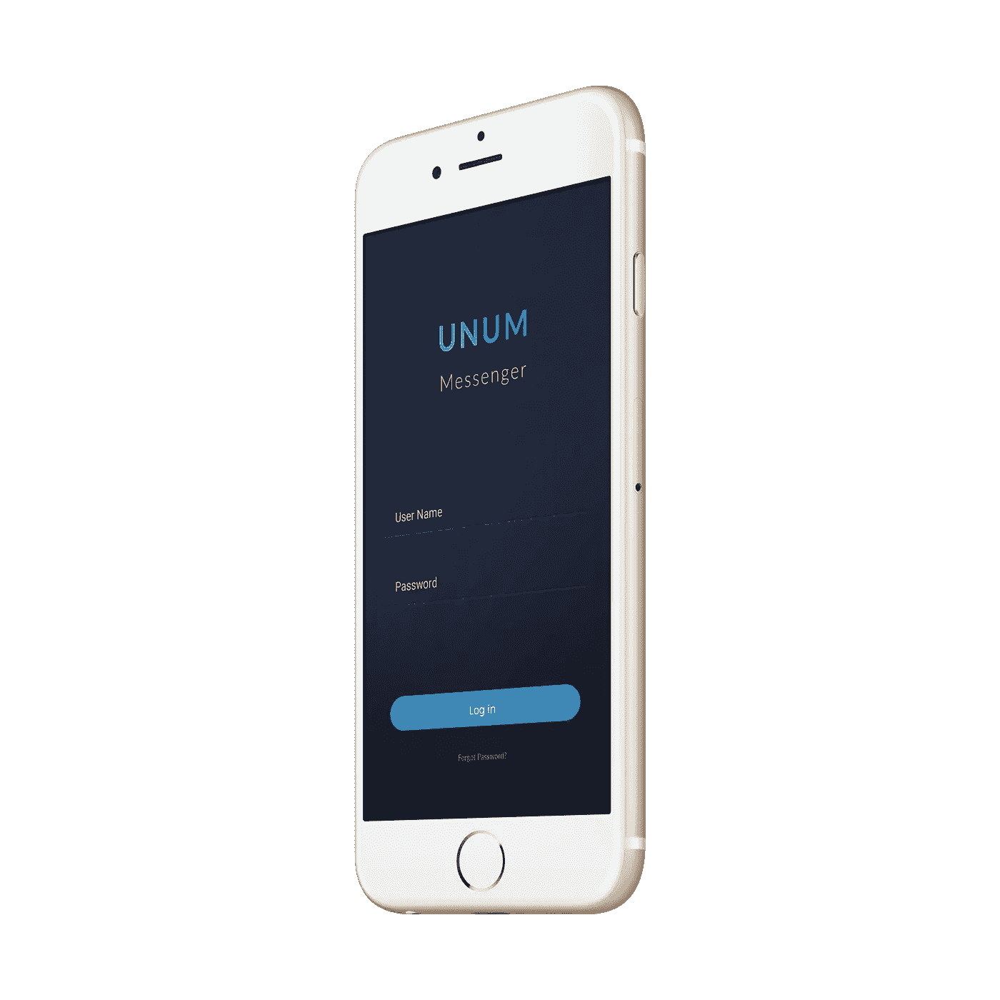

# 发信息是人们在手机上做得最多的事情

> 原文：<https://medium.com/hackernoon/messaging-is-the-one-thing-people-do-more-than-anything-else-on-their-phone-825e32d3782d>

“这是它发生的地方， ***这是一代人难得的机会来建造它*** 。”— [**大卫·马库斯，脸书**](http://www.wired.co.uk/article/inside-facebook-messenger) 消息产品副总裁

有没有想过那些该死的孩子一直在手机上做什么？很有可能，他们正在给他们所有的朋友发信息。

不相信我？根据脸书的数据，人们在新年前夕发送了 630 亿条 WhatsApp 信息。哦，是的，他们肯定是在发信息。

信息的吸引力不难理解。一直有一种害怕和你‘小圈子’之外的人面对面交流的心理。消息应用消除了人们面对面的恐惧，允许他们在发送消息之前思考、定制和完善消息。

The Evolution of Selfies

更不用说 Snapchat 之类的 app 让发消息变得很娱乐！人们涌向新的消息应用，因为他们总是在寻找与朋友交流的新方式。

Snapchat 等消息应用围绕个人消息展开。这些 P2P(点对点)消息正是人们所寻找的。使用 Snapchat 等应用的人意识到，社交媒体已经被泛化、招揽和宣传所淹没。

尽管 Snapchat 和其他消息应用都以 P2P 为中心，但它们也提供了通过“故事”功能与所有朋友分享消息的选项。这些选项为人们提供了个性化信息和大规模共享的完美平衡。

# 当一个倒下时，另一个会站起来。

[社交媒体的衰落导致了即时通讯的飞速发展。](/mobile-lifestyle/move-aside-social-media-messengers-are-taking-over-6979137db19f#.hdoj8mk2v)随着人们远离社交媒体，他们开始使用即时通讯应用。

就像在美国一样，中国的超级应用微信也出现了同样的趋势。向消息传递的转变正在全球范围内发生。

令大多数人惊讶的是，消息应用的活跃用户已经超过了社交媒体。事实上，人们开始从电子邮件过渡到加密通信方式，并通过他们的信息创造性地表达自己。

Messaging Apps Have Surpassed Social Networks

就像凤凰从灰烬中重生一样，当一种通讯形式倒下时，另一种将会从灰烬中重生。

抱歉社交媒体，但没有永远的好事。人们需要改变，对新的交流方式的渴望永远不会停止。

# 那么下一步是什么？

期待 Snapchat 继续他们无与伦比的成功之泪。这只是 Snapchat 的冰山一角，因为他们正在向 2017 年的 IPO(首次公开募股)前进。

我们已经看到 Instagram 发布了他们的‘Snapchat lookalike’，也就是 Instagram Stories。如果 Instagram stories 能够获得牵引力，它们与 Snapchat 之间可能会有一场激烈的战斗。

随着这些消息应用程序占据主导地位，期待看到一些前所未见的新东西吧！很像 Snapchat 是一个全新的想法；总有一天它会被新的令人兴奋的东西取代。密切关注下一件大事。

因为我认识到了这个机会，所以我决定[开发一个消息应用](http://www.unummessenger.com)。

[我正在开发的应用程序](http://www.unummessenger.com)将把所有形式的沟通结合到一个简单的应用程序中。这将帮助人们从一个中心位置消化和发送消息/电子邮件。

我目前正处于统一消息平台的早期开发阶段，我将其命名为 [UNUM messenger](http://www.unummessenger.com) 。

我计划在 2017 年 3 月推出测试版的 UNUM messenger。如果你想在 [UNUM messenger](http://www.unummessenger.com) 发布时得到通知，你可以在这里注册[。](http://www.unummessenger.com)

感谢所有的反馈！

如果你想在我的旅程中跟随我，一定要跟随我在这里的媒介。此外，如果你喜欢这篇文章，一定要喜欢它！

> [黑客中午](http://bit.ly/Hackernoon)是黑客如何开始他们的下午。我们是阿妹家庭的一员。我们现在[接受投稿](http://bit.ly/hackernoonsubmission)并乐意[讨论广告&赞助](mailto:partners@amipublications.com)的机会。
> 
> 如果你喜欢这个故事，我们推荐你阅读我们的[最新科技故事](http://bit.ly/hackernoonlatestt)和[趋势科技故事](https://hackernoon.com/trending)。直到下一次，不要把世界的现实想当然！

