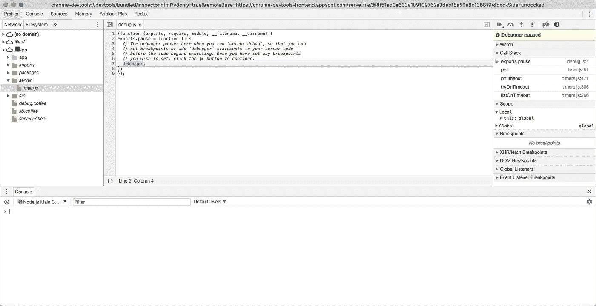
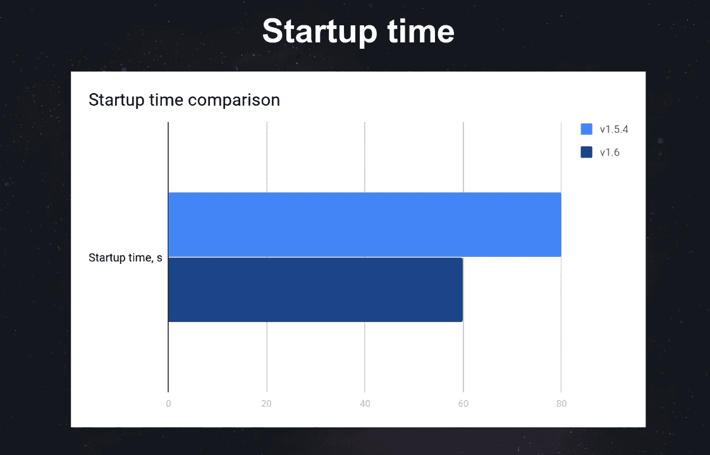
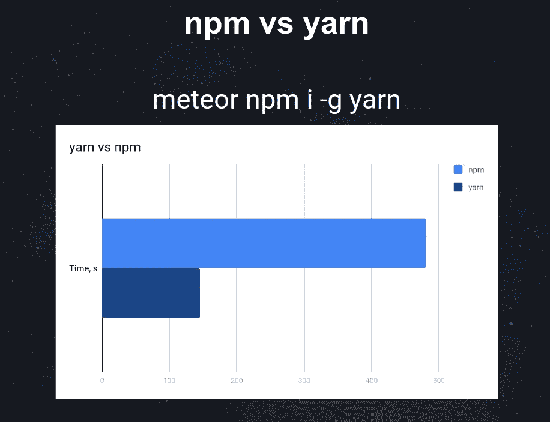
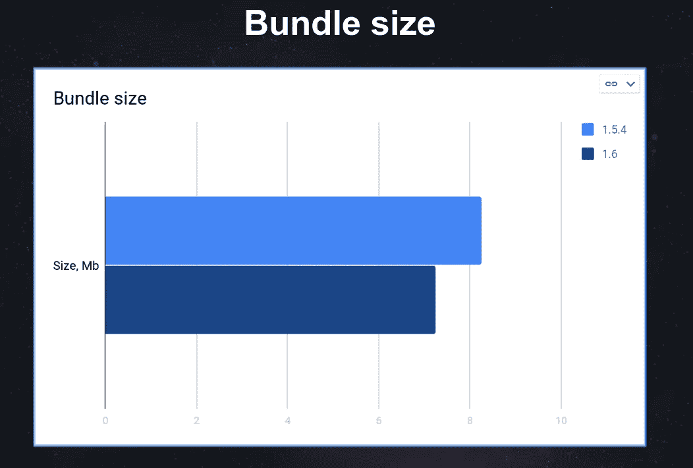

# 流星 1.6。回顾:优势、问题和示例

> 原文：<https://medium.com/hackernoon/meteor-1-6-review-benefits-issues-and-examples-f9e2a431c594>

Meteor 1.6

流星 1.6。已经在这里了。Apiko 团队已经在实践中进行了测试，现在我们想与您分享这些发现。

让我们开始吧！

# 流星 1.6 主要变化。版本

*   NodeJS 的一个新的、稳定的、长期支持的版本(从 4.8.3 迁移到 8.8.1)。
*   减少了应用程序的大小，因为不需要使用大量的巴别塔插件(新节点已经实现了许多 ES 2017 功能)
*   Npm 升级到了 V5——目前最快的 npm 版本。
*   本机调试功能(现在，我们可以使用 Chrome devtools 在调试模式下运行应用程序)

# 主要优势

*   更新到流星 1.6 非常容易。只要运行流星更新就搞定了。
*   更新常用和最常用的软件包(Mongo、accounts 等)没有问题

我们已经比较了新旧流星，而目前的项目工作。结果如下。

*   对于开发来说，Meteor 应用程序的启动速度要快得多(在这个例子中，时间减少了 20 秒)。

*   这里是 npm 包安装与 npm v5 和 yarn 的比较

*   项目包大小的比较

# 可能的问题

*   **包锁的问题**

对于 5.6.0，npm 5 中的包锁定文件存在问题。版本。问题是不同的软件包可能会添加到操作系统中，例如 Mac OS 上的 FSEvents。一旦进行了“Meteor npm 安装”,这个包将被删除。这导致了文件合并与版本控制系统的冲突。然而，在 Meteor 中，npm 将在 1.6.1 版本中更新，这就是为什么这个可以被忽略。

*   **Atmosphere 软件包与 Node V8 不完全兼容。**

Atmosphere 上并不是所有使用 npm 依赖的 Meteor 包都能很好地运行。发生这种情况是因为节点版本的快速变化。

一些功能可能会从更新版本中删除，或者语法可能会部分更改。这就是为什么社区需要一段时间来调整它的软件包以适应更新的 Meteor。不过大部分常用的包都已经适配了。此外，您可以直接使用 npm 包而不用 Meteor-wrappers。

# 包扎

我们对新的流星版本感到非常兴奋，希望你也有同样的感觉。

如果你分享我们对 Meteor 的技术热情，这些文章将会派上用场。

*   [使用 Meteor JS 发送邮件:实现流程和邮件模板](https://apiko.com/blog/organization-of-email-sending-in-meteorjs/)
*   [如何用流星建立电报聊天机器人](https://apiko.com/blog/ternopiljs-how-to-build-a-chat-bot-with-meteor/)
*   [流星应用和源代码示例](https://apiko.com/blog/meteor-apps-source-example/)

享受它，并随时与我们分享你的流星经历！

*原载于 2017 年 12 月 27 日*[*【apiko.com】*](https://apiko.com/blog/meteor-1-6-review-benefits-issues-and-examples/)*。*