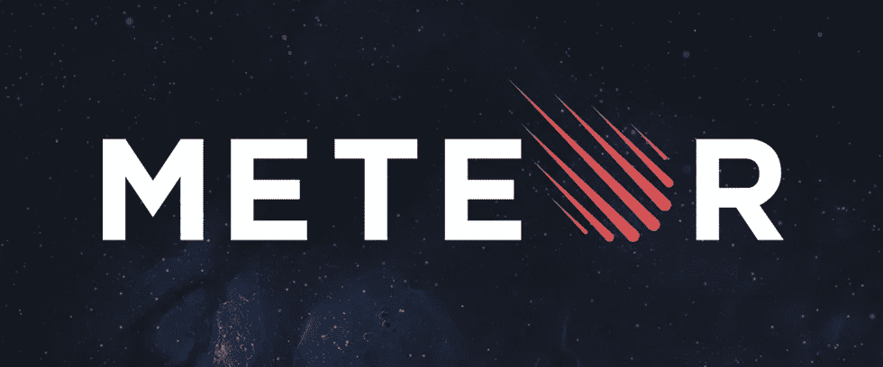
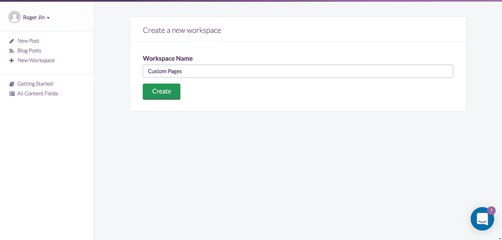
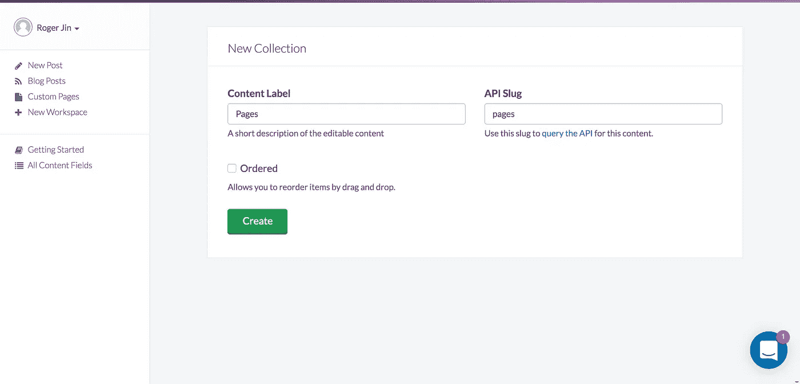
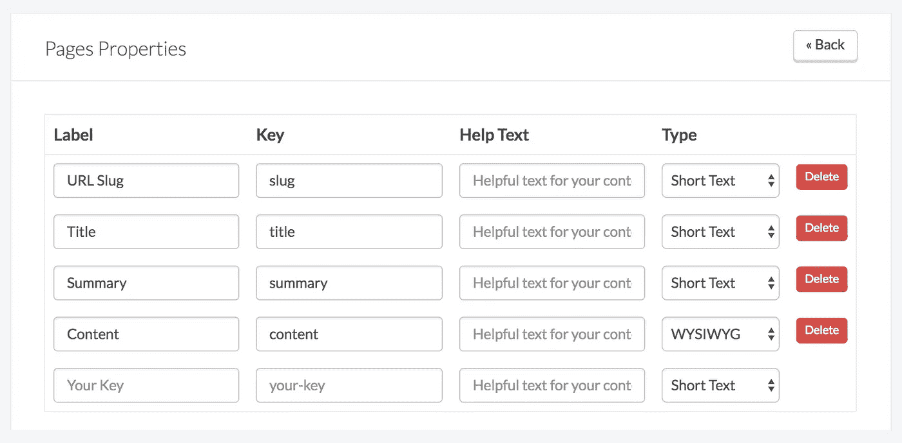
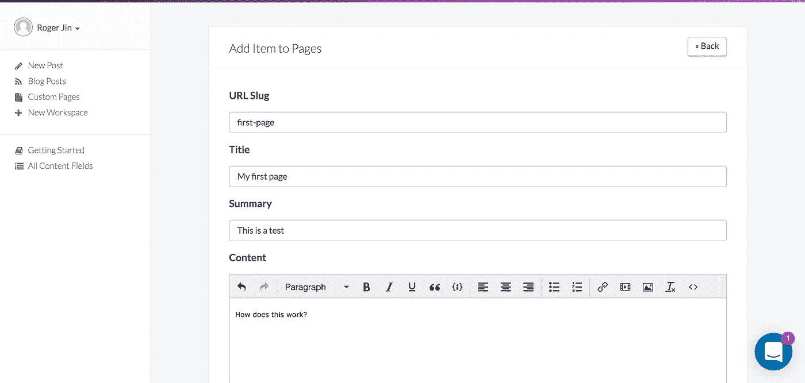

# 用 MeteorJS 构建一个基于 CMS 的网站

> 原文：<https://medium.com/hackernoon/meteor-cms-website-tutorial-2e8da489f92f>



在本教程中，我将向你展示如何使用 [ButterCMS](https://buttercms.com) 向 [MeteorJS](https://www.meteor.com/) 网站添加 CMS。本教程的完成代码是 Github 上的[。](https://github.com/buttercms/meteor-cms-website)

[Meteor](https://www.meteor.com/) 是一个使用 Node.js 编写的免费开源 [JavaScript](https://hackernoon.com/tagged/javascript) web 框架。

[ButterCMS](https://buttercms.com) 是一个托管的 [API 优先的 CMS 和内容 API](https://buttercms.com/cms/) ，让你使用任何[编程](https://hackernoon.com/tagged/programming)语言构建 CMS 驱动的应用。Butter 被称为“ [headless cms](https://buttercms.com) ”，它类似于 WordPress，只是你可以用自己选择的语言建立网站，并使用 API 插入动态内容。您可以使用您的 Github 帐户登录 ButterCMS。

# 入门指南

我们将从一个基本的流星网站开始，它使用[火焰模板](http://blazejs.org)和[铁路由器](https://github.com/iron-meteor/iron-router/)进行路由。如果您愿意，可以换入另一个模板解决方案，如 React。

获取[启动器代码](https://github.com/buttercms/meteor-cms-website-boilerplate)并确保其运行:

```
git clone [https://github.com/buttercms/meteor-cms-website-boilerplate.git](https://github.com/buttercms/meteor-cms-website-boilerplate.git)
cd meteor-cms-website-boilerplate
meteor npm install
meteor
```

如果你是 MeteorJS 的新手，查看一下他们的[快速入门指南](https://guide.meteor.com/#quickstart)的介绍。

# 设置页面模板

我们要做的第一件事是在`client/main.js`中创建一个基本的页面模板。使用 ButterCMS，您的客户端将能够创建使用该模板的定制页面。

```
<head>
  <title>Meteor Website</title>
</head>
<body>
</body><template name="home">
  Hello world!
</template><template name="page">
  <h2>{{page.title}}</h2>
  <p>{{page.summary}}</p>
  {{{page.content}}}
</template>
```

注意，我们在`page.content`周围使用了三个括号。 [Blaze templates](http://blazejs.org/api/spacebars.html#Getting-Started) 中的三支撑模板标签用于插入原始 HTML。总的来说，yu 在允许原始 HTML 时应该小心，因为它暴露了安全威胁，如跨站脚本。因为我们的页面内容将由我们的客户端生成，并由内容管理系统提供，所以我们可以假设它是安全的。

# 设置 ButterCMS

现在我们将设置 [ButterCMS](https://buttercms.com) 以便我们的客户端可以使用这个模板创建和管理页面。

[用 Github 登录 Butter](https://buttercms.com/github/oauth)，点击侧边栏上的“新工作区”链接。我们将这个工作区称为“自定义页面”。



接下来，我们将创建一个新的内容字段。内容域提供了一个用于编辑 ButterCMS 中内容的表单域，以及一个用于访问和显示网站内容的 API 键。我们将创建一个名为`pages`的新集合。



在下一个屏幕上，我们将为集合中的项目设置属性。请注意，我们使用了与我们的 Meteor 模板中相同的键。



最后，点击侧边栏中的“自定义页面”链接，创建您的第一个页面。



# 集成巴特 CMS

我们已经在 ButterCMS 中创建了我们的第一个页面，现在让我们将它显示在我们的网站上！

首先安装 [ButterCMS Node.js API 客户端](https://github.com/buttercms/buttercms-node):

```
meteor npm install buttercms
```

然后创建一个动态路由，从 ButterCMS 获取页面内容，并使用我们之前创建的模板呈现它。

```
import Butter from 'buttercms';
import './main.html';const butter = Butter('de55d3f93789d4c5c26fb07445b680e8bca843bd');Router.route('/', function() {
  this.render("Home")
});// Dynamic pages
Router.route('/:slug', function() {
  let slug = this.params.slug;

  let resp = await butter.content.retrieve(['pages[slug='+slug+']']) // Get first item in returned collection of pages
  let page = resp.data.data.pages[0]; this.render('Page', {data: {page: page}});
});
```

浏览到`[http://localhost:3000/first-page](http://localhost:3000/first-page)`，你应该会看到 ButterCMS 显示的内容。

# 搜索引擎优化

我们的动态页面工作正常，但是来自搜索引擎和社交网络的爬虫不执行 Javascript，所以我们的博客 SEO 很糟糕。

首先，我们将安装 [ms-seo 助手包](https://atmospherejs.com/manuelschoebel/ms-seo)，并确保我们有好的 HTML 标题和描述。

```
meteor add check
meteor add manuelschoebel:ms-seoRouter.route('/:slug', function() {
  let slug = this.params.slug;

  let resp = await butter.content.retrieve(['pages[slug='+slug+']']) // Get first item in returned collection of pages
  let page = resp.data.data.pages[0]; SEO.set({
    title: page.title,
    meta: {
      description: page.description
    }
  });

  this.render('Page', {data: {page: page}});
});
```

ms-seo 提供了一个简单的`SEO.set`方法来配置标签。您可以通过检查 DOM 来验证标签设置是否正确。

最后，我们希望服务器呈现我们的博客，以便搜索引擎和 Twitter 这样的社交网络可以抓取它。

最简单的方法是使用 [Meteor 的托管平台 Galaxy](https://www.meteor.com/galaxy/) ，它提供了集成的预渲染服务(Prerender.io)。Prerender.io 服务作为 Galaxy 的一部分免费提供。

遵循流星的[指南部署到星系](https://guide.meteor.com/deployment.html#galaxy)。要打开内置的 Prerender.io 集成，请添加 [Galaxy SEO](https://atmospherejs.com/mdg/seo) 包:

```
meteor add mdg:seo
```

如果你不想使用 Galaxy，可以手动集成 Prerender.io，另一个选择是在你的应用中实现服务器端渲染。在撰写本文时，Meteor 本身并不支持服务器端渲染，但是您可以查看 SSR 支持的 [Meteor SSR](https://github.com/meteorhacks/meteor-ssr) 或 [Flow Router 的](https://github.com/kadirahq/flow-router/tree/ssr) alpha 版本。

# 包裹

MeteorJS 是一个强大的开发平台，它解决了为 web、移动和桌面构建 Javascript 应用程序的许多难题。然而，没有太多的 CMS 选项可用。

一定要看看 [ButterCMS](https://buttercms.com/) ，这是一个[托管的 API 优先 CMS 和内容 API](https://buttercms.com/cms/) 以及博客引擎，它让你使用任何编程语言来构建 CMS 驱动的应用，包括 [Ruby](https://buttercms.com/ruby-cms) 、 [Rails](https://buttercms.com/rails-cms) 、 [Node.js](https://buttercms.com/nodejs-cms) 、[。网](https://buttercms.com/asp-net-cms)、[蟒蛇](https://buttercms.com/python-cms)、[凤凰](https://buttercms.com/phoenix-cms)、[姜戈](https://buttercms.com/django-cms)、[反应](https://buttercms.com/react-cms)、[角](https://buttercms.com/angular-cms)、[围棋](https://buttercms.com/golang-cms)、 [PHP](https://buttercms.com/php-cms) 、[拉拉夫](https://buttercms.com/laravel-cms)、[仙丹](https://buttercms.com/elixir-cms)、[流星](https://buttercms.com/meteor-cms)。

我们希望您喜欢学习如何使用 ButterCMS 在 Meteor 中构建 CMS 驱动的应用程序。如果您有任何问题，请通过 roger@buttercms.com[或 Twitter](mailto:roger@buttercms.com) 上的或[联系我们。](https://twitter.com/buttercms)

[](http://bit.ly/HackernoonFB)[](https://goo.gl/k7XYbx)[](https://goo.gl/4ofytp)

> [黑客中午](http://bit.ly/Hackernoon)是黑客如何开始他们的下午。我们是 [@AMI](http://bit.ly/atAMIatAMI) 家庭的一员。我们现在[接受投稿](http://bit.ly/hackernoonsubmission)并乐意[讨论广告&赞助](mailto:partners@amipublications.com)机会。
> 
> 如果你喜欢这个故事，我们推荐你阅读我们的[最新科技故事](http://bit.ly/hackernoonlatestt)和[趋势科技故事](https://hackernoon.com/trending)。直到下一次，不要把世界的现实想当然！

