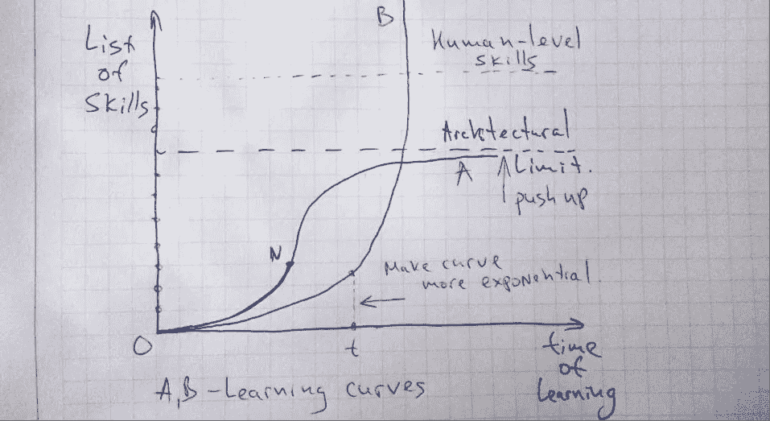

# 人类级人工智能研究的方法论

> 原文：<https://medium.com/hackernoon/methodology-of-human-level-artificial-intelligence-research-fa697dc9367e>

The learning curves for given architecture of Artificial Intelligence

每一种表现出学习能力的特定技术都会产生下一条学习曲线。通过观察这些曲线，我们可以推测特定的建筑是否达到了人类水平的能力。

让我们仔细看看每一部分。

**技能列表** —至少一个人可以通过的所有可能的测试或任务。想象一下这一堆技能:从区分几何形状到语音识别的所有种类，从掌握国际象棋到掌握围棋的所有可能的游戏，从制作音乐到新的科学发现。

人和机器的区别在于，人可以通过选择合适的课程来完成这些任务，而机器则不能。没有必要重新发明一些东西。该课程有助于使用最有效的方法获得经过充分研究的知识和能力。

此外，人类拥有大量的共同能力，有助于获得更复杂和特定的技能。例如，读、写、说的能力赋予了学习任何其他学科的无穷力量:造飞机、弹钢琴、量子物理。

**技能轴列表**。从这里开始，我们可以假设首先必须获得更多的普通技能，以帮助获得更多特定领域的技能。根据这个原则，我们可以建立一个技能的序列表——从科学的角度来看，从最普通到最有趣。这些技能被反映在一张图片上成为**人类级别的技能。**

**学习轴的时间**定义了在给定计算或其他资源的情况下学习所消耗的时间。这里的问题是，更高水平的技能需要更多的计算能力。因为它，学习时间变得巨大。

**有两条可能学习的曲线**。曲线 A 的前半部分(从 O 点到 N 点)在某种程度上类似于 B。有一点不同——曲线 B 可能有架构限制，从这个意义上说，它与 A 相同，也可能没有。第二个选项将我们引向技术奇点的话题。

***怎么做才能创造出人类级别的智能？***

基于此图，有两种互补的方式来实现人类水平的智能:

*   **减少学习时间**。必须创建这样的技能顺序列表，其中每个学到的技能将有助于以更高的效率获得下一个技能。这样的课程会让学习曲线增长得更快。
*   发展建筑公园，提升建筑极限。好吧，这很明显。但是通过使用提出的视图，我们可以测量进度。**而测量使人工智能的发展成为真正的客观科学。**

因此，每一个旨在创造人工智能的项目都可以在提议的方案下得到考虑。每个项目都通过提出自己假设和愿景来缩小这种方法。被证实的假设成为新研究的基础。人工智能科学应运而生。

不要错过我的新文章:

 [## 混沌边缘的 AI 元素周期表

### 这篇文章是对人工智能开发有益的想法和见解的汇编…

medium.com](/@mikecorp/periodic-table-of-ai-at-the-edge-of-chaos-6666598c7d3c) 

# 行动号召:

*   **Pr*ess the heart*******或*** ***分享文章*** *如果你觉得这篇文章有趣**
*   ****关注我*** *上* [*中*](/@mikecorp) *或* [*推特*](https://twitter.com/AIissimple) *这样你就能在你的 feed 里看到我即将发布的文章。**
*   *[**回答问题:你对 AI 的兴趣是什么？**](https://snowman647.typeform.com/to/Rg6Bcj)*

******

> *[黑客中午](http://bit.ly/Hackernoon)是黑客如何开始他们的下午。我们是 [@AMI](http://bit.ly/atAMIatAMI) 家庭的一员。我们现在[接受投稿](http://bit.ly/hackernoonsubmission)并乐意[讨论广告&赞助](mailto:partners@amipublications.com)机会。*
> 
> *如果你喜欢这个故事，我们推荐你阅读我们的[最新科技故事](http://bit.ly/hackernoonlatestt)和[趋势科技故事](https://hackernoon.com/trending)。直到下一次，不要把世界的现实想当然！*

**