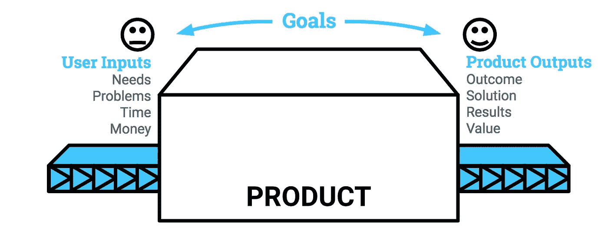
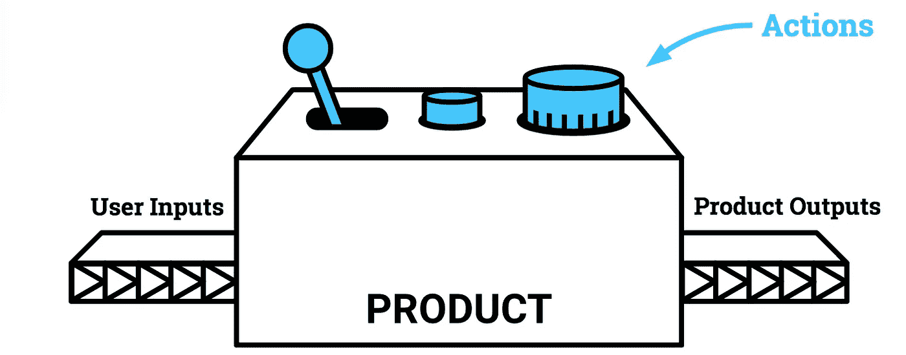
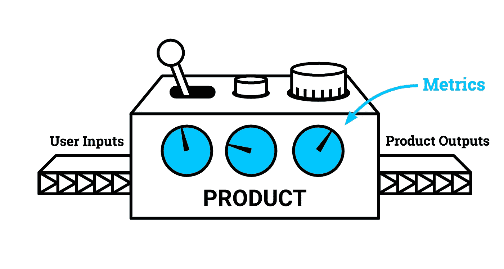
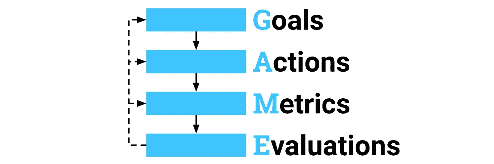
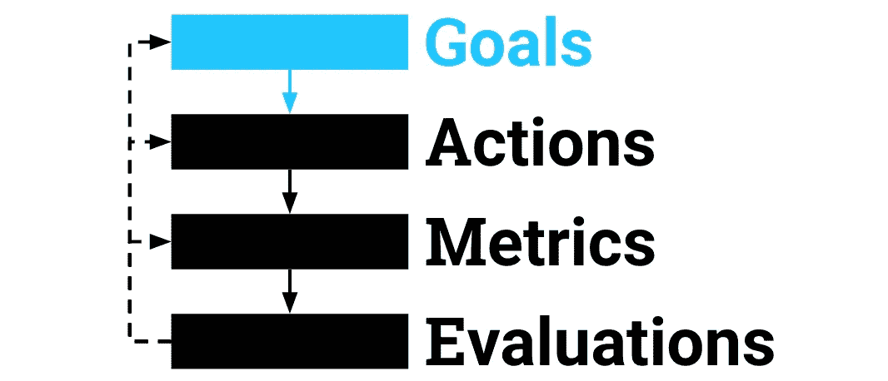
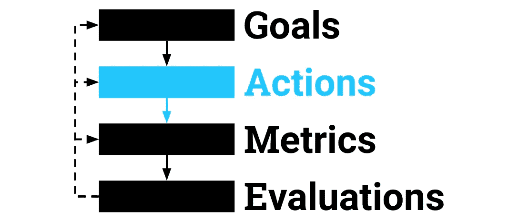
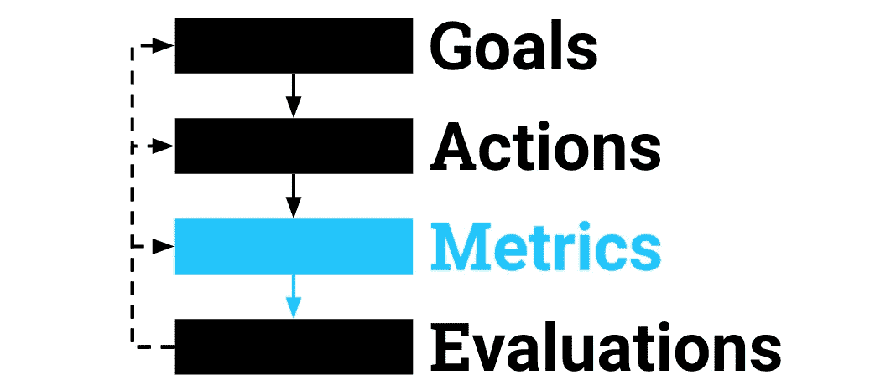
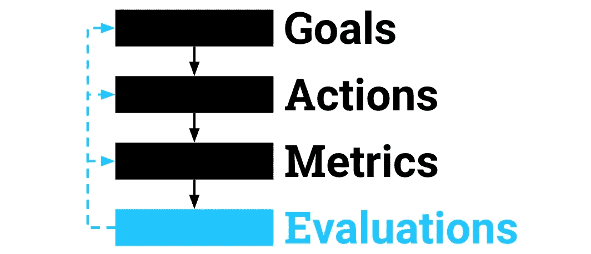
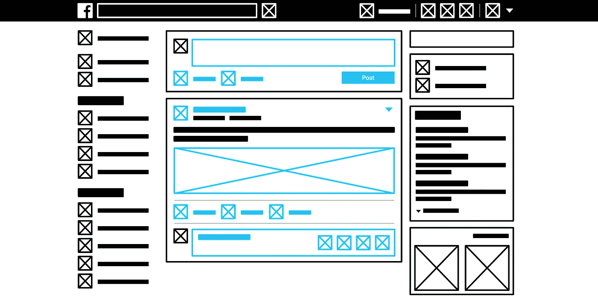

# 为任何产品定义优秀指标的 4 个步骤

> 原文：<https://medium.com/hackernoon/metrics-game-framework-5e3dce1be8ac>

## 一个你可以用于新产品、现有产品、 ***甚至*** PM 访谈的心智模型和框架

## 在这个系列中…

*   [**第一部分:** WTF 是公制？](https://www.vincelaw.co/blog/wtf-is-a-metric) — *介绍度量的基础知识，它是什么，以及它为什么重要。*
*   **第 2 部分:为任何产品定义优秀指标的 4 个步骤——如何从头开始制定指标。**
*   [**第 3 部分:**你的指标对你的客户有什么作用？](https://www.vincelaw.co/blog/wtf-is-your-metric-doing-to-your-customers) *—如何避免“一个指标很重要”的意外后果*

## 超越这个系列…

在[vincelaw.co/blog](https://www.vincelaw.co/blog)查看我的博客，在[订阅](https://www.vincelaw.co/subscribe)在你的收件箱里收到更新！

计量很重要。您产品的成功依赖于指标并由指标定义。指标是产品健康和性能的一面镜子。因此，定义你的度量标准应该和定义需求一样，是你的产品开发过程的本质。

事实上，指标是产品经理面试中最常被问到的问题之一:

> 你如何定义特性 X 的成功标准？

# 挑战

从头开始开发度量标准可能会非常令人生畏，正是因为有太多的风险。除非你在一个标准指标被广泛接受的行业工作(比如游戏、电子商务或零售)，否则指标绝不是微不足道的。

许多产品经理从底层开始:监控和收集他们能掌握的几乎无限数量的数据点。然而，一个显而易见的事实很快开始浮出水面…

> …并非所有数据都是平等的。

你能追踪一切并不意味着你应该这样做。有些数据比其他数据更有价值，因为它们让您对产品的健康状况有了独特的了解。相反，有很多不合格的数据会影响你的判断。

# 度量的心理模型

让我们退后一步。把你的产品想象成一个盒子:

您可以开始测试这个盒子并收集所有可用的数据，但这可能会成为一种漫无目的的方法，其特点是不断地试错。

为了打造一个用户看重的产品，你首先需要确定这个盒子的投入和产出。你的输入是你的用户来找你的任何东西:他们的问题和他们的资源。你的输出是使用你的产品所产生的环境。这些成为你的**目标**。

但这不是黑匣子。大多数产品要求用户在产品中采取**行动**，以提取价值并实现他们的**目标**。

量化和衡量这些行为可以让你深入了解用户如何(以及有多少)从你的产品中获得价值。当你随着时间的推移跟踪这些行动时，它们就成为你的**指标**。

一旦你开始为你的度量标准收集数据，你就可以用它们来评估你的产品。你的**评估**的结果可以通知你**目标**、**行动**，甚至**指标**本身的任何数量的调整。

您可以开始看到，这个非常简单的模型可以以多种方式应用:

*   为**新产品**定义成功指标
*   确定**新功能的**成功和影响
*   为**现有产品**重新制定衡量标准
*   回答**关于指标的面试问题**

对于每一步，这里有一些关于如何做的细节。

# 游戏框架

游戏框架是一个 **4 步流程，可以定义任何特性或产品的指标**。在这篇文章的剩余部分，我将提到一个假设的“产品”,但是只要讨论到“产品”,就可以随意用“特性”来代替。

# 第一步:阐明你的目标

这是显而易见的，但是你应该总是从为你的产品定义目标开始。你的目标对于确保你保持以目标为导向的战略思维至关重要。它们也作为在整个度量开发过程中重新访问和验证方向正确性的有形标记。将设定目标作为第一步会迫使你自上而下，这对于制定衡量标准至关重要。自底向上的方法是次优的，因为它依赖于直觉，并且经常会导致分析瘫痪。

要定义你的目标，问自己以下问题:

*   用户目标:我的用户将如何从我的产品中受益？我的用户希望我的产品为他们解决什么问题？我的用户将如何与产品互动？我的用户在使用我的产品时会有什么感觉？我对该产品如何融入用户生活的愿景是什么？
*   **商业目标:**战术或战略商业利益是什么？增加收入？降低成本？更有竞争力？进入一个新的市场？如果我的产品成功了，我的企业会是什么样子？

请注意，对于许多最好的产品，用户和业务目标是一致的。这些目标通常是同一枚硬币的两面。

一旦你有了这一套，你就可以开始行动了。

# 第二步:列出重要的行动

下一步是定义你的用户动作，或者更准确地说，你希望你的用户在你的产品中采取的所有动作。这应该从一个**定性**列表开始。不要担心这些数字，也不要担心它们是否可以追踪。

以下是一些您可以使用通用 ARM 指标框架自问的示例问题。挑选一组与你的目标相符的问题:

*   **获取&激活**:我的潜在用户将如何了解我的产品？我的潜在用户需要完成哪些操作才能成为我产品的用户？我的用户必须采取什么行动才能从我的产品中获得价值？我的产品在什么程度上为我的用户解决了真正的问题？
*   **保持度&参与度**:什么能让我的用户回到我的产品上？当我的用户对我的产品感兴趣时，他们会做什么？为我的用户提供重复价值的行为有哪些？我的用户采取这些行动的频率有多高？日常？周刊？每月？很久一次吗？
*   **货币化&收入**:我的用户用什么形式的“支付”购买，金钱还是时间？我的用户采取什么行动让我的产品开始收费？如果我的产品是免费的，我的用户会选择付费的原因是什么？当我的用户采取行动时，他们是直接付钱给我，还是其他人付钱给我(例如广告/代销商)？他们是为我的每一个行为(交易)付费，还是定期付费(订阅)？

您还可以使用度量框架，如 [AARRR](https://www.slideshare.net/dmc500hats/startup-metrics-for-pirates-long-version) 来清除操作。做好这件事的关键是要**全面，但不要面面俱到**:覆盖面最广，但不要费心区分细节。*例如，如果你的采集用户操作是“时事通讯注册”，不要担心列出每个时事通讯注册界面。*

# 步骤 3:定义您的度量标准

现在，您已经准备好将每个期望的用户行为(定性的)转化为可测量、可跟踪的值(定量的)。请注意，如果您还没有这样做，请在此阶段让工程和数据团队参与进来，检查您的指标，并就收集/存储所需数据的可行性提供技术指导。

以下是如何计算每个动作的一些主要决定:

*   **直接与代理**:动作可以直接跟踪吗？还是一定要用代理来衡量动作？*例如，你可以直接测量“点击”,但是你可能需要用滚动这样的值来代理“视图”。*
*   **个人与集体**:你能把许多行为组合起来做一个概述吗，然后再把它们分离出来做以后的分析？*例如:总收入→产品线收入→单个产品收入。*
*   **幅度与比率**:衡量行动的总体幅度对你来说更重要吗？或者你应该使用一个比率作为比较来跟踪，不管它是一个比率(每次)还是一个标准化因子(百分比，每个用户，等等)？*例如，您可以测量“总收入”，或者您可以测量“每日收入”和“每个付款人的收入”，这将为您提供关于相同数据的非常不同的视角。*
*   **内在的与启发式的**:你能从内在的测量中获得更多的知识吗？或者，您是否必须依靠启发式方法才能使指标有价值？*例如，虽然“每日活跃用户”(DAU)可能本质上对 B2C 应用有用，但类似“过去 30 天活跃的付费用户数量”这样的启发式信息可能更适合预计每月使用的 B2B SaaS 产品。*

对大多数人来说，这是框架中最难的一步。你的一些决定是由强烈的直觉决定的，而另一些决定是由技术限制或进一步的数据分析决定的。通常，在一些迭代之前，您无法确定一个指标是否有效。

在这个阶段，你也可以开始剔除[虚荣指标](http://tim.blog/2009/05/19/vanity-metrics-vs-actionable-metrics/)。调整可以“游戏化”的指标，即通过巧妙的设计/工程或恶意的用户意图人为地膨胀或收缩。*例如，通过使用分页或幻灯片来膨胀页面浏览量。*

# 步骤 4:评估你的度量标准

确保你的度量标准为你的产品提供正确见解的最好方法是**测试和迭代**。在您开始收集数据之前，您根本不会知道指标的行为。

你需要做的最重要的评估是指标的功能有用性。您可以通过监控任何误报或漏报来检查指标的有用性。例如，如果指标下降，是否表明产品中存在真正的问题？相反，如果一个问题浮出水面，这个指标是否有助于您标记这个问题？当然，您还会期望该指标标记真阳性和真阴性。

您的度量标准的不同行为可能会影响您的每个游戏步骤中的迭代:

*   **评估指标**:数据趋势是否符合您的预期？指标是否长期稳定(即不会大幅波动)？该指标是否标记了您产品的问题，并促使您进行进一步分析？这些是要收集的正确数据点吗？如果你对这些问题中的任何一个回答“否”，你需要重新考虑你是如何开发你的度量标准的。
*   **评估行动**:这些行动反映了产品、用户或商业目标吗？你的关键行为是否讲述了关于用户行为的正确故事？你的行动集合覆盖了所有新兴的用户行为吗？你的行为不会被你的用户“玩弄”吗？如果您对这些问题中的任何一个回答“否”，那么您需要重新定义一组关键操作。
*   **评估目标**:该指标与业务或用户成功相关吗？当你的度量标准是积极的时候，你的用户会更开心吗？如果你对这些问题中的任何一个回答“否”，你就要重新评估你的度量标准与你的目标之间的关系。

问自己这些诚实的问题，并记住你正在寻找你的指标来衡量生命体征，给你一个健康和表现的可操作的指示。

# 应用游戏:脸书的新闻订阅示例

*免责声明:我没有来自脸书的内部消息。本节纯属臆测。*😇

脸书新闻提要是最常见的面试问题之一，特别是因为它将普遍性、复杂性和不透明性完美地结合在一起。

让我们一步一步地应用这个框架:

新闻订阅源的目标可以分为用户目标和业务目标:

*   **用户目标**:我希望能够看到我的朋友们的最新动态，而不需要查看他们的个人资料。
*   **商业目标**:用户只有在有理由的时候才会来脸书:他们希望发帖或者他们已经收到消息/被提及。我们希望通过创造一种永恒的内容发现体验来提高参与度。

当考虑将“参与”作为用户和企业的主要目标时，在新闻订阅源上采取的行动可以收集到以下定性列表中:

*   **登录**脸书查看新闻
*   **向新闻源发布**(文本、照片/视频、照片/视频相册、实时视频)
*   **查看**新闻订阅条目，包括观看视频
*   **滚动**浏览新闻提要
*   **点击新闻源项目上的**(内容、海报的名称/照片)
*   **评论**或回复评论
*   **喜欢**一条新闻或一条评论
*   **将**新闻订阅源分享到您自己或他人的留言板(个人、页面、群组)，或作为私人消息
*   **保存**一个帖子(是的，你可以[稍后再看保存的帖子](https://www.facebook.com/saved/) …谁知道呢？)
*   **隐藏、取消关注、报告或关闭新闻订阅项的通知**

注意这个列表是如何相对**全面但不详尽**:它涵盖了所有的基础，但没有试图在所有不同的帖子、点击或评论类型之间进行细分。我们还可以看到围绕创造或改变行为的产品设计如何成为影响参与度的主要杠杆。

计量经济学是这变得有趣的地方。在尝试开发最有用、可操作的指标时，我们可以通过各种决策点对其进行审查:

*   **直接与代理**:除了用于查看 feed 项目外，上述大多数操作都可以通过点击*直接跟踪。对于查看，我们可以使用一个代理来计算查看的条目数，例如“如果 75%的提要条目在设备视口中，则计算查看的条目数。”*
*   **个人与聚合**:因为我们的主要目标是衡量参与度，我们更关心用户参与新闻订阅的总体情况，而不是任何特定的行为，所以我们将定义一个聚合指标。也就是说，有些行为(比如发帖)对我们来说更有价值，所以我们可以选择对它们进行不同的分组。例如，我们可以将新闻订阅**发布**动作聚合到第一个桶中，将**查看**动作聚合到第二个桶中，将**交互**动作(包括链接、评论、分享、屏蔽)聚合到第三个桶中。
*   **数量与比例**:查看新闻订阅行为的数量相对来说没有意义，因为任何给定的用户都可以产生大量的行为。如果我们考虑每天的操作或每个用户的操作(或两者都考虑，即每个用户每天的操作)，这将更有用。
*   不幸的是，没有简单的方法来确定一个人是否“投入”。让我们说一个 ***假设*** 的分析显示，**发布至少 1 个 feed item** 或**查看至少 20 个 feed item**或**与至少 3 个 feed item**互动的人，第二天回到脸书的可能性要高两倍。我们可以使用这些数据来开发一个关于参与度指标的试探法，如果用户超过了上面三个阈值中的任何一个，他们就被认为是“参与的”

综上所述，我们对脸书新闻订阅的衡量标准如下所示:

……其中“参与用户”是一个**启发式**，它是由**汇总**直接和代理**行为**并将其作为每日“总用户”的**比率**进行比较而开发的。

通过将你新定义的指标投入使用，评估将以验证我们上面所做的许多假设的形式出现。例如:

*   **磨砺试探法**:我们可能会发现，围绕“参与型用户”的定义过于宽松，我们 90%的用户通常被认为是“参与型”的，这没有留下多少洞察或改进的空间。我们进一步挖掘发现，在这 90%中，大多数人是通过“查看至少 20 个订阅源项目”的标准参与进来的，因此我们将该阈值上调至 50，为参与用户创建更高的门槛。
*   **分解行动**:我们可能会发现，对负面帖子采取行动(隐藏、不关注、报告或关闭通知)的人实际上与敬业度成反比。由此，我们可以决定将这些行为从我们的“交互”桶(桶 3)中抽出来，并开发一个单独的指标来监控负面的新闻订阅行为。
*   **转变目标**:我们可能会发现，我们在通过新闻订阅吸引用户方面做得如此出色，以至于吸引用户不再是首要目标。相反，我们可能会决定将目标转向“货币化”，在这种情况下，我们会将广告相关的功能开发到新闻提要中。虽然参与度可能不再是主要目标，但我们希望继续监控参与度指标，以确保新的货币化功能不会对参与度产生负面影响。

# 在您需要之前定义您的指标的案例

在一个“快速移动和打破常规”的世界里，很容易在产品发布后才关注度量标准。然而，在开始开发之前定义度量标准可以带来巨大的好处，因为:

*   指标帮助你保持**关注**
*   度量标准为团队设定了一个共同的目标
*   指标让你(项目经理)对你的用户和业务负责(T21)
*   在关键的发布阶段，指标支持更多的**客观决策**，包括分类和优先排序

在产品生命周期的任何阶段盲目行动都会大大降低你的学习能力。毕竟，你不能改进你没有测量的东西。对于一家[创业公司](https://hackernoon.com/tagged/startup)来说，预先拥有正确的数据可能是成功与失败的区别！

我希望这是一个关于如何开发度量的有用的分解。如果您对如何改进这篇文章有任何想法或主意，或者能够利用这里的工具来改进您的指标，请留下评论！

别忘了看看这个系列的[第一部](https://www.vincelaw.co/blog/wtf-is-a-metric)或[第三部](https://www.vincelaw.co/blog/wtf-is-your-metric-doing-to-your-customers)！

有兴趣了解更多吗？查看我在 vincelaw.co/blog[的博客](https://www.vincelaw.co/blog)和[订阅](https://www.vincelaw.co/subscribe)就能在你的收件箱里收到更新！

> [黑客中午](http://bit.ly/Hackernoon)是黑客如何开始他们的下午。我们是 [@AMI](http://bit.ly/atAMIatAMI) 家庭的一员。我们现在[接受投稿](http://bit.ly/hackernoonsubmission)并乐意[讨论广告&赞助](mailto:partners@amipublications.com)机会。
> 
> 如果你喜欢这个故事，我们推荐你阅读我们的[最新科技故事](http://bit.ly/hackernoonlatestt)和[趋势科技故事](https://hackernoon.com/trending)。直到下一次，不要把世界的现实想当然！

