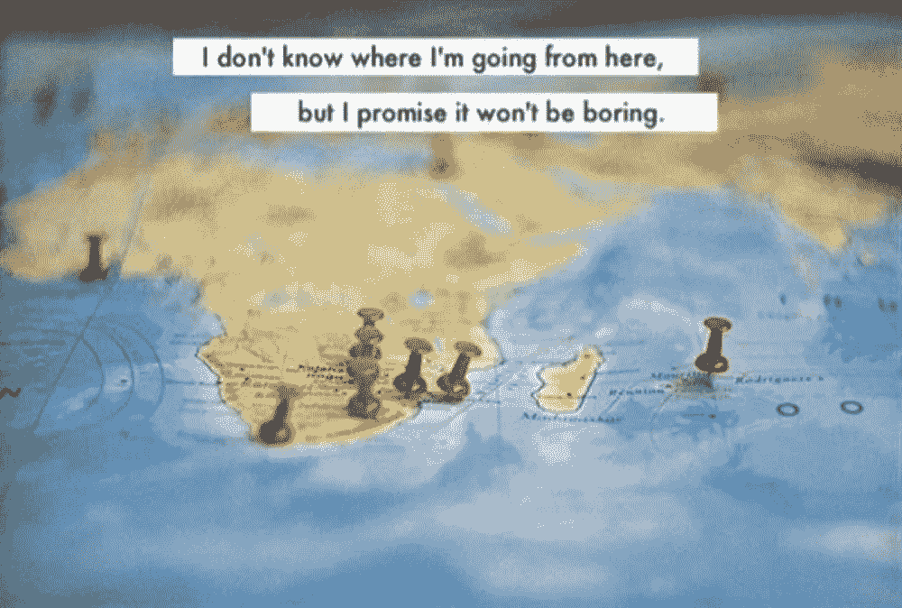

# 离开 Codando 墨西哥

> 原文：<https://medium.com/hackernoon/mi-salida-de-codeando-m%C3%A9xico-547a900036e4>

在我开始在 Codeando [墨西哥](https://hackernoon.com/tagged/mexico) 工作之前,我对各级政府感到失望。我对创新、开放和做不同事情的体验最终只是[open washing](http://blog.okfn.org/2014/03/10/open-washing-the-difference-between-opening-your-data-and-simply-making-them-available/) 执行不力。我开始在公共服务部门工作,因为我相信我可以从内部推动变革,有幸执行可以对整个城市产生影响的项目。事实证明,权力游戏和政治不仅仅是把事情做好。胡安·巴勃罗(Juan Pablo)告诉我的关于在 Codeando 项目上工作的可能性,而不必处理权力游戏并真正寻找结果,这是证明一切都没有丢失的最佳机会。

在 Codeando 墨西哥工作是一种荣幸,并让我有机会重新获得一些希望,即可以有一个真正开放的政府。今年,我很少见到全国各地的公司,他们都明白,发展一家公司并不意味着要像 Facebook 那样大,而是要开展能够改变人们生活方式的项目,这可能意味着开发一个政府应用程序,我遇到了一些愿意在周末或下班后花时间开发有用解决方案的人。我发现优秀的公务员在日常工作中逐渐改变了人们对公共服务的看法。

但它也让我有机会了解民间社会和私人倡议的作用(在明确规则的情况下)是实现这一目标的关键。在此期间,我遇到了来自拉丁美洲以及南北其他地区的杰出人士,他们每天都在寻求使他们的工作对人们的日常生活产生影响,无论是使他们的政府更加透明,让合适的人合作,开发技术,使政府能够更好地满足其服务对象的需求。

我在这里的时间即将结束,但我将继续留在我一直依赖的特殊团队中,以及这个组织给我留下的所有学习。

未来即将到来，但这只是一个开始。一个月之后，他开始了辉煌的职业生涯。因为没有进展，我想在我的[correco](mailto:oscar@citydevs.mx)或 [twitter](https://twitter.com/tlacoyodefrijol) 上讨论一下。

Esto ilustra bien y es un pequeño tributo a Bowie que se acaba de ir de acá. La imagen tomada de [http://quotlr.com/image/1743](http://quotlr.com/image/1743)

> [黑客中午](http://bit.ly/Hackernoon)是黑客如何开始他们的下午。我们是 [@AMI](http://bit.ly/atAMIatAMI) 家庭的一员。我们现在[接受投稿](http://bit.ly/hackernoonsubmission)并乐意[讨论广告&赞助](mailto:partners@amipublications.com)机会。
> 
> 如果你喜欢这个[故事](https://hackernoon.com/tagged/story)，我们推荐你阅读我们的[最新科技故事](http://bit.ly/hackernoonlatestt)和[趋势科技故事](https://hackernoon.com/trending)。直到下一次，不要把世界的现实想当然！

