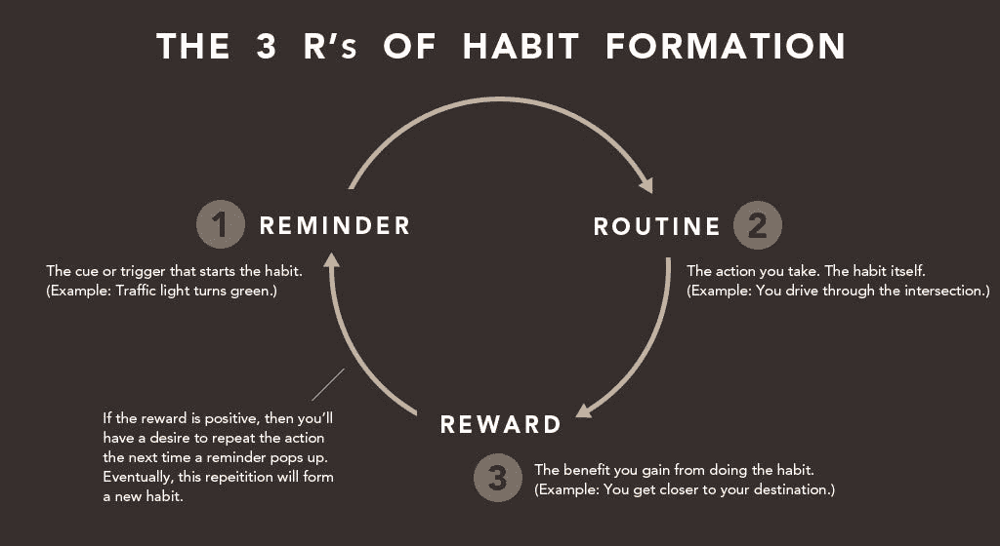

# 微习惯改变了我的生活

> 原文：<https://medium.com/hackernoon/micro-habits-changed-my-life-47f572bfc153>

对微小习惯的微小投入是如何产生巨大影响的。

 [## 每当彼得·施罗德发表文章时，就收到一封电子邮件。

### 每当彼得·施罗德发表文章时，就收到一封电子邮件。通过注册，您将创建一个中型帐户，如果您还没有…

medium.com](/subscribe/@peterschroederr) 

我是一个真正的信徒，当你感到舒适时，你就开始死亡。如果你不努力让自己变得更好，那么你就会慢慢变得更差。

在某种程度上，这种坚定的观点让我对过程和结构有点不舒服。混乱对我来说是天赐之福，多样性让我思维敏捷，但一旦我发现了微习惯的力量，一切都变了。

# 什么是微习惯？

微习惯是一种需要最少动力或努力就能完成的行动。这个想法是随着时间的推移而产生的；一个微小的习惯会慢慢建立起来，并产生重大的影响。

我的中学体育老师以举重的形式向我介绍了微习惯。他说，“把举重想象成叠纸片。每天你举重的时候，就假装你在往一堆纸里加一张纸。第一天，你从一张纸开始。经过一个月的举重，你可能会堆积多达 30 张纸。坚持举重几年，你就要有一大堆纸了！”

从那以后，这个概念就一直伴随着我，我试着培养一系列的微习惯。这些微习惯塑造了我的生活方式，并帮助我做了一些否则我无法做到的事情。

# 我如何使用微习惯

我是那种会利用我能找到的所有生活帮的人。你会发现我的 Macbook 到处都是插件和 Chrome 扩展，让我的生活更轻松。节省时间和提高效率对我来说很重要。

由于我对时间有特殊的看法，我很难每天分配大量的时间来养成一种习惯。这就是微习惯的用武之地。

我开始的第一个习惯是阅读。我从来都不是一个爱读书的人，但是我决定开始多读书来学习新的东西。最初，我开始每晚睡前读一页。**就一页，就这样！**

任何人都可以阅读一本书的一页。不管怎样，我每天晚上睡觉前都会看书。我发现阅读书页并不重要，重要的是养成习惯。几乎不可能找借口不花一分钟读一页书。于是，习惯开始形成。

图片来源—【https://unsplash.com/search/read?photo=OMXPrCAhxrE 

有时这是一场斗争(尤其是在漫长的一天之后)，但是记住——这只是一页。最终，我慢慢地能够以 5 分钟的增量增加音量，达到每晚 45 分钟的阅读量。

我能够在生活中树立的另一个小习惯是冥想。我总是头脑混乱，想开始做些事情来理清思绪。过了一段时间，我开始冥想和呼吸练习，以此作为通往清晰思维的道路。

我认为每天早上这样做有助于在一天开始时理清思绪，也是晚上放松时结束一天的完美方式。

为了开始冥想过程，我开始在早上和晚上冥想一分钟。建立这个过程帮助我使冥想成为我日常生活的一部分。现在，我早上打坐十五分钟，晚上打坐半小时。

微习惯的过程也帮助我建立了每天晚上 10 点睡觉(有例外)，每天早上 6 点起床(没有例外)，晚上 8 点以后不使用任何电子产品，开始学习法语的常规。

所有这些事情都通过微习惯变成了我的日常习惯。

# 为什么微习惯有效

正如詹姆斯·克莱尔解释的那样，在他们的内心深处，习惯就是常规。

Photo Credit — [http://jamesclear.com/three-steps-habit-change](http://jamesclear.com/three-steps-habit-change)

微习惯的美妙之处在于它们非常简单，你不能对它们说不，也不能找任何借口不坚持下去。作为人类，我们经常高估我们认为我们能完成的事情，但当现实到来时，我们就放弃了，生活变得复杂了。

微习惯就是防止你因为太“难”而放弃。

当坚持练习时，你甚至不需要考虑就可以做一些事情。你可能已经在日常生活中根深蒂固的小习惯包括刷牙、洗澡、早上冲一杯咖啡等等。

# 你如何开始使用微习惯

挑一件你想做的事情，然后改进它。然后确定阻力最小的路径来实现你的目标。从那里开始，确定你今天可以开始做什么微习惯来开始你的目标。

比方说，你想学习如何编程。从每天上一节编程课(比如[代码学院](https://www.codecademy.com/))开始。在一天的固定时间内做，每天都做。

这个小习惯会让你踏上从梦想变成习惯的旅程。

**更新:*看我在 [NBC](https://www.nbcnews.com/better/better/how-use-micro-habits-tackle-big-health-goals-n766691) 和 [Forbes](https://www.forbes.com/sites/irisleung/2017/07/18/this-digital-marketer-uses-remote-work-to-avoid-wasting-time-with-random-meetings/#15c930713f6d) 上的采访，关于微习惯和其他生产力技巧！

> 如果你喜欢这篇文章，如果你能分享它，推荐它，或者在评论中告诉我，我会非常感激！❤
> 
> 此外，如果你有兴趣了解更多关于我正在做的事情，请注册在[API Economy](https://www.apifirst.tech/)上了解一切！

如果你想了解更多，你可以阅读我关于 [***的后续文章，通过利用模式中断来平衡你混乱的生活。***](/startup-grind/balance-your-chaotic-life-by-utilizing-pattern-interruptions-34e06990cd07)

> [黑客中午](http://bit.ly/Hackernoon)是黑客如何开始他们的下午。我们是 [@AMI](http://bit.ly/atAMIatAMI) 家庭的一员。我们现在[接受投稿](http://bit.ly/hackernoonsubmission)并乐意[讨论广告&赞助](mailto:partners@amipublications.com)机会。
> 
> 如果你喜欢这个故事，我们推荐你阅读我们的[最新科技故事](http://bit.ly/hackernoonlatestt)和[趋势科技故事](https://hackernoon.com/trending)。直到下一次，不要把世界的现实想当然！

