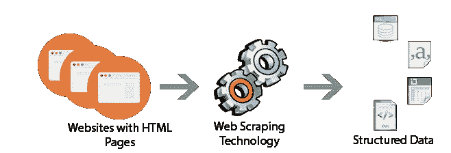
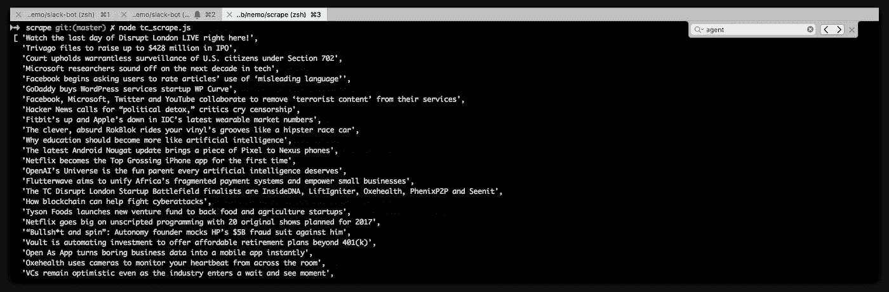

# 微服务系列:铲运机

> 原文：<https://medium.com/hackernoon/microservice-series-scraper-ee970df3e81f>

Universal Scraper Microservice

可扩展的通用刮刀。在几秒钟内抓取数千篇 TechCrunch 文章！

这篇文章是我们将在接下来发布的一系列开源项目的一部分，正如之前在这里描述的。

# 擦

我最近在做一些机器学习，学习如何创建不同的架构和模型的很大一部分是为了处理现实生活中的数据。有很多很棒的[数据集](https://kaggle.com/datasets)，但我想从头开始构建一个，并选定了 TechCrunch 文章标题(用于科技新闻文章标题生成器)。

有很多方法可以从 TC 等公共网站上抓取这样的简单数据，但是因为我们以前已经做过一些抓取工作，所以我开始构建一个简单的抓取器，它可以使用对 HTML 内容的简单查询来抓取公共元数据和文本。

## 刮擦声

这就是[刮](https://github.com/nemo/scrape)进来的地方。它建立在 [stdlib](https://stdlib.com) 的基础上，有一个简单的抽象，从它抓取的网站的原始 HTML 中提取数据，以及提取结构化的[schema.org](https://schema.org)和[开放图](http://ogp.me/)元数据。

它是开源的:

 [## 尼莫/刮擦

### 刮刀分布刮刀

github.com](https://github.com/nemo/scrape) 

你也可以在 stdlib [这里](http://stdlib.com/services/nemo/scrape)使用一个生产就绪版本。

# 抓取 Techcrunch

自然地，在建立了一个分布式的抓取器之后——从像 Techcrunch 这样的网站上抓取大量的文章标题是相当容易的。

这是我用来抓取大约 100 页 Techcrunch 档案的一个小片段:

Techcrunch scraper

几秒钟之内:

Scraped Techcrunch article names

现在让我们从这些数据中寻找乐趣，并提出几个 ML 模型。那是改天的事。

下次你需要以结构化的方式构建一个网站，并且不想投资为它创建基础设施的时候，请随意使用(或分叉) [scrape](https://github.com/nemo/scrape) ！

如果你想继续关注开源微服务的发布，请关注我的帖子。

> [黑客中午](http://bit.ly/Hackernoon)是黑客如何开始他们的下午。我们是 [@AMI](http://bit.ly/atAMIatAMI) 家庭的一员。我们现在[接受投稿](http://bit.ly/hackernoonsubmission)，并乐意[讨论广告&赞助](mailto:partners@amipublications.com)机会。
> 
> 如果你喜欢这个故事，我们推荐你阅读我们的[最新科技故事](http://bit.ly/hackernoonlatestt)和[趋势科技故事](https://hackernoon.com/trending)。直到下一次，不要把世界的现实想当然！

