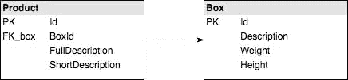
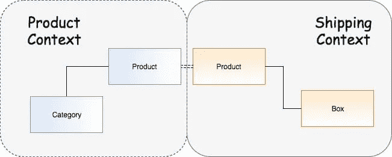

# 微服务，有界上下文，内聚力。他们有什么共同点？

> 原文：<https://medium.com/hackernoon/microservices-bounded-context-cohesion-what-do-they-have-in-common-1107b70342b3>

“Simplicity is a prerequisite for reliability.” — Edsger Dijkstra

在我们生活的十年里，业界对如何扩展一个组织有着普遍的共识。我们知道微服务帮助我们与成百上千的其他软件工程师一起工作，我们知道自主性是一个关键因素，DDD 是与其他团队和业务进行清晰沟通的基础。

然而，似乎很多公司都在努力解决如何在不同的服务中分割整体。根据我的经验，大部分关于整块分割的决定都是通过数据模型做出的。例如，在电子商务中，您可能希望从产品服务开始，并将所有产品信息转移到那里。但是，如果您仔细观察您的产品数据模型，您可能会看到与产品信息没有直接关系的信息。

电子商务拥有将产品成功发送给客户所需的产品信息。例如，交付产品所需的盒子特性，如尺寸、格式或材料。根据与产品相关的包装盒，将提供不同的运输选项。

“那么，你所说的凝聚力是什么？”

你可能听说过耦合这个概念。耦合是定义模块或组件之间相互依赖程度的一种度量。通常情况下，低耦合是好事，高耦合是坏事。

在上面的例子中，使用微服务，你可能有一个产品服务和另一个运输服务。如果您选择在产品服务上获得箱子信息，那么运输服务将需要从产品服务获得该信息，以便执行运输逻辑来查找可用的运输选项，要么通过运输服务调用产品服务，要么通过它们之间的编排层。

乍一看，这似乎不是很重要。你可以说，是托马托，托马托。因此，让我们尝试在运输服务中添加更多的逻辑。

> *作为一名送货运营经理，我想对产品进行分类，这样我就可以选择向顾客展示哪些送货选项*

让我们想象一下，我们的电子商务有一些不能空运的危险产品。这意味着运输服务现在需要改变，以便为客户提供符合这些规则的运输选项。

为此，我们希望对产品进行分类，以便在运输服务上添加逻辑来选择允许的选项。

正如您可能猜到的，我们将更改产品服务以添加新的分类功能，更改 API 以包含该信息，并更改运输服务以具有选择正确运输选项的逻辑。我们可以使用运输服务来获得产品，或者我们可以使用编排将这个分类发送给运输服务，就像我们之前说过的那样。

> "在一个设计良好的微服务架构中，服务之间的依赖性被最小化."——[https://specify.io/concepts/microservices](https://specify.io/concepts/microservices)

这可能不是我们[建筑](https://hackernoon.com/tagged/architecture)的最佳设计。运输和产品有很高的耦合性，但也有很低的内聚性。运输服务正常工作的必要数据在产品服务上。

> *如果你添加了一个新的特性，你可以通过你需要改变的服务的数量来度量内聚性。*

这是一些公司在微服务上苦苦挣扎的原因之一，改变系统中任何东西的成本都如此之高。一个简单的变化，我们需要改变至少两个服务。

*但是和产品有关。是产品信息！！！*

是的，和产品有关。但是功能完全与运输相关。如果我们在产品的运输服务中有我们需要的东西，那么更改我们的软件会更容易，因为我们只需要更改运输服务就可以将特性交付到产品中。组件变化越少，出错的机会就越少，部署就越容易，验证特性的测试就越容易，软件工程师的架构就越简单。

**有界上下文**

[有界上下文](https://hackernoon.com/tagged/bounded-context)试图将我们复杂领域的边界定义到业务上下文中。有界上下文很重要，因为它们允许我们定义一种在边界内共享和有效的无处不在的语言。

产品对于运输受限上下文的意义与对于产品受限上下文的意义不同。

产品的领域专家可能不了解任何关于运输规则或使用什么箱子将产品交付给客户的信息。然而，这些信息是交付领域专家日常活动的一部分，他甚至可以帮助您自动化系统的一部分。

所以让我们倒回去一点。既然我们已经听说了有界上下文，您可能会问自己这与我们在产品服务和运输服务中所做的有什么不同。老实说，我看不出有什么不同。

使用有界上下文是保持系统高内聚的好方法。

**如何保持发货和产品的一致性？**

我们的行业仍然非常依赖系统中的事务和一致性。一致性很重要，我不会说不重要，但是我们可能只需要我们系统的最终一致性。

当我试图实现将整体分割成服务的想法时，最常被问到的问题之一是如何保持运输和产品之间的一致性？或者，换句话说，如何确定我将只拥有存在于产品服务中的运输服务中的产品？

为此，让我们进入一个好的微服务架构的规则:**编排应该优先于编排**。为运输对产品进行分类的人可能不同于为目录信息对产品进行分类的人。大概也不会同时发生。

这意味着您将能够订阅产品服务的事件。“ProductCreated”和“ProductDeleted”以获得您需要的一致性。

**时间旅行到 2030 年**

随着时间的推移，互联网并不是世界上最好的东西。顾客现在不喜欢电子商务。我们的电子商务发展不顺利，我们将关闭网站，专注于我们商店的运营。我们不再需要运输了。

如果我们可以删除运输服务，并且不保留任何与运输逻辑相关的数据，这不是很棒吗？

> [黑客中午](http://bit.ly/Hackernoon)是黑客如何开始他们的下午。我们是 [@AMI](http://bit.ly/atAMIatAMI) 家庭的一员。我们现在[接受投稿](http://bit.ly/hackernoonsubmission)并乐意[讨论广告&赞助](mailto:partners@amipublications.com)机会。
> 
> 如果你喜欢这个故事，我们推荐你阅读我们的[最新科技故事](http://bit.ly/hackernoonlatestt)和[趋势科技故事](https://hackernoon.com/trending)。直到下一次，不要把世界的现实想当然！

