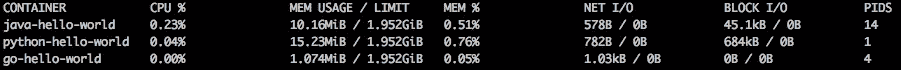
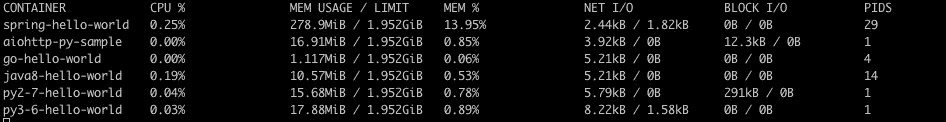

# Java 中的微服务——再看

> 原文：<https://medium.com/hackernoon/microservices-in-java-a-second-look-460ba3909c44>

所以最近我发表了一篇名为《Java 中的微服务？从来没有。”这严重分裂了阵营。对语言、工具、框架等充满热情的 Java 开发人员提出了一些非常好的反驳，在阅读了这些观点后，我想我应该再看一眼这种语言及其对基于微服务的[未来](https://hackernoon.com/tagged/future)的适用性。

## 我第一个论点中的漏洞

当提出我最初的论点时，我认为我没有足够清楚地说明我最初的内存需求来自哪里。老实说，正如一个人所说的，我的确是在拿苹果和橘子做比较。

我说过，在 Spring Boot 上运行一个基本的 Java 应用程序至少需要 1GB 的 RAM 才能运行。我们遇到了基于 CloudFoundry 的 Spring boot 应用程序的问题，如果它们没有设置为 1GB 的最小值，就会出现内存不足的错误并崩溃。因此，如果您要将一个整体应用程序分解成一系列微服务，那么所述微服务的每个实例至少需要 1GB 的 RAM。你可以用 512MB 启动应用程序，但你偶尔会发现你的应用程序在奇怪的情况下崩溃。

我在上一篇文章中收到的一些反馈表明，您可以使用内存计算器来指定堆空间大小之类的东西，但是平心而论，开发团队在正常环境中这样做的可能性微乎其微。

我用这个作为我的论点的基础，虽然这对于一个这样的环境来说是正确的，但是把所有的 Java 应用程序都归为一类是有点不公平的。

## 深入挖掘

让我们来看看 3 种不同的语言；当然是 Java，Python 和 Go。为了进行更公平的比较，我们将编写 3 个准系统 http 服务器，当根路径被点击时，它们将返回“Hello World”。

我们还将使用 Docker 运行这 3 个不同的应用程序。为了子孙后代，我将包含用于构建和运行这些基于 docker 的容器的源文件。这些将是我有限的 Docker 知识所允许的最小限度。

## Go 示例

我们的 go 服务器的 docker 文件如下所示。

我们的 go 服务器将利用`"net/http"`包，看起来像这样:

## Java 的例子

我们的 Java 示例将使用一个非常简单的 httpserver，使用 sun 库来运行它。

我们将使用 Java 8 作为 Java 示例的基础映像

## Python 的例子

我们的 Python 库应该是一个基于 flask 的应用程序。

我们将使用 Python 2.7 作为 docker 容器的基础。

## 基线结果

在运行这 3 个不同的容器时，我对 Python 的结果感到非常惊讶。Python 消耗的基本内存比基于 Java 和 Go 的等效内存的总和还要多。

不出所料，基于 Go 的等效程序仅占用 1MB 多一点。Java 版本刚刚超过 10MB，Python 2.7 Docker 镜像需要 15MB。

## 深入挖掘

因此，基于这些有点奇怪的结果，我决定深入研究一下，看看 Spring Boot 这样的应用程序会消耗多少资源，以及基于 Python 3 aiohttp/asyncio 的服务器会消耗多少资源。令我惊讶的是，我发现 Python 3 版本的 aiohttp 更重，运行一个简单的服务器大约需要 18MB。

## Spring Boot 巨人

现在是检验 Spring Boot 码头集装箱的时候了。我构建了一个 hello-world 风格的 Spring Boot 应用程序，并使用 maven 编译它。我启动了它，发现它使用的内存是基于 go 的同类软件的 260 倍。

我们示例应用程序的 docker 文件如下所示:

虽然我们的项目依赖项的总和采用这种形式:

正如你所看到的，除了 json 库之外什么也没有，我们的 spring boot 依赖项就放在这里。

在构建 docker 映像并启动它之后，我们得到了如下结果:

The final somewhat horrifying results

## 结论

相比较而言，使用像 Spring Boot 这样的东西作为你所有微服务的基础，你可能会面临和我之前文章中描述的差不多的命运。您将在基础设施成本方面付出更多，并且您最终将为大多数项目中根本不需要的功能买单。

在每个项目中使用 Spring Boot 就像买了一台高性能游戏电脑，而你真正需要的只是一个树莓派。通过选择一个较小的框架和考虑你的选择之前，你 Spring Boot 所有的事情！你可以为自己省下一大笔钱。