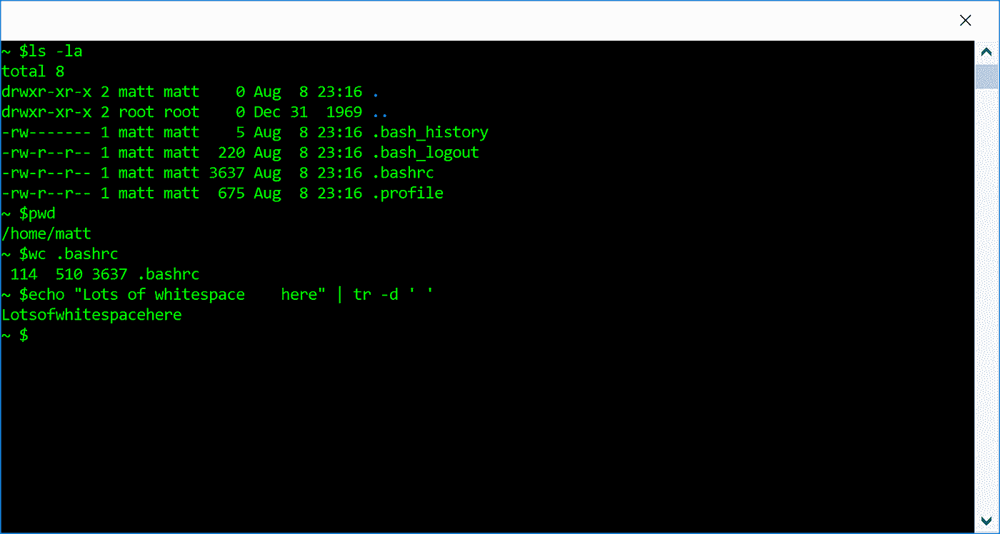

# 微服务:更有味道的 shell 命令

> 原文：<https://medium.com/hackernoon/microservices-shell-commands-with-added-flavor-b3c0bcfe12fb>

*现在在闪亮的新包装中有了更多的网络。*

Shell 命令很神奇。对于不经常使用某种形式的 shell 交互的人来说，通过 shell 观看某人工作是一种神奇的计算机语言。你可能会想到一部流行电影中的[场景，经典的黑客刻板印象坐在那里，](https://www.youtube.com/watch?v=dFUlAQZB9Ng)[用看起来像外星语言的东西敲着](https://hackernoon.com/tagged/typing)。

然而，我在 shell 中花了相当多的时间，我知道它不是一种外星语言。然而，shell 命令仍然很神奇，只是出于不同的原因。

我看过其中一些的代码。我敢肯定，成千上万个小时已经花在编码和测试每一个命令上了。我知道有些被放入我正在使用的 shell 中，而其他许多是存储在我的路径中某处的独立实用程序。它们为什么有魔力？

是因为他们把“把一件事做得非常非常好”这个概念发挥到了极致。比起怀疑 *ls* 或 *tr* 或 *grep* 的正确运行，我更有可能怀疑自己的技能。

那么这和[微服务](https://hackernoon.com/tagged/microservices)有什么关系呢？我认为彼得·西巴赫的《编写 Linux 实用程序的艺术》中的这句话很好地总结了这一点:

> 一个好的公用事业公司是尽可能把工作做好的公司。它得和别人玩得好；它必须能够与其他实用程序相结合。一个不与其他程序结合的程序不是一个实用程序；这是一个应用程序。

事实证明，微服务在很多方面都是可以远距离访问的 shell 命令。有时候是基本的 IPC。在许多情况下，它是通过网络。

丹尼尔·p·德恩在《Linux.com》上发表的文章对此有一个很好的解释:“微服务是‘小型特定任务组件’(例如子程序、Unix 命令)和‘大块巨石’之间的宇宙方法钟摆的最新例子之一。”"

那么这一切意味着什么呢？有几个重要的想法适用于微服务和 shell 命令。我们来看几个。

# 做好一件事

这是微服务和 shell 命令的核心。当然，这并不意味着它必须局限于一个用例。无论您希望通过网络还是通过命令行被调用，您都希望在您的程序中构建一定的灵活性和覆盖范围。

您是否正在尝试查询系统数据、解析关键行、格式化数据并将其保存到文件中？太棒了，结合了 [procps 工具](https://gitlab.com/procps-ng/procps)，grep，和 sed。您是否有一个正在尝试构建的复杂应用程序？好，写多个微服务。

这里的想法是*组装*你的解决方案，而不是把它建成一个整体。

# 持久性

这就是事情变得有点棘手的地方。Shell 命令不会像微服务一样失败。然而，这里的核心概念是耐用性。

对于 shell 命令，该软件旨在处理边缘情况、畸形数据、资源问题等。同时，以预期的方式报告。即使在故障模式下，也可以依赖退出代码和错误消息。

对于微服务，类似的假设也适用。应该预测故障模式，虽然这可能意味着一个节点将关闭，但这也是可以预测和设计的。

耐用不代表完美。它意味着能够承受你扔给它的任何东西。

# 使用计划

有无数种方法可以组合 shell 命令。shell 脚本的整个基础依赖于以新颖的方式混合和匹配命令的能力。

这也适用于微服务:构建一个持久的、可预测的、足够通用的微服务，并期待大量的使用。

那么这对 shell 命令或者微服务的开发者意味着什么呢？有些事情你需要记住:

*   以性能为目标:没有人想依赖一个缓慢的组件
*   期望被用作更大整体的一部分:使用标准数据格式、简单标志/选项等。
*   透明:无论是传递数据还是返回响应，都要让人们容易理解发生了什么

这些只是开始。你需要从一个寻找解决特定问题的工具的人的角度来思考。你的 shell 命令或者微服务管用吗？他们**T5 会想要 用吗？**

# 从这里去哪里？

围绕微服务有很多讨论，但这些讨论忽略了一个想法，即*我们在*之前就已经经历过了。高质量 shell 命令的普遍存在可以作为构建高质量微服务的指南，因为许多相同的原则也适用。

Shell 命令是工程师工作流程的重要组成部分。难道我们不应该期望微服务也一样耐用、可用，并且随时可以组装吗？

下次你在一个团队谈论微服务的时候，只要记住:*这是一个 UNIX 系统！你知道这个！*

*如果你有兴趣接触，我在* [*LinkedIn*](https://goo.gl/2tySiH) *，*[*Twitter*](https://goo.gl/xAvf1h)*，Medium 和许多其他平台上。*