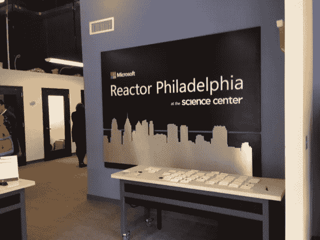

# Microsoft 反应器事件

> 原文：<https://medium.com/hackernoon/microsoft-reactor-event-7cca449930ab>

Entrance to the Microsoft Reactor in Philadelphia

*最初发表于 aulonimagazine.com，我是那里的特约撰稿人兼编辑*

费城的微软反应堆于 2017 年 5 月 24 日在大学城科学中心举办了一场见面会。该活动以微软技术传道者和最有价值的专业人士(被称为“MVP”)为特色，他们向参观者讲述了微软和微软 Reactor 在小型企业和大费城社区中可以发挥的作用。

作为全国仅有的三个站点之一，市场街上的微软反应堆是一个免费的社区空间，从周一到周五向从学生到创业者的任何人开放。这个空间设有一个私人会议室、电话亭、演讲区和虚拟现实咖啡馆，游客可以在这里尝试微软的混合现实 HoloLens。现场还有各种硬件，如 Surface Pros、Xbox、3D 打印机以及 iPhone 和 Android 智能手机，任何人都可以进来使用。

但主要的吸引力并不是微软的 HoloLens，而是正如微软现代[政府](https://hackernoon.com/tagged/government)主任杰弗瑞·弗里德曼所说，微软反应器如何教育“我们的社区如何利用[技术](https://hackernoon.com/tagged/technology)将不可能变为可能”，以讲述“费城整个技术场景的故事”

费城正在经历技术外流，个人学习技术技能，如编码和/或计算机科学专业，并将这些专业知识带到硅谷和西海岸，而不是留在费城。为此，微软 MVP 和技术布道者上台展示了微软帮助费城社区和现场问题的能力。

MVP 称号授予那些积极努力与他人分享其技术专长的个人。凭借二十多年的经验，Mahesh Chand 已经十几次获得该奖项。他告诉观众，他的工作是“倾听初创企业，成为微软的耳朵。”另一位 Robert Keiser 帮助管理宾夕法尼亚州马尔文的 Philly.Net 用户组，该用户组每月举行微软技术会议和动手实验室。

Amanda Lange 和 Dave Voyles 是技术传播者，他们推广特定的产品或技术，并成功地建立了一个庞大的支持基础，最终将其确立为市场的技术标准。作为他们角色的一部分，他们每月都有办公时间，社区成员可以自由进入寻求技术帮助。兰格的兴趣在于游戏世界，开发 HoloLens 和有助于健康和科学的应用程序。

Voyles 的发展代表了 Microsoft Reactor 如何致力于为社区做出贡献。他开始是一名建筑工人，兼职参加微软反应器的免费网络和教学活动。这些活动激发了他的兴趣，他将自己的热情转化为职业，成为了一名具有 web 开发、协助初创公司和高性能移动应用背景的技术布道者。

微软反应器正在寻找有技术想法的个人，它可以帮助实现。微软有兴趣从一开始就帮助企业家和创新者，从产品概念到投资都与他们一起工作。

Voyles 说，对于已经拥有一家成熟公司并对集成技术感兴趣的企业主，他和其他技术传播者会根据具体情况进行工作。它们最好用作技术支持，帮助企业使用分析和微软系统，如云。Tobias Wright 是费城初创企业的技术布道者，帮助企业使用微软的平台，并将初创企业与更大的微软初创企业社区联系起来。

> [黑客中午](http://bit.ly/Hackernoon)是黑客如何开始他们的下午。我们是 [@AMI](http://bit.ly/atAMIatAMI) 家庭的一员。我们现在[接受投稿](http://bit.ly/hackernoonsubmission)，并乐意[讨论广告&赞助](mailto:partners@amipublications.com)机会。
> 
> 如果你喜欢这个故事，我们推荐你阅读我们的[最新科技故事](http://bit.ly/hackernoonlatestt)和[趋势科技故事](https://hackernoon.com/trending)。直到下一次，不要把世界的现实想当然！

