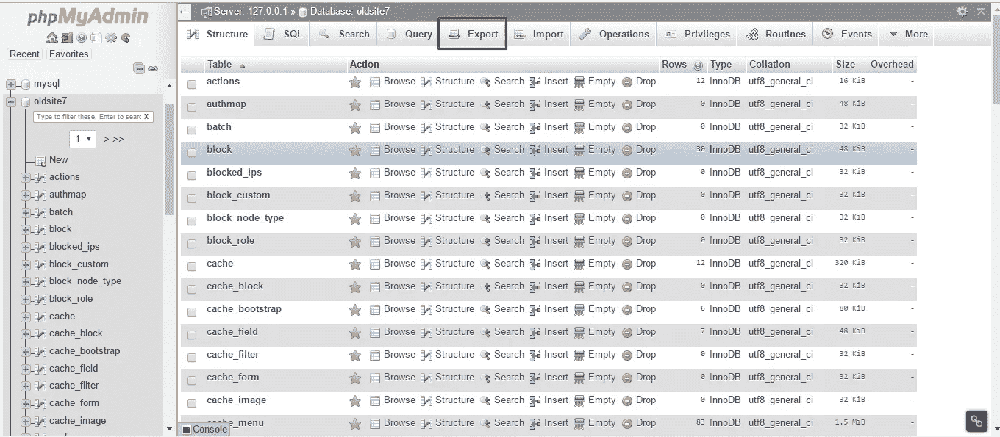
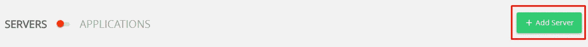
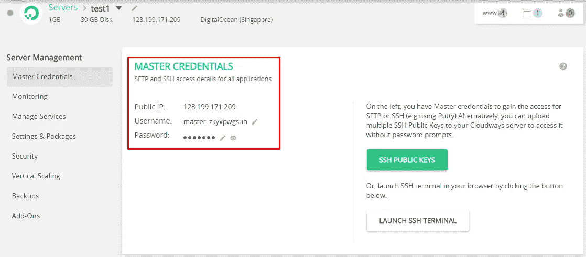
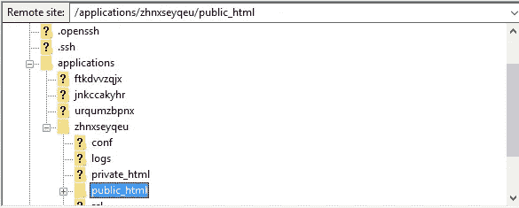
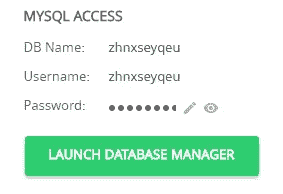
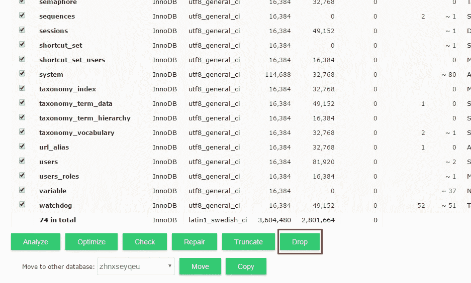
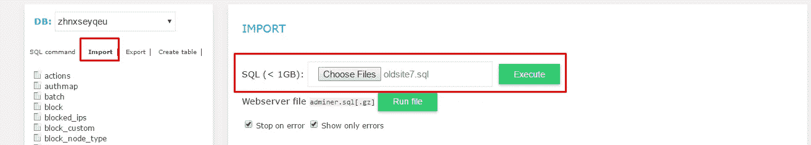
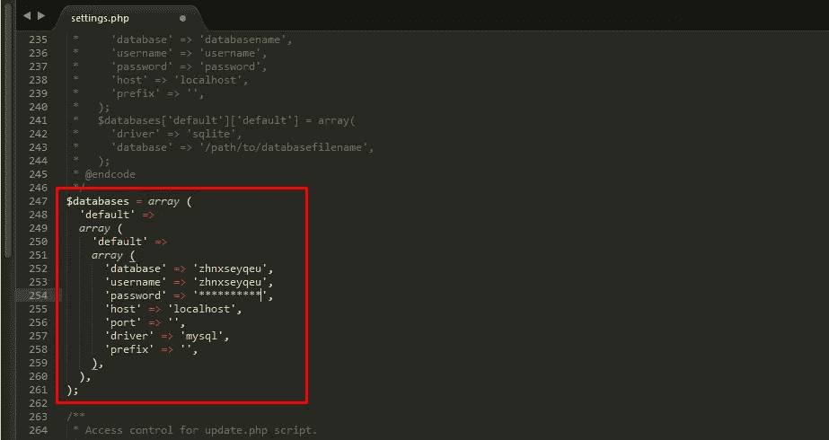

# 将 Drupal 7 网站迁移到新主机

> 原文：<https://medium.com/hackernoon/migrating-a-drupal-7-website-to-a-new-host-7f313af17262>

你目前是否在一个服务器上运行一个 Drupal 7 网站？你对目前的主机提供商有任何不满吗？您是否面临停机或速度慢的问题？

几乎所有人都知道，迁移到性能更好的主机可以解决所有这些问题。然而，许多人没有这样做，因为他们认为 Drupal 网站的迁移是一项技术上的任务。

在本教程中，我将向您展示如何将您的 Drupal 网站迁移到一个新的、更强大的主机上。出于本教程的考虑，我选择了 Cloudways。但是，这些步骤适用于任何主机。该过程包括以下步骤:

1.  备份网站文件夹。
2.  备份数据库。
3.  导入网站的备份。
4.  导入数据库备份。
5.  对 settings.php 文件进行适当的修改。

## 备份网站文件夹

你需要做的第一件事是备份你整个网站的文件夹，以避免任何数据丢失。这是确保在发生灾难时网站保持运行的重要步骤。

要进行备份，请通过 FTP 客户端(如 Filezilla)连接到您网站的当前主机服务器。为了连接到服务器，您可能需要联系您的主机提供商以获得以下详细信息:

*   服务器 FTP 主机
*   服务器 FTP 用户名
*   服务器 FTP 密码
*   服务器 FTP 端口号

一旦建立了连接，您将看到位于服务器上的所有文件。几乎在所有情况下，你的 Drupal 7 网站都位于 **public_html** 文件夹中。进入这个文件夹，将整个文件夹复制到本地机器。Filezilla 将开始将该文件夹中的所有文件复制到目标文件夹(位于本地机器上)。

## 备份数据库

下一步是网站数据库的备份过程。这是非常关键的一步，因为它涉及到网站的所有重要文件和数据。

几乎所有的主机提供商都使用 phpMyAdmin 进行数据库管理。为了访问 phpMyAdmin，您可能需要从您的主机提供商那里获得帮助。

在 phpMyAdmin 中导航到网站的数据库并创建一个备份。使用“**导出**选项，将备份文件保存在本地机器上。

完成后，继续下一步。

## 导入网站的备份

现在去[在 Cloudways](https://platform.cloudways.com/signup) 上创建一个免费账户(如果你还没有创建的话)。您可以使用 Linkedin、Github 或 Google+帐户注册和登录。

完成后，创建一个新的服务器。

服务器启动平台需要几分钟时间。接下来，导航到**应用程序**选项卡并选择**添加应用程序。**

从下拉列表中选择 Drupal 7，命名您的应用程序并创建它。

现在服务器和应用程序已经启动，通过 FTP 客户端(我更喜欢 Filezilla)连接到您的 Cloudways 服务器。进入**服务器管理> >主凭证**获取服务器登录信息。

一旦建立了连接，在**应用程序**文件夹中导航到您的应用程序，然后进入 **public_html。**选择并删除该文件夹中的所有文件。

接下来，只需从之前创建的备份中复制所有文件，并将它们粘贴到应用程序文件夹的 **public_html** 文件夹中。

## 导入数据库备份

您需要做的下一件事是恢复数据库。还记得您之前导出的数据库吗？在这一步中，您将把它导入到 Cloudways 服务器。但是在这之前，您应该删除新应用程序的数据库中已经存在的所有表。为此，在 Cloudways 上导航到您的应用程序的主页，在那里您会看到一个**启动数据库管理器**按钮。

点击按钮，您将进入内置的 Cloudways 数据库管理器。只需选择此处的所有表格，然后单击底部的**下拉**按钮。

删除所有表格后，点击右侧的**导入**按钮，浏览到保存在本地机器上的数据库备份。

点击**执行**按钮导入数据库备份。

## 对 settings.php 文件进行适当的修改

既然备份已经上传到新的服务器，现在是时候对设置进行一些更改了。一个重要的变化是在**settings.php**文件中数据库的登录凭证。现在的凭证必须被 Cloudways 数据库的数据库凭证所取代。这一点非常重要，因为不正确的凭据将无法访问网站。

这是一个相当简单的程序。首先，导航到**站点> >默认值**。使用你喜欢的代码编辑器编辑**settings.php**文件。避免使用文本编辑器，因为它们会弄乱文件的格式。

向下滚动到代码中提到数据库凭据的未注释部分。只需从 Cloudways 平台中的应用程序主页复制数据库凭证，并将它们粘贴到**settings.php**文件的适当字段中。

## 最后的想法

就是这样！您已经成功地迁移了一个 Drupal 网站(没有破坏任何东西！).如您所见，迁移到另一台主机并不像您想象的那么困难。另外请注意， [Cloudways](https://www.cloudways.com/en/drupal-cloud-hosting.php) 为您的网站提供一次免费迁移，绝对免费。这意味着您不需要担心任何与迁移相关的问题，因为 Cloudways 会为您做所有的工作。

我希望这篇文章对你有用。如果你有任何进一步的疑问，请告诉我，我很乐意回答。

> [黑客中午](http://bit.ly/Hackernoon)是黑客如何开始他们的下午。我们是 [@AMI](http://bit.ly/atAMIatAMI) 家庭的一员。我们现在[接受投稿](http://bit.ly/hackernoonsubmission)并乐意[讨论广告&赞助](mailto:partners@amipublications.com)机会。
> 
> 如果你喜欢这个故事，我们推荐你阅读我们的[最新科技故事](http://bit.ly/hackernoonlatestt)和[趋势科技故事](https://hackernoon.com/trending)。直到下一次，不要把世界的现实想当然！

