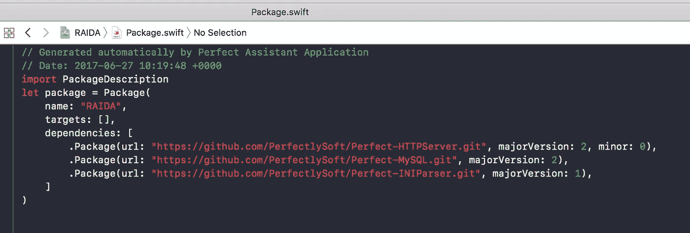
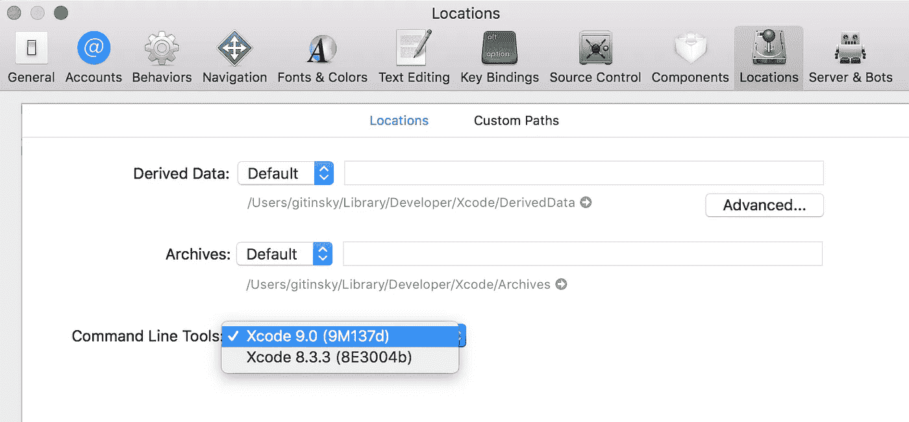
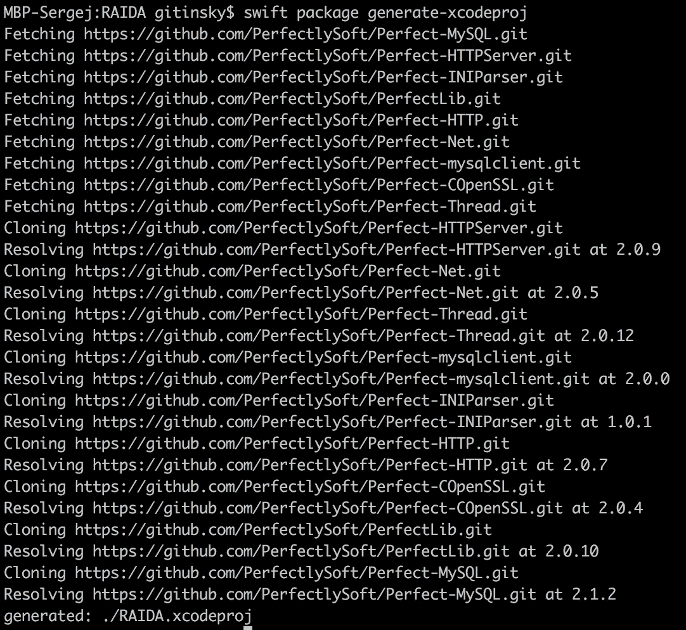
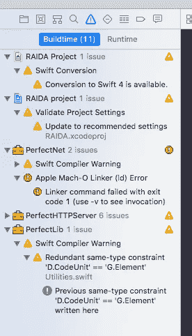
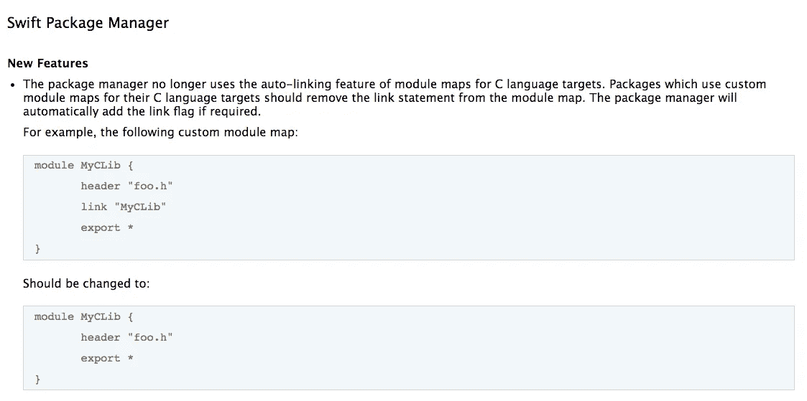

# 将完美项目迁移到 Swift 4

> 原文：<https://medium.com/hackernoon/migrating-perfect-project-to-swift-4-3ada7b4a3c1a>


为了检查 Xcode9-beta 和 Swift4 的新功能，我决定将在 Xcode 8.3.3 中编译没有问题的一个测试项目移到单独的文件夹中，并开始实验…

名为“RAIDA”的项目是使用 Perfect library 编写的，具有以下依赖关系:



我已经从 Git 库克隆了项目。当然，最初它不包含任何依赖项。我需要用构建工具下载它们。

为了让实验更干净，我决定从第一次操作开始就使用 Xcode 9 toolchain。要使用新工具链，您必须从 Xcode -> Preferences -> Locations 中更改设置:



或者从命令行:

```
$ xcode-select --switch /Applications/Xcode-beta.app/Contents/Developer/
```

然后运行生成 Xcode 配置的程序:

`$ swift package generate-xcodeproj`



所有依赖项都是从存储库和。xcodeproj 文件已写入。现在`$ open RAIDA.xcodeproj`启动了我的 Xcode 9，自动设置了构建设置。

注意 [swift](https://hackernoon.com/tagged/swift) 软件包工具是一个 CLI 命令[工具](https://hackernoon.com/tagged/tool)用于 swift 可再发行软件包，它不是一个带有某些选项的 swift 编译器。它实际上是一个名为`swift-package`的独立工具

在 Xcode 中，我试图按原样编译我的项目。我还没有在建筑设置中选择“Swift 版本 4”。是“3.2”。但是这个项目没有建成。它失败，并显示以下消息:

```
ld: library not found for -lCOpenSSL for architecture x86_64clang: error: linker command failed with exit code 1 (use -v to see invocation)
```



链接器失败。它找不到与-l 标志链接的 COpenSSL 库。

完善的网络图书馆依赖于 C 工程 COpenSSL。而且在 XCode 8.3.3 正常链接没有任何问题。XCode 9 中发生了什么，它已经停止构建了？

事实上，我花了一天时间尝试不同的可能性，玩链接器标志等等。Stackoverflow 没有帮助，人们以不同的方式解决类似的问题，但它看起来更像是“铸造”，而不是工程解决方案。

最后，我做出了一个显而易见的决定——阅读 XCode 发行说明。:)通常我们都很懒去读文档——太长太无聊了。但是当你被困住了，就没有别的办法了。当我在 XCode 8.3 中发现以下内容时非常惊讶(！)发布说明(记得在 8.3 版本中，我构建的项目没有任何问题)



我在两个 C 库——COpenSSL 和 CHTTPParser 中做了这个测试，项目最终完成了！我相信，在你所依赖的每一个 C 库中，你都必须这样做。

我无法想象这是怎么发生的，XCode 8.3 中引入的新功能实际上在 XCode 9 中已经开始工作了。很可能苹果在 8.3 中留下了新旧建筑方案

我擦去额头上的汗水…

现在是时候修复我的项目中这些临时的(我相信 PerfectlySoft 将在不久的将来修复这些)问题了。令人高兴的是，swift 软件包现在支持依赖关系的“编辑模式”——当您可以编辑依赖关系源文件时，它们将不会被稍后发生的重新提取所覆盖。

```
swift package edit COpenSSL
swift package edit PerfectHTTPServer
```

由于 PerfectHTTPServer 包含 C 库 CHTTPParser，我需要将它整体置于“编辑”模式。

```
swift package generate-xcodeproj
```

现在这些包在我的项目的 packages 文件夹中，我可以将它们添加到 git 存储库中以修复这些重要的更改。

希望对某人有所帮助！

[](http://bit.ly/HackernoonFB)[](https://goo.gl/k7XYbx)[](https://goo.gl/4ofytp)

> [黑客中午](http://bit.ly/Hackernoon)是黑客如何开始他们的下午。我们是 [@AMI](http://bit.ly/atAMIatAMI) 家庭的一员。我们现在[接受投稿](http://bit.ly/hackernoonsubmission)，并乐意[讨论广告&赞助](mailto:partners@amipublications.com)机会。
> 
> 如果你喜欢这个故事，我们推荐你阅读我们的[最新科技故事](http://bit.ly/hackernoonlatestt)和[趋势科技故事](https://hackernoon.com/trending)。直到下一次，不要把世界的现实想当然！

