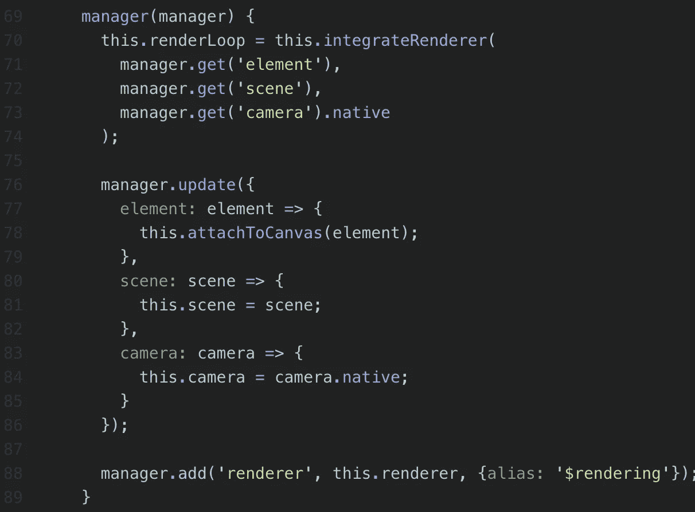
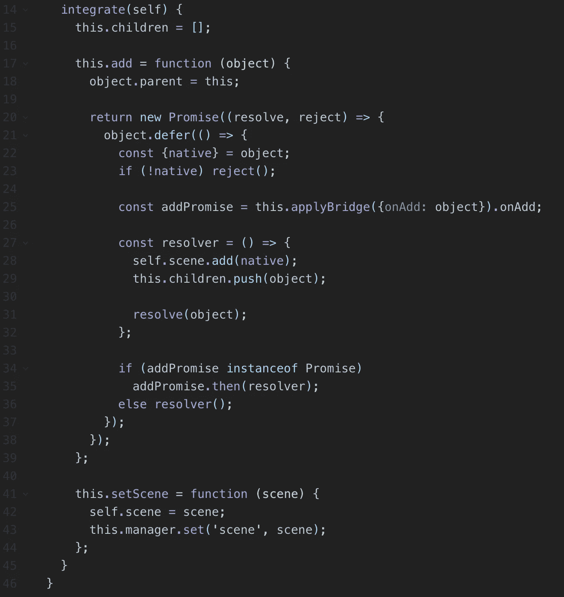
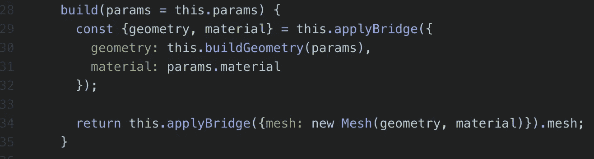
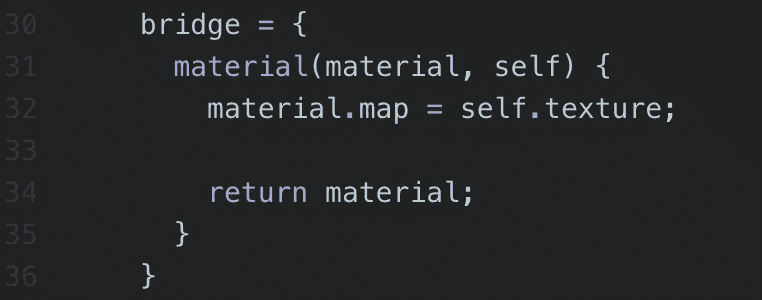
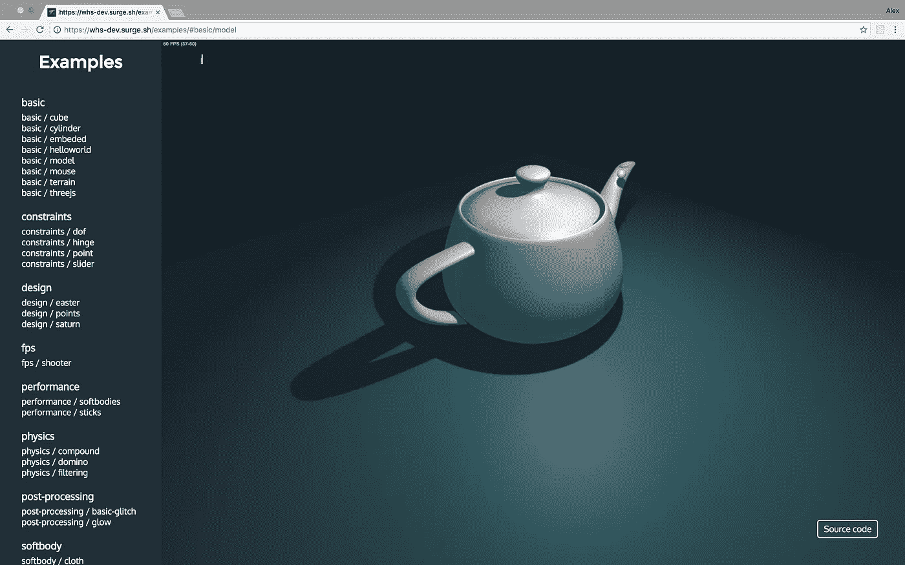

# 迁移到 WhitestormJS v2 beta。模块系统

> 原文：<https://medium.com/hackernoon/migrating-to-whitestormjs-v2-beta-module-system-2eeaeda08a80>

## 新模块系统🐫

**在我们开始**之前，我会提供一些**有用的链接**如果你是第一次看到 WhitestormJS:

Github 回购:[https://github.com/WhitestormJS/whitestorm.js](https://github.com/WhitestormJS/whitestorm.js)

**NPM**:[https://www.npmjs.com/package/whs](https://www.npmjs.com/package/whs)

# 模块

模块太棒了。模块可以做任何你可以用普通的三个模块做的事情。啮合，但更为**清洁**和**灵活**的方式。

## 第一步。经理

管理器用于添加和获取依赖关系。假设我的模块 **A** 知道有模块 **B** 会使用它的 API。然后模块 **A** 在*管理器*对象中为模块 **B** 留下一个依赖关系。

模块 **B** 也可以用 *manager.update()* 方法提供一个行为“如果组件 **C** 会覆盖组件的 **A** 依赖怎么办”。

manager() in RenderingModule

## 第二步。合并

模块可以有 *integrate()* 方法。当模块应用于组件或应用程序时，它会自动执行。通常用于向已定义的组件添加一些功能。

Example of integrate function in SceneModule

## 第三步。布里奇斯

桥允许开发人员制作特定于组件的 API。每个组件都可以通过提供将用“桥”处理的部分代码来扩展其灵活性。

假设我有一个*材质*对象。我可以将这种材料传递给模块——他们可以改变它的颜色，使它半透明或创建并用新的覆盖；

A part of WHS.Box code

功能*。applyBridge()* 定义当前对象应该经过下面的桥。

A part of TextureModule code

桥函数接受两个参数:*输入对象*和*模块的范围*。

桥函数的范围是组件，如 *integrate()* 所示

# 结论

你可以在 Github 上的 [**WhitestormJS 中开始探索其他模块**](https://github.com/WhitestormJS/whitestorm.js) **，**我们会继续添加模块(大概会添加到自述文件中)。目前你可以使用两个有助于你发展的模块，物理模块+内置模块。

> [黑客中午](http://bit.ly/Hackernoon)是黑客如何开始他们的下午。我们是 [@AMI](http://bit.ly/atAMIatAMI) 家庭的一员。我们现在[接受投稿](http://bit.ly/hackernoonsubmission)，并乐意[讨论广告&赞助](mailto:partners@amipublications.com)机会。
> 
> 如果你喜欢这个故事，我们推荐你阅读我们的[最新科技故事](http://bit.ly/hackernoonlatestt)和[趋势科技故事](https://hackernoon.com/trending)。直到下一次，不要把世界的现实想当然！

