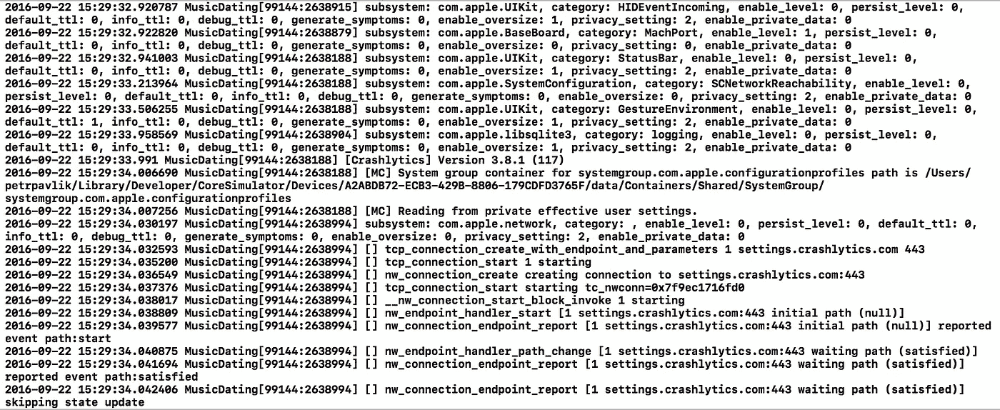

# 迁移到 Xcode 8 —您需要知道的

> 原文：<https://medium.com/hackernoon/migrating-to-xcode-8-what-you-need-to-know-5e273c74e6a7>

我想尝试将我的小项目迁移到 Xcode 8，并写这篇文章作为我必须面对的所有斗争的总结。

## 疯狂伐木

苹果在 iOS 10 中引入了新的超级快速日志 API，有一个 WWDC 在谈论它，天哪，他们已经开始记录你能想到的所有东西了。



幸运的是，我们可以添加一个环境变量来禁用它，如下所述。

## 访问媒体库时崩溃

我在访问我的照片库时遇到了崩溃。

> 此应用程序已崩溃，因为它试图在没有使用说明的情况下访问隐私敏感数据。应用程序的 Info.plist 必须包含 NSPhotoLibraryUsageDescription 键，该键带有一个字符串值，向用户解释应用程序如何使用这些数据。

解决方法很简单，按照上面的描述去做。

## 脸书登录失败

[脸书](https://hackernoon.com/tagged/facebook)登录开始返回一个老掉牙的**错误 308** 试图登录时。几分钟的谷歌搜索给了我一个提示，facebook 在 iOS 10 上处理钥匙串的方式有所改变，我需要在项目设置的功能标签下**启用钥匙串共享。那对我起了作用。**

## 破碎的浪子和一般归档

苹果公司已经引入了一些黑魔法来为你管理代码签名。我只是把它关掉，从 Xcode 中的存档按钮到浪子和 Buddybuild，所有的东西都开始工作了。

编辑:苹果似乎已经移除了自动将连接设备的 UDID 添加到开发人员预置描述文件的选项，除非你使用自动代码签名🙁。

编辑:我已经开始[尝试](https://hackernoon.com/tagged/experimenting)切换到自动代码签名，这是你需要做的。

*   在项目设置中切换到自动代码签名。
*   将调试和发布配置都设置为 iPhone Developer。是的，这是没有意义的，但这是 Xcode 告诉我的，而且有效。

使用 Xcode 存档应该不会很好。我也尝试了 fastlane，它在快结束时抛出了一个错误，但二进制文件成功了，并最终出现在 iTunes Connect 中。

## 迁移到 Swift 3

这将是一个单独的文章，当我得到它。

## 如果您还不想转换到 Swift 3

Swift 2.3 基本上是 Swift 2.2，包括苹果无法抗拒的事实，包括至少一些突破性的变化，我在核心图形框架中经历了一些变化，其中某些 API 突然返回一个可选变量，反之亦然，所以你需要修复这些。

关于 Swift cocoapods，您需要在 podfile 中添加一个 post_install stem，告诉构建系统使用 swift 2.3。请注意，在撰写本文时，cocoapods 的最新稳定版本是 1.0.1，当使用> = 1.1 的版本时，可能没有必要

```
post_install do |installer| installer.pods_project.targets.each do |target| target.build_configurations.each do |config| config.build_settings['SWIFT_VERSION'] = '2.3' end endend
```

[](http://bit.ly/HackernoonFB)[](https://goo.gl/k7XYbx)[](https://goo.gl/4ofytp)

> [黑客中午](http://bit.ly/Hackernoon)是黑客如何开始他们的下午。我们是 [@AMI](http://bit.ly/atAMIatAMI) 家庭的一员。我们现在[接受投稿](http://bit.ly/hackernoonsubmission)，并乐意[讨论广告&赞助](mailto:partners@amipublications.com)机会。
> 
> 如果你喜欢这个故事，我们推荐你阅读我们的[最新科技故事](http://bit.ly/hackernoonlatestt)和[趋势科技故事](https://hackernoon.com/trending)。直到下一次，不要把世界的现实想当然！

[](https://goo.gl/Ahtev1)