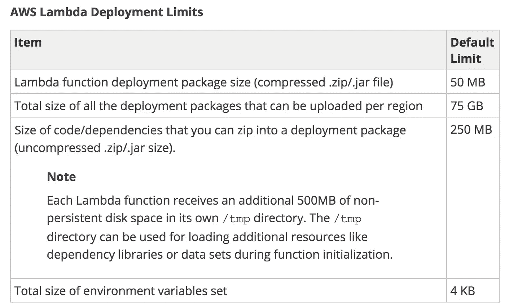
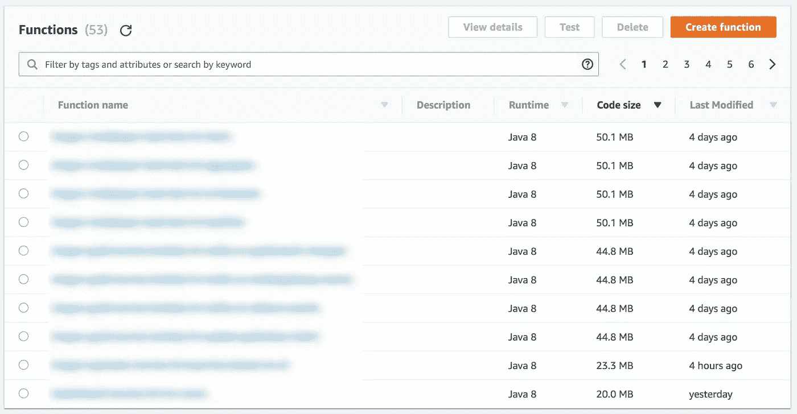
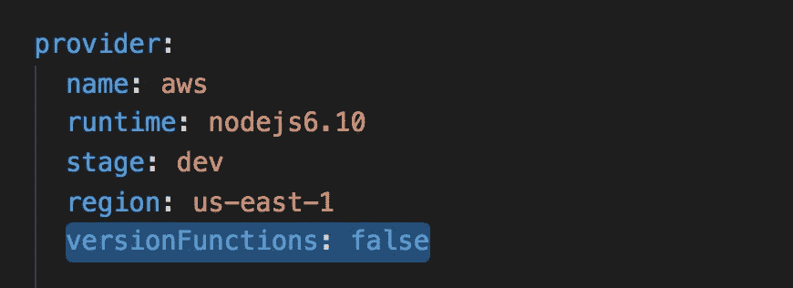
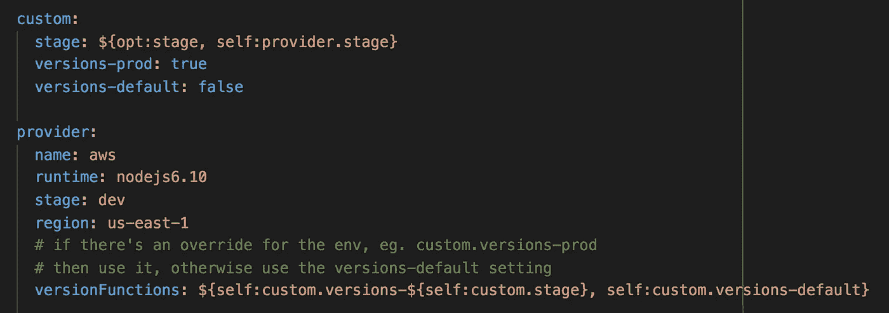

# 注意 AWS Lambda 部署包的 75GB 限制

> 原文：<https://medium.com/hackernoon/mind-the-75gb-limit-on-aws-lambda-deployment-packages-163b93c8eb72>

## Lambda 为您的所有部署包设置了 75GB 的区域限制，虽然这乍听起来可能很多，但当部署没有摩擦并且您一天要部署多次时，这实际上很容易达到。

Gotta clean up those old Lambda deployment packages!

有了 W 和 *AWS Lambda* 和*无服务器*框架，部署你的代码变得如此简单和顺畅。

随着越来越多的架构转移到 Lambda 上运行，您可能会发现，除了更快地完成工作，您还会更频繁地部署代码。

太棒了。

但是，当您为这一新发现的让您的用户和利益相关者满意的超级能力而欣喜时，您需要注意所有上传的部署包的 75GB 的区域限制。

[http://docs.aws.amazon.com/lambda/latest/dg/limits.html](http://docs.aws.amazon.com/lambda/latest/dg/limits.html)

在 Yubl，我和一个由 6 名服务器工程师组成的小组设法在 3 个月内完成了近 20GB 的部署包。

 [## Yubl 的无服务器之路—第 1 部分，概述

### 这条路到此为止

hackernoon.com](https://hackernoon.com/yubls-road-to-serverless-part-1-overview-ca348370acde) 

我们用 Nodejs 编写了所有的 Lambda 函数，部署包通常小于 2MB。但是部署的频率确保了部署包的整体规模稳步增长。

现在我用 Scala 编写了大部分 Lambda 函数(Scala 是 [Space Ape Games](http://spaceapegames.com/) 服务器团队的首选武器)，我要处理的部署包要大得多！

When authoring Lambda functions in Java, be prepared to significantly bigger deployment packages.

# 无服务器框架:禁用版本功能

默认情况下，*无服务器*框架会在每次部署时创建一个新版本的函数。

在*无服务器* 0。x，这是需要的，因为它使用了函数别名。例如，对于同一个功能，我可以有多个部署阶段— `dev`、`staging`和`production`。但是在 Lambda 控制台中只有一个函数，每个阶段只是指向同一函数的不同版本的别名。

不幸的是，这种行为也使得管理 IAM 权限变得困难，因为同一个函数的多个版本共享同一个 IAM 角色。由于您不能使用函数对 IAM 角色进行版本控制，这使得您很难在不破坏旧版本的情况下添加或删除权限。

幸运的是，开发人员听取了社区和**的意见，因为 1.0 版本的每个阶段都被部署为一个独立的功能**。

本质上，这允许您用部署阶段“版本化”IAM 角色，因为每个阶段都有一个单独的 IAM 角色。因此，从技术上讲，您不再需要为每个部署创建新版本。但是，这仍然是默认行为，除非您通过将`versionFunctions`设置为`false`在`serverless.yml`中明确禁用它。

您可能会争辩说，在产品中使用旧版本的函数可以更快地回滚。

在这种情况下，请仅在生产阶段启用它。要做到这一点，这里有一个方便的技巧，允许您的`serverless.yml`中的默认配置被部署阶段覆盖。

然而，以我个人的经验，除非你非常小心并使用别名来标记生产版本，否则实际上很难知道哪个版本与什么相关。假设你有可复制的构建，如果我们从代码的`hotfix`或`support`分支进行部署，我会更有信心。

# 用看门人-lambda 清理旧版本

如果对所有项目禁用`serverless.yml`中的`versionFunctions`很难实施，另一种方法是追溯删除不再被别名引用的旧版本函数。

为此，您可以创建一个 cron 作业(即预定的 CloudWatch event + Lambda)，它将扫描您的函数，查找未被引用的版本并删除它们。

我从网飞的[看门猴](/netflix-techblog/janitor-monkey-keeping-the-cloud-tidy-and-clean-d517ad74d648)中获得了一些灵感，并创建了一个[看门猴λ](https://github.com/theburningmonk/janitor-lambda)函数，您可以将其部署到您的 AWS 环境中，以清理您的函数的未使用版本。

在我们使用了这个*看门人 Lambda* 函数之后，我们的总部署包从 20GB 变成了 1GB(我们有很多函数…)。

Gotta clean up those old Lambda deployment packages!

 [## 燃烧的蒙克/看门人-拉姆达

### 清理 lambda 函数的旧的、未被引用的版本

github.com](https://github.com/theburningmonk/janitor-lambda) 

嗨，我的名字是**崔琰**。我是一个 [**AWS 无服务器英雄**](https://aws.amazon.com/developer/community/heroes/yan-cui/) 和 [**量产无服务器**](https://bit.ly/production-ready-serverless) 的作者。我已经在 AWS 中运行了近 10 年的大规模生产工作负载，我是一名架构师或首席工程师，涉足从银行、电子商务、体育流媒体到移动游戏等多个行业。我目前是一名专注于 AWS 和无服务器的独立顾问。

你可以通过[邮箱](mailto:theburningmonk.com)、 [Twitter](https://twitter.com/theburningmonk) 和 [LinkedIn](https://www.linkedin.com/in/theburningmonk/) 联系我。

查看我的新课程，[**AWS 步骤功能完整指南**](https://theburningmonk.thinkific.com/courses/complete-guide-to-aws-step-functions) 。

在本课程中，我们将介绍有效使用 AWS Step Functions 服务所需了解的一切。包括基本概念、HTTP 和事件触发器、活动、设计模式和最佳实践。

在这里拿到你的副本。

来了解 AWS Lambda: CI/CD 的操作性**最佳实践**，本地测试&调试功能、日志记录、监控、分布式跟踪、canary 部署、配置管理、认证&授权、VPC、安全性、错误处理等等。

还可以用代码 **ytcui** 获得**票面价格 6 折**。

点击获取您的副本[。](https://bit.ly/production-ready-serverless)