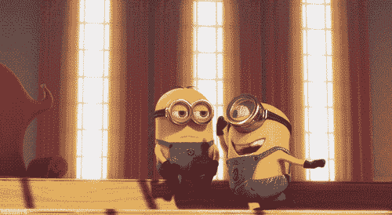
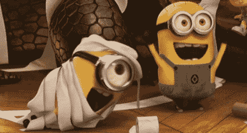
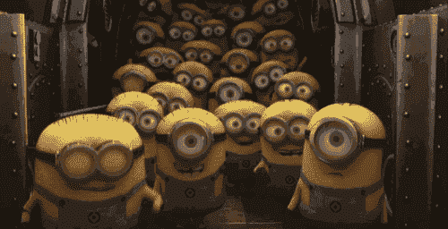

# 像机器人一样的迷你奴才来协助你

> 原文：<https://medium.com/hackernoon/miniature-minions-like-robots-to-assist-you-b372be8928f0>

如果有奴才戳你一下，提醒你有个会议，会怎么样？

通过轻拍你的左肩或右肩为你指明方向？

*坐在你的肩膀周围，充当通话的扬声器麦克风？*

*与其他爪牙合作，在你的手腕上形成一个类似珠宝的结构，或者将他们的屁股连在一起形成一个展示？*

看看这个视频

是的，我同意他们不完全是奴才。但是，Rovable 还处于早期阶段。它们可以根据你的想象而变化。

目前，智能手表或头戴式显示器等可穿戴技术不会在你的身体周围移动。然而，来自麻省理工学院的一组研究人员对此提出了挑战，并认为可穿戴技术应该在身体周围移动，并对周围环境做出反应。

是真的。拥有自己移动的能力可以帮助这些机器人实现自主。让我们看看这对互动有什么帮助。

# **互动**

## **动作**

*提供反馈* *:* Rovables 可以通过多种方式为您提供反馈。它可以使用一个线性激励器来刺激你的皮肤，或者在皮肤上拖动触觉器。

*绕衣服移动:*可以绕衣服移动。它利用衣服两侧的磁铁，自由移动。它也可以携带小重量。

*自我保护:*如果它们出现故障，它们可以脱离主机。如果电池没电了，它可以找到充电器。

## 感觉

为了感测身体周围的不同事物，传感器必须位于适当的位置。Rovables 非常适合这个用例，因为它可以将自己移动到特定的位置。它还可以从多个地方获取数据，并选择最好的一个。

## 用户界面

机器人可以组装在一起形成一个更大的屏幕。它们不仅可以提供输出，还可以通过触摸或手势接收输入。不用的时候，他们可以把自己藏在某种珠宝中。

## 玛丽和小黄人

早上，玛丽去慢跑。跟班们移动到她的四肢跟踪动作，有几个移动到她的胸部测量呼吸和心率。当她去看电影时，小跟班们聚集在她的手腕上，形成一个显示她的票的显示屏。如果温度变得太热，它就会摺叠玛丽的袖子。如果玛丽收到重要邮件，他们会通知她。当她去约会时，它们会形成一条装饰性的项链和一个合适的手镯。他们可以通过轻拍左肩或右肩来指示方向。当她入睡时，他们开始监测她的睡眠质量。

你看，可能性是无限的。

*这是研究论文* [*Rovables:作为移动穿戴设备的微型在体机器人*](http://shape.stanford.edu/research/rovables/Rovables_UIST_2016.pdf) *的衍生作品。这要归功于麻省理工学院的 Artem Dementyev、Xin-Liu(Cindy)Kao、Inrak Choi、Deborah Ajilo、Maggie Xu、Joseph A. Paradiso、Chris Schmandt 和 Sean Follmer。*

> 关注 Hackernoon 和我( [Febin John James](https://medium.com/u/75a616711f4e?source=post_page-----b372be8928f0--------------------------------) )了解更多故事。我喜欢将包含技术术语的研究论文转换成故事，这样就可以很容易理解。如果你有一篇论文或者一个话题需要转换成一个故事，在这里私信。

我还在写一本书，以提高人们对蓝鲸挑战的认识，蓝鲸挑战已经夺去了几个国家许多青少年的生命。它旨在帮助父母了解黑暗网络的威胁，并采取行动确保他们孩子的安全。《与蓝鲸战斗》这本书**在亚马逊上可以预购。该书将于本月 20 日发行。**