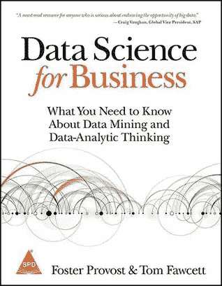

# 成为数据科学家的简约学习之路

> 原文：<https://medium.com/hackernoon/minimalistic-learning-path-to-become-a-data-scientist-c0a4f614bd09>

Image Courtesy: [https://unsplash.com/collections/396462/learn](https://unsplash.com/collections/396462/learn)

数据一直存在于我们身边，但自从《哈佛商业评论》宣布“[数据科学家是 21 世纪最性感的工作](https://hbr.org/2012/10/data-scientist-the-sexiest-job-of-the-21st-century)”的那一天起，对新工作角色——数据科学家——的需求已经达到顶峰，各行各业的人力资源部门都被赋予了招聘“数据科学家”的最艰巨任务，这几乎等同于“火星人”——从来没有见过的人。

俗话说得好，“趁热打铁”，软件工程师和工程毕业生开始将他们的职业生涯转换为“数据科学家”，这样他们的薪酬可以增加 2 倍或 3 倍(事实也确实如此)，因此一个新的行业“成为数据科学家的训练营”和“成为数据科学家的付费[课程](https://medium.freecodecamp.com/i-ranked-all-the-best-data-science-intro-courses-based-on-thousands-of-data-points-db5dc7e3eb8e#.oi3098mtj)开始在我们周围涌现，让有志之士感到困惑——有时非常沮丧的是，许多有志之士在成为数据科学家的漏斗*的早期阶段就放弃了。*

Image Courtesy: [http://blog.edx.org/the-importance-of-data-science-in-the-21st-century](http://blog.edx.org/the-importance-of-data-science-in-the-21st-century)

因此，作为一名数据科学从业者(据说)，我决定勾勒出一条成为数据科学家的极简学习路径(根据我的经验，这似乎也有更高的成功率)

**以下是建议的学习路径:**

1.  选择一种语言——R 或 Python——R 非常适合非技术人员，Python 适合技术人员
2.  理解所选语言的**基础——数据类型、循环、条件、函数**

[R-MSFT 课程简介](https://www.edx.org/course/introduction-r-data-science-microsoft-dat204x-2)[Data camp](https://www.datacamp.com/?tap_a=5644-dce66f&tap_s=210728-e54afe)
[数据科学 Python 简介](https://www.datacamp.com/?tap_a=5644-dce66f&tap_s=210728-e54afe)

1.  是时候从**数据分析**开始了——数据科学最艰苦的过程，但是 R 和 Python 中优秀的包/模块的可用性使任何人都更容易——在这个阶段，熟悉 **RStudio** / **Jupyter 笔记本**是相当可观的

    R: **dplyr** ， **tidyr** ， **stringr** ， **reshape2**
2.  生活总是枯燥的，没有切实的结果来感觉良好，所以是时候进行**数据可视化**
    R:**gg plot 2**(不败之王)，交互可视化:**rbo keh**Python:**matplotlib**，交互可视化: **bokeh**
3.  机器学习开始了——但是从**统计**开始了解基础知识

    [统计学习简介](http://www-bcf.usc.edu/~gareth/ISL/)
    [开放简介统计](https://www.openintro.org/stat/textbook.php?stat_book=os)
4.  机器学习兴起— **Learn** **用最常用的机器(监督/非监督)学习技术或算法来建立模型**(这是 Python 派上用场的地方，因为 Python 只有一个中央模块***scikit—Learn***而 R 有很多—来执行模型建立，尽管两者都更容易)

*   线性回归
*   逻辑回归
*   决策树
*   KNN (K-最近邻)
*   k 均值聚类
*   购物篮分析(关联规则挖掘)
*   朴素贝叶斯

就这样，如果你成功地完成了这一部分，你就成功地成为了一名数据科学家(虽然是入门级的)，从这里你可以开始进入**高级机器学习**(打包/增强/集成技术、特征工程、降维)的旅程，并到达**深度学习**(人工神经网络、卷积神经网络等等)的深层世界

虽然这都是关于学习的，但当学习与 ***实践-实施-反馈*** 周期紧密结合时，学习会更好——这可以是你的**github**+**blog posts**在每个阶段的组合+一个顶点**项目**或 **kaggle 竞赛**/分析黑客马拉松

最后，值得一提的一本书(其中不包含代码)是， [**商业数据科学**](http://amzn.to/2Dg6G50) —对于任何想要进入数据科学领域的人来说，这是一本精彩的必读书籍。

Image Courtesy: [Goodreads](http://www.goodreads.com/book/show/17912916-data-science-for-business)

**更多资源:**

1.  [R 为数据科学](http://amzn.to/2Dhrfyf)
2.  [Datacamp 免费&付费课程](https://www.datacamp.com/?tap_a=5644-dce66f&tap_s=210728-e54afe)
3.  [数据科学专业由 JHU 在 R](https://www.coursera.org/specializations/jhu-data-science)
4.  [Python 中的数据分析简介](https://www.udacity.com/course/intro-to-data-analysis--ud170)
5.  [数据科学 iPython 笔记本](https://github.com/donnemartin/data-science-ipython-notebooks)
6.  [牛逼-R](https://github.com/qinwf/awesome-R)
7.  [Scikit-learn 视频系列](https://github.com/justmarkham/scikit-learn-videos)
8.  [黑客正午:数据科学](https://hackernoon.com/tagged/data-science)

> [黑客中午](http://bit.ly/Hackernoon)是黑客如何开始他们的下午。我们是 AMI 家庭的一员。我们现在[接受投稿](http://bit.ly/hackernoonsubmission)并乐意[讨论广告&赞助](mailto:partners@amipublications.com)机会。
> 
> 如果你喜欢这个故事，我们推荐你阅读我们的[最新科技故事](http://bit.ly/hackernoonlatestt)和[趋势科技故事](https://hackernoon.com/trending)。直到下一次，不要把世界的现实想当然！

