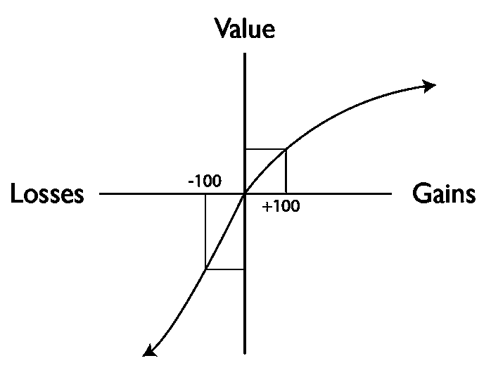

# 最小化你生活中的认知负荷

> 原文：<https://medium.com/hackernoon/minimizing-the-cognitive-load-in-your-life-bc14f4309fb2>

我试着阅读山姆·奥特曼写的所有东西。 [Antonio](https://medium.com/u/45bf6b6bbb7e?source=post_page-----bc14f4309fb2--------------------------------) 昨天给我发来了 Sam 2015 年写回来的我从来没听说过的东西:[日子很长但几十年很短](http://blog.samaltman.com/the-days-are-long-but-the-decades-are-short)。

他写的东西我没有百分之百买，但有几点我印象深刻。其中一个是第 12 个。

奥特曼写道:

> 尽量减少你自己的认知负荷，不要让那些不重要的事情分心。很难夸大这有多重要，以及大多数人在这方面有多糟糕。消除你的[生活中的干扰。开发非常有效的方法来避免让你不喜欢做的事情堆积起来，占用你的精神周期，尤其是在你的工作生活中。](https://hackernoon.com/tagged/life)

# 蔡加尼克效应

阅读时，我立即想起了蔡加尼克泄漏效应。

苏联心理学家 Bluma Zeigarnik 证明了大脑对未完成/中断的任务保持后台进程运行。

小说家和电影制作人依靠未解决的情节元素和悬念引起的认知紧张来让你翻页或等待你最喜欢的电视节目的下一集。

不仅仅是你渴望知道事情的结果，你的大脑也无法释怀。当你做其他事情的时候，认知资源在后台被消耗:工作、吃饭、锻炼、睡觉。

你的认知漏洞越多，专注、练习和学习的资源就越少。

# 我如何最小化认知负荷

2010 年，我写了一篇名为“*日常变化的思维实验*”的文章，但这篇文章从未发表。我谈过一个退休医生，他喜欢金融，业余时间尝试做投资。

他想出了一个可靠的投资策略，在一年的时间窗口内，他获利的机会超过 90%。

超过 1 天的时间窗口，他获利的机会略高于 50%。

他每天都检查自己的投资组合。他赚钱时很高兴，赔钱时很难过。每天结束时，他平均获得的利润略多于损失。但是价值是非线性的，失去对他有更大的情绪影响，并大大增加他的日常认知负荷。

*我这样做是为了最小化我的认知负荷，防止蔡加尼克效应，增加信号与噪音的比率:*

1.  比起散文，我总是更喜欢阅读*书籍*。
2.  比起 T2 的普通文章，我更喜欢看散文。
3.  我不看*日报的文章。*
4.  我不看*报纸*。
5.  我很少用*脸书*。
6.  我确实使用 Twitter，但我(试图)关注许多推荐书籍和分享有价值文章的人。
7.  我爱*电影*，但我不看*电视剧*。(*这个问题我问了很多次*)
8.  我不投资*比特币或密码。*
9.  我写了很多。