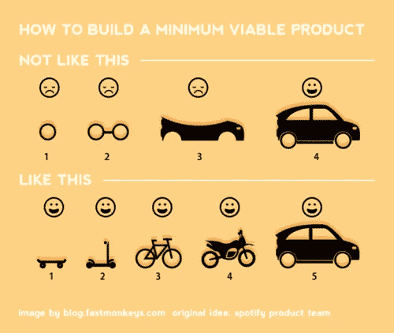
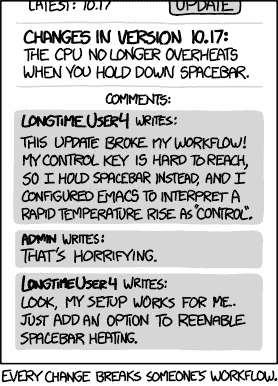

# 最小可用产品

> 原文：<https://medium.com/hackernoon/minimum-usable-product-f80d5d588fc1>

## 从产品输出到用户输入的视角

[Image Credit: Jopwell Collection](https://jopwellcollection.jopwell.com/thejopwellcollection/)

最低生存能力在很大程度上是一个**产品向外**的视角:我们能做的*最少工作量*是什么，以发现沿着这条思路走下去是否是一个值得投资的商业想法。对于用户来说与生存能力*无关。*

这是一个老生常谈的概念，即构建产品的正确方法是迭代开发的各个阶段，在每个阶段，你交付的东西，就其本身而言，通过比以前更快/更便宜/更好地实现用户的目标，提供了真正的增量价值。功能方法。

使产品能够使用的是:

*   在创作的每个阶段都更加有用
*   每回合创造[经验](/@aneel/ui-for-grandma-d2fc07a66b70#.m8tfnl42w)或*更大功效*
*   在每一步中提供*递增的胜利*加起来会有更大的收获——一种*喜悦的感觉*。【有些事我已经看够了，板着脸说。]

这显然不是产品向外的方向，而是用户向内的方向。

我们必须弥补我们让用户经历的[痛苦](/@aneel/change-hurts-42ba5612dbaa#.9cwlo3uei)——我们在构建有用的东西时磕磕绊绊的尝试，学习如何做某事的痛苦，[破坏](http://xkcd.com/1172/)他们的工作流程——另一方面是一些*快乐*。

引出应该回答的问题:

*   从用户的**角度来看，什么是定性的、主观的改进？感觉好点了吗？它会产生*更高质量*的结果吗？**
*   从用户的**角度来看，什么是定量的、客观的改进？它能更快地完成任务吗？它会产生更多的结果吗？**
*   从产品的**角度来看，什么是定量的、客观的改进？是不是更快？它是否做了更多用户想要的事情？**

*编程注意事项:此帖子是一系列不定长的产品主题中的 n 篇，主要面向* [*初创企业*](https://hackernoon.com/tagged/startup) *人员，主要是领导，主要来自非 GTM 背景。*

## 本系列中的帖子

*   [工程师用产品 101](/@aneel/product-101-for-engineers-83ef7260cbf1)
*   [工程师用产品 102](/@aneel/product-102-for-engineers-e1b8b4e82fa3)
*   [最小可用产品](/@aneel/minimum-usable-product-f80d5d588fc1)
*   [产品、营销和管理期望的艺术](/@aneel/product-marketing-is-managing-expectations-da963d36abea)

## 营销相关系列(和模板)

*   [工程师营销 101:功能介绍](/@aneel/marketing-101-for-engineers-ee9e7fcb1a51)
*   [工程师营销 102:打造漏斗](/@aneel/marketing-102-for-engineers-ddf3b7fa61e6)
*   [面向工程师的营销 201:信息传递&定位](/@aneel/marketing-201-for-engineers-b28147fdb59d)
*   [面向工程师的营销 202:发布](/@aneel/marketing-202-for-engineers-launching-9437aa0e4961)
*   [工程师市场营销 203:销售支持](/@aneel/marketing-203-for-engineers-sales-enablement-e47662ca996a)
*   [工程师市场营销 204:产生需求](/@aneel/marketing-204-for-engineers-generating-demand-27200085320c)
*   [工程师营销 301:战略&策划](/@aneel/marketing-301-for-engineers-strategy-planning-2e4473fcc879)
*   工程师的营销 302:招聘营销人员
*   [面向工程师的营销 303:定价框架](/@aneel/marketing-303-for-engineers-pricing-frame-aa71c8860a2b)
*   [工程师营销 401:GTM 阶段](/@aneel/marketing-401-for-engineers-stages-of-going-to-market-6adcedc64e17)
*   [面向工程师的营销 402:诊断&故障排除](/@aneel/marketing-402-for-engineers-diagnostics-troubleshooting-d946a337c258)
*   [工程师营销 403:解答创始人常见问题](/@aneel/marketing-403-for-engineers-office-hours-bf4d2d0b5f56)
*   [工程师销售 101:功能介绍](/@aneel/sales-101-for-engineers-6fcd1b49cffa)
*   [针对工程师的 PR 101](/@aneel/pr-101-for-engineers-7cd116cc5347)
*   [面向工程师的分析师关系 101](/@aneel/analyst-relations-for-startups-101-ea9338cb13ed)
*   [基本消息模板【谷歌文档】](https://docs.google.com/document/d/1neA71qCSeV3xH1Dpbtcy67m3v2ETmmB_Qq02ckkKUiQ/edit?usp=sharing)
*   [基本漏斗指标模板【谷歌表单】](https://docs.google.com/spreadsheets/d/11r4tHm_es6Tl4DItNUc_KzNdyvrmbbRmb38CJPLCvRU/edit?usp=sharing)
*   [基本发布时间表模板【谷歌文档】](https://docs.google.com/document/d/13Zscb5sX9ggjpWf05Ka-oj5wulC3Kb9z0LyMEQesnzM/edit?usp=sharing)
*   [基本战斗卡模板【谷歌文档】](https://docs.google.com/document/d/1dOCKhE1Ufmwp7bXeQTBCkST7NPwiCPJ2oyWEdpQut1g/edit?usp=sharing)
*   [详细战斗卡模板【Google Doc】](https://drive.google.com/open?id=1EC3Lq6Z_IVrZKR4-jHgnc5-e3krZw4bA5Z-HAOJlH10)
*   [基本营销日历模板【谷歌表单】](https://docs.google.com/spreadsheets/d/1nXr0IqwnhQsUi_D83ecPXsIyDdiTkpNZ66piRkayPsA/edit?usp=sharing)
*   [基本营销阶梯模板【谷歌表单】](https://docs.google.com/spreadsheets/d/17EfTQp_21WomJ9cwiM4ian9M2QRcbM17_d3DilGNThY/edit?usp=sharing)

## 参考书目

*   [心脏](https://library.gv.com/how-to-choose-the-right-ux-metrics-for-your-product-5f46359ab5be)框架
*   谷歌研究:[大规模测量用户体验:以用户为中心的网络应用度量](https://research.google.com/pubs/pub36299.html)