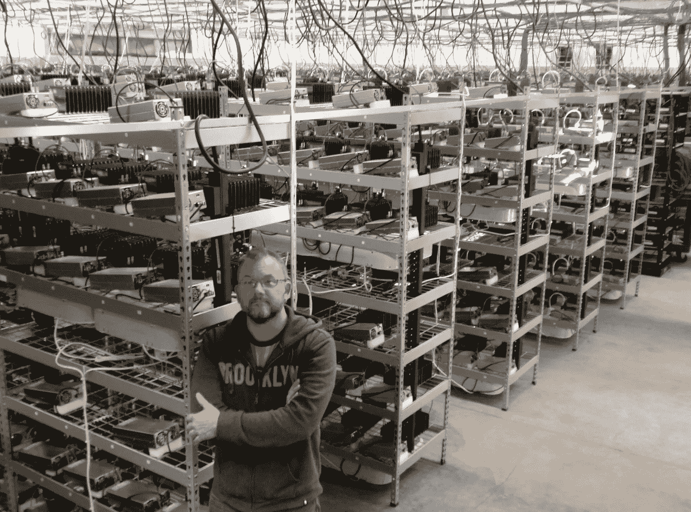
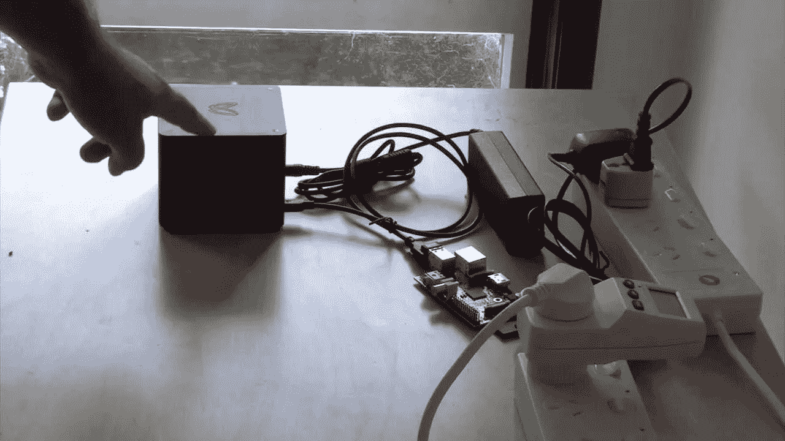
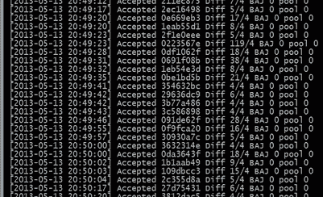
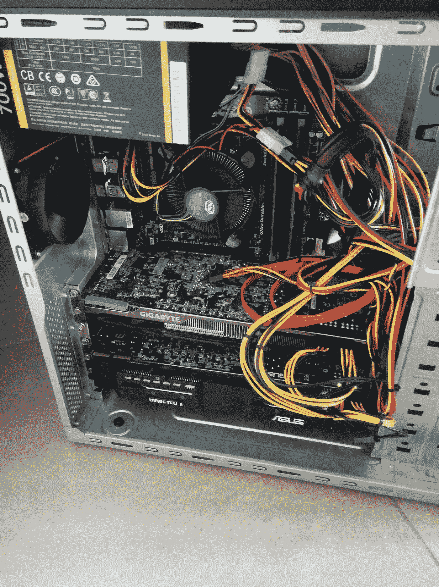
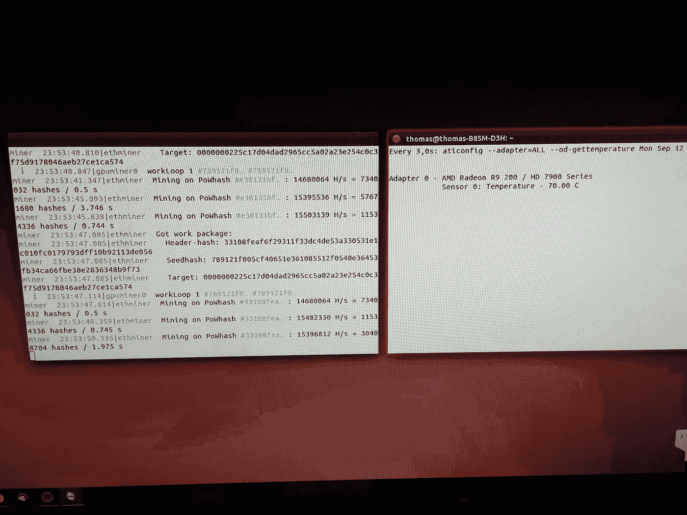

# 挖矿比特币&以太坊@家:放开野兽！

> 原文：<https://medium.com/hackernoon/mining-bitcoin-ethereum-home-let-the-beast-go-616cf50ac1ca>


我一直对科学技术非常感兴趣。我不时地投身于一个新的技术项目，不知道我疯狂的计划是否真的会成功。我对摆弄东西很感兴趣，通过试错让它工作。我的妻子仍然感谢我建立的媒体中心和服务器，我对 Linux 和服务器等一无所知。我真的很享受构建和配置这些东西。这是值得的，因为当我六岁的女儿想在媒体中心看电影时，她总是称之为“爸爸的电影之一”。:)

2013 年，我了解到一些激发我兴趣的事情。[比特币](https://hackernoon.com/tagged/bitcoin)。我的一个朋友正在谈论它，并告诉我它是什么，人们可以用它做什么。事实证明，比特币是由一个名为中本聪的实体发明的第一个分散式加密货币支付系统。可以说是互联网的现金。所以我开始更多地了解比特币，它是如何工作的，以及它的可能性是什么。

我喜欢这个想法，即能够通过互联网以快速、安全甚至匿名的方式向他人付款。对我来说，看到比特币在幕后是如何工作的，以及所有这一切是如何与[区块链](https://hackernoon.com/tagged/blockchain)联系在一起的，这很有趣，事实上，这甚至可能比比特币本身更重要。

我最终发现挖掘比特币是可能的。“挖掘比特币”意味着你的硬件必须进行一些艰难的计算，并将它们发送到比特币网络。作为回报，你可以拿回一些比特币，你可以把它们放在一个比特币钱包里。我从一开始就被迷住了。不是因为钱的问题，只是为了好玩！这些是我喜欢参与的项目。想要学习比特币和采矿基础知识的人，可以随意点击这里:[比特币和采矿基础知识](https://bitcoin.org/en/faq)。另一篇好文章可以在[这里](http://www.npr.org/sections/alltechconsidered/2014/02/25/282622916/ignored-bitcoin-this-whole-time-this-one-s-for-you)找到。这里我就不赘述了，那不是这篇作品的精髓。

所以，你说靠挖矿比特币挣钱？

在你有任何想法之前:自己挖掘比特币现在几乎已经不可能了。这就像在某个地方的土地上淘金。最终每个人都知道了这件事，带着他们的铲子和鹤嘴锄出现，在地上挖掘。只有拥有最好和最昂贵材料的人最终会真正找到一些东西，因为你必须越挖越深才能找到一些东西。这就叫挖掘难度。从技术上讲，对采矿的工作原理有不同的解释，但就像我之前说的，我们不会走那条路。只是为了让你有所了解:下图是 2014 年的，展示了当时最大的比特币矿。你看到的那些绿色的东西都是硬件，进行必要的计算以获得比特币作为回报。由于巨大的电力成本，试图与之竞争将是完全疯狂的。



所以，不要在家里尝试。回到 2013 年，仍然有可能获得一些利润，所以我决定尝试一下采矿项目。为了让一切正常运行，我需要:

*   树莓是一种小型电脑，最初在英国制造，用来教孩子们如何编程。你可以用它做很多其他伟大的项目，比如用它构建你自己的 Gameboy:)如果你想了解更多，谷歌是你的朋友。
*   矿工本身，在那些日子里，我从蝴蝶实验室得到了一个 7 GH/s 的墨西哥胡椒。矿工是在比特币网络上进行计算的硬件，作为回报，你可以获得比特币。GH 是 gigahash 的意思。哈希是计算速度的单位。
*   互联网连接，最好是通过电缆
*   另一台监控树莓派的电脑
*   Linux 的一些知识
*   运气好的话，可以在一个合适的时间框架内启动并运行一切……:)

我的设置看起来有点像这样:



A similar setup for mining Bitcoin. The black box is the miner, the raspberry pi is the small board next to it.

关于其实际工作原理的简短说明:

*   矿工被连接到树莓派。我将这两个系统配置为相互交互，从 Raspberry Pi 的一个命令就可以启动这个挖掘器。
*   我通过 RDP 协议在我的家庭网络中的个人电脑上监控 Raspberry Pi。

赚来的比特币会被送到我的在线钱包里，当时我的钱包在“雪泥池”里。



Mining calculations

我没有真正想到的一点是，矿工真的是很吵的怪物。他们就像起飞的飞机！它们也会产生大量的热量。我把它放在我们公寓的小储藏室里，希望它能盖住噪音，但它真的没起多大作用。我记得我一打开开关，我妻子就进来了，先是看了看矿工，然后看了看我，给了我一个白眼。尽管如此，我还是爱她，因为她能忍受我和我疯狂的想法…

当矿工、洗衣机和烘干机各忙各的时候，这个地方变得热得像地狱一样，情况甚至变得更好了……:)

六个月后，我不得不停止这个项目。由于比利时高昂的电力成本，开采难度变得如此之高，以至于再也负担不起开采成本。我不得不结束它，因为我的电费高于我的采矿收入。公寓里终于安静了下来。至少我妻子很开心。

最重要的是，我从这个短暂的小项目中学到了很多。从那时起，我对加密货币和采矿产生了兴趣，并开始跟踪比特币及其周围的一切。整个概念有很大的潜力，可以用于比数字支付更多的领域。

比特币本身变得流行，但它也有缺陷和局限性。我很不高兴地提到了 2014 年的[交易延展性漏洞](http://www.coindesk.com/bitcoin-bug-guide-transaction-malleability/),不要忘记:比特币交易网站 Mt. Gox 的破产，在这里人们也可以拥有自己的比特币钱包。我确信那天很多人损失了很多钱。

2013 年，一个名叫 Vitalik Buterin 的聪明人共同创立了以太坊，事情变得非常有趣。以太坊的基础可以在比特币的工作原理中找到，但以太坊有一个完全不同的目的。

以太坊是一个能够运行智能合约和其他应用程序的分散平台，也称为分散应用程序(Dapps)。智能合同是一种程序化的合同，在满足合同条件时自动执行。

举个例子:我每个月都要给房东一定的钱。这笔钱从我的银行账户中扣除，然后加到我房东的银行账户中。如果我的账户上没有足够的钱，支付失败，我可以期待一个愤怒的电话。完全有可能在智能合同中设定这些条件。

最大的区别就是“去中心化”这个词。这是银行工作方式和智能合同工作方式之间的一个关键区别。银行是一个中央权力机构，对我的银行账户有决定权。以太坊平台(以及比特币)是去中心化的。

“去中心化”是指每个连接到以太坊平台的系统都有一份契约副本。这可以确保你不能篡改合同，停机时间也不是一个问题。另一个好处是，你不再需要像银行或公证人这样的“中央权威”，因为一切都由那些“智能合同”来安排。关于智能合约的更详细的解释可以在[这里](http://cryptorials.io/a-beginners-guide-to-smart-contracts/)找到。

除了所有这些功能，以太坊也是一种加密货币，就像比特币一样。更好的消息是:目前，它还可以被开采。有了比特币，我可以买一个矿工。现在我将不得不构建一个(这实际上比听起来容易)。

如前所述:挖掘实际上是在进行计算，以确认网络上的交易(例如:A 人向 B 人支付加密货币)。有了比特币，我们有了一个矿工来做这些计算。使用以太坊，这些计算最好由矿工的图形卡(或 GPU，图形处理单元)来完成。因此，要构建一个好的矿工，我需要一个有一到两个好显卡的系统。下面我将解释我是如何做到这一切的。有点详细，但是对于想尝试同样东西的人来说是个很好的参考。

在我开始建造之前，我必须考虑几件事:

*   我对这个矿工的预算是多少？最终我选择了€ 500 左右。
*   我打算买什么样的 GPU？我需要真正擅长挖掘的 GPU。还有:我去哪里买这些？它们将是系统中最昂贵的部分，所以我必须小心。我决定在亚马逊买 2 个二手 AMD 镭龙 7950 GPU。
*   我要把我的矿工放在哪里？由于噪音和高温，我不想把它放在我的房子里。所以我去了车库。我必须在那里提供互联网。我通过 2 个 PLC 或电力线连接器做到了这一点。可以说是通过网络。
*   我要用什么操作系统？Windows 还是 Linux？因为我喜欢在这个过程中学习新的东西，所以我选择了 Ubuntu Linux。它也是一个免费的操作系统，这使得我在这里的选择很容易。
*   我还希望能够从我的公寓连接到这台电脑，所以我需要在两个系统之间实现 RDP 连接，这样我就可以从我公寓的电脑上监控一切。这样我就可以在家里解决小问题，而不是在矿工决定发疯的时候走到车库。

我选择了以下配置:

*   主板:技嘉 GA -B85M-D3H。它很小，但对我们来说已经足够了！
*   处理器:赛扬 G1840 盒装。处理器在挖掘过程中不必做太多工作。
*   内存:金士顿 8 GB 内存，我把它放在某个地方。最后，我最终安装了 4 GB，因为我的一根棍子可能不知何故坏了。
*   硬盘:SSDnow KC400 128 GB(绰绰有余。)
*   PSU: Antec 700VP(提供 700 瓦的功率)，在此之前我有一台 Seasonic S12II-Bronze 520 瓦，它不能为两个 GPU 提供足够的功率。
*   图形处理器的:AMD 镭龙 7950 x 2。良好的 GPU 在采矿和 3GB 内存。你的 GPU 必须至少有 3GB 的内存，否则它会在加载 DAG 文件时失败。见下面的更多信息。
*   案例:我有一个旧案例，放在某个适合这项工作的地方。
*   互联网连接:提供 2 个 PLC，其中一个连接到我的路由器，另一个连接到我车库里的矿工。型号:TL-PA4015PKIT
*   其他:1 个便宜的液晶显示屏，键盘和鼠标，如果我需要在车库检查系统，会很舒服。
*   操作系统:Ubuntu 14.04。我强烈反对 Ubuntu 16.04，因为我在运行 AMD 驱动程序时遇到了很多麻烦。最终，我退出了，回落到 14.04，这从一开始就很好。

实际上，自从我上次组装电脑已经有很长时间了。犯了一些愚蠢的错误:

*   我把 CPU 风扇从主板的连接器上移开，所以我不得不把电缆弄乱一点来连接它。(我担心当我再次卸下风扇时会弄坏东西，所以我决定不这样做。)
*   我找了大约半个小时才找到电源、复位按钮和高清 LED 的连接器。我找不到它们的原因是因为我已经把我的 mammoth-GPU 放在它们上面了。邪恶的我！
*   我忘了连接我的电脑扬声器，电脑第一次因为某些原因不想启动。过了一会儿，我才发现我没有连接扬声器，之后，似乎是一个内存有故障。所以我决定继续使用 4 GB 内存，这应该也能达到目的。

不管怎样，最后我把一切都搞定了。这是矿工的样子:



Don’t mind my cable management…

是时候安装 Ubuntu 了！

由于没有 DVD 光驱，我用 u 盘安装了 Ubuntu 14.04。你所需要的只是 Ubuntu 和 [Rufus](https://rufus.akeo.ie/) 的 [ISO，一个让你的 u 盘可启动并为你在 u 盘上安装 ISO 的小程序。伟大的计划。Ubuntu 的安装非常简单。最好在安装过程中连接互联网，以便安装最新的软件和存储库。](http://www.ubuntu.com/)

一旦安装了 Ubuntu，就该开始真正的工作了。如果你还没有做的话，把矿工连接到互联网上，并启动一个终端。你需要做的第一件事是让你的 AMD GPU 工作的所有必要的仓库。在我的情况下，导游发现[在这里](https://forum.ethereum.org/discussion/2695/frontier-mining-setup-notes-ubuntu-15-04-geth-v1-0-amd-ethminer/p1)是一个很大的帮助。

下载 AMD APP SDK(不要像我一样，拿 64 位驱动！)从[这里](http://developer.amd.com/tools-and-sdks/opencl-zone/amd-accelerated-parallel-processing-app-sdk/)和[这里](http://developer.amd.com/tools-and-sdks/graphics-development/display-library-adl-sdk/)的 AMD display 库，把它们保存到你的 home 文件夹并解压。下载最新版本。之后，从您的个人文件夹(例如:/home/thomas/)运行下面的命令。请记住，您可以通过键入“pwd”来检查当前文件夹。

```
$ sudo su
$ ./AMD-APP-SDK-v3.0.130.136-GA-linux32.sh # Get the 64bit driver!
$ ln -s /opt/AMDAPPSDK-3.0 /opt/AMDAPP 
$ ln -s /opt/AMDAPP/include/CL /usr/include
$ ln -s /opt/AMDAPP/lib/x86_64/* /usr/lib/
$ ldconfig
$ reboot
```

命令“sudo su”使你在输入密码后成为超级用户。否则，每次发布命令时，您都必须键入“sudo ”,这对我来说太麻烦了，但请随意。

矿工重新启动后，再次打开终端并安装 fglrx 驱动程序(windows 的 AMD Catalyst 驱动程序)。“aticonfig - list-adapters”将显示您的 AMD-GPU。

```
$ sudo su
$ apt-get install fglrx-updates
$ aticonfig --adapter=all --initial
$ aticonfig --list-adapters
```

“aticonfig - list-adapters”将显示您的 GPU('s)。您应该得到如下所示的输出:

```
* 0\. 01:00.0 AMD Radeon R9 200 / HD 7900 Series
  1\. 06:00.0 AMD Radeon HD 7900 Series* - Default adapter
```

这意味着到目前为止一切都已正确安装，我们可以继续下一步，即安装 curl、git、geth、cpp-ethereum 和 ethereum:

```
$ apt-get install curl
$ apt-get install git
$ bash <(curl https://raw.githubusercontent.com/ethereum/frontier-release/master/bin/install-go.sh)
$ add-apt-repository ppa:ethereum/ethereum-qt
$ add-apt-repository ppa:ethereum/ethereum
$ apt-get update
$ apt-get install cpp-ethereum
```

这些程序到底是做什么的，为什么我需要它们？

*   Curl 是一个使用 url 语法发送或下载文件的程序。这将在下一步中用于下载某些文件，我们将使用这些文件来生成 Genesis 块。
*   Git 用于(在本例中)从 Github 下载文件，Github 是一个著名的平台，它包含许多软件项目并跟踪版本历史。我们需要从 Github 下载某些软件来让一切正常工作。
*   Geth:一个程序，它将成为你(节点)和进行挖掘的软件(ethminer)之间的“沟通者”。它可以有很多很多用途，但是现在这个解释就足够了。Geth 将由我们在步骤 3 中运行的脚本安装(bash
*   CPP-以太坊和以太坊:实际挖掘以太坊所需的软件。

接下来，我们必须安装创世纪块。创世纪区块是区块链(在我们的例子中:以太坊-区块链)的第一个区块，在这个账本中，你可以找到加密货币的所有交易。注意，以太坊和比特币一样，有自己的区块链。

```
 $ curl -O https://raw.githubusercontent.com/ethereum/genesis_block_generator/master/mk_genesis_block.py
$ curl -O https://bootstrap.pypa.io/get-pip.py
$ python get-pip.py
$ pip install bitcoin
$ pip install --upgrade bitcoin
$ python mk_genesis_block.py --extradata 0x11bbe8db4e347b4e8c937c1c8370e4b5ed33adb3db69cbdb7a38e1e50b1b82fa > genesis_block.json
```

快到了。是时候创造我们自己的钱包了，这是我们存放以太坊的地方。这个钱包由一串字母和数字表示，只有知道密码的用户才能使用。这些地址是由 Geth 创建的，是的，它们看起来有点奇怪。例如:0x 123 f 681646 d4a 755815 F9 CB 19 E1 ACC 8565 a 0 C2 AC

您将被要求输入密码。输入密码，不要丢失，因为无法恢复。如果你失去了你的密码，你就失去了你的以太坊。这就像把你的钱放在一个盒子里，锁上，然后把钥匙扔掉。

接下来，我们必须加载上一步中创建的 Genesis 块，并将其与网络同步。

```
$ geth account new
$ geth --rpc --rpccorsdomain "*" --genesis "~/genesis_block.json"
```

现在，我们应该可以开始采矿了。但是……还有一个更重要的项目:单干挖矿和“联营挖矿”的区别。

如前所述:挖掘是指挖掘者进行复杂的计算，试图确认网络上用户所做的翻译。由于这些计算相当困难，你可以选择在一个水池中帮助“解决”这些计算，因此，由一组矿工来完成。一旦找到了解决方案，矿工们会因为提供了解决方案而获得一定比例的奖励。还有游泳池费，你必须为使用游泳池支付。

如果你独自采矿，你独自试图解决计算，没有别人的帮助。如果你有一个小矿工，不建议尝试这个，因为获得奖励更多的是基于运气，因为你是在与整个世界竞争，寻找解决方案。

不用说，我建议你开始池采矿，因为这将保证一定的以太收入。

目前，我使用 Dwarfpool 作为矿池。不需要注册。你所要做的就是告诉你的矿工它必须去哪里开始池采矿。你可以在 Dwarfpool-website 上跟踪挖掘过程，可以在这里找到。

因此，启动并运行 miner 的命令是:

```
ethminer --farm-recheck 400 -G --opencl-device 0 -F [http://eth-eu.dwarfpool.com:80/08ceda86012b77a0e780ba852f4ce7318d1d15a2/worker0](http://eth-eu.dwarfpool.com:80/08ceda86012b77a0e780ba852f4ce7318d1d15a2/worker0) --cl-local-work 256 --cl-global-work 16384
```

*   - farm-recheck 是 ethminer 要求 geth 进行新计算的频率，以毫秒为单位。
*   参数-G 表示我们希望我们的 GPU 进行挖掘。也可以用你的 CPU 挖矿，不推荐。
*   -F:这里我们表明我们想做农场采矿，而不是单独采矿
*   “设备 0”是我的主要 GPU。还记得这个输出吗？设备 0 是第一行，是默认的 GPU。

```
* 0\. 01:00.0 AMD Radeon R9 200 / HD 7900 Series
  1\. 06:00.0 AMD Radeon HD 7900 Series* - Default adapter
```

*   【http://eth-eu.dwarfpool.com:80/】是池的网址。[08 ceda 86012 b 77 a 0 e 780 ba 852 F4 ce 7318 D1 d 15 a 2](http://eth-eu.dwarfpool.com:80/08ceda86012b77a0e780ba852f4ce7318d1d15a2/worker0)是我自己的以太坊钱包 [worker0](http://eth-eu.dwarfpool.com:80/08ceda86012b77a0e780ba852f4ce7318d1d15a2/worker0) 是 Dwarfpool 已知的 GPU 名称。在这个网站上，我可以通过知道它的名字来了解 GPU 是如何执行的。
*   cl-local-work 256 和 cl-global-work 16384 是 GPU 的微调选项。这里我就不详细解释了。不过，它似乎确实能产生最好的效果。

某些人可能会注意到，在这种情况下，现在只有一个 GPU 会挖掘。实际上，我第一次忘记了这一点，当我不在家时，我突然想起了这一点。一旦你掌握了窍门，激活第二个 GPU 来采矿并不困难:记住你必须将你的设备的值从 0 改为 1，将工人的名字从 0 改为 1。其实怎么叫你工人都无所谓。如果你愿意，可以叫它“非洲燕子”或“美国燕子”。

```
ethminer --farm-recheck 400 -G --opencl-device 1 -F [http://eth-eu.dwarfpool.com:80/08ceda86012b77a0e780ba852f4ce7318d1d15a2/worker](http://eth-eu.dwarfpool.com:80/08ceda86012b77a0e780ba852f4ce7318d1d15a2/worker0)1 --cl-local-work 256 --cl-global-work 16384
```



The left screen shows the miner in action. On the right we see the temperature of one of the GPU’s.

首先，挖掘器将构建 DAG(有向无环图),并将其加载到 GPU 的 ram 中。你需要一个超过 2GB 内存的 GPU，否则 DAG 文件将无法加载，使你无法挖掘。一旦完成这项工作，实际的采矿工作将开始。

监控你的 GPU 的温度是最有趣的。为此，打开第二个终端窗口并键入:

```
watch -n 3 aticonfig --adapter=ALL --od-gettemperature
```

该命令将监视所有 GPU 的温度，并每 3 秒更新一次。我的卡的温度平衡在 70 到 80 摄氏度之间，这是可以的。如果 GPU 变得太热，你的矿工会挂起来作为安全预防措施。检查以下输出:

```
Adapter 0 - AMD Radeon R9 200 / HD 7900 Series
            Sensor 0: Temperature - 73.00 C
ERROR - Get temperature failed for Adapter 1 - AMD Radeon HD 7900 Series 
```

我仍然需要寻找适配器 1 上的错误的解决方法。这是一个可以解决的已知问题。虽然两个 GPU 的温度差不多。

还有其他一些有趣的命令，但是现在这些应该可以了。例如:有可能让你的矿工保持在一定的量以下，或者让风扇以其满负荷的一定百分比工作。顺便说一句，永远不要让你的粉丝百分百运转。

最后但同样重要的是，我在家里的桌面上安装了 Teamviewer，在车库里安装了 miner。现在可以了，但是一旦一切顺利，我会在家庭桌面和 miner 上安装 TightVNC viewer 和服务器。Teamviewer 的安装非常简单，你可以从这里的[下载它，](http://www.teamviewer.com)选择 Debian 包，让 Synaptic 为你做剩下的工作。安装后，您可以在 Teamviewer 上注册这两个系统，以便更方便地连接。如果两个互联网连接都稳定，两个系统之间的连接应该没有问题。

我希望这篇文章能激发你对这项迷人技术的兴趣，谁知道呢，也许你甚至会开始自己挖掘呢？不要犹豫分享，提问或评论我的故事。我的推特账号是@bollaertthomas 或者用#LetTheBeastGo 分享你自己的经历。

或者，你可以捐点钱给我买瓶啤酒:

以太坊(ETH):08 ceda 86012 b 77 a 0 e 780 ba 852 f 4ce 7318 D1 d 15 a 2

monero(XMR):47 ghsv 2 atyndtdcgcgfqbhhmgnpqbymun 5 ykreemfn qhzhj 6 asvrtzxqcehh 9 juqfhsq 49 e 9 rfxcyk 9 mpbdxpct 6 eatn 3 TQ

比特币(BTC):1 du H5 fevp 3c wr 8 wdp 4 wseumho 3 iaj 1g 9 a

补充说明:我还对 Monero 矿业公司进行了实验。以后可能会写一篇关于这个的小文章:)

**编辑:对我的第一篇文章获得的良好反响感到非常惊讶。我很高兴我能够成为他人的灵感。真的很欣赏这个！从这篇文章开始，我修改了我的设置中的两个东西:**

*   PLC 已经对我发脾气有一段时间了。我的车库里只有一个电源插座，所以我不得不把一个 PLC 放在一个电源板上，这通常不是一个好主意。过了一会儿，我的连接就断了。作为解决方案，我给自己买了两个内置电源插座的 PLC。这似乎已经解决了问题。连接现在稳定多了。
*   我将桌面侧放。一位矿工同事好心给了我这个建议，我得到了回报。目前一卡挖矿时 70 C。像这样更容易消除热量。

[](http://bit.ly/HackernoonFB)[](https://goo.gl/k7XYbx)[](https://goo.gl/4ofytp)

> [黑客中午](http://bit.ly/Hackernoon)是黑客如何开始他们的下午。我们是 [@AMI](http://bit.ly/atAMIatAMI) 家庭的一员。我们现在[接受投稿](http://bit.ly/hackernoonsubmission)，并乐意[讨论广告&赞助](mailto:partners@amipublications.com)机会。
> 
> 如果你喜欢这个故事，我们推荐你阅读我们的[最新科技故事](http://bit.ly/hackernoonlatestt)和[趋势科技故事](https://hackernoon.com/trending)。直到下一次，不要把世界的现实想当然！

[](https://goo.gl/Ahtev1)