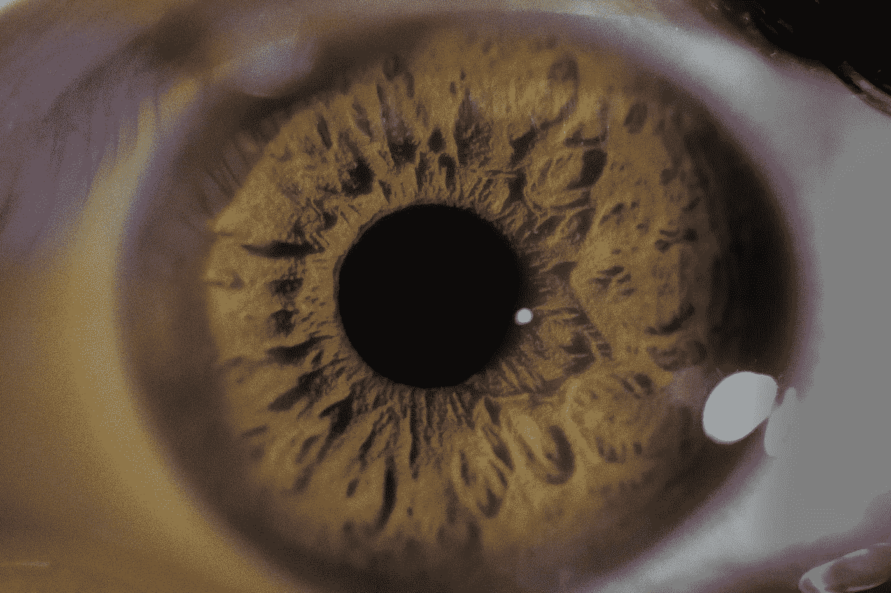

# 环境中的微小线索会推动人类行为的巨大变化

> 原文：<https://medium.com/hackernoon/minor-cues-in-context-drive-big-changes-in-human-behaviour-d15f3ec0122d>

source: [https://pixabay.com/en/eyeball-macro-eye-human-face-blue-2473099/](https://pixabay.com/en/eyeball-macro-eye-human-face-blue-2473099/)

研究表明，光是迹象就能改变人类的行为。想想交通标志。但是标志和有教育意义的信息有多大作用呢？有没有其他干预或推动措施可以带来更有效的行为改变？行为科学研究表明，环境中相对较小的变化会对人类行为产生重大影响。

## 改变驾驶员行为的干预研究

东安格利亚大学的研究人员设计了一项干预研究，鼓励司机自愿关闭怠速发动机。

**干预 1:一双“注视的眼睛”提示**

早期的研究表明，展示一双眼睛可以提高人类的道德行为和合作行为。这是因为当人类的声誉受到威胁时，他们往往会更加合作，表现得更有道德。仅仅表现出一双关注的眼睛就暗示了他们的名誉岌岌可危。然而，在这项特别的研究中，更多的司机在观察眼睛的情况下保持发动机运转。

在第二个实验中，注视眼睛的提示伴随着两种不同版本的指导性信息:1。一个通用的指导性信息“当障碍物倒下时，关掉你的引擎。”第二。旨在吸引利己主义者的信息“想想你自己:当障碍消失时，关掉你的引擎。”在普通版本中，司机关掉引擎的可能性是 1.83 倍，而在自我关注的情况下，司机关掉引擎的可能性是 4.82 倍

## 脑力游戏插曲:“拿钱”

当“观察眼睛”的提示被引入实验时，看看行为的剧烈变化。

Brain Games Episode “Take the Money”

以上两个实验显示了环境的微小变化如何能给人类的行为方式带来显著的变化。

***如果你喜欢这篇文章，请❤，以便其他人可以找到它。***

***参考文献***

 [## 有希望的行为干预有助于减少空转的汽车引擎

### 这是城市生活中令人讨厌但又不可避免的一面:空转的汽车和卡车造成的噪音和污染…

www.psychologicalscience.org](http://www.psychologicalscience.org/news/motr/promising-behavioral-intervention-helps-cut-idling-car-engines.html)  [## 自行车窃贼，我们正看着你:一个简单的标志干预对自行车盗窃的影响

### 背景自行车盗窃在许多国家都是一个严重的问题，而且缺乏有效的证据来证明这一点。

journals.plos.org](http://journals.plos.org/plosone/article?id=10.1371/journal.pone.0051738)