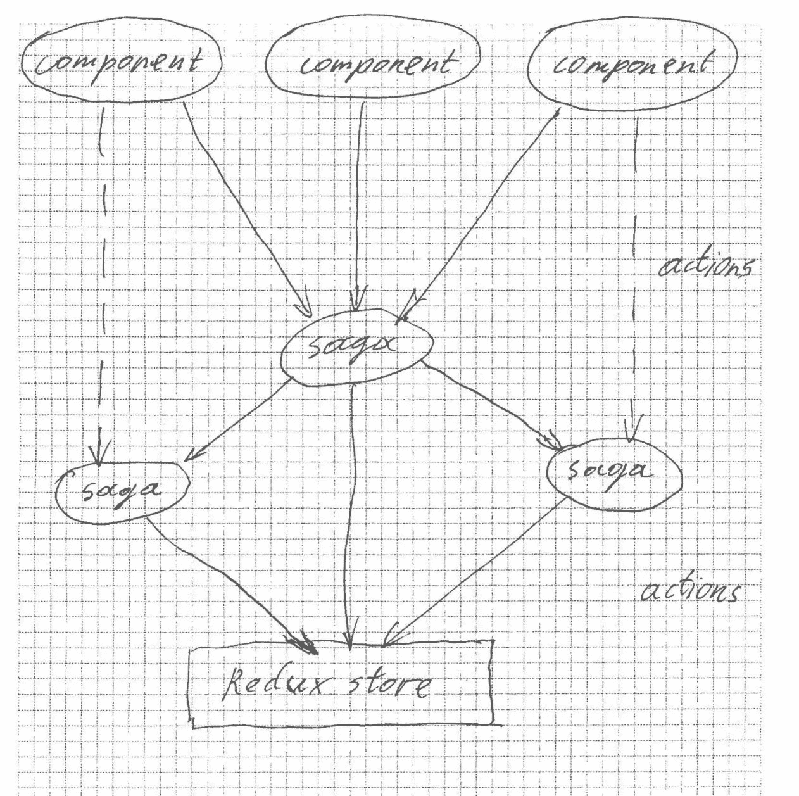

# Redux Saga 体验中缺失的部分

> 原文：<https://medium.com/hackernoon/missing-part-of-redux-saga-experience-1d2d169ba765>


Redux saga 是应用程序和 redux store 之间的中间件，由 redux actions 处理。这意味着，它可以监听动作，截取它感兴趣的动作，并用其他动作替换它们。这可能对很多事情都有用。特别是，使用 sagas，你可以保持你的组件尽可能简单，并将所有的逻辑转移到 sagas 中。

当您开始使用 Redux saga 时，编写描述单个组件或单个页面行为的 saga 似乎是非常自然的。它在有两三个页面的简单应用程序中运行良好，所有内容都是同步加载的。但是当一个项目成长的时候，这可能会让你陷入 sagas 部门的一片混乱，sagas 没有明确的目的，在很多方面互相重复。这将很难管理、调试和做出哪怕是很小的改变。

问题是萨加斯的工作应该协调一致。经过一段时间与这种混乱的局面作斗争，并最终阅读了文档之后，我们 DashBouquet 想出了一种新的方法，这种方法一直存在。描述一个传奇故事的完整流程。这就是文档所暗示的，你应该仔细阅读。让我们看看，它看起来像什么。



它看起来像一朵花，不是吗？当然，在传奇中描述完整的流程并不意味着应该只有一个传奇。关键是所有事情都在一个地方处理。

现在，让我们看一个实际的例子。比方说，在我们的应用程序中，用户可以填写工作申请，并将其发送到服务器进行进一步处理。我们想创造一个传奇来描述这个过程的全部流程。

当用户点击“申请工作”按钮并被重定向到申请表时，一切都开始于 **/create_application_page** 路径。

```
**import** {take, call, put, select, fork, cancel, race} **from** 'redux-saga/effects';
**import** {*LOCATION_CHANGE*, *push*} **from** 'react-router-redux';
**import** {takeEvery} **from** "redux-saga";
**import** * **as** api **from** './api';**function*** createApplication(data) {
 **yield** put(*push*(`/application_form`)); **const** { saveApplication } = yield race({
 saveApplication: take(SAVE_APPLICATION),
 cancelApplication: take(CANCEL_APPLICATION),
 }); **if** (saveApplication) {
    **const** { data } = saveApplication;
    **yield** api.saveApplication(data);
    **yield** put(*push*(`/application_saved`));
} else {
    yield put(*push*(`/application_cancaled`));
 }
}
**function*** watchCreateApplication() {
**const** createApplicationTask = takeEvery(CREATE_APPLICATION, createApplication); **while (true)** {
**const** {payload: {pathname}} = yield take(*LOCATION_CHANGE*);
**if** (pathname.search(/^\/create_application_page\/?$/) !== -1) {
   **yield** cancel(createApplicationTask);
   **break;**
 }
  }
}
```

这里的 **CREATE_APPLICATION** 是用户点击“申请工作”时调度的动作。然后，他被重定向到另一个带有表单的页面。在用户填写完表单并单击 Submit 或 Cancel 后，他会根据所分派的操作被进一步重定向。只有当用户单击提交时，数据才会发送到服务器。

此外，用户可能会在填写表单的过程中改变主意，而只是通过另一个链接，而不是单击“取消”。在这种情况下，如果他稍后回到异步注入 saga 的 **/create_application_page** ，saga 将被再注入一次，服务器上的数据将被创建两次，而用户打算只做一次。我们当然不希望这样，所以我们需要取消 redux-router 分派的 LOCATION_CHANGE 任务，因此检查 **watchCreateApplication** 中的路径名。

为了让事情变得复杂一点，我们假设，在填写表单的过程中，用户可以调用另一个表单的对话框，在这个对话框中，他可以选择他申请的国家和城市，并将这些数据提交给服务器。我们可以通过简单地派生另一个与 **createApplication** 传奇非常相似的传奇来做到这一点:

```
**function*** chooseLocation() {
**yield** put(showDialog());
 **const** { saveLocation } = yield race({
  saveLocation: take(SAVE_LOCATION),
  cancelLocation: take(CANCEL_LOCATION),
  });
 **if** (saveLocation) {
     **const** { data } = saveLocation;
     **yield** api.saveLocation(data);
 }
 **yield** put(closeDialog());
}
```

```
**function*** createApplication() {
 **yield** put(*push*(`/application_form`));
  **const** createLocationTask = takeEvery(CREATE_LOCATION, createLocation) ... **yield** cancel(createLocationTask);}
```

这里我们处理与 **showDialog** 和 **closeDialog** 传奇的对话。换句话说，如果此时必须显示或隐藏对话框，他们应该在存储中设置一些值来告诉页面。更详细地说，这是另一篇文章的主题。

重要的是不要忘记取消分叉的任务。如果在某个时候，您发现大量的请求被发送到服务器，而本应该只有一两个，那么您可能在某个地方忽略了这一点。

这是一个非常简单的例子。一个流可能要复杂得多，有任意数量的子流(尽管从 UX 的角度来看，这可能不是一个好主意)。但无论如何，这种方法给你的是，你可以一步一步地建立你的流量。你可以很容易地在以后做出改变，而且它们不会导致其他传奇的意外行为。如果你需要，你可以把它变得更复杂，但是不管你的心流有多少分叉，你都不会迷失其中。

[](https://hackernoon.com/using-normalizr-to-organize-data-in-stores-practical-guide-82fa061b60fb) [## 使用 Normalizr 组织商店中的数据——实用指南

### 在对 Normalizr 的工作结果应用一些简单的操作之后，我们得到了可以存储的数据

hackernoon.com](https://hackernoon.com/using-normalizr-to-organize-data-in-stores-practical-guide-82fa061b60fb) [](https://hackernoon.com/usage-of-reselect-in-a-react-redux-application-fcdca05cc00d) [## 在 React-Redux 应用程序中使用重选

### 为什么重选这么好

hackernoon.com](https://hackernoon.com/usage-of-reselect-in-a-react-redux-application-fcdca05cc00d) [](https://hackernoon.com/using-normalizr-to-organize-data-in-store-part-2-d9646133b7df) [## 使用 Normalizr 组织存储中的数据。第二部分

### 文章的第二部分讲述了如何使用 Normalizr 来组织商店中的数据。

hackernoon.com](https://hackernoon.com/using-normalizr-to-organize-data-in-store-part-2-d9646133b7df) [](https://hackernoon.com/how-to-stop-using-callbacks-and-start-living-1e5ed92e68e8) [## 如何停止使用回调，开始生活

### Javascript 有两种处理异步任务的主要方式——回调和承诺。一般来说，承诺是…

hackernoon.com](https://hackernoon.com/how-to-stop-using-callbacks-and-start-living-1e5ed92e68e8) 

作者:[伊利亚·博哈斯洛克](https://github.com/iPhaeton)

[](http://bit.ly/HackernoonFB)[](https://goo.gl/k7XYbx)[](https://goo.gl/4ofytp)

> [黑客中午](http://bit.ly/Hackernoon)是黑客如何开始他们的下午。我们是 [@AMI](http://bit.ly/atAMIatAMI) 家庭的一员。我们现在[接受投稿](http://bit.ly/hackernoonsubmission)并乐意[讨论广告&赞助](mailto:partners@amipublications.com)机会。
> 
> 如果你喜欢这个故事，我们推荐你阅读我们的[最新科技故事](http://bit.ly/hackernoonlatestt)和[趋势科技故事](https://hackernoon.com/trending)。直到下一次，不要把世界的现实想当然！

