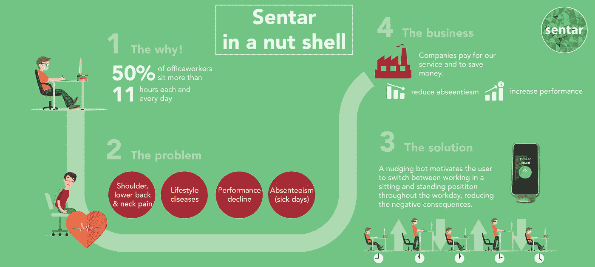
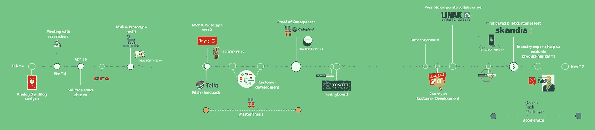
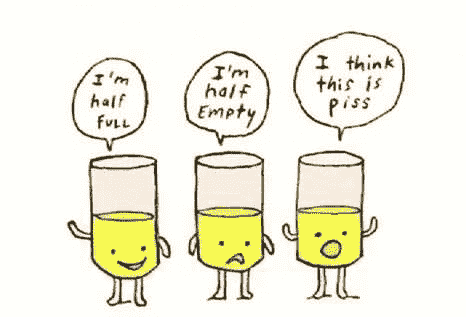
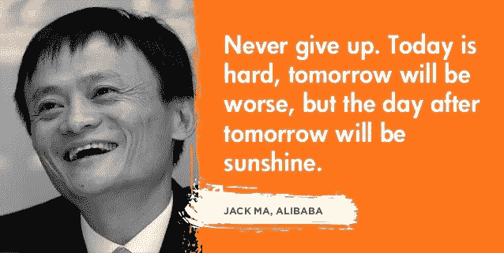
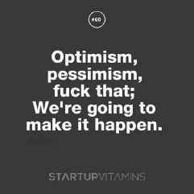
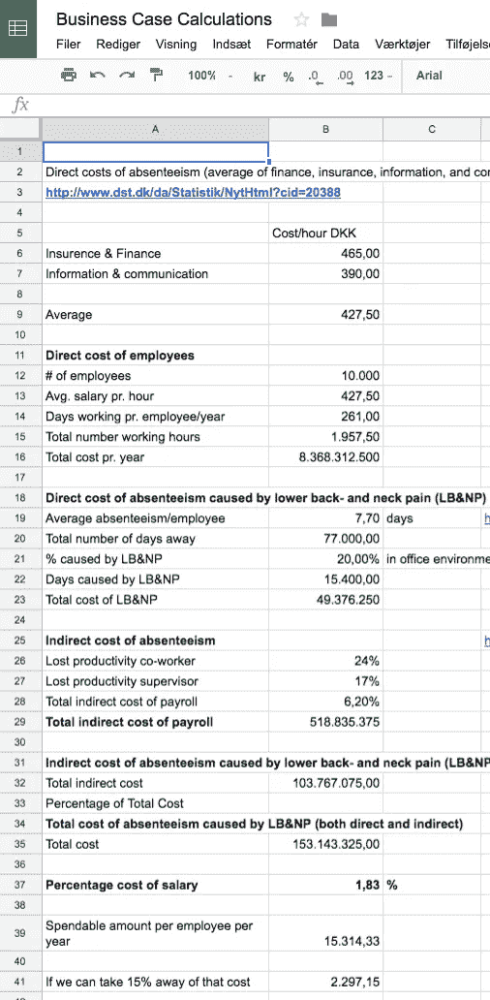

# 3 错 1；过于努力地去验证我们产品的需求

> 原文：<https://medium.com/hackernoon/mistake-1-out-of-3-trying-too-hard-to-validate-the-need-for-our-product-909fd57b0e33>

## *与* [*克里斯蒂安·布雷因霍尔特*](/@cbreinholt) *和* [*马兹·罗默·斯文森合作撰写。*](/@svendsen2032)

我们刚刚打烊。我们最初是一个 3 人多元化的创始团队，有一个重大的社会问题要解决，现在 18 个月后，我们决定关闭我们早期的 [*创业公司*](https://hackernoon.com/tagged/startup) *。为什么？因为我们犯了一堆错误。这篇文章将带你了解其中一个。*

有一点我们可以肯定，如果你仔细想想，作为创始人的你会非常清楚； ***努力验证你的产品的需求。你现在正在创业吗？***

# 我们的生意是什么？

重要的事情先来。我们试图让办公室工作人员少坐一会儿，以改善员工健康，避免丧失工作能力。我们的解决方案应该是经济高效的 B2B 替代方案，聘请职业治疗师提供个别指导。我们想用技术的方式来做，可扩展的方式。

所以我们的解决方案是制造一个小型硬件机器人，它可以让办公室工作人员更频繁地使用他们的升降桌在坐着和站着之间转换(在斯堪的纳维亚，9/10 的桌子是升降桌)，从而消除整天坐着的大部分负面后果(也称为久坐行为)。

**是不是有点混乱？也许这能帮助解释它。**

这是我们的主要活动时间表，提供了正确的背景。

但是为什么我们最终会犯这个错误呢？

# 原因 1:“让它发生”和“确认你产品的需求”的两难境地

当你试图确认对某样东西的需求时，你会做一个实验。你试图向一群有共同问题/需求的客户推销一个解决方案，实验的结果应该是验证、驳回或改变你的假设。你必须为所有的结果做好准备，而我们作为一个团队却没有。我们希望它能以某种方式解决。

在内部，这导致了一场关于你是悲观主义者还是乐观主义者的讨论。在我们的例子中，我们的业务人员是典型悲观主义者的化身，产品人员是典型乐观主义者。

讨论的一方是我们的业务人员，他不断从客户访谈和市场调查中获得负面反馈。另一方由产品人员代表，他们认为这只是一个让它发生的问题，问题很明显，因此，有人会为我们的解决方案买单。

**“让它发生”(产品团队)** 的论点——前 10 个创业公司的创始人认为一切都与他们作对，继续前进，现在他们是亿万富翁(以阿里巴巴创始人马云为例)
——也许我们销售我们的价值主张是错误的
——我们只需要做出用户喜欢的产品，然后我们就能以某种方式销售它
——行为改变(让办公室工作人员坐得更少)超级困难——如果我们能用我们的产品解决这个问题，就会有人为此买单

**“验证我们解决方案的需求”的论据(Business guy)**
- 9/10 的创业公司失败了，其中 43%的人说他们失败是因为“没有市场需求”——因此，我们的首要任务是确保我们有市场需求
-如果我们卖不出去，为什么还要造东西，甚至是原型？
-我们的商业案例对我们的客户来说不清楚，我们先建立商业案例，然后再培训我们的客户是不可行的

Elon Musk on optimism vs. pessimism

参与讨论的双方都能理解对方的观点，这使得很难得出任何结论。我们最终花在产品开发上的时间比花在业务开发上的时间多得多，所以从这个意义上说，产品开发团队“赢得”了讨论。

W *回顾过去，我们可以得出这样的结论:每一个早期创业公司都应该把所有的精力放在他们的解决方案是否有商业需求上。我们真诚地认为，花费在原型上的数千小时是浪费时间，现在我们得出结论，没有足够多的客户认为我们的解决方案值得花钱。*

*我们还得出结论，如果你在验证你的解决方案的必要性时必须在悲观主义者和乐观主义者之间做出选择，你应该选择悲观主义者——下一个原因将解释为什么。*

# 原因 2:妈妈测试

在不深入研究社会学和人类互动的复杂性的情况下，我们犯这个错误的第二个原因在 Sentar 中是“过于努力地验证你的产品的需求”,这在人类互动时发生的事情中是合理的。

基本上，当人们互动时，他们想“保全面子”。意思是维护自己和他人的尊严。我们不想让彼此尴尬，告诉别人他们展示的产品没有意义。在创业世界中，这种机制有时被称为 MOM 测试。还记得你 4 岁时带回家的那幅超级丑的画吗，你妈妈称之为艺术杰作？

你妈妈会对你撒谎说你有多好，顾客会对你撒谎说他们对你的产品有什么看法。是啊，运气不好。我们知道。

以我们与 PFA Pension(大型丹麦养老金保险公司)的第一次会面为例。事情是这样的:
——我们用统计数字说明下背痛和久坐不动是一个大问题，并提出了这个问题
——我们问他们是否也认为这是一个大问题:“是的，是的， 非常大的问题"
-我们提出了解决这个问题的方案和我们的价格模型(这是在我们开发任何东西之前)
-他们喜欢这个解决方案，并表示如果产品能达到预期效果，他们可能会向他们的保险客户推广这个解决方案
-他们同意作为一家免费的测试公司进行合作，这样他们就可以直接看到他们是否会向客户推荐这个产品

我们认为这是积极的。也许你也一样？我们变得更聪明了。PFA 承诺并认可的一切都是 100%的“免费”。一个月后，他们借口 IT 部门的问题跳槽了。

让我们来看看这到底意味着什么:
——我们在会议上面对面地向他们展示了核心事实。自然，他们会同意，从统计学角度来看，我们的问题是一个问题
-我们向他们展示了一个我们显然花了一些时间开发的想法，为了表现出同情并让我们开心，他们避免批评
-他们表示，如果我们可以开发出一个能做很多事情的解决方案，他们不会为此付费，而只会向他们的客户推荐
-他们同意与我们一起测试，只需要花费他们“几个小时”

所以这里真正发生的是，我们分析这次会议的结果是非常积极的。但实际上，他们还没有确认他们在这里有业务问题。我们已经确认的是，一家养老金公司愿意向他们的客户提供像我们这样的产品— **但不需要支付任何费用。**因此，该产品没有解决值得购买的 PFA 业务需求。

回顾过去，我们得出结论，在最初的会面中，我们应该更加努力地推动我们的客户。我们应该从第一天就谈钱，让他们付钱。这样，我们会让 PFA 说:“伙计们，这是一个很好的解决方案，但我们真的不能支付它，因为你们正在解决的问题不是我们现在可以花钱解决的。对我们的核心业务来说，它根本没有那么有价值”。

但是我们没有。我们并不是第一个在这方面失败的国家。

这也是 Rob Fitzpatrick 写了《妈妈测试》这本书的原因之一，他在书中回答了这个问题: ***如何与客户交谈&当所有人都在对你撒谎时，了解你的业务是否是个好主意。***

# 原因 3:商业问题与社会问题

如今，许多初创公司都想解决一个有意义的大问题。在 Sentar，我们觉得“背痛”是一个巨大的社会问题，用接下来的五年时间去解决它是有意义的

In the world of startups, societal issues such as pollution are two folded. How do we minimise pollution for the greater good of society and make someone pay for it?

与久坐行为(坐下)相关的背痛是一个巨大而重要的问题——对社会而言。看看这些数字:
-80–85%的世界人口在一生中经历过下背部&颈部疼痛(LBNP
)-LBNP 是全球缺勤(病假)的第二大原因
-久坐行为显著增加了糖尿病和心血管疾病的风险

[Hoy 等人(2010)](https://www.ncbi.nlm.nih.gov/pubmed/20227638) 估计 LBNP 每年花费澳大利亚社会 91 亿美元！那是一个有 2500 万人口的国家。研究人员宣称，“久坐是新的吸烟方式”。

**但这有点像污染问题。当然，这是一个重大的社会问题，如果我们不采取行动将其最小化，作为一个社会，我们将遭受全球变暖的后果。但是实际上并没有任何减少污染的生意，不是吗？就像减轻办公室职员的背痛和同时赚钱之间可能没有直接联系一样。**

当然，绿色生意可以是好生意。但是，环境企业家通常会找到一种创造性的方法，通过做他们真正想做的事情——拯救地球——来赚钱。政府有时会资助企业，让绿色企业成为大企业。

久坐行为每年在治疗和手术上花费卫生保健系统数十亿美元。但是现在社会不会奖励企业让他们的员工少坐。**在我们的案例中，我们发现我们的客户很难弄清楚久坐行为在成本中代表了什么。**

原因如下:
-他们没有跟踪*员工生病(缺勤)的确切原因*
-他们没有足够准确地跟踪绩效，以衡量减少久坐行为的影响
-病假总天数受到多种因素的影响，如公司有多忙、全国性流行病、管理层的绩效等。
-他们将治疗外包给第三方(理疗师和按摩师),为他们提供 1-10 次一次性费用的治疗

Our LBNP calculator in the beginning.

当然，我们花了几个小时为他们构建了一个复杂的业务案例计算器，他们可以在其中输入:“员工总数”、“平均工资”、“当前年度旷工程度”等。由此可以计算出每年节省的费用，这些费用是根据统计报告计算出来的，这些报告是根据下背部和颈部疼痛引起的总病假天数的百分比计算出来的。

我们的客户对这个计算器比对我们真正的解决方案更感兴趣—嗯:)

但我们发现这些统计数据和现实之间存在差距。至少我们的客户没有一个能给我们一个确切的估计，我们试图解决的问题花了他们多少钱。

回顾过去，我们应该将此视为一个巨大的警告信号。如果我们的客户甚至不能估计“我们的”问题有多贵，那对他们来说可能不是什么大问题。当然，我们可以帮助他们建立一个具体的业务案例，但是如果他们在这方面几乎没有投入，那么这个问题就不是“首要问题”。如果是这样的话，他们会试图自己估算一些东西，并开始将他们稀缺的预算的一部分花在竞争性的解决方案上。

# 你想知道我们犯的另外两个主要错误吗？

然后顺着这个链接进入[《3 错之 2:陷入沉没成本的魔咒》](/@lasse.k/mistake-2-out-of-3-falling-into-the-curse-of-sunk-cost-daa1bbac56eb)。几乎所有的科技创业公司都应该阅读这篇文章。

值得鼓掌还是 10 分钟？我们将评估媒体上收到的每一个掌声，作为一个信号，表明你，我们的观众，想听到更多关于我们的故事和我们犯下的错误。

# 关于作者

这篇博文是 Sentar 三位创始人共同努力的结果。这三篇文章的目的是让未来的、现在的和以前的创始人从我们所犯的错误中吸取教训。

如果你想了解更多关于我们的学习，以及我们下一步要做的事情，请给我们写信 [info@sentar.io](mailto:info@sentar.io) 。

**Sentar 团队**

**麦兹·罗默·斯文森** [领英简介](https://www.linkedin.com/in/mads-rømer-svendsen-4b49a342)

2017 年春天毕业于丹麦的丹麦技术大学——之前是一家鸡尾酒企业的合伙人，并为一家工程机构成功推出了 kickstarter。

小麦现在正在寻找新的机会。

**Lasse Korsholm Poulsen** [LinkedIn 简介](https://www.linkedin.com/in/lassekorsholmpoulsen)

2016 年夏季毕业于哥本哈根商学院——此前曾在 IBM 和一家小型设计机构担任商业顾问。

将从 2018 年 1 月开始在 Implement Consulting Group 开始职业生涯。

**克里斯蒂安·布雷因霍尔特** [领英简介](https://www.linkedin.com/in/cbreinholt)

2017 年春毕业于丹麦丹麦技术大学——求学期间曾为辐射计工作。

克里斯蒂安现在正在寻找新的机会。