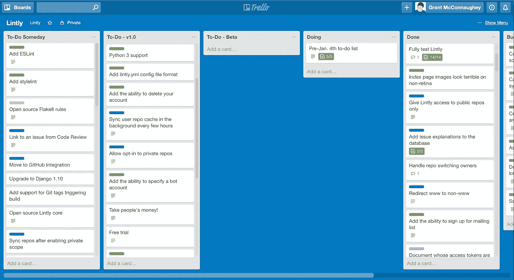

# 我在编写 Django 应用时犯的错误(以及我是如何改正的)

> 原文：<https://medium.com/hackernoon/mistakes-i-made-writing-a-django-app-and-how-i-fixed-them-16de4e632042>

我[最近宣布](http://blog.lintly.com/2017/01/04/introducing-lintly/)发布一个我已经工作了几个月的项目。这个项目叫做[简称](https://lintly.com)。它是一个持续的 [Python](https://hackernoon.com/tagged/python) 代码质量检查工具，当你推送到 [GitHub](https://hackernoon.com/tagged/github) 时，它会检查你的代码。我不会在这里详细介绍什么是 Lintly 你可以在另一篇博客文章中读到或者去[lintly.com](https://lintly.com)看看。相反，我想谈谈我创建第一个合适的副业项目的经历，我写这个项目时犯的一些错误，以及我是如何改正这些错误的。

**技术提示:** Lintly 是运行在 Python 2.7 上的 Django 1.9 应用程序。

## 错误

*   错误 1:让函数做太多事情
*   错误 2:使用神奇的字符串
*   错误 3:到处都放第三方 API 调用
*   错误#4:功能蠕变
*   错误 5:将我的应用与其他应用进行比较

# 错误 1:让函数做太多事情

天哪，代码怎么会很快变成一大碗意大利面。别误会，我喜欢一碗好的意大利面。但是说到代码，我不是一个爱好者。

这个错误主要是由于懒惰造成的。我写了太大的函数，做了太多的事情，并且知道他们不知道的事情。事实证明，当你在没有太多计划的情况下钻研编码时，这个陷阱非常容易进入。我给你举个例子。

下面的两个方法是`Build`类的一部分。当 Lintly 从 GitHub 下载代码、Lintly、存储结果并发出通知时，就会发生构建。下面是一个`Build`最初是如何终止回购的:

这是粗暴的，明显违反了[单一责任原则](https://en.wikipedia.org/wiki/Single_responsibility_principle)，该原则规定如下:

> 一个类应该只有一个改变的理由。

在这个例子中，一个`Build`做了过多的事情。它知道`flake8` CLI，也解析 flake8 的结果。它应该把所有这些(林挺+解析)交给另一个类。

## 我是如何纠正错误的

我决定创建一个新的`Linter`类来存放所有 linters 共享的逻辑。构建可以实例化一个 linter 并使用它，而不是自己做林挺。

这是我的第二次尝试:

好多了！构建不再在命令行上运行 CLI 工具，也不再分析自己的结果。这也更具可扩展性，因为`flake8`工具不再被硬编码到构建中。将来添加棉绒会容易得多。

# 错误 2:使用神奇的字符串

目前，Lintly 只与 GitHub 合作。在未来的版本中，我计划让 Lintly 与 GitLab 和 BitBucket 等其他服务一起工作。这就是为什么网址是以`/gh/dashboard/`或`/gh/new/`的形式出现的。`gh`部分代表 GitHub。当你在 Lintly 中访问一个页面时，你是在一个外部 Git 服务的上下文中访问的。这样，后端代码就知道使用哪些 API 令牌，向您显示哪些 repos，以及向您显示哪些组织。

URL 看起来是这样的:

```
url(r'^(?P<service>gh|dummy)/',
 include('lintly.apps.projects.urls', namespace='projects')),
```

下面是它如何映射到视图函数:

看起来没问题。该 URL 确保服务变量永远只能是`gh`或`dummy`(稍后将在`dummy`中详细介绍)。将来，我可以添加`gl`和`bb`，以便 URL 和视图分别与 GitLab 和 BitBucket 一起工作。

问题出在我的模板上。我的模板会到处硬编码`gh`变量。例如，下面是一个按钮的外观:

## 我是如何纠正错误的

为了解决这个问题，我在所有模板中引入了一个新的`service`变量。这个变量可以传递给 URL，这样所有的 URL 都相对于当前页面的服务。我通过上下文处理器做到了这一点:

现在，当我需要一个 URL 时，我只需将`service`传递给`url`模板标签:

# 错误 3:到处都放第三方 API 调用

Lintly 使用了几个第三方 API，其中最重要的是 GitHub API。

我开始将 API 调用直接放在我的视图、模型和模板标签中。例如，下面是`User.get_projects()`方法最初的样子:

注意，这直接创建了一个`Github`客户端对象(这个`Github`客户端来自伟大的 [PyGithub](https://github.com/PyGithub/PyGithub) 库)。不幸的是，`get_projects`方法是从项目侧边栏(登录到 Lintly 时每个页面左侧的侧边栏)调用的。这意味着我不得不在每个视图测试中模仿`get_projects`方法……真是噩梦！

## 我是如何纠正错误的

我做了这个修改，同时也修改了错误 2。没错，好的 ol' `service`变量。

首先，我将所有与 GitHub 的交互都重构到它们自己的类中:`GitHubBackend`类。这是一个围绕 PyGithub 库的简单包装器。我还创建了一个名为`DummyGitBackend`的[存根对象](http://www.martinfowler.com/articles/mocksArentStubs.html)，它将模拟与外部 Git 服务(如 GitHub)的交互。

现在，当我需要调用外部服务时，我会根据`service`得到一个`GitBackend`实例。在生产中，`service`总是`'gh'`，这意味着我们总是使用`GitHubBackend`类进行 API 调用。在单元测试中，`service`总是`'dummy'`，并且使用`DummyGitBackend`存根类。这确保了我的测试不会调用 GitHub。

下面是`User.get_projects()`的新实现:

# 错误#4:功能蠕变

我喜欢使用 Trello 进行简单的项目管理。这就是为什么我用它来代替 Lintly。

对于 Lintly，我有一个包含 4 列的 Trello 板:

1.待办事项 v1.0
2。待办事项
3。做
4。完成的

我的工作流程很简单:从 **Beta** 通道中抽取卡片，并将它们移动到 **Doing** 通道中。当我完成这个特性时，我会提交代码并将卡片从**正在做**移动到**完成**。当**测试版**中的所有项目都完成后，那么**测试版**就可以发布了。



My trusty Trello board

这听起来很简单，对吗？问题是将项目从 **v1.0** 移动到 **Beta** 有多容易。我有时会在 **v1.0** 通道中看到一个特性，并说服自己我也可以很容易地把它放到 **Beta** 中。这看起来没什么大不了的，但是一遍又一遍地这么做肯定会让我错过发布 Lintly 测试版的最后期限。

## 我如何改正我的错误

我创建了第二个 Trello 板，名为“Lintly v1.0”，并将**To-Do v 1.0**通道移到那个板上。仅仅是每天让车道变得更难看的简单行为就意味着我不太可能把它的卡片移到测试版。

当你在做测试的时候，保持专注。找出哪些功能是绝对必须的，在测试版发布之前忽略所有其他功能。

# 错误 5:将我的应用与其他应用进行比较

除非你正在创建一个完全基于原创想法的应用程序，否则你可能会发现自己犯了同样的错误。错误在于将你的应用程序(甚至可能是你自己)与其他人进行比较。

六月，当我开车送我和妻子度蜜月回家的时候，我想到了 Lintly 这个主意。我违反了国际反劫持汽车法，叫醒了我的妻子，让她在我的手机上打一个便条。纸条上只有四个字:Flake8 即服务。

当时，这似乎完全是原创的。我无法相信没有其他人想到这一点！我们有像 [CodeCov](https://codecov.io) 这样的网站持续检查你的代码的测试覆盖率，那么为什么林挺没有同样的网站呢？我必须尽快完成。

在接下来的一两个月里，当我开始在 Lintly 上工作时，我意识到我并没有想象中那么有创意。还有其他网站，比如链接 Python 的 Landscape，或者评论 GitHub PRs 的 HoundCI。这种认识当然令人失望。那些应用程序很棒，我担心我永远也做不出和它们一样好的东西。由于沮丧，我暂时停止了 Lintly 的工作。

## 我是如何纠正错误的

终于，有一个想法出现了，这个想法帮助我度过了难关，最终释放了 Lintly。这是对两件事的认识:

1.竞争是好事
2。[每个人都需要一个副业](https://simpleprogrammer.com/2016/11/23/side-projects/)

几乎可以肯定的是，对于你正在开发的应用程序，竞争总是存在的，这是完全没有问题的。你所能做的就是尽你所能把应用程序做得最好，并享受使用它的乐趣。如果没有别的，它在简历上会一直很好看！

# 结论

Lintly 并不完美，也永远不会完美。如你所见，我犯了很多错误。但是我也学到了很多关于从开始到(某种程度上)结束创建项目以及发布项目的知识。制作它很有趣，而且随着我添加新的特性，如 Python 3 支持和对其他 linters 的支持，它将继续有趣下去。

*如果你想尝试 Lintly，请前往*[*lintly.com*](https://lintly.com)*注册测试版。开源回购完全免费，而且永远免费。*

*哦，还有我在* [*上推特*](https://twitter.com/gmcconnaughey) *！*😎

[](http://bit.ly/HackernoonFB)[](https://goo.gl/k7XYbx)[](https://goo.gl/4ofytp)

> [黑客中午](http://bit.ly/Hackernoon)是黑客如何开始他们的下午。我们是 [@AMI](http://bit.ly/atAMIatAMI) 家庭的一员。我们现在[接受投稿](http://bit.ly/hackernoonsubmission)，并乐意[讨论广告&赞助](mailto:partners@amipublications.com)机会。
> 
> 如果你喜欢这个故事，我们推荐你阅读我们的[最新科技故事](http://bit.ly/hackernoonlatestt)和[趋势科技故事](https://hackernoon.com/trending)。直到下一次，不要把世界的现实想当然！

