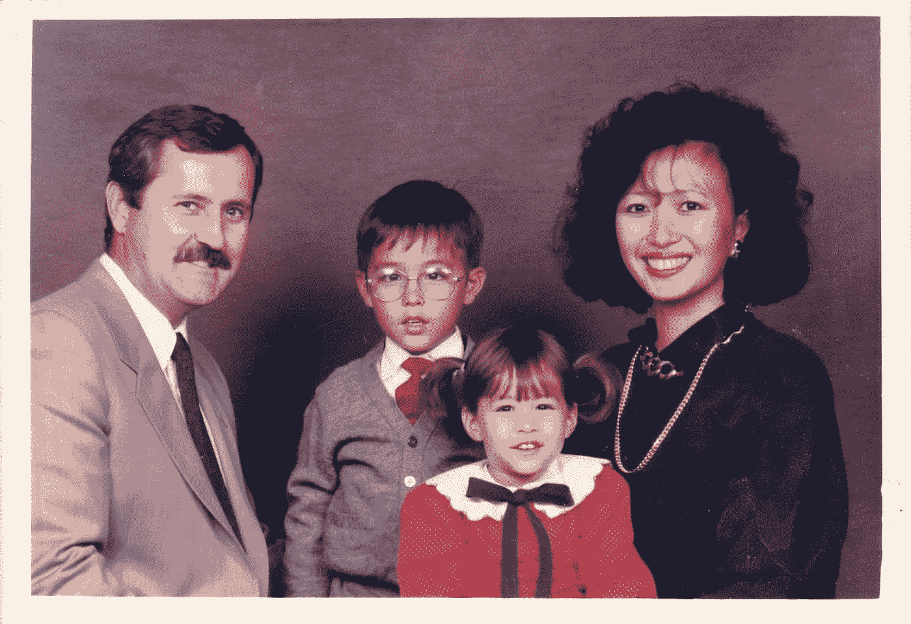

# 混血其他。多样化的经历以及为什么我对技术最熟悉。

> 原文：<https://medium.com/hackernoon/mixed-race-other-experiences-with-diversity-and-why-im-most-at-home-in-tech-f37729b095>

> “无论什么 Rylan，你不是白人，所以一切对你来说总是更困难”

有一天，我妈妈就这样警告我。

她是越南人，但在我们全家逃离西贡周围的凝固汽油弹后，她在曼彻斯特、卡莱尔和伦敦度过了许多青少年时光。她会告诉我她在 70 年代受到当地英国白人的虐待——对她来说是明显的种族歧视和攻击。值得庆幸的是，妈妈非常精明，避免了任何严重的事件。然而，这显然对她产生了持久的影响。

我父亲是英国白人，所以我是混血儿，虽然我的名和姓都很罕见，但都来自约克郡；不是你会联想到异国情调的地方。事实上你知道表格上的种族选项吗？我是那个必须在“其他混血”旁边的最后一个方框打勾的人，不知何故，这让我感觉到一种自豪的排他性和社会排斥的结合。

# 异常多元化城市中的异常事件

在我的一生中，我只能数出三次对我的公然种族诽谤，其中没有一次是暴力的，但仍然令人难忘。有两次发生在 90 年代末，当时我住在约克，直到去年我和我妹妹在金斯兰路(Kingsland)路过一个意大利人时大喊“他妈的中国佬”，除了醉酒和我们的肤色，没有其他明显的原因。

过了这么长时间，发生这样的事真令人震惊，我们俩的反应都一样——对愤怒一笑置之。这是在一个不正常的[多元化城市](https://hackernoon.com/tagged/diverse-city)发生的一件不正常的事情。讽刺的是，这话出自一个明显不是土生土长的伦敦人之口。

但是，这些是我一生中完全不寻常的时刻。在很大程度上，我没有像我母亲那样成为受害者。但我记不太清楚的是，对我更微妙的歧视发生在什么时候。我当然没有记录事情，我希望没有人觉得他们必须这样做。

就歧视风险而言，在我成为 LGBT 群体的一员后，形势对我不利。出柜后，我确实和我妈妈谈过我的性取向，然而，尽管这发生在大约八年前，她最初还是很沮丧，但我觉得在很多方面，这是因为对她儿子的潜在歧视越来越多，抑制了他的雄心。

# 有什么影响？

所以最大的问题是:我的种族和/或我的性取向对我的职业生涯有影响吗？

我的回答是:是的，但不是以你期望的方式。我认为，由于英国已经取得了相当大的进步，我已经能够茁壮成长——可能不会在我现在的位置。

在我 11 年的职业生涯中，迄今为止，我已经在五家规模和文化迥异的公司工作过。我不认为我曾在申请、面试和现场时故意遭受歧视:

*   B2B 活动销售的猛男锅炉房
*   高尚而商业化的音乐教育事业
*   艺术的灵感和精益世界
*   进取和等级银圈律师事务所
*   技术独角兽的创业乌托邦

就我手下的经理而言——男性和女性领导的比例相当。我甚至有两个公开的同性恋导演。在我担任的所有角色中，我觉得我在商业上对企业产生了影响，希望在文化上也是如此。事实上，当我决定出柜时，我在 ABRSM 的经理黛比·巴特勒完全支持我。

由于我的英文名字和男性性别，我确实认为我比我母亲有明显的优势。如果我用了她的娘家姓，变成了瑞兰·nguyễn，我的求职申请可能会有不同的结果，而且很容易被自动归入另一堆。

# 我的首席执行官说出了他的想法…

我不认为这是一个巧合，在我所有的工作中，我在 Hootsuite 呆的时间最长(将近 4 年)。在我们的首席执行官 Ryan Holmes 能够挑战德国数字营销大会 DMEXCO 的组织者的公司工作，我怎么能不感到自豪呢？在他们的主舞台上，有六个白人在为明年的活动考虑更多的性别多样性。

事实上，我第一次见到瑞安是在伦敦，当时我受邀参加一个 Hootsuite 企业客户晚宴，就在那一刻，我决定:我需要为这个人工作。

我们的谈话在某个时候转移到了工作场所的多样性上。我讲述了作为一名同性恋在律师事务所的感受。

我绝对相信 SJ Berwin 非常关注平等机会，事实上，他有一个非常积极的环境，有强大的多元化领导。尽管法律行业是古老的，但不得不提出这样一个企业形象确实意味着你必须时刻敏锐地意识到自己的形象和谈论的内容。

但是莱恩在餐桌上说:

> “在我的公司，每个人都有权做自己，没有人应该有任何理由隐瞒任何事情”

自从加入 Hootsuite 以来，确认 Ryan 的信仰已经深深植根于公司文化中，这是一件很棒的事情。Hootsuite 是从零开始建立的，多样性不是问题。

所以事实上，如果我不是现在的我，我想我不会有今天。因为我妈妈说的话，我更加努力了，我就不会和 Ryan 有那次谈话了。

总的来说，我在英国的工资高于平均水平，有一份每天醒来都知道会有不同挑战的工作，不用担心受到种族或性别歧视。绩效和文化一致性才是最重要的，也是最应该的。

# 私营部门的影响

随着我越来越多地参与到我们在新兴市场的工作中，我确实在想，在那些对同性恋、双性恋和变性者不那么友好的国家，我该如何公平对待他们。事实上我可能会被处死。

我不是活动家，也永远不会成为彼得·塔切尔或哈维·米尔克，但我会永远崇拜那些让像我这样的人获得成功的英雄。正是这些勇敢的彩虹旗帜摇摆者进入像俄国这样的国家，试图有所作为，[有时会带来可怕的后果](http://www.telegraph.co.uk/news/worldnews/1552832/Tatchell-beaten-up-in-Moscow-protest.html)——但我认为私营部门也可以帮助改变新兴市场的观点，那里的多样性和包容性可能会受到影响。

毕马威会计师事务所(KPMG)有一篇关于全球化的私营企业对文化的影响的精彩报告。当我希望与新地区的人合作时，我通常只与符合 Hootsuite 文化信仰的合作伙伴合作，以帮助渗透多元化和自由工作文化的好处和商业价值。

我认为这是我能够在日常工作中推动变革的一个小方法。

# 一项政策改变，倒退两步

让我担心的是，看看世界范围内总体上的右倾化(除了有着神奇的贾斯廷·特鲁多的加拿大)以及反对全球化的反应，我们可能会很快倒退。看看 Amber Rudd 最近让公司报告其劳动力国籍或特朗普崛起的计划就知道了。

伦敦爱乐合唱团的一名成员，他是 80 年代 LGBT 权利运动的一部分，提醒我他们为之奋斗的一切都可以被一项政策改变带走。《里斯本条约》第 50 条可能只是说，随着英国走向英国退出欧盟未知的领域和更加孤立的前景。

我母亲经历的可能性更小，我仍然不认为我们在英国是完美的，但我确实认为在过去几十年里，多元化、包容性和平等已经有了巨大的改善。

我只希望我妈妈的警告不会变成现实。今天，进步正在发生，每个人都应该有平等的机会——无论你的背景、种族、性别或性取向如何。我很幸运能够利用这一进步，并在这种变化中茁壮成长。

> [黑客中午](http://bit.ly/Hackernoon)是黑客如何开始他们的下午。我们是 [@AMI](http://bit.ly/atAMIatAMI) 家庭的一员。我们现在[接受投稿](http://bit.ly/hackernoonsubmission)，并乐意[讨论广告&赞助](mailto:partners@amipublications.com)机会。
> 
> 如果你喜欢这个故事，我们推荐你阅读我们的[最新科技故事](http://bit.ly/hackernoonlatestt)和[趋势科技故事](https://hackernoon.com/trending)。直到下一次，不要把世界的现实想当然！

