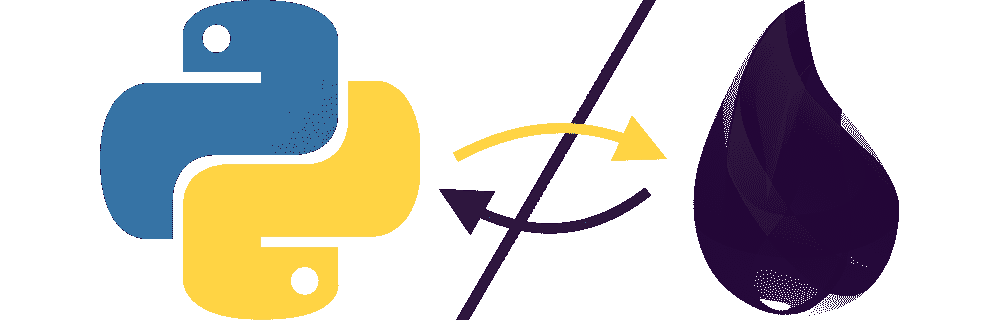
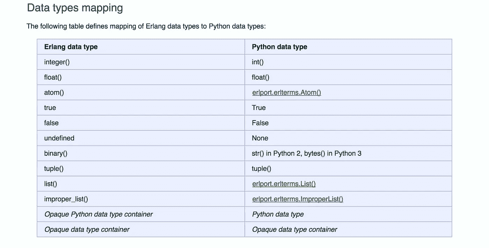
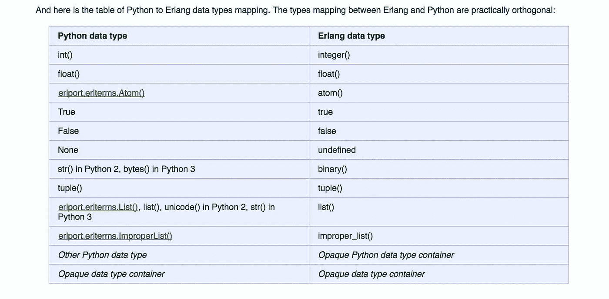

# 将 Python 与 Elixir II 混合

> 原文：<https://medium.com/hackernoon/mixing-python-with-elixir-ii-async-e8586f9b2d53>



## 异步通信

**重要的**:在继续之前，请阅读这篇文章的[第一部分](/@badu_bizzle/mixing-python-with-elixir-7a2b7ac6696)。

在第一部分[，](/@badu_bizzle/mixing-python-with-elixir-7a2b7ac6696)中，我们看了如何使用 Erlport 从 Elixir 调用 Python 函数！

ErlPort 是一个 Elixir 库，它使得使用 Erlang 端口协议将 Erlang 连接到许多其他编程语言变得更加容易。

然而，您可能已经注意到，调用过程必须等待 Python 完成处理并返回结果。这适用于即时且不需要太多时间的操作。否则，在运行密集型 Python 函数时就没什么意思了。因为你的长生不老药程序会挂起，等待 Python 代码完成。

对于需要一段时间才能完成的操作，我们需要一种方法来调用 Python 函数，并在函数完成时在我们的 elixir 代码中得到通知——类似于我们如何编写带有异步相互通信的进程的 elixir 程序。这很有用，尤其是当您想要一个 Elixir 进程来控制/监督几个 Python 操作时。我们可以同时运行 Python 函数，这让生活变得更美好。

在本帖中，我们将探索如何实现这一点 Python 和 Elixir 之间的异步通信！

我们可以像在 Elixir 进程之间通信一样思考这个挑战——通过使用`cast`——它允许我们在进程之间异步通信。

以前我们从 Python 调用函数时，大多使用 [erlport 的](https://github.com/hdima/erlport) `[:python.call/4](http://erlport.org/docs/python.html#python-call-4)`。这是同步的，elixir 程序必须等待 python 函数完成并发送响应。

在这篇文章中，我们将使用`[:python.cast/2](http://erlport.org/docs/python.html#python-cast-2)`

# **了解:python.cast/2**

`:python.cast/2`的工作原理与`[GenServer.cast/2](https://hexdocs.pm/elixir/GenServer.html#cast/2)`相同。您给它进程 id(或注册的进程名)和发送给该进程的消息。与`:python.call`不同，`:python.cast`用于发送消息，而不是调用 Python 函数。就像你的长生不老药传递信息一样。Erlport 为我们提供了一种机制来接收发送给 python 实例的消息。

## Erlport Python 模块

Erlport 提供了一个 [python 库](https://pypi.python.org/pypi/erlport)，它有助于使用 elixir 数据类型和过程。您可以使用 [pip](https://pypi.python.org/pypi/pip) 安装 erlport。

```
pip install erlport #don't run this yet!
```

然而，Erlport Elixir repo 已经附带了 Python 库，它会在运行时自动加载。因此，如果您通过 Elixir 使用 Erlport，就不必安装 Erlport Python 库。

下面是 Erlang/Elixir 和 Python 之间的数据映射



Erlang/Elixir data types mapped to Python data types ([http://erlport.org/docs/python.html](http://erlport.org/docs/python.html))



Python data types mapped to Erlang/Elixir data types ([http://erlport.org/docs/python.html](http://erlport.org/docs/python.html))

# **处理从 Elixir 发送到 Python 的消息**

对于 Elixir 流程，您有一个接收块，在其中处理所有消息。或者使用 GenServer 时的`handle_call`、`handle_cast`和`handle_info`功能。Erlport 为处理发送给 Python 进程的消息提供了类似的机制。`*set_message_handler*`是函数。它在`erlport.erlang`模块中。它采用一个带有一个参数消息的 Python 函数，即传入的消息。无论何时收到消息，Erlport 都会调用传递给`set_message_handler`的函数。这就像一个回调函数。

# 从 Python 向 Elixir 发送消息

由于 Elixir 进程不知道谁发送了一条 *cast* 消息，所以我们必须找到一种方法，一旦 python 函数完成，就知道将结果发送给哪个进程。一种方法是注册您希望结果发送到的 Elixir 流程的流程 id。

Erlport python 模块提供了`[cast](http://erlport.org/docs/python.html#erlport-erlang-cast)`函数，用于向 Elixir process 发送消息。这样，当函数完成时，我们可以将消息异步发送回 elixir 进程！

# 把所有的放在一起

打开终端并使用 mix 创建一个新的 Elixir 项目

```
$ mix new elixir_python
```

*添加依赖关系*

将`erlport`添加到您的依赖关系`mix.exs`

```
defp deps do
    [     
      **{:erlport, "~> 0.9"}**,
    ]
  end
```

然后安装项目依赖项。

```
$ cd elixir_python
$ mix deps.get
```

创建`priv/python`目录，你将在那里保存我们的 python 模块

```
$ mkdir -p priv/python
```

为 Erlport 相关函数创建一个 elixir 模块包装。

```
#lib/python.ex
**defmodule** ElixirPython.Python **do** @doc """
      Start python instance with custom modules dir priv/python 
     """
    **def** start() **do** 
        path = [
             :code.priv_dir(:elixir_python), 
             "python"
        ]|> Path.join()

        {:ok, pid} = :python.start([
           {:python_path, to_charlist(path)}
        ])
        pid **end** **def** call(pid, m, f, a \\ []) **do** 
       :python.call(pid, m, f, a)
    **end**

    **def** cast(pid, message) **do** 
       :python.cast(pid, message)
    **end**

    **def** stop(pid) **do** 
       :python.stop(pid)
    **end****end**
```

为了让 Elixir 流程异步接收消息，我们将创建一个简单的`GenServer`模块

```
#lib/python_server.ex
**defmodule** ElixirPython.PythonServer **do 
   use** GenServer
   alias ElixirPython.Python **def** start_link() **do** GenServer.start_link(__MODULE__, [])
   **end** **def** init(args) **do** #start the python session and keep pid in state
      python_session = Python.start()
      #register this process as the message handler
      Python.call(python_session, :test, :register_handler, [self()])
      {:ok, python_session}
   **end** **def** cast_count(count) **do** {:ok, pid} = start_link()
      GenServer.cast(pid, {:count, count})
   **end

   def** call_count(count) **do** {:ok, pid} = start_link()
      # :infinity timeout only for demo purposes
      GenServer.call(pid, {:count, count}, :infinity)
   **end

   def** handle_call({:count, count}, from, session) **do** result = Python.call(session, :test, :long_counter, [count])
      {:reply, result, session}
   **end** **def** handle_cast({:count, count}, session) **do** Python.cast(session, count)
     {:noreply, session}
   **end** **def** handle_info({:python, message}, session) **do** IO.puts("Received message from python: #{inspect message}")

      #stop elixir process
      {:stop, :normal,  session}
   **end** **def** terminate(_reason, session) **do** Python.stop(session)
     :ok
   **end****end**
```

现在让我们创建 python 模块`priv/python/test.py`

```
#priv/python/test.py
**import** time
**import** sys
#import erlport modules and functions
**from** erlport.erlang **import** set_message_handler, cast
**from** erlport.erlterms **import** Atom

message_handler = **None** #reference to the elixir process to send result to

**def** cast_message(pid, message):
    cast(pid, message)

**def** register_handler(pid):
    #save message handler pid
    **global** message_handler
    message_handler = pid

**def** handle_message(count):
    **try**:
        print "Received message from Elixir"
        print count
        result = long_counter(count)
        if message_handler:
           #build a tuple to atom {:python, result}
           cast_message(message_handler, (Atom('python'), result))
    **except** Exception, e:
      # you can send error to elixir process here too
      # print e
      **pass**
**def** long_counter(count=100):
    #simluate a time consuming python function
    i = 0
    data = []
    **while** i < count:
        time.sleep(1) #sleep for 1 sec
        data.append(i+1)
        i = i + 1
    **return** data

set_message_handler(handle_message) #set handle_message to receive all messages sent to this python instance
```

编译！

```
$ mix compile
```

快跑！

```
$ iex -S mix
iex(1)> ElixirPython.PythonServer.call_count(4)
[1, 2, 3, 4] #printed after waiting 4sec
iex(2)> ElixirPython.PythonServer.call_count(10)
[1, 2, 3, 4, 5, 6, 7, 8, 9, 10] #printed after waiting 10sec!
```

还要注意的是，`call_count`导致`iex`挂起，直到我们从 python 获得返回结果

现在让我们异步调用同一个 python 函数！

```
iex(3)> ElixirPython.PythonServer.cast_count(4)
:ok
Received message from Elixir
4
Received message from python: [1, 2, 3, 4] # printed after 4sec, no wait
iex(4)> ElixirPython.PythonServer.cast_count(10)
:ok
Received message from Elixir
10
iex(5)>
nil
Received message from python: [1, 2, 3, 4, 5, 6, 7, 8, 9, 10] #printed after 10sec without blocking
```

请注意，一旦 python 函数完成，我们将如何继续在 iex 中工作并获得结果。试着用不同的号码——大号码和小号码——拨打`cast_count`。

就是这样！现在您可以在 Elixir 和 Python 之间异步通信了。

编码快乐！