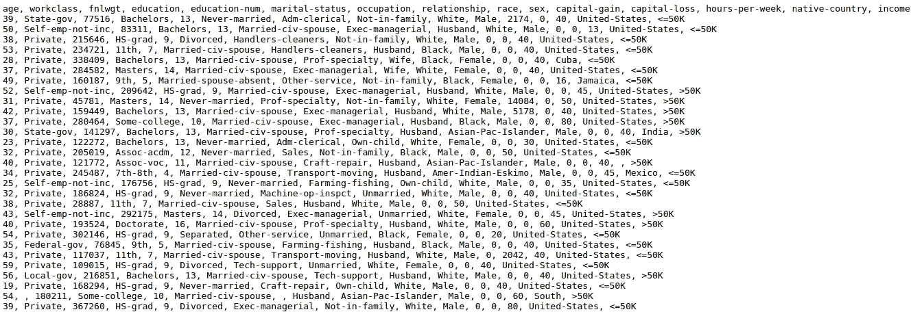
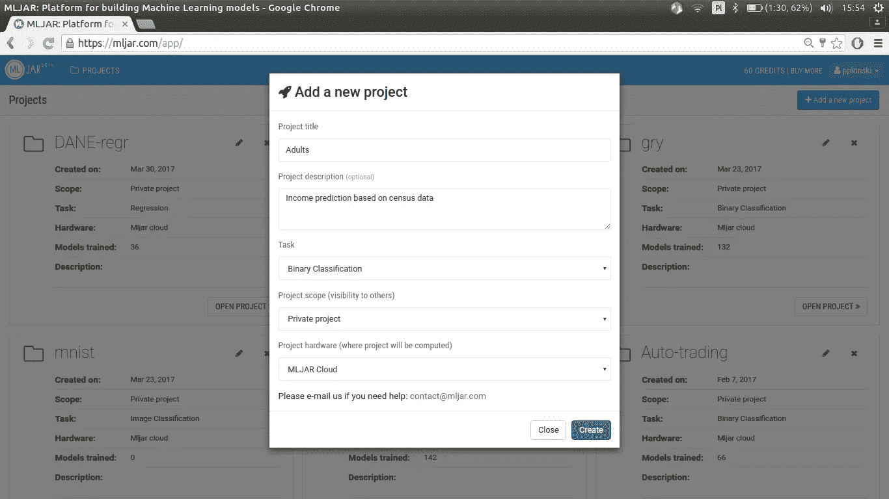
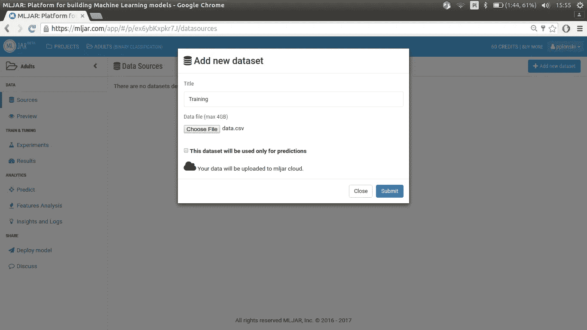
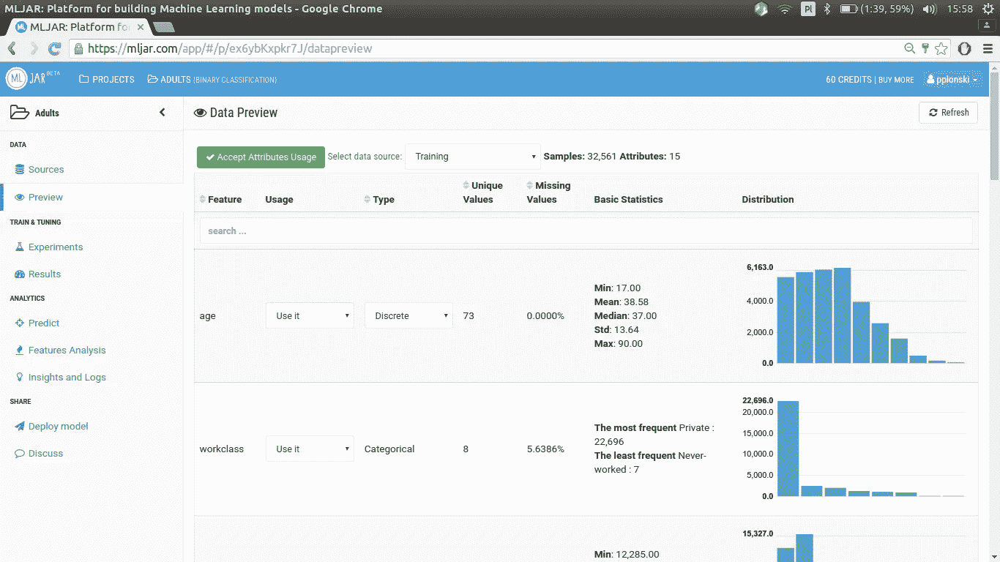
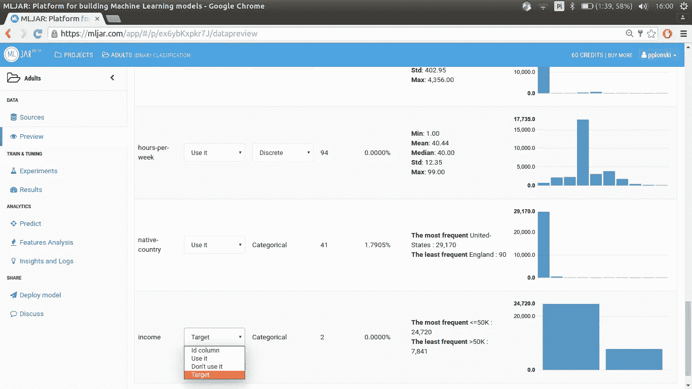
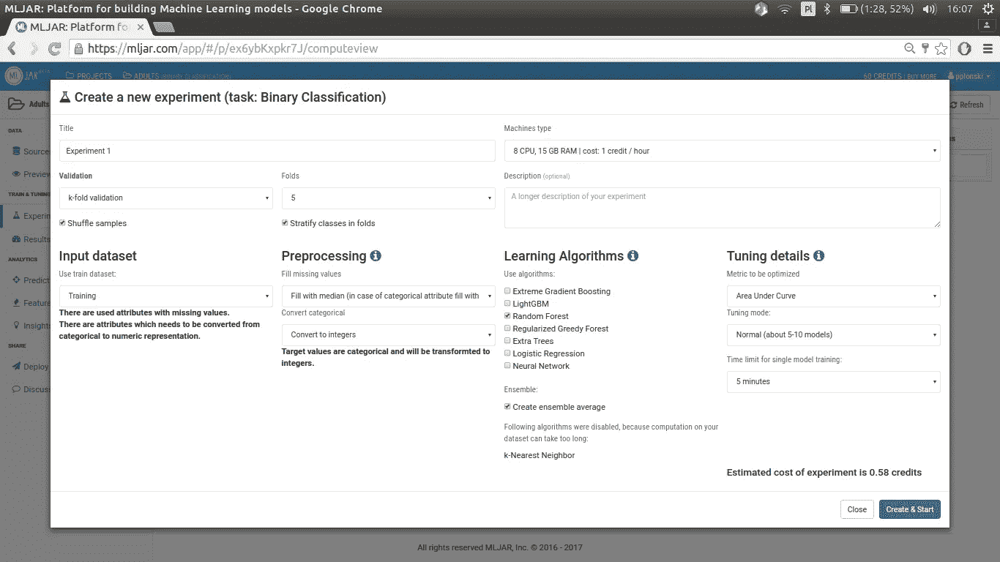
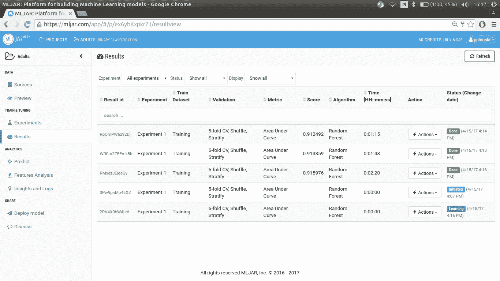
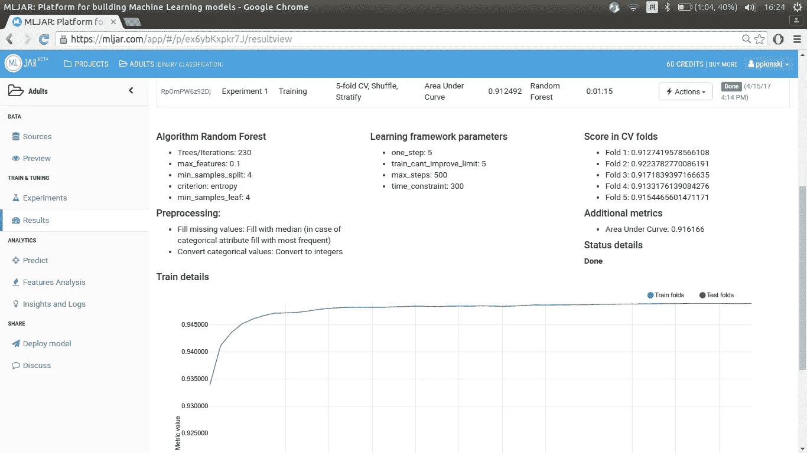

# MLJAR 学院:从机器学习开始

> 原文：<https://medium.com/hackernoon/mljar-start-with-machine-learning-d63003833474>

机器[学习](https://hackernoon.com/tagged/learning)是时下的热门话题。这是一种流行语，每个人都试图用它来显得更聪明。我问我的朋友他的公司用于分类的算法类型，他说:

> “老实说我没有 ML 经验。我是技术人员。但为了听起来聪明，我可能会说:我们正在使用基于人工神经[网络](https://hackernoon.com/tagged/network)的复杂机器学习算法。”

事实上，这听起来很不错:-)为了帮助人们满足对机器学习知识的渴望，我将发布一系列关于机器学习的文章，特别是预测分析。

机器学习根据[维基百科](https://en.wikipedia.org/wiki/Machine_learning):

> **机器学习**是[计算机科学](https://en.wikipedia.org/wiki/Computer_science)的子领域，它……赋予了“**计算机无需显式编程**就能学习的能力。”机器学习是从对[人工智能](https://en.wikipedia.org/wiki/Artificial_intelligence)中的[模式识别](https://en.wikipedia.org/wiki/Pattern_recognition)和[计算学习理论](https://en.wikipedia.org/wiki/Computational_learning_theory)的研究演变而来的，它探索研究和构建能够从[数据](https://en.wikipedia.org/wiki/Data)中学习并做出预测的[算法](https://en.wikipedia.org/wiki/Algorithm)...

简单来说，机器学习允许你建立一个不必明确定义的算法(配方)——可能吗？是的，这个算法(配方)中的一切都是从你的数据中学习的——每个条件或新步骤都是基于你的数据。作为学习的结果，你得到一个算法，但更准确地说，你得到一个**模型**。这个模型有一些关于你的数据的知识，并且这个模型可以基于输入数据为你提供响应。

模型总会有某种回应，因为否则就没用了。响应可以是不同的格式——可以是数字、图像、音频，或者响应可以是模型的内部结构，这可以给我们带来一些见解。根据回答，你可以采取行动。

通常，机器学习模型的生命周期有两个阶段:

*   **阶段 1:学习** —在这一步中，你需要学习你的模型，你向你的模型显示数据并训练它。
*   **阶段 2:预测** —这是一个“生产”阶段，在这个阶段中，新数据被呈现给你的模型，并且它基于它先前的知识(来自阶段 1)提供响应。

你不能省略你的模型的学习步骤，因为否则它会产生一些随机的反应。然而，有时你可以购买已经学习过的模型，你可以用它来进行预测(例如 [clarifai](https://www.clarifai.com/) ， [algorithmia](https://algorithmia.com/) )。

有许多方法可以对机器学习算法进行分类，其中一种方法取决于可用于学习的数据:

*   [监督学习](https://en.wikipedia.org/wiki/Supervised_learning) —在老师(监督人)的指导下进行训练，你的数据应该包含将用于指导模型关于响应值的信息，你知道什么值是期望的响应值，并且你将教你的模型返回它们。一些例子:电子邮件中的垃圾邮件分类、图像中的对象识别、信用风险评估、流失预测、股票市场的价格预测。
*   [无监督学习](https://en.wikipedia.org/wiki/Unsupervised_learning) —没有可用于指导模型的关于期望响应值的信息，模型需要自己算出它——它不会被监督。一些例子:用户细分，复杂的数据可视化。
*   [强化学习](https://en.wikipedia.org/wiki/Reinforcement_learning) —在学习阶段，您的模型与动态环境互动，在其中它有一定的目标，可以采取行动，并从环境中获得反馈(奖励和惩罚)。一些例子:自动驾驶汽车或与对手玩游戏。

在我看来**学习人类的最好方式是通过做**，所以现在在一些理论之后我们将会进入分类任务(这是*监督学习*的一部分)。好了，来学习我们的模式吧！

我已经准备了几个数据集，这些数据集很容易上手。它们可以在 [my github](https://github.com/pplonski/datasets-for-start) 上获得。我们将使用成人数据集:

*   资料链接:[此处](https://github.com/pplonski/datasets-for-start/tree/master/adult)
*   原始数据来源:[此处](https://archive.ics.uci.edu/ml/datasets/Adult)

在此任务中，我们将训练一个模型，根据人口普查数据预测一个人的年收入是否超过 5 万美元。让我们来看看我们的[数据集](https://raw.githubusercontent.com/pplonski/datasets-for-start/master/adult/data.csv):

Few top rows from Adult dataset.

我们的数据集中有 15 列和 32，562 行。第一行是标题，它描述了每一列的含义。一行描述一个人。每个人都被描述为:

*   年龄(连续属性)
*   工作类(分类属性)
*   fnlwgt(连续属性)——是描述人的一些指标
*   教育(分类属性)
*   教育-数量(连续属性)
*   婚姻状况(分类属性)
*   职业(分类属性)
*   关系(分类属性)
*   种族(分类属性)
*   性别(分类属性)
*   资本收益(连续属性)
*   资本损失(连续属性)
*   每周小时数(连续属性)
*   本国(分类属性)
*   收入(分类属性)

连续属性意味着该列中的值是数字，例如“年龄”——在该列中，我们将只看到数字。分类属性意味着在这个列中将有字符串，例如“性别”，有值“男性”或“女性”。字符串值将被转换成数字(我们现在不讨论预处理细节，将在下一课中讨论)。

为了构建分类器，我们将使用 [MLJAR](https://mljar.com) ，它有简单的基于网络的用户界面——你可以在那里建立账户并获得免费的启动信用(足够运行 MLJAR 学院课程的实验)。我们从新项目的创建开始分析。

项目创建后，请转到**源**并添加新的数据源。

添加新数据集后，请转到**预览**，让我们检查数据、列类型和分布。

在训练之前，我们需要选择哪些属性将用作模型的输入(“使用它”列)，以及哪个列是“目标”列。

目标列将在模型训练中用于*监督*，我有时会将*目标*列称为*输出*列，因为模型将学习给出类似于目标值的响应(输出)。选择列用法后，我们需要在**预览**的顶部选择“接受属性用法”。现在，我们准备开始我们的第一个机器学习实验！让我们转到**实验**并添加新实验。

哇！这个对话框有很多功能——不要担心，它们中的很多都被设置为智能默认值！在这个对话框中，我们将设置三件事:

1.  输入数据集:它将是我们的数据源
2.  学习算法:我们将选择随机森林
3.  要优化的指标:我们将设置 ROC 曲线下的面积

仅此而已！我们单击“Create & Start ”,模型培训将开始(在后台，我们将为您启动 AWS 实例来完成这项工作)。请不要担心其他实验的参数，例如:预处理。我们将在接下来的课程中详细介绍。实验创建后，您将被重定向至**结果**视图。

好吧，这是怎么回事？结果表中有几行，每行代表一个模型。您可以单击表格中的行来查看模型参数。

当你训练机器学习算法时，它通常有许多控制学习过程的参数——它们的值需要仔细选择，MLJAR 可以为你做到这一点。

这是一个好的开始！你今天取得了很大的进步:

*   你知道什么是机器学习吗
*   你知道什么是学习
*   你用随机森林算法训练了你的第一个分类器

在接下来的课程中，我们将讲述更多细节:

*   超参数调谐
*   数据预处理
*   模型验证
*   还有更多！所以请在 mljar.com 订阅，不要错过下一篇文章

我对你在 MLJAR 平台上的反馈非常感兴趣！

*免责声明:为了更容易解释和理解，对一些定义进行了简化。*

> [黑客中午](http://bit.ly/Hackernoon)是黑客如何开始他们的下午。我们是 [@AMI](http://bit.ly/atAMIatAMI) 家庭的一员。我们现在[接受投稿](http://bit.ly/hackernoonsubmission)并乐意[讨论广告&赞助](mailto:partners@amipublications.com)机会。
> 
> 如果你喜欢这个故事，我们推荐你阅读我们的[最新科技故事](http://bit.ly/hackernoonlatestt)和[趋势科技故事](https://hackernoon.com/trending)。直到下一次，不要把世界的现实想当然！

