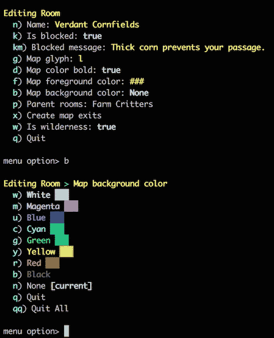

# MMO 发展博客——现在有菜单

> 原文：<https://medium.com/hackernoon/mmo-devblog-now-with-menus-a9f2c8151746>

我在 [Bread](https://www.getbread.com/) ，带着一个了不起的团队走向我们的 B 系列赛。

否则你会发现我在追寻一个梦想，在一个中世纪的幻想世界中建立并运行一个大型多人社区游戏。[代码库](https://hackernoon.com/tagged/codebase)是在[开发](https://hackernoon.com/tagged/development)的 5 个月。

我们的愿景是创造一个社会，丰富而独特的领域去探索，并在玩家之间建立关系，给他们一些可以失去的东西和团队合作的工具来避免这种损失。

世界不会自我解释，创造了神秘和掌握的机会。我们将努力保持游戏“未解决”。

菜单系统是这个月编写的，花了两个星期才完成，比预期的要长得多。OLC(在线创作，在世界中建造世界)现在使用房间的菜单系统，花了五天时间建造。出口和区域的 OLC 正在进行中。总的来说，这款游戏处于试生产阶段，这意味着我们正在计划和编码引擎核心。

“Now with menus”

"制造一个游戏或者一个引擎，但是两者都做，你会失败的."—我们两者都在做，并努力通过在设计、内容、业务模式和引擎方面的持续进步来克服失败。现在，设计意味着为虚拟世界的主要方面写一个高水平的具体计划的文档；内容是一个正在进行的故事、区域、技能和地图的草图；商业模式让我们写下潜在客户和要卖的东西；而占据我们大部分时间的引擎，正在让虚拟世界的基础变得真实。

我们愿景的核心是一个问题——为什么书籍和电影在继续进化，而文字游戏却被图形成功了？我们将努力找出答案(并注意消息传递、聊天机器人和虚拟现实的崛起。)

[给我发邮件](mailto:ryanberckmans@gmail.com)

> [黑客中午](http://bit.ly/Hackernoon)是黑客如何开始他们的下午。我们是阿妹家庭的一员。我们现在[接受投稿](http://bit.ly/hackernoonsubmission)并乐意[讨论广告&赞助](mailto:partners@amipublications.com)机会。
> 
> 如果你喜欢这个故事，我们推荐你阅读我们的[最新科技故事](http://bit.ly/hackernoonlatestt)和[趋势科技故事](https://hackernoon.com/trending)。直到下一次，不要把世界的现实想当然！

