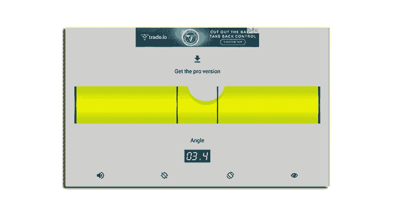
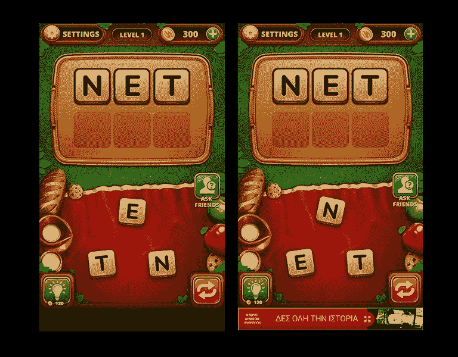
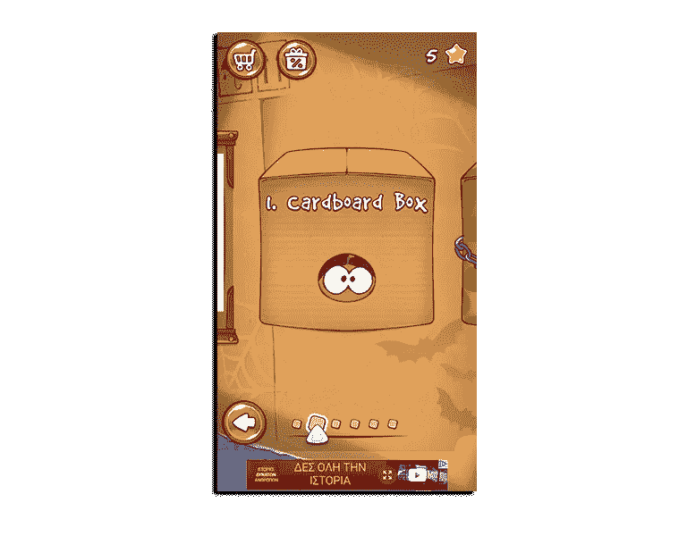
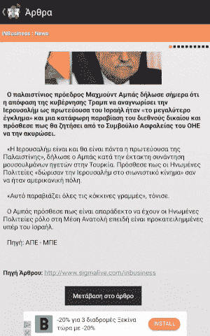
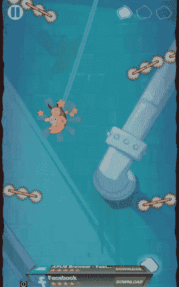
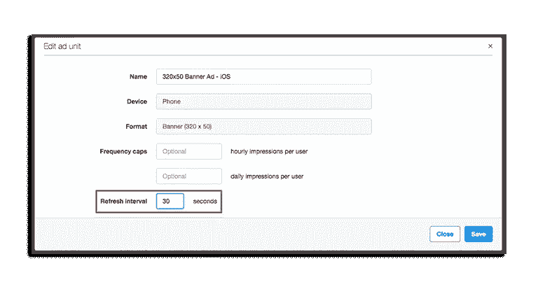
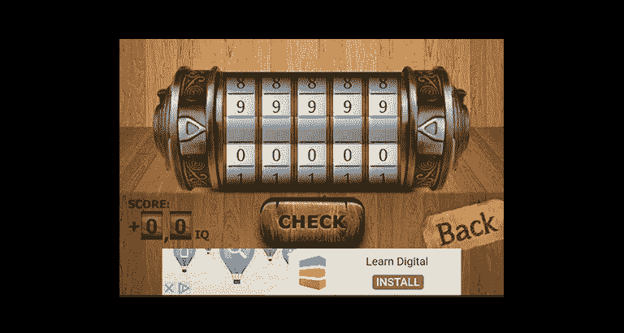
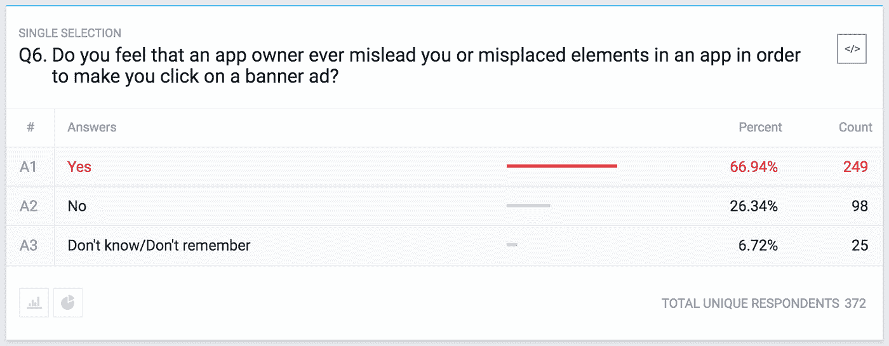
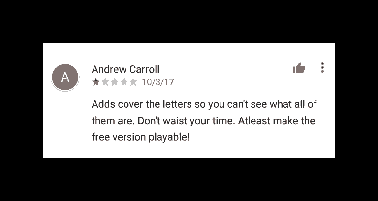

# 移动广告格式实验室#3 —横幅广告的注意事项

> 原文：<https://medium.com/hackernoon/mobile-ad-formats-lab-3-banner-ads-dos-and-donts-cdb63cd831de>

在我们的[移动](https://hackernoon.com/tagged/mobile)广告格式实验室系列的前一篇文章中，我们研究了应用发布者在处理横幅广告时应该知道的一些重要指标，以及一些关于用户如何看待横幅广告及其在移动应用中的使用的见解。

在这篇最新的文章中，我们将阐述出版商在处理横幅广告时应该遵循的一些良好做法，然后我们将讨论出版商在移动应用中实施横幅广告时应该避免的一些常见的错误做法和错误。

Banner ads are a good option for Utility apps

# 磁盘操作系统

当选择实施横幅广告时，出版商的主要关注点应该是在优化广告效果的同时提供良好的用户体验，最终实现成功的点击率并增加收入。以下是一些良好做法:

## 为横幅广告分配用户界面空间

发布者应该在应用程序的设计阶段分配 UI 空间来放置横幅。这样，当加载横幅时，它们不会干扰应用程序的其他内容。

In Word Snack app we can see how a dedicated space was allocated for banner ads

## 将横幅与需要用户输入的元素分开

发布者应该在应用程序 UI 中需要用户交互的项目和横幅广告之间留出一个清晰的空间。

In Cut The Rope app there is a clear separation between banner ads and game elements/options

## 单一方法

通过像 [MoPub](https://www.mopub.com/resources/docs/ad-formats-best-practices/banner-best-practices/) 这样的网络或中介平台提供的单一方式，出版商可以在几个屏幕上保留同一个广告，从而增加用户点击它们的可能性。

Grooky Reader app persists the same banner ad between different articles

# 有生命的

在某些情况下，当广告被加载时，在场景中使用动画横幅广告不失为一个好主意，可以改善用户体验，同时也可以将注意力集中在广告上。一些广告网络已经默认提供这种方法(见下面 StartApp 的 3d 横幅广告)。

3d animated banner ads by StartApp

## 刷新率

在大多数网络中，出版商可以定制和试验横幅广告的刷新率间隔。刷新率是显示下一个广告单元之前的秒数。横幅广告的行业平均水平在 30 秒左右。一些发行商在刷新率上做了很多尝试，为他们的应用找到一个转化率最高的。成功的刷新率因网络而异，但通常有一个最佳的推荐刷新率。

Setting refresh rate from MoPub’s dashboard

## 使用中介

如果你已经在应用程序货币化行业呆了足够长的时间，你应该知道你不应该只依靠一个广告网络来从你的应用程序中赚钱。克服填充率问题并利用市场上最高 eCPMs 的最佳方法是使用中介解决方案并在不同横幅广告提供商之间进行中介。

## 尝试不同的横幅选项

**智能横幅**

在像 AdMob 这样的广告网络中，为了克服碎片化问题并避免使用预定义大小的横幅广告，您可以使用智能横幅，这种横幅可以轻松适应不同的屏幕大小。

Smart Banner Ad from AdMob

**迷你墙横幅**

在像 StartApp 这样的广告网络中，你可以找到横幅广告，它就像一面水平的要约墙，最终导致 CPI 下载应用程序。

Mini Wall Banner ad from StartApp

## **3d 横幅**

像 StartApp 提供的 3d 横幅广告，只不过是普通的横幅广告，以流畅的 3d 动画进入屏幕，吸引用户的注意力。

# 不要

## 要求用户点击

不允许以任何理由要求用户点击横幅广告，因为这会导致用户点击他们不感兴趣的广告。在大多数广告网络中，这将导致出版商被禁止进入广告网络。

## 放置在一种方式，以推动意外点击

在任何需要用户输入的元素附近放置横幅会导致意外点击，应该避免。

正如我们在上一篇文章中看到的，最近[关于移动横幅广告的民意调查](https://www.pollfish.com/dashboard/results/360153/-137820604)显示，超过 66%的用户表示，他们认为出版商试图误导他们，以提高广告点击量。这些点击会被广告网络取消资格，并可能导致应用程序中的广告暂时禁用。

## 放置在活动的游戏屏幕上

在活跃的游戏屏幕上放置横幅通常被认为是一种不好的做法，除了偶然的点击之外，很少会引起任何点击。在主活动游戏屏幕中，用户主要关注游戏，尤其是当需要继续输入时。在这种情况下，用户往往会忽略任何出现的横幅广告。你会停止玩 flappy bird，为了快速点击底部的横幅广告而放弃生活吗？

## 放置在不可见的部分

在 listview 之类的可滚动元素中放置横幅或者使其不可见(即使加载了广告)会在某些网络中导致错误印象。横幅广告应该放在屏幕上的一个固定位置，至少在加载的时候是可见的。

## 重叠的应用程序内容

横幅不应该放在应用程序内容的上方，因为这可能会让用户感到沮丧，也会导致意外点击。滥用广告不仅会影响广告的效果，还会影响店内评论和潜在的[未来](https://hackernoon.com/tagged/future)应用用户，如下所示:

Bad review from a user due to ad misplacement

## 在同一个屏幕上使用多个横幅广告

一些出版商为了最大限度地利用可用的屏幕空间，在同一个屏幕上使用了不止一个横幅。这种方法除了会造成不良的用户体验之外，还会违反广告网络的政策(例如 AdMob ),并导致发布者被禁止进入广告网络。

移动广告格式实验室系列的前三篇文章详细介绍了横幅广告的信息。我们研究了为什么出版商和广告商广泛使用它们，也研究了用户对它们的看法。在本章的最后一篇文章中，我们探讨了出版商在使用横幅广告时的一些不良做法，以及最佳做法和一些应遵循的技巧。

在我们的下一篇文章中，我们将触及插播广告格式，以及出版商如何从他们的移动应用中受益。

.