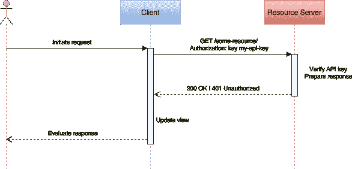
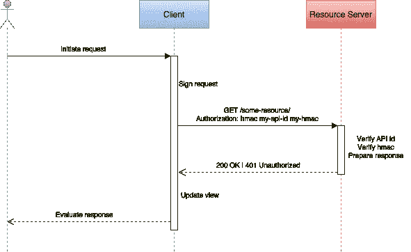

# 移动 API 安全技术

> 原文：<https://medium.com/hackernoon/mobile-api-security-techniques-682a5da4fe10>

## 第 1 部分—应用程序和用户 API 密钥

移动应用通常使用 API 与后端服务和信息进行交互。2016 年，花在[移动应用上的时间同比增长了令人印象深刻的 69%](https://www.flickr.com/photos/138382953@N08/31415282864/in/dateposted-public/)，强化了大多数公司的移动优先战略，同时也为网络犯罪分子提供了新的、有吸引力的[目标](https://www.approov.io/blog/theres-a-fake-app-for-that.html)。作为 API 提供商，保护您的企业资产免受信息抓取、恶意活动和拒绝服务攻击，对于维护声誉良好的品牌和实现利润最大化至关重要。

如果使用得当，API 密钥和令牌在应用程序安全性、效率和使用情况跟踪方面发挥着重要作用。虽然在概念上很简单，但是 API 键和令牌有很多需要注意的问题。在第 1 部分中，我们将从一个非常简单的 API 密钥用法的例子开始，并迭代地增强它的 API 保护。在[第 2 部分](https://hackernoon.com/mobile-api-security-techniques-fc1f577840ab#.ext32ysbh)中，我们将在几个 OAuth2 场景中从密钥转移到 JWT 令牌，在我们的最终实现中，我们将删除存储在客户端中的任何用户凭证和静态机密，即使令牌不知何故遭到破坏，我们也可以最小化对单个 API 调用的暴露。

# 从一个简单的应用 ID 密钥开始

最简单的 API 键只是一个应用程序或开发人员 ID 字符串。为了使用 API，开发人员向 API 服务注册他的应用程序，并接收一个惟一的 ID，以便在发出 API 请求时使用。

在序列图中，客户端是一个移动应用程序。资源所有者是应用程序用户，资源服务器是通过 API 调用与客户机交互的后端服务器。我们将尽可能多地使用 [OAuth2](https://oauth.net/2/) 术语。

对于每个 API 调用，客户机在 HTTP 请求中传递 API 键。通常最好将 API 密钥作为授权报头的一部分发送，例如:

授权:密钥 some-客户端 id

URL 经常被记录，因此如果 API 键作为查询参数传递，它可能会出现在客户端日志中并很容易被观察到，正如过去的[脸书漏洞](http://blog.parse.com/learn/engineering/discovering-a-major-security-hole-in-facebooks-android-sdk/)所示。这种最初的 API 密钥方法提供了一些基本的保护。如果调用不包含可识别的 ID，任何进行 API 调用的应用程序都将被拒绝。具有不同键的不同应用程序也可以具有与那些键相关联的不同权限范围；例如，一个应用程序可能具有只读访问权限，而另一个应用程序可能被授予对相同后端服务的管理访问权限。

密钥可用于收集关于 API 使用的基本统计数据，如呼叫计数或流量来源，可能会拒绝来自非应用程序用户代理的呼叫。重要的是，大多数 API 服务使用调用统计来强制每个应用的速率限制，以提供不同的服务等级或拒绝可疑的高频率调用模式。这种简单方法的一个明显缺点是 API 调用和密钥是以明文形式传递的。一个[中间人攻击](https://www.owasp.org/index.php/Man-in-the-middle_attack)可以成功修改任何 API 调用或逆向工程 API，并使用观察到的 API 密钥进行自己的恶意 API 调用。在不破坏现有应用程序实例并要求升级整个安装基础的情况下，不能将受损的 API 密钥列入黑名单。

# 保护通信信道

[传输层安全性](https://en.wikipedia.org/wiki/Transport_Layer_Security) (TLS)是一种保护 HTTP 通道的机密性、完整性和认证的标准方法。通过[相互 TLS](https://www.codeproject.com/Articles/326574/An-Introduction-to-Mutual-SSL-Authentication) ，客户端和服务器交换并验证彼此的公钥。使用[证书锁定](https://www.owasp.org/index.php/Pinning_Cheat_Sheet)，客户端和服务器知道预期的公钥，因此它们将实际交换的密钥与预期的密钥进行比较，而不是通过证书的层次链来验证客户端和服务器必须保持它们自己的私钥安全。一旦验证了密钥，客户端和服务器就协商共享秘密、消息认证码(MAC)和加密算法。

当运行在未受损的移动设备上时，TLS 上的客户端流量相对于中间人攻击是相当安全的。不幸的是，如果攻击者可以在他控制的设备上安装您的客户端应用程序，他可以使用数据包嗅探器来观察公钥交换，并使用该知识来解密通道以观察 API 密钥，并对您的 API 进行逆向工程。虽然他可能无法观察其他客户端上的流量，但他现在可以创建自己的恶意应用程序，通过 TLS 安全通道免费调用您的 API。因此，即使在使用 TLS 时，您也需要额外的安全性来防止 API 被未授权的应用程序调用。

# 防止 API 调用篡改

我们可以做的第一个改进是将 API 密钥分成一个 ID 和一个共享秘密。和以前一样，密钥的 ID 部分与每个 HTTP 请求一起传递，但是共享秘密用于签名和/或加密传输中的信息。

为了确保消息的完整性，客户端使用共享的秘密和算法(如[HMAC·SHA-256](https://en.wikipedia.org/wiki/Hash-based_message_authentication_code))为每个请求计算消息认证码(MAC)。使用相同的秘密，服务器计算接收到的消息 MAC，并将其与请求中发送的 MAC 进行比较。

虽然客户端和服务器都知道这个秘密，但是这个秘密永远不会出现在通信信道中。攻击者可能会以某种方式看到 ID，但是如果没有秘密，他就不能正确地签署请求。按照现在的情况，攻击者仍然可以拒绝或重放请求，但是他不能改变它。围绕这个方案构建的例子包括 [HAWK](https://github.com/hueniverse/hawk) HTTP 认证规范或者[亚马逊 S3 REST API 签名和授权方案](http://docs.aws.amazon.com/AmazonS3/latest/dev/RESTAuthentication.html)。

为了进一步保护关键信息不被看到，在签名之前，可以使用从共享秘密导出的密钥材料对消息的全部或部分进行加密。

# 保护秘密

我们开始在客户身上积累秘密。我们有共享的 API 秘密和客户机的私有 TLS 密钥。

在它的基本形式中，秘密将是安装的应用程序包的静态常量，使用开发人员友好的名称，如 SHARED_SECRET。一个初级黑客不需要太多时间就能提取出这个常量，一旦他得到了这个常量，你的后端就暴露了。作为第一步，使用[代码混淆器](http://stackoverflow.com/questions/14570989/best-practice-for-storing-private-api-keys-in-android)，使其更难定位和提取秘密常数。更进一步，考虑一下[以某种计算简单的方式编码一个静态秘密](https://www.approov.io/blog/simple-app-authentication.html)，将编码分割成小段，然后将它们分布在二进制文件中。根据需要在内存中重组和解码秘密；千万不要把它保存在永久存储器里。

虽然公钥实际上不是秘密，但是您也想混淆它们。它们的值可以被观察到，因此如果它们没有被混淆，就很容易被发现和更改，从而很容易禁用或欺骗后端流量。

不管你如何努力，关键不是秘密是否会被窃取，而是窃取秘密的时间和努力是否值得回报。让它变得尽可能困难。如果一个 API 秘密被窃取，我们会遇到和以前一样的可撤销性问题；所有的应用程序实例都将受到损害，直到我们用新的秘密和新的技术来掩盖它，从而升级整个安装基础。

我们将在第 2 部分再次回到这个挑战，在那里我们将讨论从应用程序中完全移除秘密的方法。

# 处理用户凭据

我们已经使用应用程序密钥增强了 API 安全性，但是我们还没有考虑如何处理用户凭证。

从简单的开始，客户端请求用户提供用户 ID 和密码。使用[基本访问认证](https://en.wikipedia.org/wiki/Basic_access_authentication)，客户端对凭证进行编码并传递给服务器，服务器对凭证进行验证。如果凭证有效，服务器可以启动用户会话并返回用户会话密钥。使用相同凭据的多个身份验证应该总是返回不同的密钥字符串。

正如我们看到的应用程序密钥，我们可以使用用户密钥来收集统计数据和设置授权级别，但现在我们可以用用户级粒度来完成。假设我们同时使用应用程序和用户密钥，用户的授权级别将是应用程序和用户的函数；例如，用户可能在一个应用程序上拥有管理授权，而在另一个应用程序上只有读取权限，即使他们正在与同一个后端服务器对话。

类似于使用[HTTP cookie](https://en.wikipedia.org/wiki/HTTP_cookie)时，会话状态通常在服务器上维护。这可能会降低服务器的可伸缩性，如果多个服务器可以处理一个用户请求，则它们之间的会话数据必须同步。我们将在第 2 部分用用户令牌解决这个问题。

到目前为止，我们的应用程序密钥是静态的，因此具有无限的生存期。相比之下，用户密钥是在服务器上创建的，它们可以而且应该过期。当用户密钥过期时，用户必须重新进行身份验证才能继续进行 API 调用，并且会话状态会丢失。用户不喜欢重复登录，因此需要对密钥生存期做出策略决策。生存期越长，用户就越方便，但是如果用户密钥被泄露，它也可能被恶意使用更长时间。

如果一个键可以比一个应用程序实例持续更长时间，那么它必须在应用程序调用之间存储在客户端的持久存储中。这在本质上比密钥只存在于内存中更不安全。使用安全存储，如 IOS 的[钥匙链服务](https://developer.apple.com/library/content/documentation/Security/Conceptual/keychainServConcepts/01introduction/introduction.html#//apple_ref/doc/uid/TP30000897-CH203-TP1)，考虑 Android 的[共享首选项](https://developer.android.com/reference/android/content/SharedPreferences.html)。

与应用程序密钥不同，用户密钥可以在不破坏已安装的应用程序的情况下被撤销。

# 摘要

我们从一个非常简单的 API 密钥使用示例开始，并迭代地增强了它的 API 保护，以保护通信通道，并使用 API 密钥授权客户端和用户。在[第 2 部分](https://hackernoon.com/mobile-api-security-techniques-fc1f577840ab#.ext32ysbh)中，我们将在几个 OAuth2 场景中从密钥转移到 JWT 令牌，在我们的最终实现中，我们将删除存储在客户端中的任何用户凭证和静态机密，即使令牌不知何故遭到破坏，我们也可以最大限度地减少对单个 API 调用的暴露。

感谢阅读！如果你能推荐这篇文章(点击❤按钮)，让其他人也能找到，我将不胜感激。

*最初发表于*[*approov.io/blog*](https://approov.io/blog/mobile-api-security-techniques-part-1.html)*。*

> [黑客中午](http://bit.ly/Hackernoon)是黑客如何开始他们的下午。我们是 [@AMI](http://bit.ly/atAMIatAMI) 家庭的一员。我们现在[接受投稿](http://bit.ly/hackernoonsubmission)，并乐意[讨论广告&赞助](mailto:partners@amipublications.com)机会。
> 
> 如果你喜欢这个故事，我们推荐你阅读我们的[最新科技故事](http://bit.ly/hackernoonlatestt)和[趋势科技故事](https://hackernoon.com/trending)。直到下一次，不要把世界的现实想当然！

