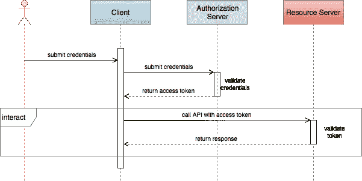
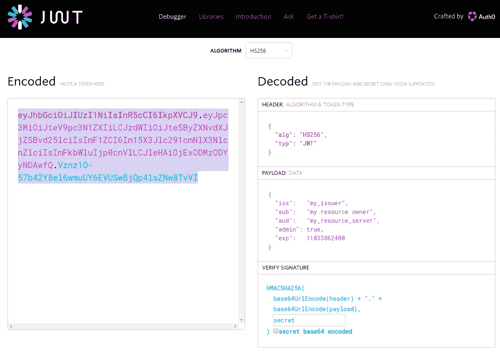
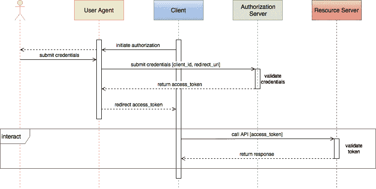
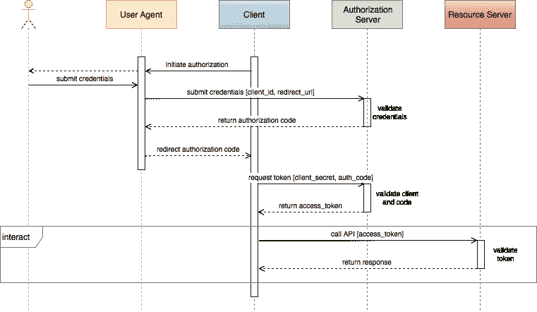
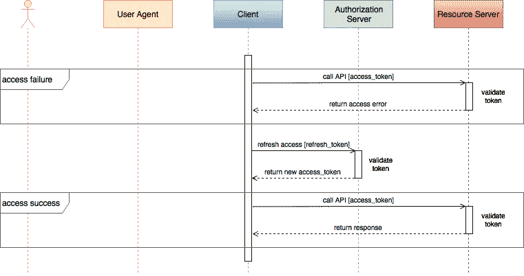
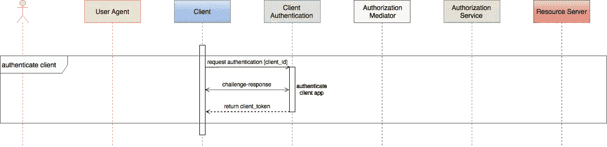
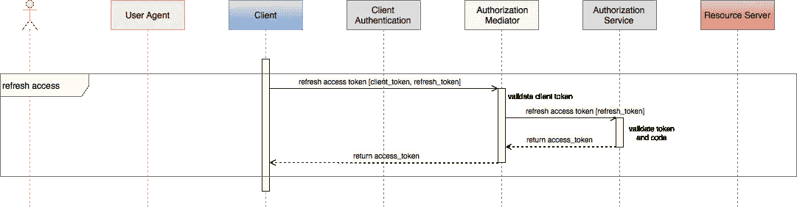

# 移动 API 安全技术，第 2 部分

> 原文：<https://medium.com/hackernoon/mobile-api-security-techniques-fc1f577840ab>

## API 令牌、Oauth2 和消失的秘密

[推文](https://twitter.com/share)

移动应用通常使用 API 与后端服务和信息进行交互。2016 年，花在[移动应用上的时间同比增长了令人印象深刻的 69%](https://www.flickr.com/photos/138382953@N08/31415282864/in/dateposted-public/)，强化了大多数公司的移动优先战略，同时也为网络犯罪分子提供了新鲜而有吸引力的[目标](https://www.approov.io/blog/theres-a-fake-app-for-that.html)。作为 API 提供商，保护您的企业资产免受信息抓取、恶意活动和拒绝服务攻击，对于维护声誉良好的品牌和实现利润最大化至关重要。

如果使用得当，API 密钥和令牌在应用程序安全性、效率和使用情况跟踪方面发挥着重要作用。虽然在概念上很简单，但是 API 键和令牌有很多需要注意的问题。

之前，在[第 1 部分](https://hackernoon.com/mobile-api-security-techniques-682a5da4fe10#.hfqj8zvl2)中，我们从一个非常简单的 API 密钥用法的例子开始，并迭代地增强了它的 API 保护。在第 2 部分中，我们从几个 OAuth2 场景中的密钥转移到 JWT 令牌，在我们的最终实现中，我们删除了存储在客户端中的任何用户凭证和静态机密，即使令牌不知何故受到了威胁，我们也可以将暴露给单个 API 调用的风险降至最低。

# 我们离开的地方

对于接下来的所有场景，我们假设第 1 部分中讨论的 [TLS 技术](https://en.wikipedia.org/wiki/Transport_Layer_Security)用于保持通信通道的安全。

我们将尽可能多地使用 [OAuth2](https://oauth.net/2/) 术语。对于本文，客户端*是一个移动应用程序。*资源所有者*是应用用户，*资源服务器*是通过 API 调用与客户端交互的后端服务器。*授权服务器*，如果存在，将验证资源所有者的凭证，并授权对资源服务器的有限访问。代表授权服务器的*用户代理*将从客户端单独收集资源所有者凭证。*

在第 1 部分的最后，我们使用[基本访问认证](https://tools.ietf.org/html/rfc2617)来验证用户凭证并在服务器上启动用户会话。如果认证成功，服务器将会话密钥返回给客户端。客户端将会话密钥添加到 API 调用中，服务器检查会话密钥当前是否有效，并将其用作查找它为客户端存储的任何会话状态的密钥。

# 切换到授权令牌

授权用户访问受保护的资源已经成为一种流行的方式。 [OAuth2 授权框架](https://tools.ietf.org/html/rfc6749)定义了几个授权授予流程。尽管大多数服务提供者遵循规范的精神，但他们通常选择只实现完整规范的一部分，或者有时实现与指定不同的功能。

最类似于基本访问认证的 OAuth2 流被称为资源所有者密码凭证授权。在这个流程中，移动客户端直接获取资源所有者的 id 和密码凭证，并将它们传递给其后端资源服务器。后端服务器验证凭证，并向客户端返回访问令牌。

返回的访问令牌看起来就像一个会话密钥，客户端以同样的方式使用它；在任何需要授权进行 API 调用的 http 请求中都提供了访问令牌。与基本访问身份验证一样，访问令牌代表资源所有者的凭证，因此一旦客户端收到访问令牌，客户端就应该丢弃凭证。资源所有者必须相信客户端没有保留这些凭据。

访问令牌与会话密钥的不同之处在于如何解释令牌。 [JSON Web 令牌(JWT)](https://tools.ietf.org/html/rfc7519) 是一种安全、URL 安全的声明表示方法，通常用作 OAuth2 访问令牌。JWT.io 站点提供了一个方便的地方来试验令牌。

JWT 包含描述一组声明的 JSON 格式的有效负载。常见的索赔包括:

*   “ISS”—标识令牌的颁发者
*   “sub”—声明的主体，通常是资源所有者
*   “aud”——声明的预期受众，通常是资源服务器
*   “exp”—声明的到期时间戳

访问令牌也称为承载令牌，并随每个 API 调用一起传递，通常作为 HTTP 请求头:

*   授权:无记名 eyjhbgcioijuzi 1 niis INR 5 CCI 6 ikpxvcj 9 . ey jpc 3 mioijte v 9 PC 3n 1 zxiilcjzdwiiijtesbyzxnvdxjzsbvd 25 LCI isi m f1 zci 6 im 15 x3 jlc 291 cmnlx 3 nlcnzlciisimfkbwluijp 0 c nvllcjehaiojexodmzodyyndawfq。vznz 1o-57b 42y 8 El 6 wmuuy 6 evuswbjqp 4 lsz NW 8 tvvi

资源服务器可以通过不同的方式验证令牌。一种常见的方法是使用资源服务器和授权服务(在这种情况下是资源服务器本身)都知道的秘密来签署 JWT 令牌。攻击者无法在不使签名无效的情况下修改令牌的声明。如果需要，客户端可以读取声明，但是它不知道秘密，所以它不能验证令牌本身。用户凭据和签名机密都不存储在客户端，因此不能通过对应用程序进行反向工程来提取它们。

服务器可以验证签名并检查声明是否已经过期。对于基本访问身份验证，会话密钥用于检索存储在后端的状态。如果有多个服务器可以服务于一个请求，那么访问这个状态并在服务器之间同步它可能是一个性能瓶颈。使用访问令牌，授权状态(如主题)存储在客户端，并且每次调用都会提供该状态。如果客户端为每个调用维护并提供所有会话状态的等价物，那么 API 协议就是无状态的，任何服务器都可以独立于其他服务器处理请求，从而极大地提高系统的可伸缩性。

由于签名密码不存储在客户端，因此可以在服务器上更改密码，而无需更改客户端。访问令牌在到期前一直有效，因此如果到期窗口很长，被盗令牌可能会被攻击者成功使用相当长一段时间。如果怀疑有可疑行为，可以将令牌列入一组服务器的黑名单。被吊销的令牌将无法通过验证，从而触发资源所有者的新密码凭据序列。

# 将用户授权与服务分开

如果资源授权与资源访问相分离，可以增强安全性。如果是分离的，那么只有授权服务器需要处理用户凭证。用户凭证永远不会向客户端或资源服务器公开。

在 OAuth 的隐式授权类型中，授权和资源服务器是分开的。客户端通过重定向将资源所有者发送到授权服务器的网站。本地用户代理(通常是一个浏览器，独立于客户端)提交凭证。授权服务器验证凭证，并通过用户代理将访问令牌重定向回客户端。

与用户凭证一起，授权服务器可以接收客户端标识符和请求的范围。授权服务器可以使用资源所有者的 id、客户端的 id 和请求的范围来确定允许客户端访问哪些资源以及客户端如何访问或修改这些资源。因此，单个授权服务器可以跨许多客户端和许多资源管理许多用户的安全策略。

隐式授权类型流用户通过重定向发送到身份验证提供商的网站，用户提交凭据，身份验证提供商为您的应用程序验证凭据，然后提供商重定向回您的 web 应用程序。访问令牌直接在 URL #hash 中传递，只需一点 JavaScript 代码就可以提取出来。因为客户端不能保守秘密，所以没有秘密(没有 client_secret)。此外，没有刷新令牌这样的东西，客户端 web 应用程序将不得不要求一个新的令牌。

从客户端传递到资源服务器的访问令牌可以由资源服务器使用用于签名它们的相同秘密来验证。授权服务器和资源服务器共享这个秘密，但是这个秘密永远不会暴露给客户机或用户代理。一个单独的系统管理用户凭证、客户机 id、资源访问范围和共享机密。

这种授权类型被认为是隐式的，因为资源服务器隐式地相信提交访问令牌的请求者是客户机。这可能是一个冒险的假设。例如，如果攻击者能够危及用户代理的安全，攻击者可能能够查看访问令牌，并随后使用该令牌进行有效但恶意的 API 调用。

# 认证应用程序，而不仅仅是用户

授权授予类型将客户端应用程序身份验证添加到隐式流中。

授权分为两步。在第一步中，资源所有者通过用户代理提供凭证，但是这一次只向客户端返回一个授权代码。客户端使用授权代码和身份验证秘密回调授权服务器。然后，授权服务器将访问令牌直接返回给客户端。

通过将授权过程分为两个步骤，访问令牌不会流经用户代理，这是安全性方面的一大改进。如果用户代理暴露了授权代码，攻击者就不能使用该代码，除非他可以使用客户端秘密来验证自己。

正如我们在第 1 部分中所知道的，存储在客户机上的静态秘密很难对有决心的攻击者隐藏。我们将很快讨论如何从客户端移除静态机密。

OAuth2 规范不要求授权流之外的客户端应用程序身份验证，但理想情况下，用户访问(通过访问令牌)和应用程序访问(通过客户端密码)都应该随每个 API 调用一起发送。资源服务器应该在允许访问资源之前验证这两者。

# 缩短令牌生命周期

访问令牌的一个优点是它们有一个截止日期。如果它们以某种方式暴露，它们只能在有限的时间内有用。由于资源所有者每次都必须输入自己的凭据才能获得令牌，因此如果生命周期很短，用户就会对必须重复进行身份验证感到恼火。相反，如果生存期很长，公开的令牌在过期之前会造成很大的损害。怀疑被盗的令牌可以被撤销，但是这不会撤销在检测之前发生的任何损坏。

对于授权许可类型，OAuth2 可以选择允许使用刷新令牌。在初始授权许可期间，刷新令牌可以与访问令牌一起被接收。现在，可以给访问令牌一个短的到期窗口，当它到期时，可以发送刷新令牌来接收新的访问令牌。

刷新令牌的生存期比访问令牌长。在刷新令牌过期之前，资源所有者不需要重新进行身份验证。如果访问令牌被破坏，那么它的恶意使用将被限制在短时间内。如果刷新令牌遭到破坏，它将具有更长的生命周期，并可用于生成额外的访问令牌。因此，刷新令牌通常受到严格的存储要求，以确保它们不被泄露。他们也可以被授权服务器列入黑名单，这将触发新的资源所有者凭证会话。我强烈建议在任何刷新令牌操作期间对客户端应用程序进行身份验证，但这不是 OAuth2 规范所要求的。

随着每次刷新，除了新的访问令牌之外，还可以发送新的刷新令牌。旧的刷新令牌可以立即列入黑名单，或者可以使用更复杂的令牌轮换方案来阻止对任何单个令牌的恶意使用。

# 删除客户端机密

客户端密码应该用于鉴定客户端应用程序:

*   初始接入令牌授权
*   每次访问令牌刷新
*   每个 API 调用

许多人并不在每次 API 调用时都发送客户机秘密，他们认为由于客户机是在授权令牌授予期间使用秘密进行认证的，所以这是多余的。我更喜欢将它作为一个额外的检查，这样您就可以验证使用访问令牌的仍然是客户端。

不幸的是，客户端机密是静态存储在客户端应用程序中的，因此很容易受到攻击。我们可以按照类似于 OAuth 从客户端删除资源所有者凭证的剧本，通过委托给应用程序认证服务，从应用程序中删除静态秘密。在这种情况下，客户端必须向身份验证服务提供其应用程序凭据，服务对应用程序进行身份验证，并且客户端接收其自己的身份验证令牌。该令牌授权客户端访问资源，而不是授权用户访问资源。

应用认证服务使用客户端应用的独特特征来证明应用的完整性和真实性。唯一特征的一个例子可能是应用程序包的简单散列。这种简单证明的完整性取决于哈希计算的完整性。这样一个简单的方案可能很容易被欺骗。

更强大的证明服务可能会使用一组随机的高覆盖率挑战来检测任何应用程序替换、篡改或签名重放。这类服务的一个例子是[approv](https://approov.io/)(完全公开，这是我的公司 [CriticalBlue](https://www.criticalblue.com/) )。如果响应满足质询，身份验证服务将返回由客户端机密签名的身份验证、限时客户端完整性令牌。令牌可以由资源服务器验证，资源服务器也知道客户端秘密。如果证明失败，服务仍会返回一个有时间限制的令牌，但它将无法被资源服务器验证。证明服务和资源服务器共享客户机机密，但它不再存储在客户机中。

对于每个 API 调用，客户机完整性令牌和 oauth2 访问令牌都在请求头中发送。资源服务器被修改为在处理请求之前验证这两个令牌。

与用户身份验证不同，客户端身份验证不需要用户交互，因此客户端完整性令牌的生命周期可能非常短，并且不需要刷新令牌。

由于客户端密码不再存储在应用程序中，如果客户端密码以某种方式暴露，可以用新的密码替换，而无需对已安装的客户端基础进行任何更改。

必须修改初始授权授予流程，以添加应用程序身份验证。由于授权规范需要一个静态的客户端秘密，因此引入了中介服务器。客户端通过应用认证服务对自身进行认证，并接收客户端完整性令牌。和以前一样，它从资源所有者的身份验证中接收一个授权码。它将两者都发送到中介服务器。如果客户端完整性令牌有效，则中介将授权代码和客户端秘密发送到授权服务器，授权服务器返回用户访问令牌，然后将用户访问令牌返回给客户端，用于后续 API 调用，直到需要新的用户访问令牌。

要刷新用户访问令牌，可以使用同一个中介服务器。这一次，如果客户端完整性令牌有效，则刷新令牌被传递给授权服务器，如果有效，则返回新的用户访问令牌。尽管用户访问令牌刷新不需要应用程序身份验证，但我们能够通过向中介添加客户端完整性令牌验证来加强刷新检查。

使用这种方法，我们能够保护对我们的资源服务器进行的每个 API 调用，验证用户和应用的真实性，并且我们做到了这一切，而没有向客户端本身暴露用户凭证或客户端机密。

# 结论

在[第 1 部分](https://hackernoon.com/mobile-api-security-techniques-682a5da4fe10#.hfqj8zvl2)中，我们演示了使用客户端秘密和基本用户认证来保护 API 的使用。在第 2 部分中，我们介绍了 JWT 令牌，并描述了几种 OAuth2 用户认证方案。在移动设备上，静态秘密是有问题的，所以我们用动态客户端认证替换了静态秘密，同样使用 JWT 令牌。将用户和应用程序身份验证服务结合起来，可以有效防止 API 滥用。

在第 3 部分中，我们将讨论用户身份验证流程中一些剩余的威胁场景。

感谢阅读！如果你能推荐这篇文章(点击❤按钮)，让其他人也能找到，我将不胜感激。

*最初发表于*[*approv . io*](https://approov.io/blog/mobile-api-security-techniques-part-2.html)*。*

> [黑客中午](http://bit.ly/Hackernoon)是黑客如何开始他们的下午。我们是阿妹家庭的一员。我们现在[接受投稿](http://bit.ly/hackernoonsubmission)并乐意[讨论广告&赞助](mailto:partners@amipublications.com)机会。
> 
> 如果你喜欢这个故事，我们推荐你阅读我们的[最新科技故事](http://bit.ly/hackernoonlatestt)和[趋势科技故事](https://hackernoon.com/trending)。直到下一次，不要把世界的现实想当然！

