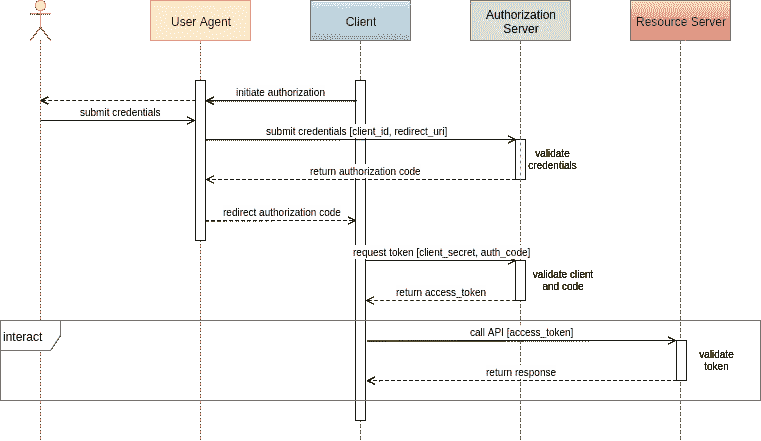
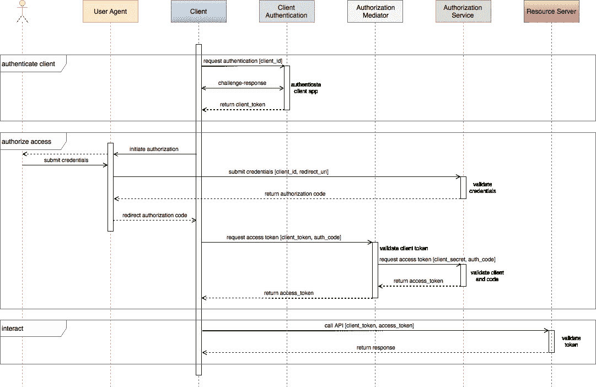
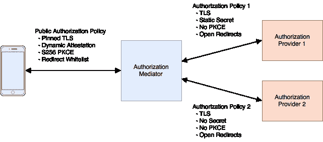

# 移动 API 安全技术，第 3 部分

> 原文：<https://medium.com/hackernoon/mobile-api-security-techniques-part-3-1e1e092aeacd>

## OAuth2 攻击、保护和中介

[推文](https://twitter.com/share)


移动应用通常使用 API 与后端服务和信息进行交互。2016 年，花在[移动应用上的时间同比增长了令人印象深刻的 69%](https://www.flickr.com/photos/138382953@N08/31415282864/in/dateposted-public/)，强化了大多数公司的移动优先战略，同时也为网络犯罪分子提供了新鲜而有吸引力的[目标](https://www.approov.io/blog/theres-a-fake-app-for-that.html)。作为 API 提供商，保护您的企业资产免受信息抓取、恶意活动和拒绝服务攻击，对于维护声誉良好的品牌和实现利润最大化至关重要。

如果使用得当，API 密钥、令牌和授权在应用程序安全性、效率和使用情况跟踪方面发挥着重要作用。之前，在[第 1 部分](https://hackernoon.com/mobile-api-security-techniques-682a5da4fe10#.cb44ddcwf)中，我们从一个非常简单的 API 密钥用法的例子开始，并迭代地增强了它的 API 保护。在[第 2 部分](https://hackernoon.com/mobile-api-security-techniques-fc1f577840ab#.49vmb9ry4)中，我们在几个 OAuth2 场景中从密钥转移到了 JWT 令牌，最终移除了存储在客户端中的任何用户凭证和静态秘密。在第 3 部分中，我们讨论了对 OAuth2 授权授权流的几种攻击以及常见的缓解措施。最后，我们扩展了第 2 部分中介绍的授权中介模式，以提供最佳实践安全性，同时适应不太安全的 [OAuth2](https://oauth.net/2/) 实现。

# 基本的 OAuth2 授权授权流

我们将尽可能使用 [OAuth2](https://oauth.net/2/) 术语。对于本文，客户端*是一个移动应用程序。*资源所有者*是应用用户，*资源服务器*是后端服务器，通过 API 调用与客户端交互。*授权服务器*，如果存在，将验证资源所有者的凭证，并授权对资源服务器的有限访问。代表授权服务器的*用户代理*将从客户端单独收集资源所有者凭证。*

下面是基本的 OAuth2 授权授予流程:



授权是一个两步过程。在第一步中，客户端委托给用户代理，通常是浏览器。通过用户代理，作为资源所有者的用户批准客户端，并向身份验证服务器提供凭据。服务器返回一个授权码，该授权码被重定向回客户端。在第二步中，客户端对自己进行身份验证，并将授权码返回给授权服务器，如果授权服务器满意，则返回一个访问令牌。

OAuth2 有一个相当长的规范阶段，因此，不同服务提供商之间的实现会有所不同。我们将在下面描述的一些可选特性和更新的扩展，对于防止利用授权流的攻击变得非常重要。

对于所有场景，我们假设在[第一部分](https://hackernoon.com/mobile-api-security-techniques-682a5da4fe10#.cb44ddcwf)中讨论的 [TLS 技术](https://en.wikipedia.org/wiki/Transport_Layer_Security)被用于保持通信信道的安全。

# 移动客户端的特殊注意事项

OAuth2 区分公共客户端和机密客户端。机密客户能够保护秘密，而公开客户则不能保证。最初的 OAuth2 规范 [RFC6749](https://tools.ietf.org/html/rfc6749) 建议只有机密客户端使用授权授权流，该授权流使用客户端秘密进行身份验证，并允许使用刷新令牌。因为公共客户端不能保护秘密，所以它们必须使用隐式授权流，该授权流既不验证客户端也不允许刷新令牌。

OAuth2 认为移动应用是公共客户端。尽管 RFC6749 提出了建议，但大多数授权服务提供商选择为他们的移动应用程序实现授权授权流，并且最近针对本地 OAuth2 客户端的 IETF 草案[现在似乎需要这样的授权授权流。这为用户提供了刷新令牌的便利，但是风险更大，除非使用客户端秘密的替代方案来进行客户端认证。](https://tools.ietf.org/html/draft-ietf-oauth-native-apps-08)

# 我知道你的秘密

考虑一个简单的授权实现。它依赖于客户端 id、客户端机密，以及客户端、授权服务器和资源服务器之间共享的一组固定的重定向 URIs。由于这些都是客户端应用程序中的静态值，因此不能认为它们是安全的。如果攻击者对这些值进行逆向工程，就可以很容易地构造出一个假的应用程序，它看起来既像是真的，又对 OAuth2 授权流来说是完全真实的。正如所暗示的，有一个虚假的应用程序，在应用程序商店中有很多这样的应用程序在作怪。

在[第 2 部分](https://hackernoon.com/mobile-api-security-techniques-fc1f577840ab#.49vmb9ry4)中，我们讨论了移除客户端秘密并用动态证明服务来代替它。



(click diagram to enlarge)

在此流程中，授权中介检查授权服务的证明服务客户端完整性令牌。我们将在后面详述这种模式。

动态证明服务，如[approv](https://www.approov.io/)，为未经篡改的应用程序提供了极其可靠的主动认证。该服务是动态的，在授权授予流程的两个阶段以及授权操作期间频繁地对应用程序进行身份验证。因此，在不依赖客户端机密的情况下，每个授权的 API 调用都是由授权用户的可信应用程序进行的。

# 我看到你的授权码了

对 grant authorization 的几种攻击涉及到观察授权代码。一种方法依赖于修改重定向 URI，该重定向用于通过用户代理将授权代码重定向回客户端。修改后的 URI 将授权码返回给恶意客户端。客户端管理员可以选择向授权服务注册重定向 URIs 的白名单来防止这种情况。

有了移动应用，事情就更复杂了。移动应用重定向 URIs 通常使用自定义 URI 方案。例如，URI

```
com.example.awesome:/redirect/here
```

可能会从移动浏览器重定向到运行在同一设备上的 example.com 的优秀应用程序。这些方案必须向操作系统注册，并且多个应用程序可以针对同一个方案注册。因此，即使 URI 在授权服务器上预先注册，也不能保证正确的应用程序将接收到重定向。

利用可选或可利用的静态机密，恶意应用程序可以成功地将重定向的授权代码转换为访问和刷新令牌，并开始访问资源服务器。想象一下，启动一个真正的银行应用程序，授予您权限，出示登录凭证，然后想知道为什么您的应用程序似乎卡住了。在你等待的时候，你的授权码被盗了，一个恶意的 app 正在进行 API 调用，清空你的银行账户。

# 代码交换保护

为了减少授权代码拦截的情况，增加了代码交换(PKCE)扩展的[证明密钥，作为 OAuth2 公共客户端的要求。](https://tools.ietf.org/html/rfc7636)

当使用 PKCE 扩展时，对于每个授权请求，客户端都会创建一个加密的随机代码验证密钥。初始客户端授权请求中添加了两个参数，即代码质询和代码质询方法。对于“普通”方法，代码挑战值与代码验证器密钥值相同，代码挑战方法是简单比较。

当接收到请求时，授权服务器会记录代码验证器质询和方法，并照常返回授权代码。

为了将接收到的授权码转换成令牌，客户端必须提供其原始的代码验证器以及授权码。使用代码质询方法，比较简单的情况，服务器将在返回有效的访问和刷新令牌之前验证代码质询。

因此，即使恶意客户端观察到或接收到授权代码，它也无法向授权服务器提供正确的代码验证器。

如果授权服务器希望保持无状态，则服务器可以将代码质询和代码质询方法加密编码到授权代码本身中。

尽管普通代码质询方法是默认的，但它实际上只是为了向后兼容初始实现。如果攻击者能够观察到初始的客户端请求，包括明文中的代码验证器，那么普通方法就会失败。

另一种优选的挑战方法是“S256”。在 S256 中，代码质询是代码验证器纯文本的 SHA2 256 位哈希的 base 64 编码。

因为 SHA2 转换实际上是不可逆的，所以即使攻击者观察到了代码挑战，他也不能提供获得访问代码所需的原始明文代码验证器。

# 动态证明保护

如果没有实现 PKCE，动态证明可以很好地防止授权码被劫持。使用上面的动态证明流程，接收授权码的任何应用都必须正确证明，以便将授权码转换为访问令牌。假设只有可信应用的一个实例可以在设备上运行，则只有该可信应用将能够成功转换授权码。

恶意应用程序可能会存储被劫持的代码，并试图在以后使用它，甚至将授权代码从设备上传递出去。由于它只能将授权代码转换为来自被证明客户端的访问令牌，因此它必须以某种方式控制该客户端，并且仅限于通过该客户端的正常 API 调用序列。可以添加授权码到期时间、设备指纹识别和重放防御来挫败这些攻击。

# 扩展授权中介器

我们在第 2 部分的[中引入了一个授权中介器来调整授权流，以使用动态证明服务。这将易受攻击的共享秘密从客户端移走，并提供了可靠的主动身份验证方法，而不需要对现有的 OAuth2 授权服务进行任何更改。](https://hackernoon.com/mobile-api-security-techniques-fc1f577840ab#.49vmb9ry4)

我们前面提到的挑战之一是各种不一致的 OAuth2 服务实现。每个服务可能忽略一些必需的元素和/或需要一些可选的元素。随着时间的推移，实现还可能增加一些功能，如 PKCE。

如果您想直接与授权服务进行交互，那么您将被绑定到它所实现的任何安全策略。由于本地应用是公开的,“lite”实现可能非常不安全。

如果您希望直接与多个授权服务接口，那么您的客户端授权库/SDK 将会增长并变得难以管理。任何政策变化都需要应用程序更新。

或者，如果使用授权中介，可以在客户端和中介之间实现单一的强授权策略，而中介本身可以桥接不同 OAuth2 授权服务所需的任何策略。公共客户端在最需要的地方使用一致的、最佳实践的授权策略，而通常较弱的授权提供者策略在授权中介器后面私下使用。

服务策略升级和额外的服务提供者可以在中介中添加，而不需要客户端升级。



如果使用动态证明服务，中介可以用作授权和资源服务器的前端。对于资源服务器，它会在无效的客户端请求到达后端资源服务器之前过滤掉它们。这个中介可以与现有的 [WAF](https://www.owasp.org/index.php/Web_Application_Firewall) 或 [API gateway](http://microservices.io/patterns/apigateway.html) 解决方案集成。

使用这种方法，我们能够保护对我们的资源服务器进行的每个 API 调用，验证用户和应用的真实性，而不依赖于所使用的授权服务的能力。

# 结论

在[第 1 部分](https://hackernoon.com/mobile-api-security-techniques-682a5da4fe10#.cb44ddcwf)中，我们展示了使用客户端秘密和基本用户认证来保护 API 的使用。在第 2 部分中，我们介绍了 JWT 令牌并描述了几个 OAuth2 用户认证方案。在移动设备上，静态秘密是有问题的，所以我们用动态客户端认证替换了静态秘密，同样使用 JWT 令牌。将用户和应用程序身份验证服务结合起来，可以有效防止 API 滥用。在第 3 部分中，我们讨论了一些威胁场景，并扩展了授权中介器以提供强授权，而不管所支持的 OAuth2 提供者的强度如何。

感谢阅读！如果你能推荐这篇文章(点击❤按钮)，让其他人也能找到，我将不胜感激。

*最初发布于 approv . io .*

[](http://bit.ly/HackernoonFB)[](https://goo.gl/k7XYbx)[](https://goo.gl/4ofytp)

> [黑客中午](http://bit.ly/Hackernoon)是黑客如何开始他们的下午。我们是阿妹家庭的一员。我们现在[接受投稿](http://bit.ly/hackernoonsubmission)并乐意[讨论广告&赞助](mailto:partners@amipublications.com)机会。
> 
> 如果你喜欢这个故事，我们推荐你阅读我们的[最新科技故事](http://bit.ly/hackernoonlatestt)和[趋势科技故事](https://hackernoon.com/trending)。直到下一次，不要把世界的现实想当然！

