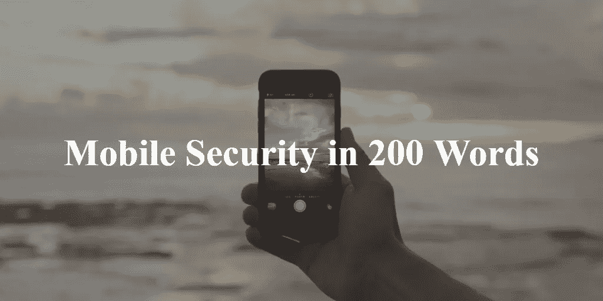

# 移动安全 200 字

> 原文：<https://medium.com/hackernoon/mobile-security-in-200-words-5fdf31f62f64>

1.  **修补已知的安全漏洞** —确保安装更新的操作系统&应用程序版本。
2.  **限制对您的设备和敏感应用的未授权访问** —使用 pin 码或应用锁定服务。
3.  **防盗** —安装一个应用程序，一旦你的设备被盗或丢失，它能帮助你定位你的设备。确保它还能为您提供远程数据擦除功能。
4.  不要越狱或 Root 你的设备。
5.  **恶意应用检测&预防** —安装高级[移动](https://hackernoon.com/tagged/mobile)威胁防护解决方案&仅从官方应用商店安装应用。
6.  **防范网络钓鱼** —如果您曾经通过即时消息、彩信或带有链接的电子邮件收到不明来源的消息，请避免访问它。
7.  **保护自己免受中间人(MitM)攻击** —避免连接到未知的 Wi-Fi 网络。如果你要连接，确保你使用的是加密流量的 VPN 应用。
8.  **避免 iOS 恶意配置文件攻击** —切勿自行安装或更新 [iOS](https://hackernoon.com/tagged/ios) 预配置文件或 APN 配置。
9.  **iOS 假冒开发者证书保护** —切勿安装带有开发者或演示证书的应用，以避免恶意应用。
10.  **保护您的数据** —避免在您的设备上保存敏感数据。

> [黑客中午](http://bit.ly/Hackernoon)是黑客如何开始他们的下午。我们是阿美族家庭的一员。我们现在[接受投稿](http://bit.ly/hackernoonsubmission)并乐意[讨论广告&赞助](mailto:partners@amipublications.com)机会。
> 
> 如果你喜欢这个故事，我们推荐你阅读我们的[最新科技故事](http://bit.ly/hackernoonlatestt)和[趋势科技故事](https://hackernoon.com/trending)。直到下一次，不要把世界的现实想当然！

