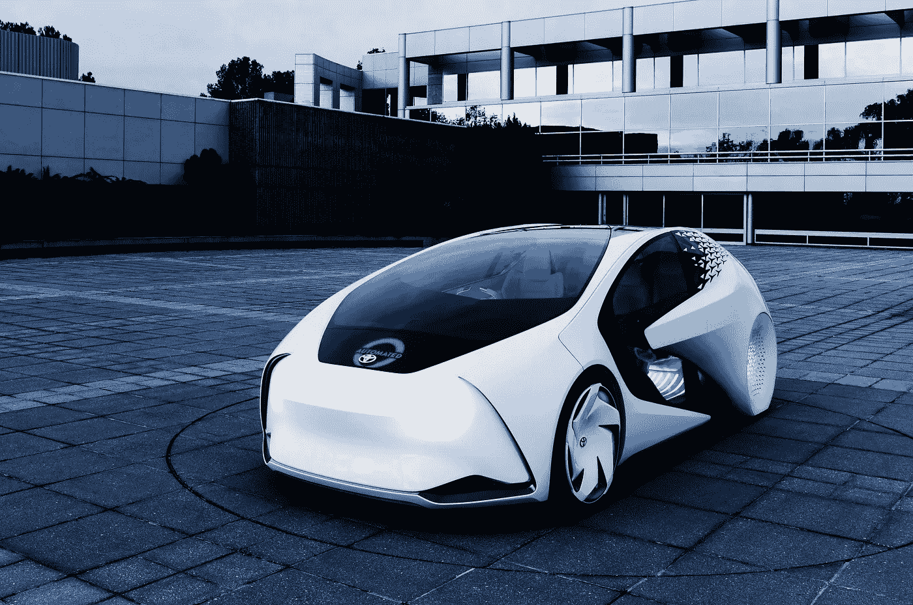
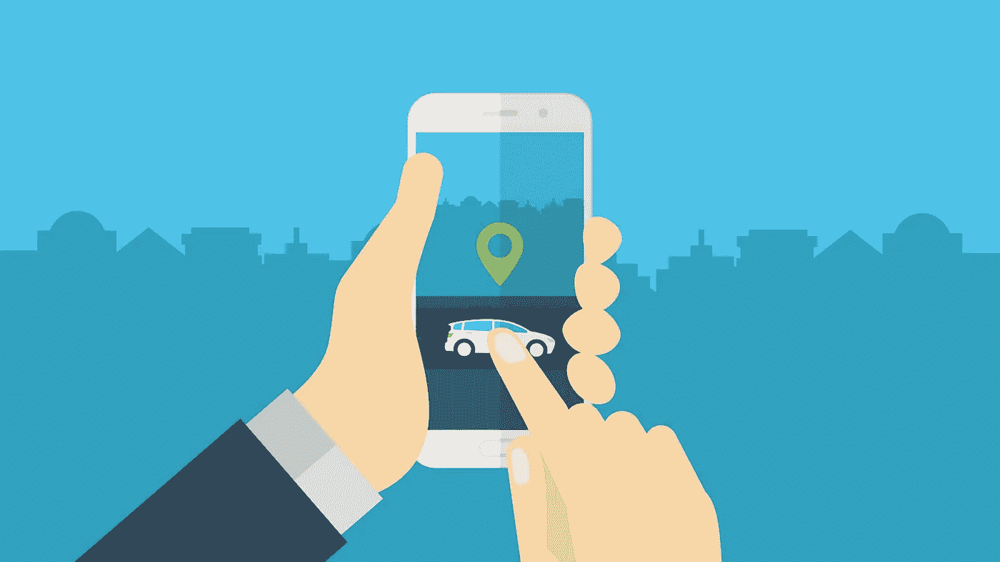
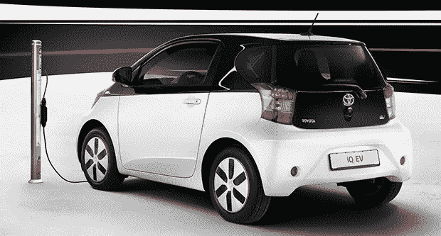

# 区块链上的移动即服务

> 原文：<https://medium.com/hackernoon/mobility-as-a-service-on-the-blockchain-fd5124088875>

Toyota’s Concept-i autonomous vehicle

## “你按一个按钮。在很短的时间内，一辆车出现了。”

在最近的[播客](https://www.stitcher.com/podcast/frederick-munawa/blockchain-innovation/e/50928450)中，[丰田研究所](http://www.tri.global/)首席财务官兼移动服务总监 Chris Ballinger 说道:

> 你按一个按钮。在很短的时间内，一辆车出现了。带你去你想去的地方，让你下车。
> 
> 付款的谈判，你是谁，你的声誉，汽车的声誉，合同…
> 
> 所有这些都是区块链做得非常好的事情的潜在应用。

丰田[重金押注区块链](https://techcrunch.com/2017/05/22/toyota-pushes-into-blockchain-tech-to-enable-the-next-generation-of-cars/)。实话实说:每个人都拥有一辆[汽车](https://hackernoon.com/tagged/car)的问题是，汽车实际上 ***没有得到充分利用*** 。

平均而言， [**辆车 95%的时间都停在**](http://fortune.com/2016/03/13/cars-parked-95-percent-of-time/) 。是的，你没看错。

最重要的是，拥有一辆车会带来固定成本:保险、保养、停车、驾照更新等。如果你只在 5%的时间里使用你的车，这种开销值得吗？

# 移动即服务

丰田押注于一个按需实现移动性的未来。换句话说， [**移动性变成了一种服务**](https://www.wikiwand.com/en/Transportation_as_a_Service) **而不是你所拥有的资源**。

在一个城市 有一个 ***的自动驾驶汽车车队(要么驻扎要么四处漫游)，你通过使用你设备上的应用程序请求一辆。***

汽车带你去你想去的地方，你付车费，然后下车。然后它又可以被别人使用。

# 生态系统

**因为没有人驾驶汽车，**它必须能够自己找到充电站——以及它需要的所有其他服务。

当然，像丰田这样的公司不打算在世界各地为他们的车辆部署充电站。相反，他们设想围绕汽车的经济/服务生态系统，就像加油站、洗车场、保险公司等。遍布全球。

但与今天的关键区别是**汽车必须能够与这些服务进行通信**,并立即进行交易:通过兑换货币或其他一些代表价值的令牌。**你好，智能合约。**

**为所有这些合作伙伴和交易创建一个单一的中央数据库是不切实际的。**

谁会拥有它？它会遵守全球的所有法律法规吗？它有多安全？谁来管理它？

集权不是答案。**进入******。****

# **区块链上的交易**

**假设你叫了一辆自动驾驶汽车，它就要来接你了。我将“事务”缩写为 TX。**

**想象一下这个流程:**

1.  ****保险:这辆车有一份保险**，但是因为它在接你之前没有载人，所以**只包括这辆车**。**
2.  **你一上车，**车辆就升级保单，覆盖一个人(你)**。它通过使用智能合约制作 TX 来实现这一点，该合约涵盖汽车+ 1 个人**，直到预计到达时间(ETA)** 。**
3.  ****收费公路:**开始行驶。但是唉，它需要**接入一条收费公路**。它在区块链上制造了一个 TX，用另一个聪明的合同来支付通行费。整个收费公路的押金是预先支付的。**
4.  **它继续行驶。当它离开收费公路时，它会使用之前的智能合约进行另一次 TX。它拿回押金，减去在收费公路上的行程费用(根据公里数)。**
5.  **付款:它会把你送到目的地。你通过在区块链上发一张 TX 来支付车款。汽车支付*车辆+ 1 个人*保险费，按你在汽车上实际花费的时间比例分配(旅程的开始和结束都在区块链上登记)。然后，汽车将保险降级为“零人类”保险。**
6.  ****电池和脏污:**汽车注意到电池电量不足，而且还很脏。你有点乱扔东西。所以它通过区块链向你收取污染费，并且通过在区块链上制造另一个 TX 来降低你的声望-1 点。**
7.  ****充电:**由于它已经收了你的交通费，加上污费，所以它先找一个充电站，自己充电。它支付站的所有者*(可能是某个人的家！)*经由区块链上的一个 TX。**
8.  **清洁:然后它去清洁服务*(这是人工操作的还是自动化的？如果人类…这就是我们被降级的原因吗？🤔)*并通过区块链上的一个 TX 付费，让自己重新焕发光彩和好客。**

****现在可以搭载另一名乘客了。**也就是说，除非发生这种情况:**

****

**A trap for self-driving cars.**

**👉关于区块链的**置顶文章**，一定要**跟两个，** [**共识 X**](https://consensusx.com) **和我**上媒。**

**如果你喜欢这篇文章，请**在 Medium 上推荐**(鼓掌/心动吧！)，并且**在 Twitter、LinkedIn 等上分享**。**

# **关于作者**

**我叫劳尔·克里帕拉尼，是一名后端和分布式系统工程师。我目前在[协议实验室](https://medium.com/u/7369a3c69ff2?source=post_page-----fd5124088875--------------------------------)工作，为 P2P 网络构建一个叫做 [libp2p](https://libp2p.io/) 的模块化网络堆栈。**

****随时在**[**Twitter**](https://twitter.com/raulvk)**和/或**[**LinkedIn**](https://www.linkedin.com/in/raulkripalani)**上与我联系。****